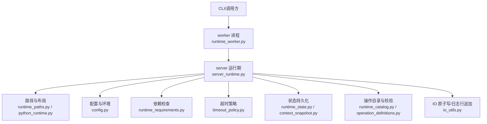
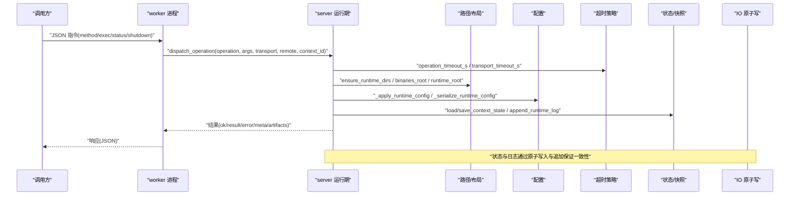
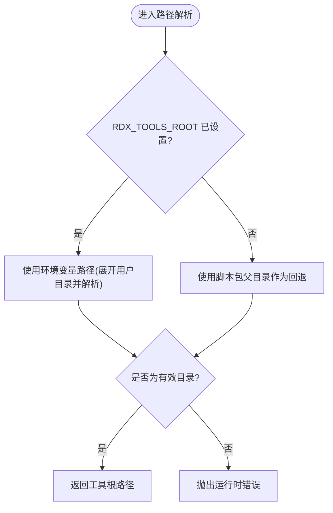
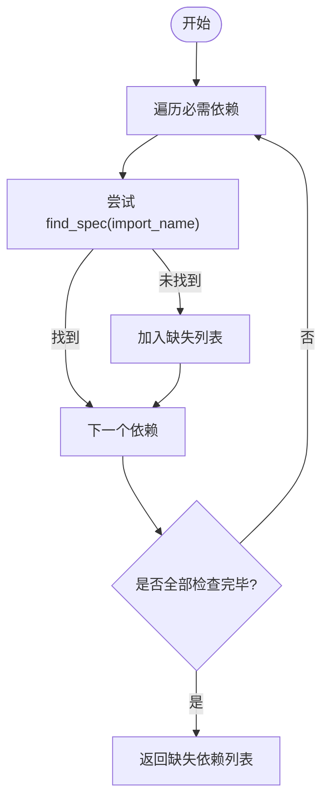
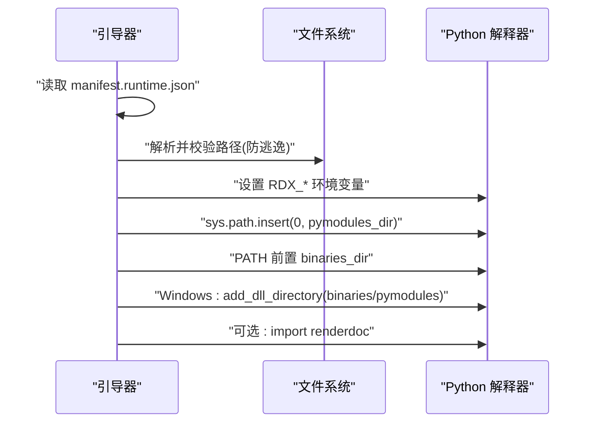
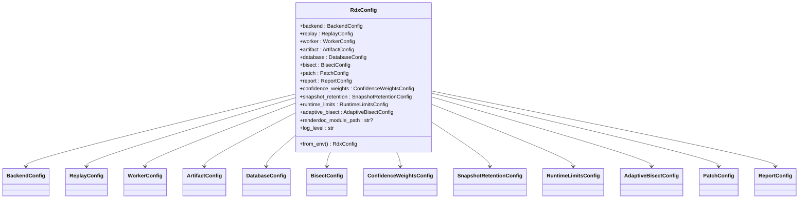
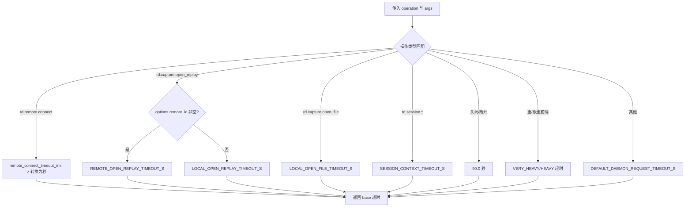
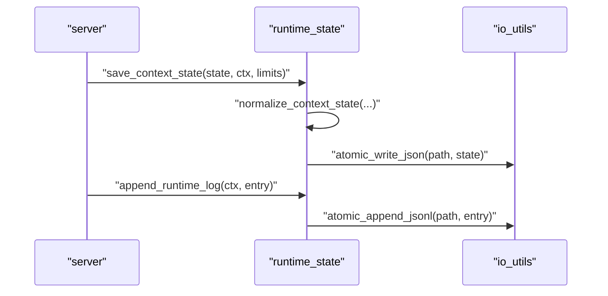
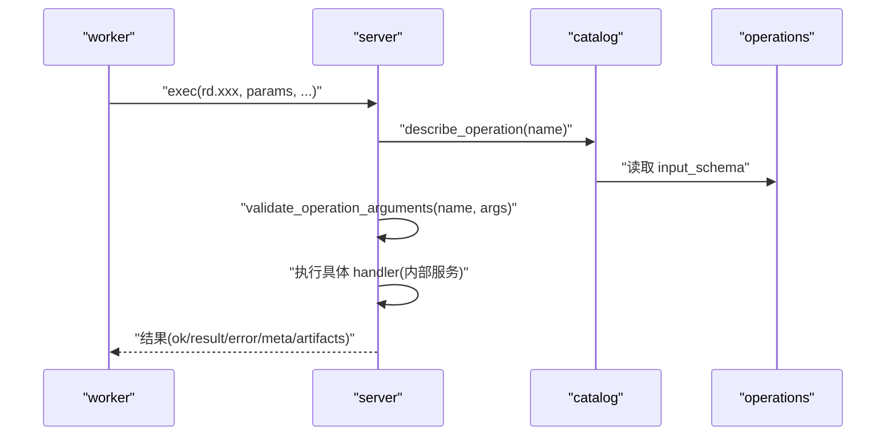
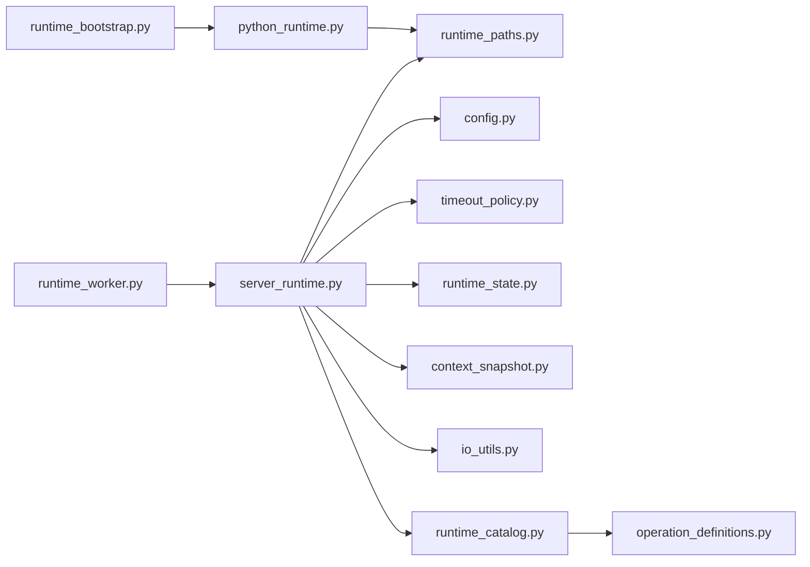

# 运行时管理

<cite>
**本文引用的文件**
- [runtime_paths.py](file://rdx/runtime_paths.py)
- [python_runtime.py](file://rdx/python_runtime.py)
- [config.py](file://rdx/config.py)
- [timeout_policy.py](file://rdx/timeout_policy.py)
- [runtime_requirements.py](file://rdx/runtime_requirements.py)
- [runtime_bootstrap.py](file://rdx/runtime_bootstrap.py)
- [server_runtime.py](file://rdx/server_runtime.py)
- [runtime_worker.py](file://rdx/runtime_worker.py)
- [runtime_state.py](file://rdx/runtime_state.py)
- [runtime_catalog.py](file://rdx/runtime_catalog.py)
- [operation_definitions.py](file://rdx/operation_definitions.py)
- [context_snapshot.py](file://rdx/context_snapshot.py)
- [io_utils.py](file://rdx/io_utils.py)
</cite>

## 目录
1. [简介](#简介)
2. [项目结构](#项目结构)
3. [核心组件](#核心组件)
4. [架构总览](#架构总览)
5. [详细组件分析](#详细组件分析)
6. [依赖关系分析](#依赖关系分析)
7. [性能考量](#性能考量)
8. [故障诊断指南](#故障诊断指南)
9. [结论](#结论)
10. [附录：配置示例与最佳实践](#附录配置示例与最佳实践)

## 简介
本仓库实现了一个面向 RenderDoc 的“运行时管理系统”，负责在独立工具包中启动、引导并协调 Python 运行时、RenderDoc 原生模块、会话与上下文状态、操作路由、超时策略、依赖检查与路径解析等。其目标是让上层 CLI/服务端/工作进程以统一接口调用图形捕获与回放能力，同时保证环境一致性、资源隔离、可恢复性与可观测性。

## 项目结构
- 运行时路径与布局：集中管理工具根、二进制、Python 运行时、中间产物与日志目录，确保跨平台一致的路径解析与临时文件组织。
- 运行时引导：准备 Python 环境、注册 DLL 搜索路径、注入 sys.path，探测 renderdoc 模块可用性。
- 配置系统：通过 dataclass 定义多类配置项，支持环境变量覆盖与运行时动态调整。
- 依赖检查：声明必需依赖、排除打包列表、检测缺失依赖。
- 超时策略：按操作类型与重量级分组计算超时，提供传输层与执行层超时换算。
- 状态持久化：上下文/会话/捕获句柄的状态序列化、并发安全写入、最近操作摘要与指标统计。
- 工作进程：独立的 worker 进程封装异步事件循环，接收 JSON 指令并调度到 server 的操作分发器。
- 服务与编排：server_runtime 聚合各服务（会话管理、渲染、流水线、性能、事件图、补丁引擎），维护全局运行时状态与上下文快照。

**图表来源**
- [runtime_worker.py:65-167](file://rdx/runtime_worker.py#L65-L167)
- [server_runtime.py:1-120](file://rdx/server_runtime.py#L1-L120)
- [runtime_paths.py:14-123](file://rdx/runtime_paths.py#L14-L123)
- [python_runtime.py:28-92](file://rdx/python_runtime.py#L28-L92)
- [config.py:15-186](file://rdx/config.py#L15-L186)
- [runtime_requirements.py:1-73](file://rdx/runtime_requirements.py#L1-L73)
- [timeout_policy.py:1-104](file://rdx/timeout_policy.py#L1-L104)
- [runtime_state.py:41-57](file://rdx/runtime_state.py#L41-L57)
- [runtime_catalog.py:13-91](file://rdx/runtime_catalog.py#L13-L91)
- [io_utils.py:67-161](file://rdx/io_utils.py#L67-L161)

**章节来源**
- [runtime_paths.py:14-123](file://rdx/runtime_paths.py#L14-L123)
- [python_runtime.py:28-92](file://rdx/python_runtime.py#L28-L92)
- [config.py:15-186](file://rdx/config.py#L15-L186)
- [runtime_requirements.py:1-73](file://rdx/runtime_requirements.py#L1-L73)
- [timeout_policy.py:1-104](file://rdx/timeout_policy.py#L1-L104)
- [runtime_worker.py:65-167](file://rdx/runtime_worker.py#L65-L167)
- [server_runtime.py:1-120](file://rdx/server_runtime.py#L1-L120)
- [runtime_state.py:41-57](file://rdx/runtime_state.py#L41-L57)
- [runtime_catalog.py:13-91](file://rdx/runtime_catalog.py#L13-L91)
- [io_utils.py:67-161](file://rdx/io_utils.py#L67-L161)

## 核心组件
- 路径管理系统：统一解析工具根、二进制目录、内置 Python 运行时、中间产物与日志目录，并提供创建与强制设置环境变量的能力。
- 依赖检查系统：声明必需依赖、过滤打包前缀、检测当前环境是否满足要求。
- Python 运行时管理：读取 manifest 描述内置 Python 布局，校验关键文件/目录存在性，返回当前 Python 细节。
- 配置管理系统：集中定义后端、回放、工作进程、工件存储、数据库、二分查找、报告、置信度权重、快照保留、运行时限制等；支持从环境变量加载与运行时动态应用。
- 超时策略：按操作名与重量级前缀选择不同超时，区分连接、打开回放、关闭、重负载请求等场景，并提供传输层与执行层超时换算。
- 状态与快照：上下文/会话/捕获句柄的持久化、并发锁、最近操作裁剪、指标汇总、预览状态归一化。
- 工作进程与服务：worker 进程通过 stdin 接收 JSON 指令，调用 server 的操作分发器执行；server 维护全局运行时状态、服务实例与上下文容量控制。

**章节来源**
- [runtime_paths.py:14-123](file://rdx/runtime_paths.py#L14-L123)
- [runtime_requirements.py:1-73](file://rdx/runtime_requirements.py#L1-L73)
- [python_runtime.py:28-172](file://rdx/python_runtime.py#L28-L172)
- [config.py:15-186](file://rdx/config.py#L15-L186)
- [timeout_policy.py:1-104](file://rdx/timeout_policy.py#L1-L104)
- [runtime_state.py:104-500](file://rdx/runtime_state.py#L104-L500)
- [context_snapshot.py:130-200](file://rdx/context_snapshot.py#L130-L200)
- [runtime_worker.py:65-167](file://rdx/runtime_worker.py#L65-L167)
- [server_runtime.py:196-468](file://rdx/server_runtime.py#L196-L468)

## 架构总览
下图展示了从调用方到 worker、server、子系统的交互流程，以及路径、配置、超时、状态等横切关注点如何贯穿其中。

**图表来源**
- [runtime_worker.py:97-161](file://rdx/runtime_worker.py#L97-L161)
- [server_runtime.py:277-390](file://rdx/server_runtime.py#L277-L390)
- [timeout_policy.py:56-104](file://rdx/timeout_policy.py#L56-L104)
- [runtime_paths.py:112-123](file://rdx/runtime_paths.py#L112-L123)
- [runtime_state.py:448-472](file://rdx/runtime_state.py#L448-L472)
- [io_utils.py:138-161](file://rdx/io_utils.py#L138-L161)

## 详细组件分析

### 路径管理系统
- 工具根解析：优先使用环境变量覆盖，否则回退到脚本所在包的父目录；提供强制设置环境变量的方法。
- 二进制与 Python：导出 binaries_root、bundled_python_root、pymodules_dir 等固定布局路径。
- 中间产物与日志：intermediate_root 可由环境变量覆盖，默认位于 tools_root/intermediate；提供 runtime_root、cli_runtime_dir、worker_state_dir、artifacts_dir、pytest_dir、logs_dir 等便捷访问。
- 目录初始化：ensure_runtime_dirs 一次性创建所有必要目录。

**图表来源**
- [runtime_paths.py:14-57](file://rdx/runtime_paths.py#L14-L57)

**章节来源**
- [runtime_paths.py:14-123](file://rdx/runtime_paths.py#L14-L123)

### 依赖检查系统
- 必需依赖清单：pydantic、numpy、Pillow、jinja2、aiofiles。
- 打包排除：排除测试、开发工具与构建相关包的前缀，避免将无关内容打入运行时 site-packages。
- 可用性与缺失检测：基于 importlib.util.find_spec 判断模块是否存在，收集缺失依赖列表。

**图表来源**
- [runtime_requirements.py:7-57](file://rdx/runtime_requirements.py#L7-L57)

**章节来源**
- [runtime_requirements.py:1-73](file://rdx/runtime_requirements.py#L1-L73)

### Python 运行时的环境管理、模块加载与细节处理
- 内置 Python 布局：从 manifest.runtime.json 读取 bundled_python 元数据，合并默认值，解析出 python.exe、pythonw.exe、DLL、stdlib、site-packages、pth 等路径，并进行安全校验（防止逃逸 binaries_root）。
- 验证：校验必需元数据字段与关键路径/目录存在性；若 stdlib 为 zip 则检查文件，否则检查目录与关键标记文件。
- 当前 Python 详情：返回当前进程的 executable、version、prefix、base_prefix。
- 运行时引导：bootstrap_renderdoc_runtime 设置 RDX_RUNTIME_DLL_DIR 与 RDX_RENDERDOC_PATH，将 pymodules_dir 插入 sys.path 首位，将 binaries_dir 前置 PATH，并在 Windows 上注册 DLL 目录；可选探测 renderdoc 导入。

**图表来源**
- [python_runtime.py:28-172](file://rdx/python_runtime.py#L28-L172)
- [runtime_bootstrap.py:105-131](file://rdx/runtime_bootstrap.py#L105-L131)

**章节来源**
- [python_runtime.py:28-172](file://rdx/python_runtime.py#L28-L172)
- [runtime_bootstrap.py:18-131](file://rdx/runtime_bootstrap.py#L18-L131)

### 配置管理系统
- 配置模型：BackendConfig、ReplayConfig、WorkerConfig、ArtifactConfig、DatabaseConfig、BisectConfig、ConfidenceWeightsConfig、SnapshotRetentionConfig、RuntimeLimitsConfig、AdaptiveBisectConfig、PatchConfig、ReportConfig、RdxConfig。
- 环境变量覆盖：from_env 支持大量 RDX_* 环境变量，如 RDX_RENDERDOC_PATH、RDX_ARTIFACT_STORE、RDX_DATA_DIR、RDX_REPORT_DIR、RDX_LOG_LEVEL、RDX_GPU_VENDOR、RDX_SPIRV_TOOLS_PATH、RDX_HEADLESS、各类 bisect 与运行时限制变量。
- 运行时应用：_apply_runtime_config 支持在运行期动态更新 artifact_dir、log_level、snapshot_retention、bisect、confidence_weights、adaptive_bisect、runtime_limits 等，并持久化到 _runtime.config。
- 配置序列化：_serialize_runtime_config 输出当前配置摘要，便于对外暴露或记录。

**图表来源**
- [config.py:15-186](file://rdx/config.py#L15-L186)

**章节来源**
- [config.py:15-186](file://rdx/config.py#L15-L186)
- [server_runtime.py:277-390](file://rdx/server_runtime.py#L277-L390)

### 超时策略
- 基础超时：针对远程连接、本地/远程打开回放、本地打开文件、会话上下文、像素历史等定义默认秒数。
- 重量级前缀：HEAVY_TIMEOUT_PREFIXES 与 VERY_HEAVY_TIMEOUT_PREFIXES 用于识别重负载操作，分别赋予更长的超时。
- 操作超时计算：operation_timeout_s 根据操作名与参数决定基础超时；transport_timeout_s 在此基础上增加缓冲时间；daemon_exec_timeout_s 与 worker_exec_timeout_s 分别用于不同执行层；harness_timeout_s 取最大值保证最低阈值。

**图表来源**
- [timeout_policy.py:8-104](file://rdx/timeout_policy.py#L8-L104)

**章节来源**
- [timeout_policy.py:1-104](file://rdx/timeout_policy.py#L1-L104)

### 状态与快照、临时文件处理
- 上下文状态：默认 schema_version、backend、captures/sessions/recovery/preview/limits/metrics/recent_operations 等；支持加载、保存、清理、列出上下文 ID。
- 并发安全：每个上下文对应一个互斥锁，并使用 msvcrt.locking 对 .lock 文件进行锁定，确保多进程/多线程写入安全。
- 最近操作裁剪：按 trace_id 去重并按更新时间排序，保留最近 N 条。
- 指标统计：操作计数、错误计数、恢复计数、拒绝计数、活跃会话/捕获/操作计数、最近操作耗时分布与百分位。
- 临时文件：io_utils 提供原子写入与交换、JSON 安全序列化、追加 JSONL 日志；atomic_swap_path 支持重试与备份恢复。

**图表来源**
- [runtime_state.py:388-472](file://rdx/runtime_state.py#L388-L472)
- [io_utils.py:117-161](file://rdx/io_utils.py#L117-L161)

**章节来源**
- [runtime_state.py:104-500](file://rdx/runtime_state.py#L104-L500)
- [io_utils.py:13-161](file://rdx/io_utils.py#L13-L161)
- [context_snapshot.py:130-200](file://rdx/context_snapshot.py#L130-L200)

### 工作进程与服务协调机制
- 工作进程：main 解析 --context-id，设置 RDX_CONTEXT_ID，启动父进程守护线程，发送 ready 消息，使用 asyncio.Runner 与单线程 executor 保持持久回放线程；stdin 循环读取 JSON 指令，调用 server.dispatch_operation 执行 exec/clear_context/status/shutdown。
- 服务运行期：server_runtime 维护全局 _runtime（包含 config/logs/captures/replays/remotes/contexts/previews/shader_debugs 等），提供配置应用、上下文容量检查、快照同步、度量更新、后端推断与投影等。
- 操作目录：runtime_catalog 从 operation_definitions 加载公开操作定义，生成目录载荷，支持 describe_operation 与 validate_operation_arguments 进行输入校验。

**图表来源**
- [runtime_worker.py:97-161](file://rdx/runtime_worker.py#L97-L161)
- [runtime_catalog.py:17-91](file://rdx/runtime_catalog.py#L17-L91)
- [operation_definitions.py:1-200](file://rdx/operation_definitions.py#L1-L200)

**章节来源**
- [runtime_worker.py:65-167](file://rdx/runtime_worker.py#L65-L167)
- [server_runtime.py:196-468](file://rdx/server_runtime.py#L196-L468)
- [runtime_catalog.py:13-91](file://rdx/runtime_catalog.py#L13-L91)
- [operation_definitions.py:1-200](file://rdx/operation_definitions.py#L1-L200)

## 依赖关系分析
- 模块耦合：
  - server_runtime 强依赖 runtime_paths、config、timeout_policy、runtime_state、context_snapshot、io_utils、runtime_catalog、operation_definitions。
  - runtime_worker 依赖 server 的 dispatch_operation 与 runtime_shutdown。
  - python_runtime 与 runtime_bootstrap 共同协作完成内置 Python 与 RenderDoc 模块的环境准备。
  - runtime_requirements 被依赖检查流程使用，不反向依赖上层。
- 外部依赖：
  - 运行时必需 Python 包：pydantic、numpy、Pillow、jinja2、aiofiles。
  - Windows 特定：msvcrt 用于文件锁；os.add_dll_directory 用于 DLL 搜索路径注册。
- 潜在循环：未发现直接循环依赖；catalog 仅读取 operation_definitions，server 通过 catalog 做校验，单向依赖清晰。

**图表来源**
- [server_runtime.py:1-120](file://rdx/server_runtime.py#L1-L120)
- [runtime_worker.py:65-167](file://rdx/runtime_worker.py#L65-L167)
- [runtime_bootstrap.py:105-131](file://rdx/runtime_bootstrap.py#L105-L131)
- [python_runtime.py:28-92](file://rdx/python_runtime.py#L28-L92)
- [runtime_catalog.py:13-91](file://rdx/runtime_catalog.py#L13-L91)
- [operation_definitions.py:1-200](file://rdx/operation_definitions.py#L1-L200)

**章节来源**
- [server_runtime.py:1-120](file://rdx/server_runtime.py#L1-L120)
- [runtime_worker.py:65-167](file://rdx/runtime_worker.py#L65-L167)
- [runtime_bootstrap.py:105-131](file://rdx/runtime_bootstrap.py#L105-L131)
- [python_runtime.py:28-92](file://rdx/python_runtime.py#L28-L92)
- [runtime_catalog.py:13-91](file://rdx/runtime_catalog.py#L13-L91)
- [operation_definitions.py:1-200](file://rdx/operation_definitions.py#L1-L200)

## 性能考量
- 超时分级：对重负载操作自动延长超时，避免阻塞整体流程；传输层额外缓冲，提升稳定性。
- 上下文容量：限制最大上下文数、每上下文会话数、捕获文件数量与大小估计，防止资源耗尽。
- 状态裁剪：recent_operations 限制长度，减少内存占用与序列化开销。
- 原子写入：避免并发竞争导致的损坏；重试与备份提高可靠性。
- 单线程回放：worker 使用单线程 executor 维持持久回放线程，避免频繁创建销毁带来的原生上下文失效。

[本节为通用指导，无需特定文件引用]

## 故障诊断指南
- 路径问题：
  - 确认 RDX_TOOLS_ROOT 指向有效目录；tools_root 会警告覆盖情况。
  - 检查 ensure_runtime_dirs 是否创建了 intermediate/runtime/cli_runtime_dir/worker_state/artifacts/pytest/logs。
- Python/RenderDoc 引导失败：
  - 查看 bootstrap 报告的 dll_dirs_registered 与 dll_dir_errors；确认 Windows 下 add_dll_directory 可用。
  - 使用 validate_bundled_python_layout 检查内置 Python 元数据与关键路径。
- 依赖缺失：
  - 使用 missing_dependencies 获取缺失包列表；确保 site-packages 中包含必需依赖。
- 超时与卡死：
  - 根据 operation 名称与重量级前缀评估预期超时；必要时通过参数 timeout_ms 调整远程连接超时。
- 状态不一致：
  - 检查 runtime_state.json 与 runtime_logs.jsonl；使用 read_runtime_logs 拉取最近日志；利用 summarize_operation_durations 分析耗时分布。
- 上下文超限：
  - 当达到 max_contexts 时会抛出 context_limit_exceeded；清理不再使用的上下文或增大限制。

**章节来源**
- [runtime_paths.py:14-123](file://rdx/runtime_paths.py#L14-L123)
- [runtime_bootstrap.py:70-131](file://rdx/runtime_bootstrap.py#L70-L131)
- [python_runtime.py:104-172](file://rdx/python_runtime.py#L104-L172)
- [runtime_requirements.py:45-73](file://rdx/runtime_requirements.py#L45-L73)
- [timeout_policy.py:56-104](file://rdx/timeout_policy.py#L56-L104)
- [runtime_state.py:448-500](file://rdx/runtime_state.py#L448-L500)
- [server_runtime.py:427-468](file://rdx/server_runtime.py#L427-L468)

## 结论
该运行时管理系统通过清晰的分层与职责划分，实现了路径解析、依赖检查、Python 环境引导、配置管理、超时策略、状态持久化与工作进程协调的完整闭环。其设计强调可移植性、可恢复性与可观测性，适合在多种部署环境中稳定运行，并为上层工具提供一致的图形捕获与回放能力。

[本节为总结，无需特定文件引用]

## 附录：配置示例与最佳实践
- 环境变量建议：
  - RDX_TOOLS_ROOT：指向工具根目录，便于多版本共存与调试。
  - RDX_INTERMEDIATE_ROOT：自定义中间产物与日志位置，便于磁盘规划与清理。
  - RDX_RENDERDOC_PATH：指定 pymodules 目录，便于替换或扩展 RenderDoc Python 绑定。
  - RDX_ARTIFACT_STORE、RDX_DATA_DIR、RDX_REPORT_DIR：分别配置工件存储、数据库与报告输出路径。
  - RDX_LOG_LEVEL：控制日志级别，便于生产与调试切换。
  - RDX_GPU_VENDOR、RDX_SPIRV_TOOLS_PATH、RDX_HEADLESS：按需配置后端与工具链。
  - RDX_BISECT_*、RDX_MAX_*：调整二分策略与运行时限制，平衡性能与资源。
- 运行时配置：
  - 通过 _apply_runtime_config 动态调整 artifact_dir、log_level、snapshot_retention、bisect、confidence_weights、adaptive_bisect、runtime_limits，无需重启。
- 最佳实践：
  - 启动时调用 ensure_runtime_dirs 确保目录存在。
  - 使用 bootstrap_renderdoc_runtime(probe_import=True) 快速验证环境。
  - 对重负载操作预留足够超时，结合 harness_timeout_s 设定上限。
  - 定期清理 intermediate/runtime 下的旧状态与日志，避免磁盘膨胀。
  - 使用 validate_bundled_python_layout 在发布前自检内置 Python 完整性。

[本节为通用指导，无需特定文件引用]