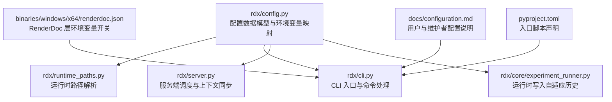
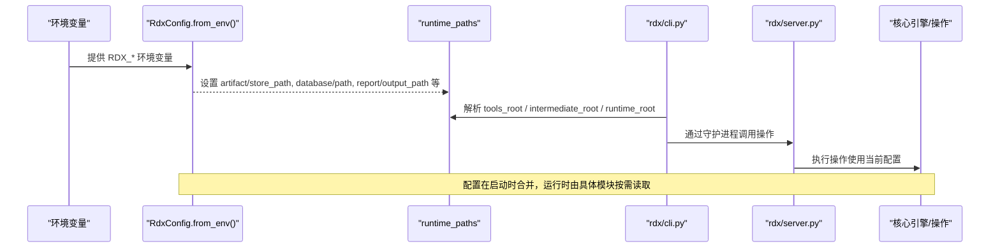
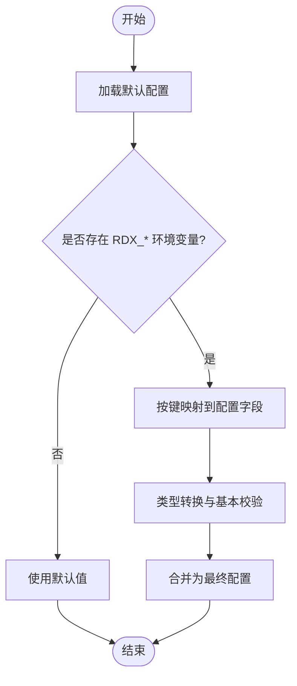
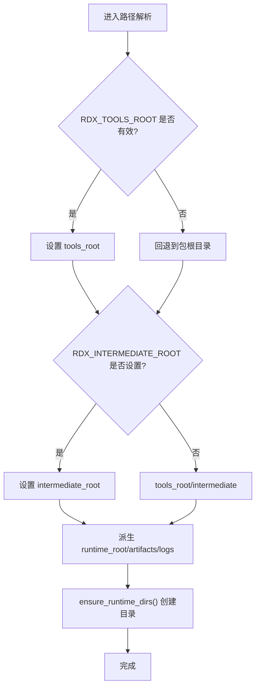
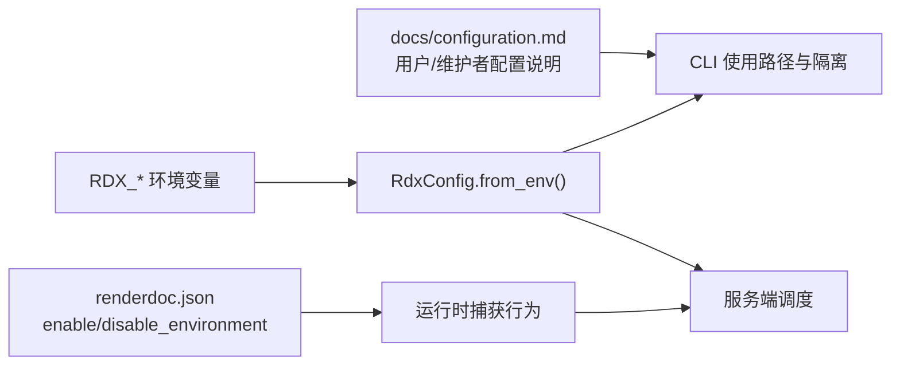
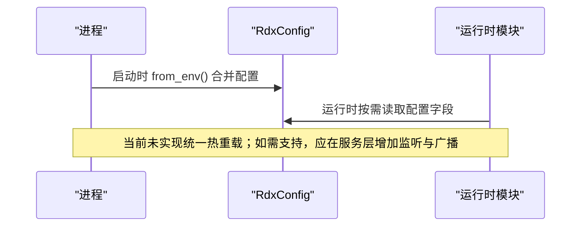
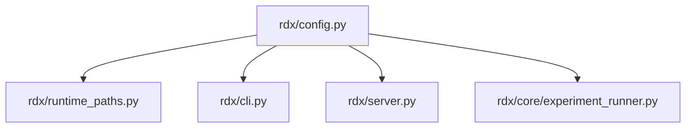

# 配置管理系统

<cite>
**本文引用的文件**
- [rdx/config.py](file://rdx/config.py)
- [rdx/runtime_paths.py](file://rdx/runtime_paths.py)
- [docs/configuration.md](file://docs/configuration.md)
- [binaries/windows/x64/renderdoc.json](file://binaries/windows/x64/renderdoc.json)
- [pyproject.toml](file://pyproject.toml)
- [rdx/cli.py](file://rdx/cli.py)
- [rdx/server.py](file://rdx/server.py)
- [rdx/core/experiment_runner.py](file://rdx/core/experiment_runner.py)
</cite>

## 目录
1. [简介](#简介)
2. [项目结构](#项目结构)
3. [核心组件](#核心组件)
4. [架构总览](#架构总览)
5. [详细组件分析](#详细组件分析)
6. [依赖关系分析](#依赖关系分析)
7. [性能考虑](#性能考虑)
8. [故障排除指南](#故障排除指南)
9. [结论](#结论)
10. [附录：配置参考与使用示例](#附录配置参考与使用示例)

## 简介
本文件系统性阐述 RDX 工具链中的配置管理子系统，覆盖配置层次、合并策略、环境变量映射、运行时路径解析、配置项定义与校验、动态更新与热重载机制、安全考量以及最佳实践与排障。该子系统以数据类模型承载默认值，通过环境变量进行覆盖，结合运行时路径模块统一解析产物、日志与中间目录，确保在 CLI、守护进程与核心引擎之间共享一致的配置视图。

## 项目结构
- 配置模型与环境变量映射集中在 rdx/config.py，采用 dataclass 组织各子域配置（后端、回放、工作器、工件、数据库、二分查找、补丁、报告、置信度权重、快照保留、运行时限制、自适应二分等）。
- 运行时路径解析集中在 rdx/runtime_paths.py，提供 tools_root、intermediate_root、runtime_root、artifacts_dir、logs_dir 等函数，并支持通过环境变量覆盖根目录。
- 文档 docs/configuration.md 说明用户/维护者配置要点及预览运行约束。
- 二进制层配置文件 binaries/windows/x64/renderdoc.json 描述 RenderDoc Vulkan 层的启用/禁用环境变量，属于“外部配置”的补充来源。
- pyproject.toml 声明入口脚本 rdx = "rdx.cli:main"，CLI 是配置消费的重要入口之一。
- rdx/cli.py 与 rdx/server.py 作为 CLI 与服务器侧的调度层，消费配置并通过守护进程/核心引擎执行操作。
- rdx/core/experiment_runner.py 在运行时写入自适应二分历史，体现配置对运行时行为的影响。

**图示来源**
- [rdx/config.py:15-185](file://rdx/config.py#L15-L185)
- [rdx/runtime_paths.py:14-123](file://rdx/runtime_paths.py#L14-L123)
- [rdx/cli.py:1-550](file://rdx/cli.py#L1-L550)
- [rdx/server.py:1-120](file://rdx/server.py#L1-L120)
- [rdx/core/experiment_runner.py:676-707](file://rdx/core/experiment_runner.py#L676-L707)
- [binaries/windows/x64/renderdoc.json:1-49](file://binaries/windows/x64/renderdoc.json#L1-L49)
- [docs/configuration.md:1-20](file://docs/configuration.md#L1-L20)
- [pyproject.toml:21-22](file://pyproject.toml#L21-L22)

**章节来源**
- [rdx/config.py:15-185](file://rdx/config.py#L15-L185)
- [rdx/runtime_paths.py:14-123](file://rdx/runtime_paths.py#L14-L123)
- [docs/configuration.md:1-20](file://docs/configuration.md#L1-L20)
- [binaries/windows/x64/renderdoc.json:1-49](file://binaries/windows/x64/renderdoc.json#L1-L49)
- [pyproject.toml:21-22](file://pyproject.toml#L21-L22)
- [rdx/cli.py:1-550](file://rdx/cli.py#L1-L550)
- [rdx/server.py:1-120](file://rdx/server.py#L1-L120)
- [rdx/core/experiment_runner.py:676-707](file://rdx/core/experiment_runner.py#L676-L707)

## 核心组件
- 配置数据模型：以 dataclass 定义多域配置，提供类型化字段与默认值，便于后续扩展与校验。
- 环境变量映射：集中式 from_env 方法将环境变量按命名约定映射到配置对象字段，实现“默认值 + 环境覆盖”的合并策略。
- 运行时路径：统一解析工具根目录、中间目录、运行时目录、工件与日志目录，支持通过环境变量隔离测试或发布产物。
- CLI/Server 集成：CLI 与服务端通过配置驱动行为，如日志级别、工件存储、数据库路径、渲染层路径等。
- 运行时影响：部分配置在运行时被读取并影响行为（例如自适应二分模式与历史存储路径），并在实验过程中持久化记录。

**章节来源**
- [rdx/config.py:15-185](file://rdx/config.py#L15-L185)
- [rdx/runtime_paths.py:14-123](file://rdx/runtime_paths.py#L14-L123)
- [rdx/cli.py:1-550](file://rdx/cli.py#L1-L550)
- [rdx/server.py:1-120](file://rdx/server.py#L1-L120)
- [rdx/core/experiment_runner.py:676-707](file://rdx/core/experiment_runner.py#L676-L707)

## 架构总览
下图展示配置从“默认值 → 环境变量覆盖 → 运行时路径解析 → CLI/Server 消费”的整体流程，以及与外部配置（RenderDoc 层）的关系。

**图示来源**
- [rdx/config.py:135-185](file://rdx/config.py#L135-L185)
- [rdx/runtime_paths.py:14-123](file://rdx/runtime_paths.py#L14-L123)
- [rdx/cli.py:1-550](file://rdx/cli.py#L1-L550)
- [rdx/server.py:1-120](file://rdx/server.py#L1-L120)

## 详细组件分析

### 配置数据模型与合并策略
- 默认值：每个 dataclass 字段均提供合理默认值，保证无环境覆盖时的可运行性。
- 环境变量覆盖：from_env 方法按键名读取环境变量并覆写对应字段，形成“默认值 + 环境覆盖”的合并结果。
- 类型与范围：字段类型明确（字符串、整数、浮点、布尔、Path），数值型字段在赋值前会进行转换；未显式校验的范围错误会在后续使用时暴露（例如负数或越界）。
- 路径字段：artifact.store_path、database.path、report.output_path、adaptive_bisect.history_store_path 等 Path 字段可通过环境变量覆盖，便于隔离不同任务或环境。
- 日志级别：log_level 可由环境变量覆盖，影响全局日志输出。

**图示来源**
- [rdx/config.py:135-185](file://rdx/config.py#L135-L185)

**章节来源**
- [rdx/config.py:15-185](file://rdx/config.py#L15-L185)

### 运行时路径解析
- 工具根目录：优先使用 RDX_TOOLS_ROOT，否则回退到包根目录；当两者不一致时会发出警告。
- 中间目录：RDX_INTERMEDIATE_ROOT 可隔离任务级中间产物；未设置时使用 tools_root/intermediate。
- 运行时目录：基于 intermediate_root 派生 runtime_root、cli_runtime_dir、worker_state_dir。
- 工件与日志：artifacts_dir、logs_dir 同样基于 intermediate_root，便于统一清理与管理。
- 自动创建：ensure_runtime_dirs 会确保上述目录存在，避免首次运行失败。

**图示来源**
- [rdx/runtime_paths.py:14-123](file://rdx/runtime_paths.py#L14-L123)

**章节来源**
- [rdx/runtime_paths.py:14-123](file://rdx/runtime_paths.py#L14-L123)

### 环境变量与外部配置的映射
- RDX_* 环境变量：用于覆盖配置对象的字段，包括工件存储、数据库路径、报告输出、日志级别、GPU 供应商、SPIRV-Tools/DXC 路径、回放头显模式、二分置信度权重、自适应二分模式与历史存储、运行时限制等。
- RenderDoc 层配置：renderdoc.json 中 enable_environment/disable_environment 指定 Vulkan 捕获相关的环境变量开关，属于外部配置源，与 RDX 配置共同决定捕获行为。
- 维护者/用户配置：docs/configuration.md 强调 RDX_TOOLS_ROOT 与 RDX_INTERMEDIATE_ROOT 的作用，以及 preview 运行约束（screen_cap_ratio）。

**图示来源**
- [rdx/config.py:135-185](file://rdx/config.py#L135-L185)
- [binaries/windows/x64/renderdoc.json:41-46](file://binaries/windows/x64/renderdoc.json#L41-L46)
- [docs/configuration.md:1-20](file://docs/configuration.md#L1-L20)

**章节来源**
- [rdx/config.py:135-185](file://rdx/config.py#L135-L185)
- [binaries/windows/x64/renderdoc.json:1-49](file://binaries/windows/x64/renderdoc.json#L1-L49)
- [docs/configuration.md:1-20](file://docs/configuration.md#L1-L20)

### 动态配置更新与热重载
- 启动时合并：配置在进程启动阶段通过 from_env 合并，形成不可变视图供后续模块使用。
- 运行时读取：部分模块在运行时读取配置（如 experiment_runner 读取 adaptive_bisect 模式与历史路径），但未见统一的“热重载”接口。
- 建议的热重载方案：若需运行时变更生效，可在服务层引入配置监听与广播机制，或在关键操作前后重新加载配置并通知相关组件。当前代码未实现此能力，需在服务端或核心引擎扩展。

**图示来源**
- [rdx/config.py:135-185](file://rdx/config.py#L135-L185)
- [rdx/core/experiment_runner.py:676-707](file://rdx/core/experiment_runner.py#L676-L707)

**章节来源**
- [rdx/config.py:135-185](file://rdx/config.py#L135-L185)
- [rdx/core/experiment_runner.py:676-707](file://rdx/core/experiment_runner.py#L676-L707)

### 配置的安全考虑
- 敏感信息：当前配置模型未内置加密或访问控制；对于密钥、令牌等敏感值，建议使用环境变量注入并在部署层面限制可见性。
- 路径安全：Path 字段应确保指向受信任目录；避免接受不受控的用户输入直接拼接路径。
- 外部配置：renderdoc.json 的环境变量开关需谨慎配置，防止意外启用捕获导致性能或隐私问题。
- 日志级别：log_level 可通过环境变量覆盖，生产环境应避免开启过高详细度导致敏感信息泄露。

[本节为通用安全建议，不直接分析具体文件]

### 配置的最佳实践
- 使用环境变量覆盖：将差异化的配置（路径、端口、阈值）放入环境变量，保持默认配置稳定。
- 隔离中间目录：通过 RDX_INTERMEDIATE_ROOT 隔离不同任务或环境的中间产物，便于清理与审计。
- 明确日志级别：根据环境调整 log_level，生产环境建议 INFO 或更高。
- 谨慎修改外部配置：renderdoc.json 的环境变量开关仅在需要时启用，避免不必要的捕获开销。
- 验证配置：在启动时打印或记录最终配置摘要，便于排查问题。

[本节为通用最佳实践，不直接分析具体文件]

## 依赖关系分析
- 配置模块依赖运行时路径：config.py 导入 runtime_paths 以获取 artifacts_dir、logs_dir、runtime_root，确保默认路径正确。
- CLI/Server 依赖配置：CLI 与服务端通过配置驱动行为，如工件存储、数据库路径、报告输出、日志级别等。
- 运行时模块依赖配置：experiment_runner 读取 adaptive_bisect 配置并写入历史文件。

**图示来源**
- [rdx/config.py:12-185](file://rdx/config.py#L12-L185)
- [rdx/runtime_paths.py:14-123](file://rdx/runtime_paths.py#L14-L123)
- [rdx/cli.py:1-550](file://rdx/cli.py#L1-L550)
- [rdx/server.py:1-120](file://rdx/server.py#L1-L120)
- [rdx/core/experiment_runner.py:676-707](file://rdx/core/experiment_runner.py#L676-L707)

**章节来源**
- [rdx/config.py:12-185](file://rdx/config.py#L12-L185)
- [rdx/runtime_paths.py:14-123](file://rdx/runtime_paths.py#L14-L123)
- [rdx/cli.py:1-550](file://rdx/cli.py#L1-L550)
- [rdx/server.py:1-120](file://rdx/server.py#L1-L120)
- [rdx/core/experiment_runner.py:676-707](file://rdx/core/experiment_runner.py#L676-L707)

## 性能考虑
- 配置合并开销：from_env 在进程启动时执行一次，开销可忽略。
- 路径解析：runtime_paths 提供轻量路径计算，避免重复 I/O。
- 日志级别：高详细度日志可能影响性能，生产环境建议适度降低。
- 工件压缩：compress_artifacts 默认启用，权衡存储空间与 I/O 成本。

[本节为通用性能讨论，不直接分析具体文件]

## 故障排除指南
- 工具根目录无效：若 tools_root 非目录，将抛出运行时错误；检查 RDX_TOOLS_ROOT 是否正确设置。
- 中间目录不存在：ensure_runtime_dirs 会自动创建必要目录；若仍失败，检查权限与磁盘空间。
- 环境变量冲突：当 RDX_TOOLS_ROOT 与包根不一致时会发出警告；确认是否为预期行为。
- 捕获异常：若 renderdoc 模块加载失败，相关模块会记录警告；检查 renderdoc.json 的环境变量与依赖。
- 配置类型错误：数值型环境变量需为合法数字；字符串枚举需为允许值；否则在后续使用时报错。

**章节来源**
- [rdx/runtime_paths.py:44-49](file://rdx/runtime_paths.py#L44-L49)
- [rdx/runtime_paths.py:112-123](file://rdx/runtime_paths.py#L112-L123)
- [rdx/config.py:135-185](file://rdx/config.py#L135-L185)
- [binaries/windows/x64/renderdoc.json:41-46](file://binaries/windows/x64/renderdoc.json#L41-L46)

## 结论
RDX 配置管理以数据类模型为核心，结合环境变量覆盖与运行时路径解析，形成清晰、可扩展且易于维护的配置体系。当前实现聚焦于启动时合并与运行时读取，尚未提供统一的热重载机制；未来可在服务层引入配置监听与广播以支持运行时变更。安全方面建议通过环境变量与部署策略保护敏感信息，并谨慎配置外部捕获开关。

[本节为总结，不直接分析具体文件]

## 附录：配置参考与使用示例

### 配置项参考（节选）
- 后端配置（BackendConfig）
  - type: 后端类型（local/remote）
  - gpu_vendor: GPU 厂商（nvidia/amd/intel/arm/any）
  - remote_host/port/protocol/auth_mode/auth_value: 远程连接参数
- 回放配置（ReplayConfig）
  - headless: 是否无头模式
  - optimisation_level: 优化等级（balanced/fast_seek/max_accurate）
  - default_output_width/height: 默认输出分辨率
  - max_texture_readback_bytes: 最大纹理回读字节数
  - replay_timeout_seconds: 回放超时秒数
- 工件配置（ArtifactConfig）
  - store_path: 工件存储路径
  - max_store_size_gb: 最大存储大小（GB）
  - hash_algorithm: 哈希算法
  - compress_artifacts: 是否压缩工件
- 数据库配置（DatabaseConfig）
  - path/fingerprint_path: 元数据与指纹数据库路径
- 二分查找配置（BisectConfig）
  - default_strategy: 搜索策略（binary/ddmin）
  - max_iterations: 最大迭代次数
  - default_confidence_threshold: 默认置信度阈值
  - early_stop_on_clear_boundary: 是否在清晰边界提前停止
  - confidence_profile: 置信度曲线配置
- 置信度权重（ConfidenceWeightsConfig）
  - sharpness/consistency/range_factor: 权重系数
- 快照保留（SnapshotRetentionConfig）
  - total_limit/per_type_limit: 快照数量限制
- 运行时限制（RuntimeLimitsConfig）
  - max_contexts/sessions_per_context/capture_files/capture_size_bytes/estimated_replay_memory_bytes/replay_memory_multiplier/max_recent_operations: 资源与并发限制
- 自适应二分（AdaptiveBisectConfig）
  - mode: 模式（off/recommend）
  - history_store_path: 历史存储路径
- 补丁配置（PatchConfig）
  - max_patch_ops/auto_revert_on_crash/preserve_original_shaders/spirv_tools_path/dxc_path: 补丁相关参数
- 报告配置（ReportConfig）
  - output_path/generate_html/markdown/json/embed_thumbnails/max_embedded_image_width: 报告生成参数
- 其他
  - renderdoc_module_path: RenderDoc 模块 sys.path 补充路径
  - log_level: 日志级别

**章节来源**
- [rdx/config.py:15-134](file://rdx/config.py#L15-L134)

### 环境变量映射（节选）
- RDX_RENDERDOC_PATH → renderdoc_module_path
- RDX_ARTIFACT_STORE → artifact.store_path
- RDX_DATA_DIR → database.path / database.fingerprint_path
- RDX_REPORT_DIR → report.output_path
- RDX_LOG_LEVEL → log_level
- RDX_GPU_VENDOR → backend.gpu_vendor
- RDX_SPIRV_TOOLS_PATH → patch.spirv_tools_path
- RDX_HEADLESS → replay.headless
- RDX_BISECT_CONFIDENCE_SHARPNESS/CONSISTENCY/RANGE_FACTOR → confidence_weights.*
- RDX_BISECT_PROFILE → bisect.confidence_profile
- RDX_BISECT_ADAPTIVE_MODE → adaptive_bisect.mode
- RDX_BISECT_HISTORY_STORE → adaptive_bisect.history_store_path
- RDX_CONTEXT_ARTIFACT_TOTAL_LIMIT/PER_TYPE_LIMIT → snapshot_retention.*
- RDX_MAX_CONTEXTS/MAX_SESSIONS_PER_CONTEXT/MAX_CAPTURE_FILES/MAX_CAPTURE_SIZE_BYTES/MAX_ESTIMATED_REPLAY_MEMORY_BYTES/MAX_RECENT_OPERATIONS → runtime_limits.*
- RDX_REPLAY_MEMORY_MULTIPLIER → runtime_limits.replay_memory_multiplier

**章节来源**
- [rdx/config.py:135-185](file://rdx/config.py#L135-L185)

### 使用示例
- 设置工件存储与数据库路径：
  - export RDX_ARTIFACT_STORE=/path/to/artifacts
  - export RDX_DATA_DIR=/path/to/data
- 调整日志级别与回放模式：
  - export RDX_LOG_LEVEL=DEBUG
  - export RDX_HEADLESS=true
- 配置二分置信度权重：
  - export RDX_BISECT_CONFIDENCE_SHARPNESS=0.6
  - export RDX_BISECT_CONFIDENCE_CONSISTENCY=0.3
  - export RDX_BISECT_CONFIDENCE_RANGE_FACTOR=0.1
- 隔离中间目录：
  - export RDX_INTERMEDIATE_ROOT=/tmp/rdx-task-123

[以上示例为常见用法，具体键名与行为参见配置与环境变量映射]

**章节来源**
- [rdx/config.py:135-185](file://rdx/config.py#L135-L185)
- [docs/configuration.md:1-20](file://docs/configuration.md#L1-L20)