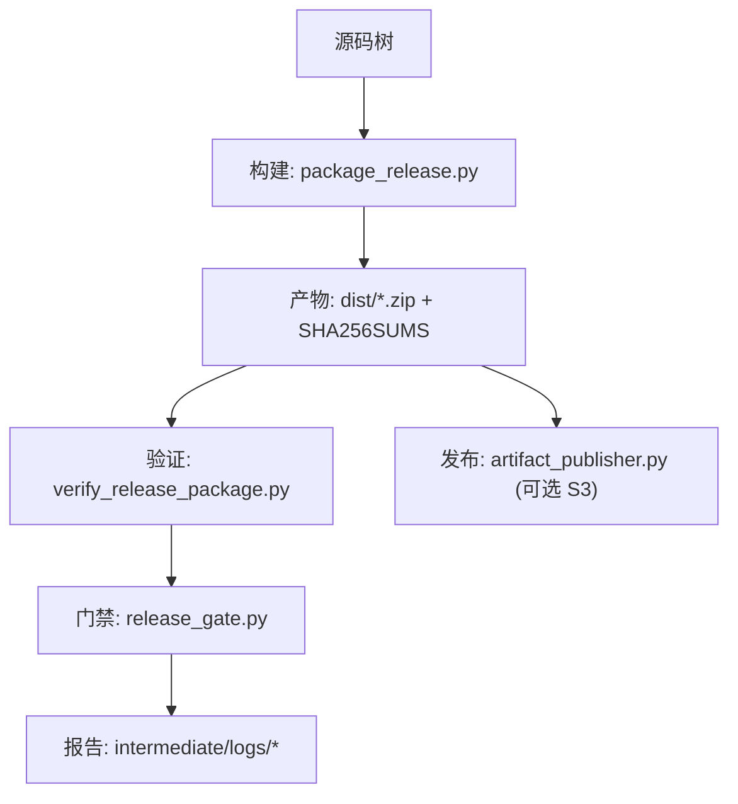
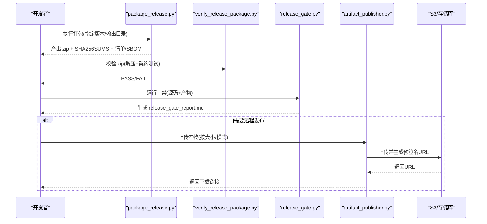
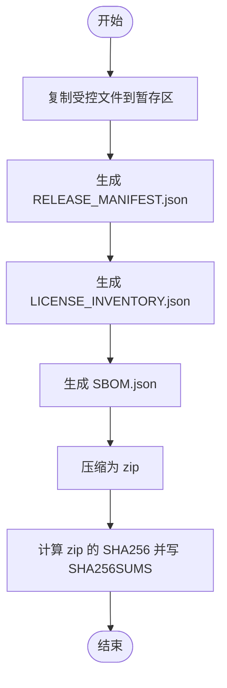
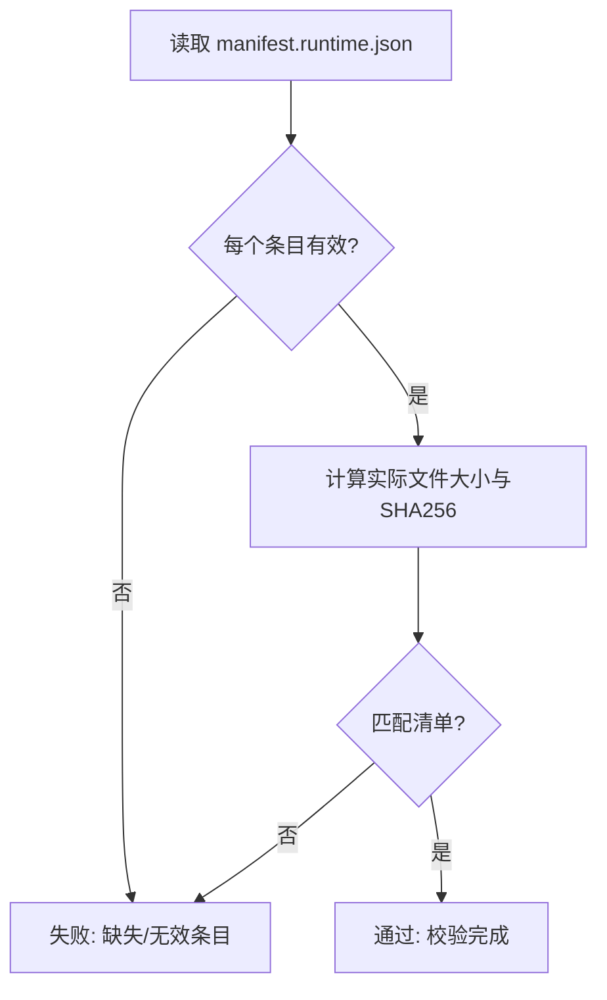
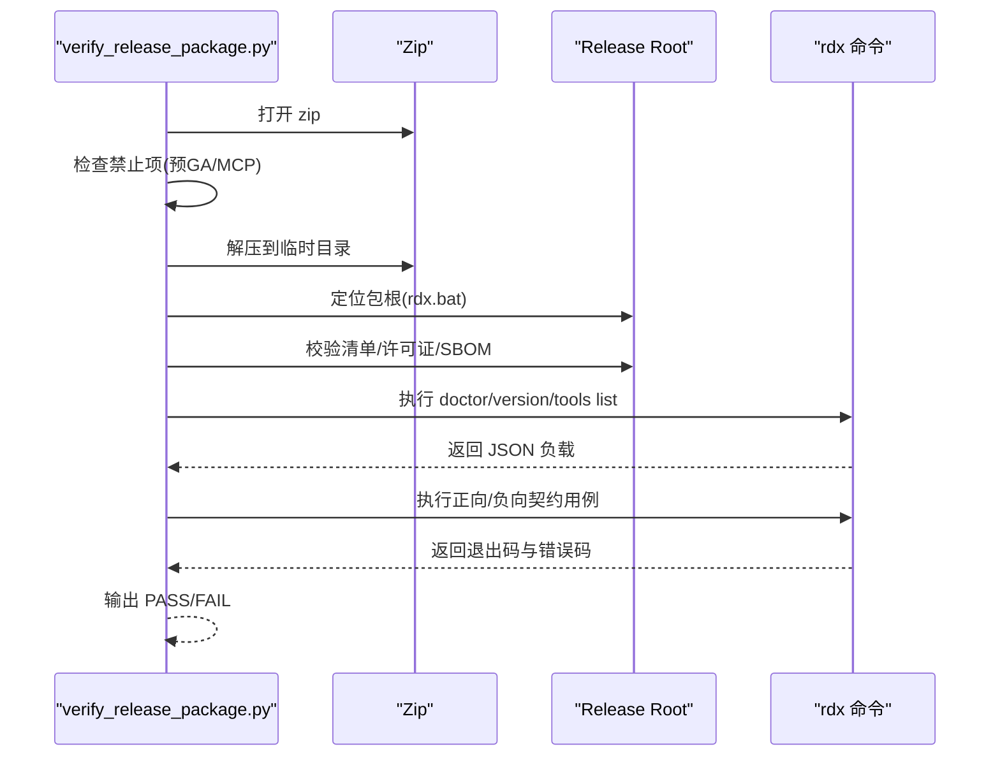
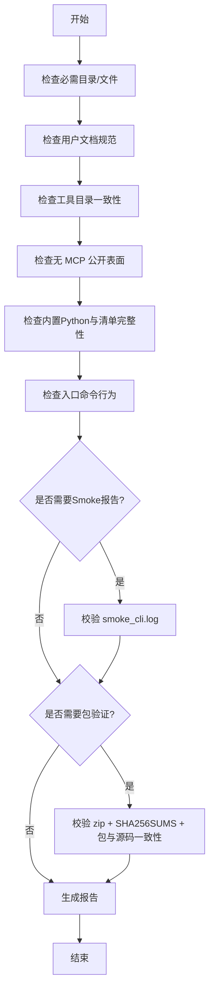
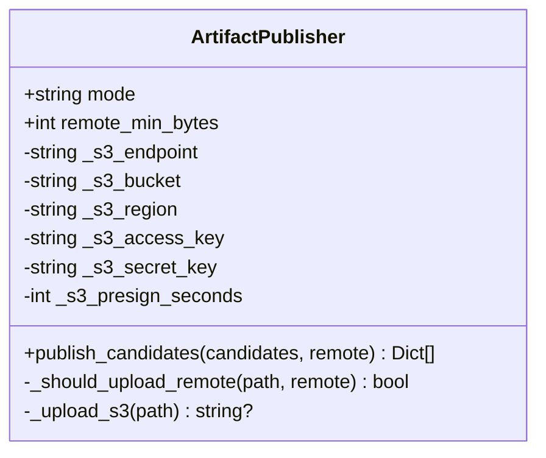
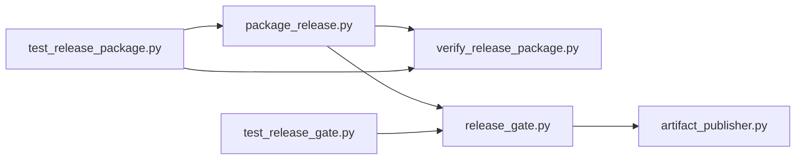

# 分发准备

<cite>
**本文引用的文件**
- [scripts/package_release.py](file://scripts/package_release.py)
- [scripts/generate_release_checksums.py](file://scripts/generate_release_checksums.py)
- [scripts/verify_release_package.py](file://scripts/verify_release_package.py)
- [scripts/release_gate.py](file://scripts/release_gate.py)
- [rdx/core/artifact_publisher.py](file://rdx/core/artifact_publisher.py)
- [scripts/_shared.py](file://scripts/_shared.py)
- [pyproject.toml](file://pyproject.toml)
- [THIRD_PARTY_NOTICES.md](file://THIRD_PARTY_NOTICES.md)
- [docs/release-notes.md](file://docs/release-notes.md)
- [tests/test_release_gate.py](file://tests/test_release_gate.py)
- [tests/test_release_package.py](file://tests/test_release_package.py)
</cite>

## 目录
1. [简介](#简介)
2. [项目结构](#项目结构)
3. [核心组件](#核心组件)
4. [架构总览](#架构总览)
5. [详细组件分析](#详细组件分析)
6. [依赖关系分析](#依赖关系分析)
7. [性能与完整性考量](#性能与完整性考量)
8. [故障排查指南](#故障排查指南)
9. [结论](#结论)
10. [附录](#附录)

## 简介
本文件面向发布前的分发准备工作，覆盖以下主题：第三方依赖合规性与许可证验证、完整性校验（SHA256 哈希与签名）、发布包验证测试（功能与兼容性）、文档更新与发布说明要求、安全扫描与漏洞检测流程、分发渠道配置与管理（存储库上传与镜像同步）、分发故障排查与回滚策略、以及分发监控与质量指标收集。内容基于仓库中的打包脚本、门禁脚本、验证脚本、制品发布器及相关测试与文档进行系统化梳理。

## 项目结构
本项目将“构建—校验—发布”的关键能力拆分为多个脚本与模块：
- 构建与打包：生成自包含的 Windows x64 zip 包，附带清单、许可证清单与 SBOM。
- 完整性校验：计算并输出 SHA256 校验和；在门禁阶段校验运行时清单与包内清单一致性。
- 发布前门禁：执行目录/文件存在性检查、用户文档规范检查、公开命令契约检查、工具目录一致性检查、MCP 暴露面检查、内置 Python 布局检查等。
- 发布包验证：解压包后运行 doctor/version/tools list 等契约测试，并拒绝预 GA 标记与 MCP 公开入口。
- 制品发布：本地或远程（S3）上传产物，支持预签名 URL。
- 测试与报告：通过 pytest 与 smoke 日志记录门禁结果，生成可审计的报告。

**图表来源**
- [scripts/package_release.py:168-210](file://scripts/package_release.py#L168-L210)
- [scripts/verify_release_package.py:301-332](file://scripts/verify_release_package.py#L301-L332)
- [scripts/release_gate.py:520-673](file://scripts/release_gate.py#L520-L673)
- [rdx/core/artifact_publisher.py:60-118](file://rdx/core/artifact_publisher.py#L60-L118)

**章节来源**
- [scripts/package_release.py:168-210](file://scripts/package_release.py#L168-L210)
- [scripts/release_gate.py:520-673](file://scripts/release_gate.py#L520-L673)

## 核心组件
- 打包器：负责复制受控文件集、生成 RELEASE_MANIFEST.json、LICENSE_INVENTORY.json、SBOM.json，压缩为 zip，并输出 SHA256SUMS。
- 校验器：解压 zip，校验清单字段、公共命令、入口点、工具目录、CLI 契约、禁止项（测试数据、.rdc、预 GA 标记、MCP 公开入口）。
- 门禁：对源码树与产物做全面检查，包括必需目录/文件、用户文档规范、公开命令帮助文本、工具目录指纹、内置 Python 布局、Smoke 报告、包与源码一致性。
- 发布器：根据环境变量决定本地或远程（S3）上传，生成预签名下载链接。
- 辅助工具：路径解析、子进程调用、JSON 提取、写入文本等通用函数。

**章节来源**
- [scripts/package_release.py:86-156](file://scripts/package_release.py#L86-L156)
- [scripts/verify_release_package.py:126-299](file://scripts/verify_release_package.py#L126-L299)
- [scripts/release_gate.py:28-104](file://scripts/release_gate.py#L28-L104)
- [rdx/core/artifact_publisher.py:15-33](file://rdx/core/artifact_publisher.py#L15-L33)
- [scripts/_shared.py:10-92](file://scripts/_shared.py#L10-L92)

## 架构总览
下图展示了从源码到最终产物的关键步骤与交互：

**图表来源**
- [scripts/package_release.py:168-210](file://scripts/package_release.py#L168-L210)
- [scripts/verify_release_package.py:301-332](file://scripts/verify_release_package.py#L301-L332)
- [scripts/release_gate.py:520-673](file://scripts/release_gate.py#L520-L673)
- [rdx/core/artifact_publisher.py:60-118](file://rdx/core/artifact_publisher.py#L60-L118)

## 详细组件分析

### 打包与清单生成（package_release.py）
- 复制受控文件集：仅允许根级白名单文件与目录进入发布树，排除测试、缓存、中间产物及二进制调试符号等。
- 生成清单：
  - RELEASE_MANIFEST.json：包含名称、版本、平台、公共命令、入口点、文件列表（含 size 与 sha256）。
  - LICENSE_INVENTORY.json：遍历 site-packages 的 METADATA，汇总第三方依赖的名称、版本、许可证与路径。
  - SBOM.json：以 rdx-tools.sbom.v1 格式描述组件集合。
- 压缩与校验：生成 zip，并在 dist 目录输出 SHA256SUMS 与 release_report.md。

**图表来源**
- [scripts/package_release.py:86-156](file://scripts/package_release.py#L86-L156)
- [scripts/package_release.py:159-210](file://scripts/package_release.py#L159-L210)

**章节来源**
- [scripts/package_release.py:86-156](file://scripts/package_release.py#L86-L156)
- [scripts/package_release.py:159-210](file://scripts/package_release.py#L159-L210)

### 完整性校验（generate_release_checksums.py 与 release_gate.py）
- 独立校验脚本：对指定文件或目录递归计算 SHA256，输出统一格式的校验和文件。
- 门禁集成：
  - 校验运行时清单：读取 binaries/windows/x64/manifest.runtime.json，逐项核对文件大小与 SHA256，并禁止特定后缀（如 .pdb/.lib/.exp/.ilk/.h）。
  - 校验包与源码一致性：对比包内 RELEASE_MANIFEST.json 与源码树生成的清单，确保文件集合、size、sha256 完全一致。

**图表来源**
- [scripts/release_gate.py:254-283](file://scripts/release_gate.py#L254-L283)
- [scripts/release_gate.py:482-517](file://scripts/release_gate.py#L482-L517)
- [scripts/generate_release_checksums.py:18-50](file://scripts/generate_release_checksums.py#L18-L50)

**章节来源**
- [scripts/generate_release_checksums.py:18-50](file://scripts/generate_release_checksums.py#L18-L50)
- [scripts/release_gate.py:254-283](file://scripts/release_gate.py#L254-L283)
- [scripts/release_gate.py:482-517](file://scripts/release_gate.py#L482-L517)

### 发布包验证测试（verify_release_package.py）
- 解压与定位：自动识别包根目录（包含 rdx.bat）。
- 清单校验：验证 public_commands、entrypoints、files 字段，拒绝泄露 tests、.rdc、mcp 等路径。
- 许可证与 SBOM：确认 rdx-tools 许可证为 Apache-2.0，且 SBOM components 中正确声明。
- 契约测试：
  - doctor/version/tools list 等命令必须成功返回预期 result_kind。
  - 正向用例：context status/list/update/clear、vfs ls 等。
  - 负向用例：不支持的投影、缺少 session、已移除别名等应返回约定错误码。
- 禁止项：
  - 拒绝预 GA 路径与文本标记。
  - 拒绝用户文档中出现 MCP 公开入口提示。

**图表来源**
- [scripts/verify_release_package.py:119-299](file://scripts/verify_release_package.py#L119-L299)
- [scripts/verify_release_package.py:301-332](file://scripts/verify_release_package.py#L301-L332)

**章节来源**
- [scripts/verify_release_package.py:119-299](file://scripts/verify_release_package.py#L119-L299)
- [scripts/verify_release_package.py:301-332](file://scripts/verify_release_package.py#L301-L332)

### 门禁与发布前检查（release_gate.py）
- 结构与文档：
  - 必需目录/文件存在性检查。
  - 用户文档不得包含 venv/pip/uv 等引导命令示例，不得出现 rdx.bat 命令用法（仅保留作为启动器引用）。
  - 工具参考文档需与代码定义保持一致。
- 公开表面：
  - 工具目录必须与代码定义一致，禁止已移除别名出现在活跃目录中。
  - 禁止 mcp/ 出现在发布源表面与用户文档中。
- 运行时与入口：
  - 校验内置 Python 布局与版本。
  - 校验 rdx --help、--version、doctor、tools list 等入口行为。
- Smoke 与包：
  - 可选/强制检查 bash CLI smoke 日志是否通过。
  - 可选/强制检查是否存在并验证 dist 下的 zip 包及其 SHA256SUMS。
- 报告：将所有检查项写入 intermediate/logs/release_gate_report.md，整体 PASS/FAIL 由 exit code 表达。

**图表来源**
- [scripts/release_gate.py:28-104](file://scripts/release_gate.py#L28-L104)
- [scripts/release_gate.py:254-396](file://scripts/release_gate.py#L254-L396)
- [scripts/release_gate.py:399-460](file://scripts/release_gate.py#L399-L460)
- [scripts/release_gate.py:520-673](file://scripts/release_gate.py#L520-L673)

**章节来源**
- [scripts/release_gate.py:28-104](file://scripts/release_gate.py#L28-L104)
- [scripts/release_gate.py:254-396](file://scripts/release_gate.py#L254-L396)
- [scripts/release_gate.py:399-460](file://scripts/release_gate.py#L399-L460)
- [scripts/release_gate.py:520-673](file://scripts/release_gate.py#L520-L673)

### 制品发布与渠道管理（artifact_publisher.py）
- 模式选择：通过环境变量 RDX_ARTIFACT_MODE 控制 local 或 remote。
- 远程上传：当满足最小大小阈值且配置了 S3 相关环境变量时，使用 boto3 上传至 S3 兼容存储，并生成预签名 URL。
- 本地优先：若不满足远程条件或未启用远程模式，则返回本地路径制品。
- 去重：对重复路径或 URL 进行去重处理。

**图表来源**
- [rdx/core/artifact_publisher.py:15-118](file://rdx/core/artifact_publisher.py#L15-L118)

**章节来源**
- [rdx/core/artifact_publisher.py:15-118](file://rdx/core/artifact_publisher.py#L15-L118)

### 第三方依赖合规与许可证验证
- 许可证清单：打包器会扫描 site-packages 的 METADATA，生成 LICENSE_INVENTORY.json，记录每个依赖的名称、版本、许可证与路径。
- SBOM：同时生成 SBOM.json，用于下游供应链安全与合规审查。
- 项目许可证：清单与 SBOM 均要求 rdx-tools 许可证为 Apache-2.0。
- 第三方通知：仓库提供 THIRD_PARTY_NOTICES.md，声明测试资产的上游仓库、许可证与发布行为（不随包分发）。

**章节来源**
- [scripts/package_release.py:108-156](file://scripts/package_release.py#L108-L156)
- [THIRD_PARTY_NOTICES.md:1-16](file://THIRD_PARTY_NOTICES.md#L1-L16)

### 文档更新与发布说明
- 发布说明：docs/release-notes.md 记录了操作接口收敛、CLI 运行时基线、发布打包与验证流程等关键变更。
- 工具参考：docs/tool-reference.md 需与 spec/tool_catalog.json 保持同步，门禁会校验其新鲜度。
- 用户文档约束：不得包含 venv/pip/uv 等引导命令，不得出现 rdx.bat 命令示例（仅作为启动器引用），以确保安装与使用体验一致。

**章节来源**
- [docs/release-notes.md:1-26](file://docs/release-notes.md#L1-L26)
- [scripts/release_gate.py:294-377](file://scripts/release_gate.py#L294-L377)

### 安全扫描与漏洞检测
- 源码扫描：门禁使用 ripgrep（rg）扫描源码，若 rg 不可用则回退到 Python 实现，避免外部依赖缺失导致门禁失败。
- 禁止项扫描：
  - 禁止引用 extensions/ 与 debug-agent/RDC-Agent-Frameworks 等内部术语。
  - 禁止用户文档中包含 uv.lock、uv sync、python -m venv、pip install 等引导命令。
  - 禁止 MCP 公开入口暴露于发布源与用户文档。
- 运行时清单校验：校验 binaries/windows/x64/manifest.runtime.json 中每个文件的 size 与 sha256，并禁止特定后缀（如 .pdb/.lib/.exp/.ilk/.h）。
- 注意：当前仓库未集成专门的漏洞扫描工具（如依赖漏洞数据库扫描），但通过清单、SBOM 与源码扫描形成基础的安全基线。

**章节来源**
- [scripts/release_gate.py:187-251](file://scripts/release_gate.py#L187-L251)
- [scripts/release_gate.py:254-396](file://scripts/release_gate.py#L254-L396)

### 分发渠道配置与管理
- 本地模式：默认将制品保存在本地 artifacts_dir（可通过环境变量覆盖）。
- 远程模式：设置 RDX_ARTIFACT_MODE=remote，并配置 RDX_S3_ENDPOINT、RDX_S3_BUCKET、RDX_S3_REGION、RDX_S3_ACCESS_KEY、RDX_S3_SECRET_KEY、RDX_S3_PRESIGN_SECONDS。当制品大于等于 RDX_REMOTE_ARTIFACT_MIN_BYTES 时，将上传至 S3 并生成预签名 URL。
- 镜像同步：仓库未提供镜像同步逻辑；如需镜像同步，可在 CI/CD 层基于生成的 SHA256SUMS 与 zip 进行二次分发。

**章节来源**
- [rdx/core/artifact_publisher.py:15-33](file://rdx/core/artifact_publisher.py#L15-L33)
- [rdx/core/artifact_publisher.py:35-58](file://rdx/core/artifact_publisher.py#L35-L58)

### 分发故障排查与回滚策略
- 常见失败点：
  - 版本不匹配：打包器会拒绝与期望版本不一致的构建。
  - 清单不一致：RELEASE_MANIFEST.json 与源码树不一致将被拒绝。
  - 许可证不符：LICENSE_INVENTORY.json 与 SBOM 中 rdx-tools 许可证必须为 Apache-2.0。
  - 契约失败：doctor/version/tools list 等命令返回非预期 payload 或错误码。
  - 禁止项触发：预 GA 标记、MCP 公开入口、测试数据泄露等。
- 回滚策略：
  - 由于产物包含 SHA256SUMS 与清单，可在任何时间点重新校验历史包的一致性。
  - 若远程模式启用，可通过撤销 S3 对象或限制预签名 URL 有效期进行快速回滚。
  - 门禁报告 intermediate/logs/release_gate_report.md 可作为回滚决策依据。

**章节来源**
- [scripts/package_release.py:168-176](file://scripts/package_release.py#L168-L176)
- [scripts/release_gate.py:482-517](file://scripts/release_gate.py#L482-L517)
- [rdx/core/artifact_publisher.py:35-58](file://rdx/core/artifact_publisher.py#L35-L58)

### 分发监控与质量指标收集
- 门禁报告：release_gate.py 输出结构化报告，包含每项检查的 PASS/FAIL 与详情摘要。
- Smoke 日志：bash scripts/smoke_cli.sh 的输出被门禁读取，标记 [smoke] PASS/FAIL。
- 包验证报告：verify_release_package.py 输出 PASS/FAIL，便于自动化流水线判定。
- 制品元数据：RELEASE_MANIFEST.json、LICENSE_INVENTORY.json、SBOM.json 提供可机读的制品信息，便于下游系统采集与审计。

**章节来源**
- [scripts/release_gate.py:520-673](file://scripts/release_gate.py#L520-L673)
- [scripts/verify_release_package.py:301-332](file://scripts/verify_release_package.py#L301-L332)
- [scripts/package_release.py:136-156](file://scripts/package_release.py#L136-L156)

## 依赖关系分析
- 构建与验证强耦合：package_release.py 生成的清单与校验器 verify_release_package.py 的断言高度一致，确保包内容与契约稳定。
- 门禁与源码/产物双向校验：release_gate.py 既检查源码树也检查 dist 下的 zip，保证发布物与代码一致。
- 发布器与环境变量：artifact_publisher.py 的行为完全由环境变量驱动，便于在不同环境切换本地/远程发布。
- 测试保障：tests/test_release_gate.py 与 tests/test_release_package.py 覆盖了门禁与打包器的关键分支与边界情况。

**图表来源**
- [scripts/package_release.py:168-210](file://scripts/package_release.py#L168-L210)
- [scripts/verify_release_package.py:301-332](file://scripts/verify_release_package.py#L301-L332)
- [scripts/release_gate.py:520-673](file://scripts/release_gate.py#L520-L673)
- [rdx/core/artifact_publisher.py:60-118](file://rdx/core/artifact_publisher.py#L60-L118)
- [tests/test_release_gate.py:1-355](file://tests/test_release_gate.py#L1-L355)
- [tests/test_release_package.py:1-175](file://tests/test_release_package.py#L1-L175)

**章节来源**
- [tests/test_release_gate.py:1-355](file://tests/test_release_gate.py#L1-L355)
- [tests/test_release_package.py:1-175](file://tests/test_release_package.py#L1-L175)

## 性能与完整性考量
- 大文件分块哈希：SHA256 计算采用分块读取，降低内存占用。
- 压缩级别：zip 压缩级别设为 9，兼顾体积与构建时间。
- 清单一致性：通过 size 与 sha256 双重校验，防止构建期替换或遗漏。
- 回退机制：rg 不可用时回退 Python 扫描，提升门禁鲁棒性。

**章节来源**
- [scripts/package_release.py:64-72](file://scripts/package_release.py#L64-L72)
- [scripts/package_release.py:159-166](file://scripts/package_release.py#L159-L166)
- [scripts/release_gate.py:187-251](file://scripts/release_gate.py#L187-L251)

## 故障排查指南
- 版本不匹配：检查 pyproject.toml 的版本与打包参数是否一致。
- 清单缺失或字段错误：确认 RELEASE_MANIFEST.json 包含 public_commands、entrypoints、files，且 entrypoints 物理文件存在。
- 许可证不符：检查 LICENSE_INVENTORY.json 与 SBOM.json 中 rdx-tools 许可证是否为 Apache-2.0。
- 契约失败：查看 verify_release_package.py 输出的错误信息与退出码，定位具体命令与 expected_codes。
- 禁止项触发：根据门禁报告定位具体规则（如 MCP 公开入口、预 GA 标记、测试数据泄露）。
- 远程发布失败：检查 S3 环境变量与网络连通性，确认制品大小达到阈值。

**章节来源**
- [pyproject.toml:5-11](file://pyproject.toml#L5-L11)
- [scripts/verify_release_package.py:126-299](file://scripts/verify_release_package.py#L126-L299)
- [scripts/release_gate.py:254-396](file://scripts/release_gate.py#L254-L396)
- [rdx/core/artifact_publisher.py:35-58](file://rdx/core/artifact_publisher.py#L35-L58)

## 结论
该项目的分发准备流程围绕“构建—校验—门禁—发布”展开，强调清单化、契约化与可审计性。通过严格的清单与完整性校验、全面的门禁检查、标准化的发布包验证与可配置的制品发布，确保了发布物的合规性、一致性与可追溯性。建议在 CI/CD 中固化这些步骤，并结合组织策略扩展漏洞扫描与镜像同步能力。

## 附录
- 关键环境变量：
  - RDX_ARTIFACT_MODE：local/remote
  - RDX_REMOTE_ARTIFACT_MIN_BYTES：远程上传最小字节数
  - RDX_S3_ENDPOINT/BUCKET/REGION/ACCESS_KEY/SECRET_KEY/PRESIGN_SECONDS：S3 配置
- 关键输出：
  - dist/*.zip：发布包
  - dist/SHA256SUMS：包校验和
  - intermediate/logs/release_gate_report.md：门禁报告
  - intermediate/logs/smoke_cli.log：Smoke 日志
  - RELEASE_MANIFEST.json/LICENSE_INVENTORY.json/SBOM.json：制品元数据

[无需来源：本节为概览性补充]