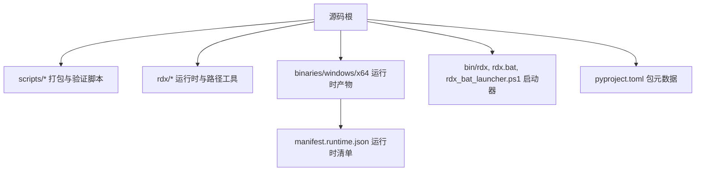
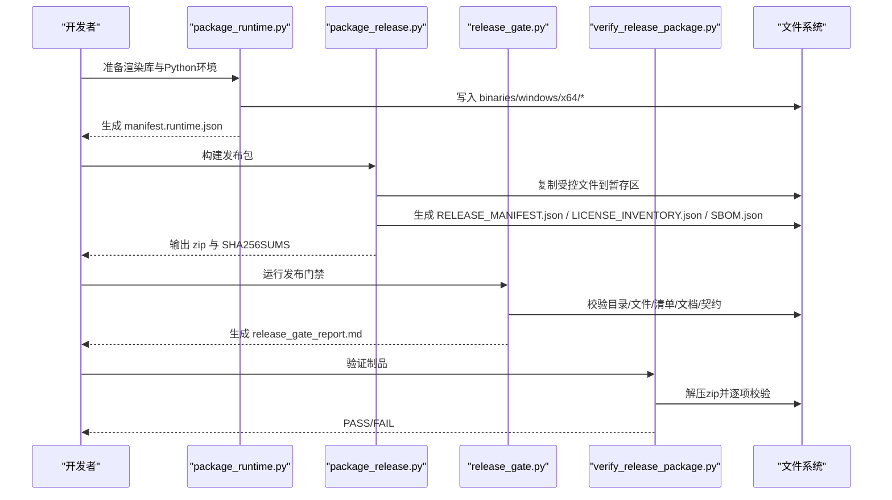
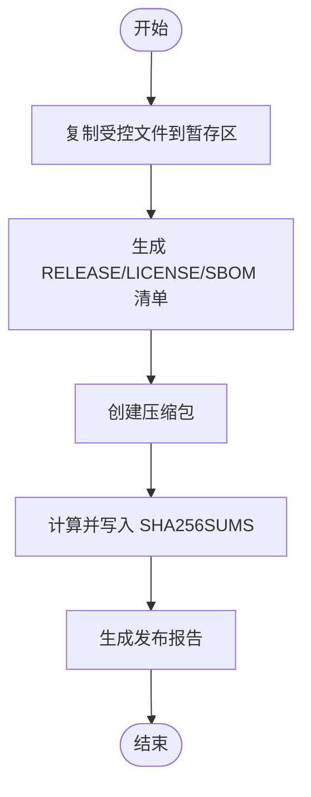
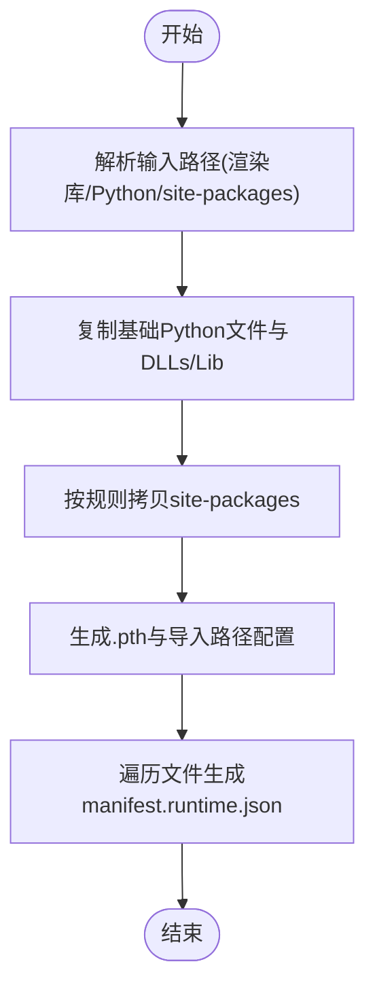
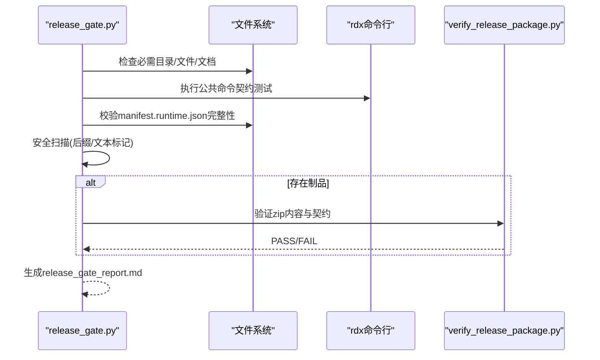
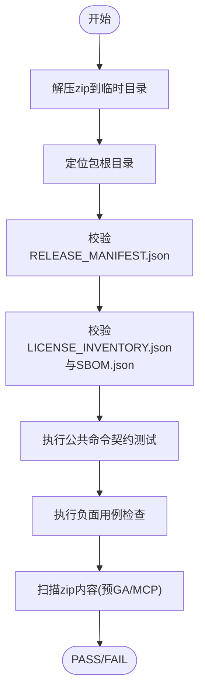
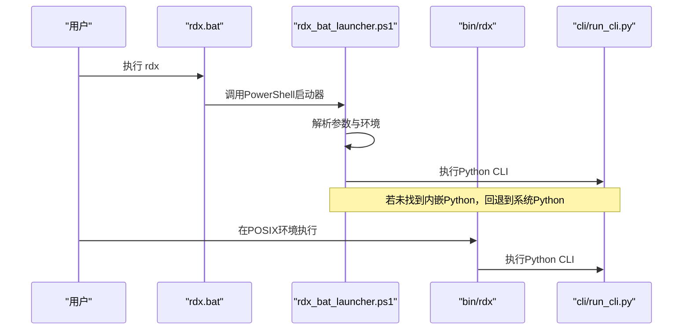
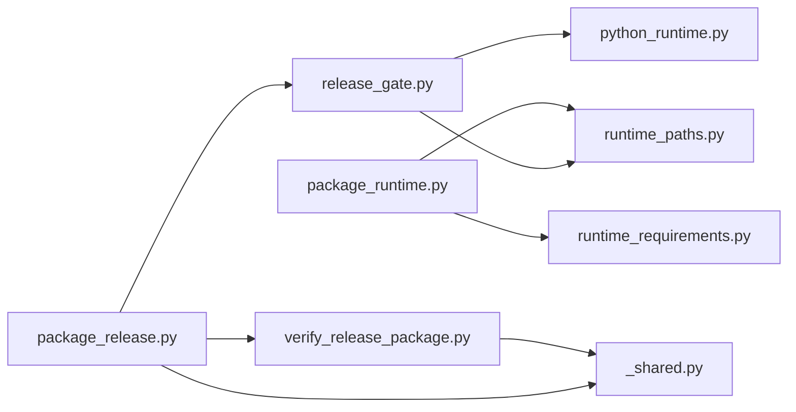

# 发布打包

<cite>
**本文引用的文件**
- [scripts/package_release.py](file://scripts/package_release.py)
- [scripts/package_runtime.py](file://scripts/package_runtime.py)
- [scripts/release_gate.py](file://scripts/release_gate.py)
- [scripts/verify_release_package.py](file://scripts/verify_release_package.py)
- [scripts/generate_release_checksums.py](file://scripts/generate_release_checksums.py)
- [scripts/_shared.py](file://scripts/_shared.py)
- [rdx/python_runtime.py](file://rdx/python_runtime.py)
- [rdx/runtime_paths.py](file://rdx/runtime_paths.py)
- [rdx/runtime_requirements.py](file://rdx/runtime_requirements.py)
- [bin/rdx](file://bin/rdx)
- [rdx.bat](file://rdx.bat)
- [scripts/rdx_bat_launcher.ps1](file://scripts/rdx_bat_launcher.ps1)
- [pyproject.toml](file://pyproject.toml)
- [rdx/__init__.py](file://rdx/__init__.py)
- [binaries/windows/x64/manifest.runtime.json](file://binaries/windows/x64/manifest.runtime.json)
</cite>

## 目录
1. [简介](#简介)
2. [项目结构](#项目结构)
3. [核心组件](#核心组件)
4. [架构总览](#架构总览)
5. [详细组件分析](#详细组件分析)
6. [依赖关系分析](#依赖关系分析)
7. [性能考虑](#性能考虑)
8. [故障排查指南](#故障排查指南)
9. [结论](#结论)
10. [附录](#附录)

## 简介
本文件系统化说明 RDX 工具的发布打包流程与自动化脚本，覆盖以下方面：
- 发布包构建：文件收集、元数据生成、压缩包创建与校验和输出。
- 运行时打包：Python 环境集成、平台特定文件处理与清单生成。
- 版本检查与一致性验证：源码与制品的一致性、清单完整性、入口点与公共命令契约。
- 包结构规范：目录布局、入口点定义、清单文件格式。
- 许可证清单与 SBOM：自动生成与校验。
- 参数定制与输出格式：各脚本的参数与产物说明。
- 质量检查与安全验证：发布门禁、内容扫描、负面用例验证。

## 项目结构
发布相关的关键目录与文件：
- scripts：发布与验证脚本集合（打包、运行时打包、门禁、校验、校验和）。
- rdx：运行时路径解析、Python 运行时布局校验、依赖过滤策略。
- binaries/windows/x64：平台二进制与内嵌 Python 运行时及清单。
- bin/rdx、rdx.bat、scripts/rdx_bat_launcher.ps1：跨平台启动器与 Windows 引导。
- pyproject.toml：包名、版本、入口点与依赖声明。

图表来源
- [scripts/package_release.py:1-215](file://scripts/package_release.py#L1-L215)
- [scripts/package_runtime.py:1-355](file://scripts/package_runtime.py#L1-L355)
- [rdx/runtime_paths.py:1-123](file://rdx/runtime_paths.py#L1-L123)
- [bin/rdx:1-40](file://bin/rdx#L1-L40)
- [rdx.bat:1-18](file://rdx.bat#L1-L18)
- [scripts/rdx_bat_launcher.ps1:1-479](file://scripts/rdx_bat_launcher.ps1#L1-L479)
- [pyproject.toml:1-45](file://pyproject.toml#L1-L45)

章节来源
- [scripts/package_release.py:1-215](file://scripts/package_release.py#L1-L215)
- [scripts/package_runtime.py:1-355](file://scripts/package_runtime.py#L1-L355)
- [rdx/runtime_paths.py:1-123](file://rdx/runtime_paths.py#L1-L123)
- [bin/rdx:1-40](file://bin/rdx#L1-L40)
- [rdx.bat:1-18](file://rdx.bat#L1-L18)
- [scripts/rdx_bat_launcher.ps1:1-479](file://scripts/rdx_bat_launcher.ps1#L1-L479)
- [pyproject.toml:1-45](file://pyproject.toml#L1-L45)

## 核心组件
- 发布打包脚本：负责从源码树复制受控文件、生成 RELEASE_MANIFEST.json、LICENSE_INVENTORY.json、SBOM.json，并输出 zip 与 SHA256SUMS。
- 运行时打包脚本：将 RenderDoc 等第三方二进制与内嵌 Python 运行时复制到 binaries/windows/x64，生成 manifest.runtime.json。
- 发布门禁：执行结构、文档、清单、运行契约、安全扫描与制品一致性检查。
- 制品验证：解压 zip，校验清单、许可证清单、SBOM、公共命令契约、负面用例与敏感内容。
- 辅助工具：共享函数、路径解析、子进程调用、JSON 提取；Python 运行时布局校验；依赖白名单/黑名单。

章节来源
- [scripts/package_release.py:1-215](file://scripts/package_release.py#L1-L215)
- [scripts/package_runtime.py:1-355](file://scripts/package_runtime.py#L1-L355)
- [scripts/release_gate.py:1-678](file://scripts/release_gate.py#L1-L678)
- [scripts/verify_release_package.py:1-337](file://scripts/verify_release_package.py#L1-L337)
- [scripts/_shared.py:1-92](file://scripts/_shared.py#L1-L92)
- [rdx/python_runtime.py:1-172](file://rdx/python_runtime.py#L1-L172)
- [rdx/runtime_paths.py:1-123](file://rdx/runtime_paths.py#L1-L123)
- [rdx/runtime_requirements.py:1-73](file://rdx/runtime_requirements.py#L1-L73)

## 架构总览
发布流水线由“运行时打包 → 发布打包 → 发布门禁 → 制品验证”组成，形成闭环的质量保障。

图表来源
- [scripts/package_runtime.py:288-350](file://scripts/package_runtime.py#L288-L350)
- [scripts/package_release.py:168-210](file://scripts/package_release.py#L168-L210)
- [scripts/release_gate.py:520-673](file://scripts/release_gate.py#L520-L673)
- [scripts/verify_release_package.py:301-332](file://scripts/verify_release_package.py#L301-L332)

## 详细组件分析

### 发布打包脚本（package_release.py）
- 文件收集：仅复制允许的文件与目录，排除测试、缓存、中间产物与调试符号。
- 元数据生成：
  - RELEASE_MANIFEST.json：包含名称、版本、平台、公共命令、入口点、文件清单（含大小与 sha256）。
  - LICENSE_INVENTORY.json：遍历 site-packages 的 dist-info/METADATA 汇总第三方许可信息。
  - SBOM.json：基于许可证清单生成软件物料清单。
- 压缩包创建：以 rdx-tools-<version>-windows-x64.zip 命名，压缩级别最高。
- 校验和与报告：生成 SHA256SUMS 与 release_report.md。

图表来源
- [scripts/package_release.py:86-166](file://scripts/package_release.py#L86-L166)
- [scripts/package_release.py:168-210](file://scripts/package_release.py#L168-L210)

章节来源
- [scripts/package_release.py:1-215](file://scripts/package_release.py#L1-L215)

### 运行时打包脚本（package_runtime.py）
- 输入源：RenderDoc 或其他第三方二进制目录、CPython home、site-packages 源。
- Python 集成：
  - 探测或指定 Python 版本，复制 python.exe、pythonw.exe、python3.dll、版本化 DLL、DLLs、Lib（跳过顶层不需要的目录）。
  - 选择性拷贝 site-packages，依据排除前缀过滤开发/测试依赖。
  - 生成 .pth 文件与必要的 pth 配置，确保运行时导入路径正确。
- 清单生成：遍历 binaries/windows/x64 下所有文件，记录 path/size/sha256，写入 manifest.runtime.json。

图表来源
- [scripts/package_runtime.py:135-215](file://scripts/package_runtime.py#L135-L215)
- [scripts/package_runtime.py:279-350](file://scripts/package_runtime.py#L279-L350)
- [rdx/runtime_requirements.py:60-73](file://rdx/runtime_requirements.py#L60-L73)

章节来源
- [scripts/package_runtime.py:1-355](file://scripts/package_runtime.py#L1-L355)
- [rdx/runtime_requirements.py:1-73](file://rdx/runtime_requirements.py#L1-L73)

### 发布门禁（release_gate.py）
- 结构与文档：检查必需目录与文件，用户文档不得包含 venv/pip 等引导命令，禁止使用 rdx.bat 作为用户命令示例。
- 清单与运行时：校验 manifest.runtime.json 中每个文件的 size/sha256 与实际一致，验证内嵌 Python 布局。
- 公共命令契约：通过 rdx --help、doctor、version、tools list、context/vfs 等命令验证行为与返回结构。
- 安全扫描：禁止调试符号后缀、禁止 MCP 公开入口、禁止预 GA 标记泄露。
- 制品一致性：若提供 zip，则校验其 RELEASE_MANIFEST.json 与源码清单一致，并执行 verify_release_package.py。

图表来源
- [scripts/release_gate.py:254-397](file://scripts/release_gate.py#L254-L397)
- [scripts/release_gate.py:428-518](file://scripts/release_gate.py#L428-L518)
- [scripts/release_gate.py:520-673](file://scripts/release_gate.py#L520-L673)

章节来源
- [scripts/release_gate.py:1-678](file://scripts/release_gate.py#L1-L678)

### 制品验证（verify_release_package.py）
- 解压后定位包根，校验 RELEASE_MANIFEST.json 的 public_commands 与 entrypoints。
- 校验 LICENSE_INVENTORY.json 与 SBOM.json 的存在性与关键字段。
- 运行 doctor、物理启动器、version、tools list 等契约测试。
- 检查负面用例（不支持的投影、缺失操作、已移除别名等）。
- 扫描 zip 内容，禁止预 GA 路径/文本标记与 MCP 公开入口。

图表来源
- [scripts/verify_release_package.py:119-176](file://scripts/verify_release_package.py#L119-L176)
- [scripts/verify_release_package.py:178-259](file://scripts/verify_release_package.py#L178-L259)
- [scripts/verify_release_package.py:262-332](file://scripts/verify_release_package.py#L262-L332)

章节来源
- [scripts/verify_release_package.py:1-337](file://scripts/verify_release_package.py#L1-L337)

### 启动器与入口点
- 跨平台入口：
  - bin/rdx：优先使用内嵌 Python，否则回退到系统 Python。
  - rdx.bat：Windows 上调用 PowerShell 启动器。
  - scripts/rdx_bat_launcher.ps1：解析参数、选择 Python、设置环境变量、调用 cli/run_cli.py。
- 包元数据：
  - pyproject.toml：声明包名、版本、依赖与脚本入口 rdx = rdx.cli:main。
  - rdx/__init__.py：__version__ 用于版本一致性检查。

图表来源
- [rdx.bat:1-18](file://rdx.bat#L1-L18)
- [scripts/rdx_bat_launcher.ps1:24-115](file://scripts/rdx_bat_launcher.ps1#L24-L115)
- [scripts/rdx_bat_launcher.ps1:298-332](file://scripts/rdx_bat_launcher.ps1#L298-L332)
- [bin/rdx:1-40](file://bin/rdx#L1-L40)
- [pyproject.toml:21-23](file://pyproject.toml#L21-L23)
- [rdx/__init__.py:1-4](file://rdx/__init__.py#L1-L4)

章节来源
- [rdx.bat:1-18](file://rdx.bat#L1-L18)
- [scripts/rdx_bat_launcher.ps1:1-479](file://scripts/rdx_bat_launcher.ps1#L1-L479)
- [bin/rdx:1-40](file://bin/rdx#L1-L40)
- [pyproject.toml:1-45](file://pyproject.toml#L1-L45)
- [rdx/__init__.py:1-4](file://rdx/__init__.py#L1-L4)

### 版本检查与一致性验证机制
- 版本一致性：
  - package_release.py 比较传入 --version 与 rdx.__version__，不一致即失败。
  - release_gate.py 通过 rdx version --json 与 tools list 对比 catalog 与代码定义。
- 清单一致性：
  - release_gate.py 校验 manifest.runtime.json 中每个文件的 size/sha256。
  - verify_release_package.py 校验 RELEASE_MANIFEST.json 的 public_commands/entrypoints/files。
- 源码与制品一致性：
  - release_gate.py 将源码树生成的清单与 zip 中的清单比对，检测缺失/多余项与哈希不一致。

章节来源
- [scripts/package_release.py:168-176](file://scripts/package_release.py#L168-L176)
- [scripts/release_gate.py:254-283](file://scripts/release_gate.py#L254-L283)
- [scripts/release_gate.py:482-518](file://scripts/release_gate.py#L482-L518)
- [scripts/verify_release_package.py:126-152](file://scripts/verify_release_package.py#L126-L152)
- [rdx/__init__.py:1-4](file://rdx/__init__.py#L1-L4)

### 包结构规范
- 目录布局：
  - binaries/windows/x64：平台二进制与内嵌 Python 运行时。
  - intermediate：运行时状态、日志、pytest 与 artifacts。
  - rdx、bin、cli、spec、policy、docs、scripts：源码与脚本。
- 入口点定义：
  - 公共命令：rdx。
  - 入口点：rdx.bat、bin/rdx、cli/run_cli.py。
- 清单文件格式：
  - RELEASE_MANIFEST.json：name/version/platform/public_commands/entrypoints/file_count/files。
  - LICENSE_INVENTORY.json：数组，每项包含 name/version/license/path。
  - SBOM.json：schema/name/version/platform/components。
  - manifest.runtime.json：file_count/files，可选 bundled_python 元数据。

章节来源
- [scripts/package_release.py:136-156](file://scripts/package_release.py#L136-L156)
- [scripts/package_runtime.py:335-348](file://scripts/package_runtime.py#L335-L348)
- [scripts/verify_release_package.py:126-176](file://scripts/verify_release_package.py#L126-L176)
- [binaries/windows/x64/manifest.runtime.json:1-800](file://binaries/windows/x64/manifest.runtime.json#L1-L800)

### 许可证清单自动生成与 SBOM 生成过程
- 许可证清单：
  - 遍历 binaries/windows/x64/python/Lib/site-packages/*.dist-info/METADATA，提取 Name/Version/License。
  - 加入 rdx-tools 自身条目（Apache-2.0）。
- SBOM：
  - 基于许可证清单生成 SBOM.json，包含 schema、name、version、platform、components。
- 验证：
  - verify_release_package.py 检查 LICENSE_INVENTORY.json 与 SBOM.json 存在且字段正确。

章节来源
- [scripts/package_release.py:108-156](file://scripts/package_release.py#L108-L156)
- [scripts/verify_release_package.py:154-176](file://scripts/verify_release_package.py#L154-L176)

### 打包参数定制选项与输出格式
- package_release.py：
  - --out-dir：输出目录（默认 dist）。
  - --version：期望包版本（需与 rdx.__version__ 一致）。
  - 输出：zip、SHA256SUMS、release_report.md、RELEASE_MANIFEST.json、LICENSE_INVENTORY.json、SBOM.json。
- package_runtime.py：
  - --source：渲染库源目录（相对仓库根）。
  - --python-home：CPython home（绝对或相对）。
  - --site-packages-source：site-packages 源（默认 .venv/Lib/site-packages）。
  - --python-version：覆盖 Python 版本元数据。
  - 输出：binaries/windows/x64/* 与 manifest.runtime.json。
- generate_release_checksums.py：
  - paths：文件或目录列表。
  - --out：输出校验和文件（默认 intermediate/logs/release_checksums.sha256）。

章节来源
- [scripts/package_release.py:168-210](file://scripts/package_release.py#L168-L210)
- [scripts/package_runtime.py:279-350](file://scripts/package_runtime.py#L279-L350)
- [scripts/generate_release_checksums.py:29-51](file://scripts/generate_release_checksums.py#L29-L51)

### 打包质量检查与安全验证步骤
- 结构检查：必需目录与文件存在性。
- 文档检查：用户文档不包含 venv/pip 引导命令，不使用 rdx.bat 作为用户命令示例。
- 清单检查：manifest.runtime.json 完整性与哈希一致性。
- 运行契约：公共命令帮助、doctor、version、tools list、context/vfs 等行为验证。
- 安全扫描：禁止调试符号后缀、禁止 MCP 公开入口、禁止预 GA 标记。
- 制品验证：解压 zip，校验清单、许可证清单、SBOM、契约与负面用例。

章节来源
- [scripts/release_gate.py:28-104](file://scripts/release_gate.py#L28-L104)
- [scripts/release_gate.py:254-397](file://scripts/release_gate.py#L254-L397)
- [scripts/release_gate.py:428-518](file://scripts/release_gate.py#L428-L518)
- [scripts/verify_release_package.py:119-332](file://scripts/verify_release_package.py#L119-L332)

## 依赖关系分析
- 脚本间依赖：
  - release_gate.py 依赖 package_release.py 的受控文件规则与入口点常量。
  - verify_release_package.py 依赖 _shared.py 的 JSON 提取与子进程封装。
  - package_runtime.py 依赖 runtime_requirements.py 的 site-packages 过滤策略。
- 运行时依赖：
  - rdx/python_runtime.py 读取 manifest.runtime.json 并校验内嵌 Python 布局。
  - rdx/runtime_paths.py 提供工具根、二进制根、中间目录等路径解析。
- 外部依赖：
  - 通过 pyproject.toml 声明运行时依赖（如 pydantic、numpy、Pillow、jinja2、aiofiles）。

图表来源
- [scripts/release_gate.py:21-25](file://scripts/release_gate.py#L21-L25)
- [scripts/verify_release_package.py:20-27](file://scripts/verify_release_package.py#L20-L27)
- [scripts/package_runtime.py:19-20](file://scripts/package_runtime.py#L19-L20)
- [rdx/python_runtime.py:1-12](file://rdx/python_runtime.py#L1-L12)
- [rdx/runtime_paths.py:1-12](file://rdx/runtime_paths.py#L1-L12)

章节来源
- [scripts/release_gate.py:1-678](file://scripts/release_gate.py#L1-L678)
- [scripts/verify_release_package.py:1-337](file://scripts/verify_release_package.py#L1-L337)
- [scripts/package_runtime.py:1-355](file://scripts/package_runtime.py#L1-L355)
- [rdx/python_runtime.py:1-172](file://rdx/python_runtime.py#L1-L172)
- [rdx/runtime_paths.py:1-123](file://rdx/runtime_paths.py#L1-L123)
- [rdx/runtime_requirements.py:1-73](file://rdx/runtime_requirements.py#L1-L73)
- [pyproject.toml:1-45](file://pyproject.toml#L1-L45)

## 性能考虑
- 文件复制与扫描：
  - 使用递归遍历与后缀过滤减少无关文件处理。
  - 大文件分块计算 sha256，避免内存峰值。
- 压缩：
  - 发布包使用高压缩级别，平衡体积与构建时间。
- 子进程调用：
  - 限制超时与捕获输出，避免长时间阻塞。
- 清单生成：
  - 增量式遍历与过滤，减少 I/O 次数。

[本节为通用指导，无需具体文件引用]

## 故障排查指南
- 找不到 Python：
  - 检查 binaries/windows/x64/python/python.exe 是否存在，或设置 RDX_PYTHON。
  - 参考启动器逻辑与错误提示。
- 清单不一致：
  - 重新运行 package_runtime.py 与 package_release.py，确保 manifest.runtime.json 与 RELEASE_MANIFEST.json 同步更新。
- 版本不匹配：
  - 确保 --version 与 rdx.__version__ 一致。
- 安全扫描失败：
  - 清理调试符号、移除 MCP 公开入口与预 GA 标记。
- 契约测试失败：
  - 检查 rdx 命令输出是否符合预期，必要时调整入口点或命令实现。

章节来源
- [bin/rdx:1-40](file://bin/rdx#L1-L40)
- [scripts/rdx_bat_launcher.ps1:86-115](file://scripts/rdx_bat_launcher.ps1#L86-L115)
- [scripts/package_release.py:168-176](file://scripts/package_release.py#L168-L176)
- [scripts/release_gate.py:254-397](file://scripts/release_gate.py#L254-L397)
- [scripts/verify_release_package.py:178-259](file://scripts/verify_release_package.py#L178-L259)

## 结论
该发布体系通过严格的文件收集、清单生成、版本一致性检查、安全扫描与契约验证，确保发布包的完整性、可追溯性与安全性。运行时打包与内嵌 Python 集成为跨平台用户提供开箱即用的体验，而发布门禁与制品验证构成双重质量保障，适合持续集成与发布流水线。

[本节为总结性内容，无需具体文件引用]

## 附录
- 关键路径与环境变量：
  - RDX_TOOLS_ROOT：工具根目录（优先级最高）。
  - RDX_INTERMEDIATE_ROOT：中间目录覆盖。
  - RDX_PYTHON：指定 Python 解释器。
- 常用命令：
  - 运行时打包：python scripts/package_runtime.py --python-home ... --site-packages-source ...
  - 发布打包：python scripts/package_release.py --out-dir dist --version <ver>
  - 发布门禁：python scripts/release_gate.py --require-release-package
  - 制品验证：python scripts/verify_release_package.py --zip dist/rdx-tools-*.zip
  - 校验和生成：python scripts/generate_release_checksums.py <paths> --out intermediate/logs/release_checksums.sha256

章节来源
- [rdx/runtime_paths.py:10-86](file://rdx/runtime_paths.py#L10-L86)
- [scripts/package_runtime.py:279-350](file://scripts/package_runtime.py#L279-L350)
- [scripts/package_release.py:168-210](file://scripts/package_release.py#L168-L210)
- [scripts/release_gate.py:520-673](file://scripts/release_gate.py#L520-L673)
- [scripts/verify_release_package.py:301-332](file://scripts/verify_release_package.py#L301-L332)
- [scripts/generate_release_checksums.py:29-51](file://scripts/generate_release_checksums.py#L29-L51)