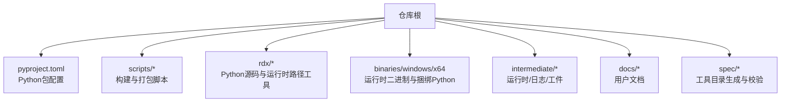
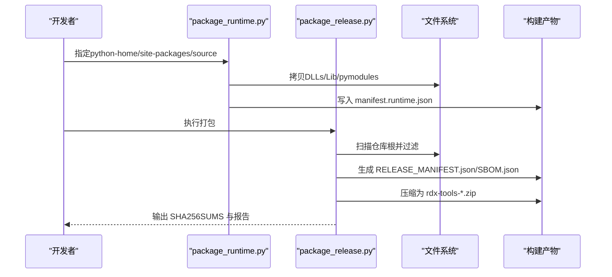
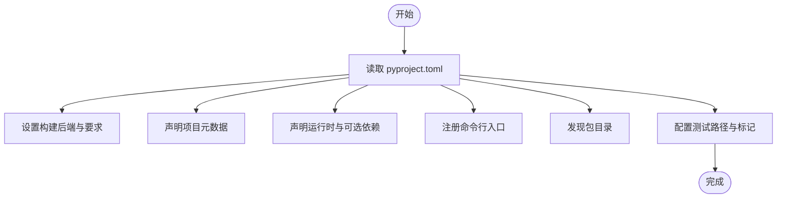
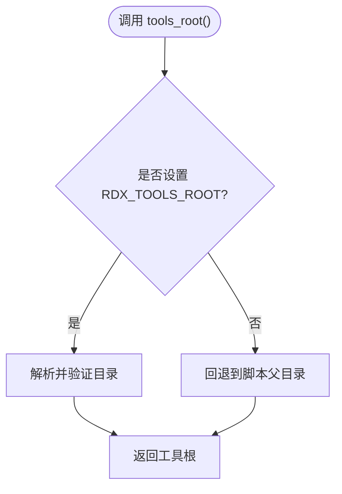
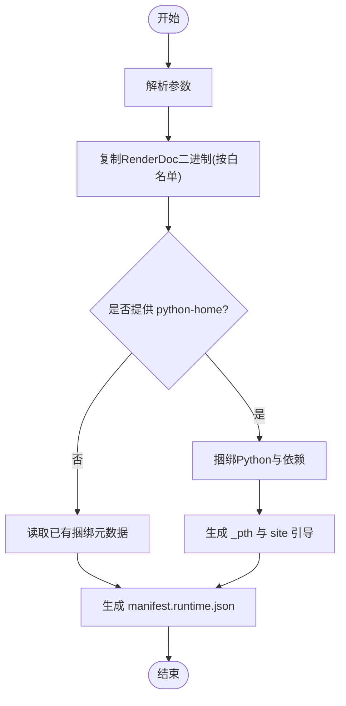
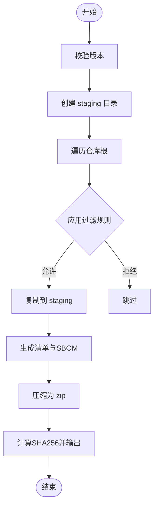
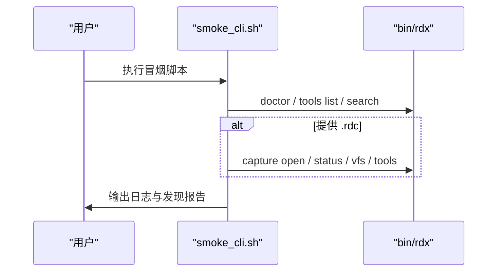
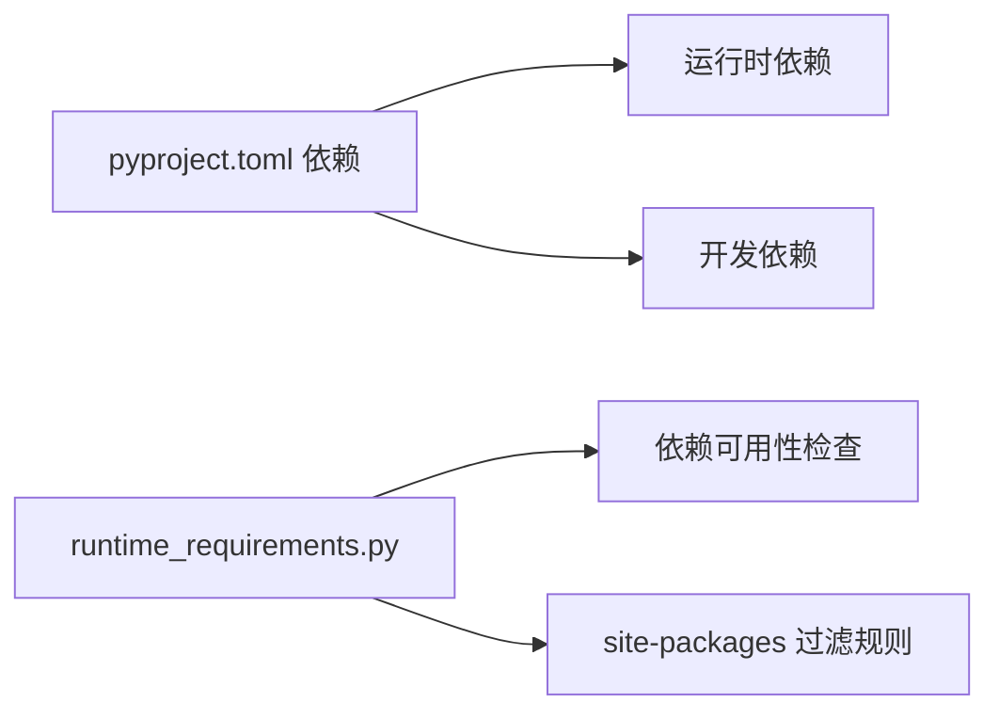

# 构建系统

<cite>
**本文引用的文件**
- [pyproject.toml](file://pyproject.toml)
- [scripts/_shared.py](file://scripts/_shared.py)
- [scripts/package_release.py](file://scripts/package_release.py)
- [scripts/package_runtime.py](file://scripts/package_runtime.py)
- [rdx/runtime_paths.py](file://rdx/runtime_paths.py)
- [rdx/runtime_requirements.py](file://rdx/runtime_requirements.py)
- [scripts/smoke_cli.sh](file://scripts/smoke_cli.sh)
- [rdx.bat](file://rdx.bat)
- [spec/build_catalog.py](file://spec/build_catalog.py)
- [docs/install.md](file://docs/install.md)
</cite>

## 目录
1. [简介](#简介)
2. [项目结构](#项目结构)
3. [核心组件](#核心组件)
4. [架构总览](#架构总览)
5. [详细组件分析](#详细组件分析)
6. [依赖分析](#依赖分析)
7. [性能考虑](#性能考虑)
8. [故障排查指南](#故障排查指南)
9. [结论](#结论)
10. [附录](#附录)

## 简介
本文件面向RDC-Tool项目的构建系统，聚焦以下目标：
- 解释Python项目配置文件 pyproject.toml 的作用与依赖管理策略。
- 说明构建脚本的结构与执行流程，包括工具根目录发现、路径解析与环境检查。
- 详述构建过程中的文件过滤规则（排除的目录与文件类型）。
- 介绍构建产物组织结构，包括源代码、二进制文件和文档的整合方式。
- 提供构建环境准备要求与依赖安装指南。
- 汇总自定义构建配置的选项与参数。

## 项目结构
RDC-Tool采用“源码+预打包运行时”的双层构建模式：
- Python包与CLI入口由 setuptools 管理，通过 pyproject.toml 声明元数据、依赖与可执行脚本入口。
- 运行时二进制（RenderDoc相关）与捆绑的CPython解释器由专用脚本复制到 binaries/windows/x64，并生成运行时清单。
- 发布包由 release 打包脚本从仓库根目录筛选必要文件，生成自包含的Windows x64压缩包。
- 中间产物统一写入 intermediate 目录，便于隔离运行态、测试与日志。

**图表来源**
- [pyproject.toml:1-45](file://pyproject.toml#L1-L45)
- [scripts/package_release.py:24-57](file://scripts/package_release.py#L24-L57)
- [scripts/package_runtime.py:23-41](file://scripts/package_runtime.py#L23-L41)
- [rdx/runtime_paths.py:60-86](file://rdx/runtime_paths.py#L60-L86)

**章节来源**
- [pyproject.toml:1-45](file://pyproject.toml#L1-L45)
- [scripts/README.md:1-29](file://scripts/README.md#L1-L29)

## 核心组件
- Python包配置与依赖声明：pyproject.toml
- 工具根目录发现与路径安全：scripts/_shared.py、rdx/runtime_paths.py
- 运行时打包：scripts/package_runtime.py
- 发布包打包：scripts/package_release.py
- 依赖可用性检查与site-packages过滤：rdx/runtime_requirements.py
- 冒烟测试与CLI验证：scripts/smoke_cli.sh
- Windows启动器：rdx.bat
- 工具目录生成：spec/build_catalog.py

**章节来源**
- [pyproject.toml:1-45](file://pyproject.toml#L1-L45)
- [scripts/_shared.py:10-35](file://scripts/_shared.py#L10-L35)
- [rdx/runtime_paths.py:14-86](file://rdx/runtime_paths.py#L14-L86)
- [scripts/package_runtime.py:23-41](file://scripts/package_runtime.py#L23-L41)
- [scripts/package_release.py:24-57](file://scripts/package_release.py#L24-L57)
- [rdx/runtime_requirements.py:7-73](file://rdx/runtime_requirements.py#L7-L73)
- [scripts/smoke_cli.sh:18-79](file://scripts/smoke_cli.sh#L18-L79)
- [rdx.bat:1-18](file://rdx.bat#L1-L18)
- [spec/build_catalog.py:1-26](file://spec/build_catalog.py#L1-L26)

## 架构总览
构建系统围绕“源码包 + 运行时二进制 + 发布包”三层展开：
- 源码包：setuptools基于pyproject.toml发现rdx包，注册rdx命令入口。
- 运行时：将RenderDoc相关二进制与捆绑Python拷贝到binaries/windows/x64，生成manifest.runtime.json。
- 发布包：从仓库根复制允许的文件与目录，生成RELEASE_MANIFEST.json、SBOM等元数据，并输出zip包与SHA256SUMS。

**图表来源**
- [scripts/package_runtime.py:135-215](file://scripts/package_runtime.py#L135-L215)
- [scripts/package_runtime.py:279-349](file://scripts/package_runtime.py#L279-L349)
- [scripts/package_release.py:86-156](file://scripts/package_release.py#L86-L156)
- [scripts/package_release.py:168-210](file://scripts/package_release.py#L168-L210)

## 详细组件分析

### Python项目配置与依赖管理（pyproject.toml）
- 构建后端与要求：使用setuptools.build_meta，要求setuptools>=68与wheel。
- 项目元数据：名称、版本、描述、许可证、作者、最低Python版本。
- 依赖管理：声明运行时依赖（aiofiles、jinja2、numpy、Pillow、pydantic），以及可选开发依赖（pytest）。
- 可执行脚本：注册rdx命令入口指向rdx.cli:main。
- 包发现：package-dir映射到根，packages.find包含rdx*。
- 测试配置：testpaths=tests，排除.git、intermediate、binaries；定义pytest标记。

**图表来源**
- [pyproject.toml:1-45](file://pyproject.toml#L1-L45)

**章节来源**
- [pyproject.toml:1-45](file://pyproject.toml#L1-L45)

### 工具根目录发现、路径解析与环境检查
- tools_root：优先使用环境变量 RDX_TOOLS_ROOT，否则回退到脚本所在目录的父级。
- resolve_repo_path：支持绝对路径或相对仓库根的路径解析。
- ensure_within_root：确保输入路径在工具根内，防止越权访问。
- runtime_paths：提供工具根、二进制根、捆绑Python根、中间目录等便捷方法，并可创建所需目录。

**图表来源**
- [scripts/_shared.py:10-16](file://scripts/_shared.py#L10-L16)
- [rdx/runtime_paths.py:14-41](file://rdx/runtime_paths.py#L14-L41)

**章节来源**
- [scripts/_shared.py:10-35](file://scripts/_shared.py#L10-L35)
- [rdx/runtime_paths.py:14-86](file://rdx/runtime_paths.py#L14-L86)

### 运行时打包（package_runtime.py）
- 输入参数：renderdoc_source、python_home、site-packages-source、python-version。
- 过滤规则：
  - 拒绝后缀：.pdb、.lib、.exp、.ilk、.h。
  - 允许模式：*.dll、*.json；pymodules下允许*.pyd、*.dll、*.json。
  - 跳过stdlib顶层目录：site-packages、test、tests、idlelib、turtledemo、ensurepip、venv、__pycache__。
  - 跳过编译缓存与文档：.pyc、.md、.rst、.chm。
- 捆绑Python：
  - 复制基础文件（python.exe、pythonw.exe、python3.dll、vcruntime DLLs、LICENSE.txt）。
  - 复制版本化DLL（pythonXY.dll）。
  - 复制DLLs与Lib（跳过顶层目录）。
  - 选择性复制site-packages（依据should_bundle_site_package）。
  - 生成.pth以引导导入路径。
- 输出：生成manifest.runtime.json，记录文件清单与捆绑Python信息。

**图表来源**
- [scripts/package_runtime.py:23-41](file://scripts/package_runtime.py#L23-L41)
- [scripts/package_runtime.py:79-108](file://scripts/package_runtime.py#L79-L108)
- [scripts/package_runtime.py:135-215](file://scripts/package_runtime.py#L135-L215)
- [scripts/package_runtime.py:279-349](file://scripts/package_runtime.py#L279-L349)

**章节来源**
- [scripts/package_runtime.py:23-41](file://scripts/package_runtime.py#L23-L41)
- [scripts/package_runtime.py:79-108](file://scripts/package_runtime.py#L79-L108)
- [scripts/package_runtime.py:135-215](file://scripts/package_runtime.py#L135-L215)
- [scripts/package_runtime.py:279-349](file://scripts/package_runtime.py#L279-L349)
- [rdx/runtime_requirements.py:7-73](file://rdx/runtime_requirements.py#L7-L73)

### 发布包打包（package_release.py）
- 平台与命名：windows-x64，包名前缀rdx-tools。
- 排除目录：.git、各类缓存、.venv、__pycache__、dist、intermediate。
- 排除文件后缀：.pyc、.pyo、.pdb、.ilk、.exp、.lib、.rdc。
- 允许根级文件：.gitattributes、.gitignore、AGENTS.md、CHANGELOG.md、LICENSE、THIRD_PARTY_NOTICES.md、README.md、pyproject.toml、rdx.bat。
- 允许目录：bin、binaries、cli、docs、policy、rdx、scripts、spec。
- 处理流程：
  - 校验版本一致性。
  - 清理并创建staging目录。
  - 遍历仓库根，应用过滤规则复制文件。
  - 生成RELEASE_MANIFEST.json、LICENSE_INVENTORY.json、SBOM.json。
  - 压缩为zip，计算SHA256并输出SHA256SUMS与release_report.md。

**图表来源**
- [scripts/package_release.py:24-57](file://scripts/package_release.py#L24-L57)
- [scripts/package_release.py:75-105](file://scripts/package_release.py#L75-L105)
- [scripts/package_release.py:136-156](file://scripts/package_release.py#L136-L156)
- [scripts/package_release.py:168-210](file://scripts/package_release.py#L168-L210)

**章节来源**
- [scripts/package_release.py:24-57](file://scripts/package_release.py#L24-L57)
- [scripts/package_release.py:75-105](file://scripts/package_release.py#L75-L105)
- [scripts/package_release.py:136-156](file://scripts/package_release.py#L136-L156)
- [scripts/package_release.py:168-210](file://scripts/package_release.py#L168-L210)

### 冒烟测试与CLI验证（smoke_cli.sh）
- 作用：直接调用bin/rdx进行doctor、工具发现与捕获链路的端到端验证。
- 关键行为：
  - 解析工具根、上下文ID、超时与捕获文件路径。
  - 记录命令与结果，生成日志与发现报告。
  - 支持可选的捕获文件打开与上下文状态检查。
  - 清理上下文与停止守护进程。

**图表来源**
- [scripts/smoke_cli.sh:18-79](file://scripts/smoke_cli.sh#L18-L79)
- [scripts/smoke_cli.sh:238-264](file://scripts/smoke_cli.sh#L238-L264)

**章节来源**
- [scripts/smoke_cli.sh:18-79](file://scripts/smoke_cli.sh#L18-L79)
- [scripts/smoke_cli.sh:238-264](file://scripts/smoke_cli.sh#L238-L264)

### Windows启动器（rdx.bat）
- 作用：Windows环境下启动PowerShell加载器，传递非交互模式标志。
- 行为：检测launcher是否存在，设置执行策略与参数，调用powershell执行。

**章节来源**
- [rdx.bat:1-18](file://rdx.bat#L1-L18)

### 工具目录生成（spec/build_catalog.py）
- 作用：从代码中注册的operation definitions生成公开的工具目录JSON。
- 行为：读取catalog_payload，输出或校验tool_catalog.json。

**章节来源**
- [spec/build_catalog.py:1-26](file://spec/build_catalog.py#L1-L26)

## 依赖分析
- 运行时依赖：aiofiles、jinja2、numpy、Pillow、pydantic。
- 开发依赖：pytest（可选）。
- 运行时依赖检查：通过REQUIRED_DEPENDENCIES列表检测模块可用性。
- 捆绑site-packages过滤：排除测试、构建工具与本地开发辅助包，仅保留运行时必需组件。

**图表来源**
- [pyproject.toml:13-27](file://pyproject.toml#L13-L27)
- [rdx/runtime_requirements.py:7-73](file://rdx/runtime_requirements.py#L7-L73)

**章节来源**
- [pyproject.toml:13-27](file://pyproject.toml#L13-L27)
- [rdx/runtime_requirements.py:7-73](file://rdx/runtime_requirements.py#L7-L73)

## 性能考虑
- 构建阶段：
  - 使用ZIP_DEFLATED压缩级别9，平衡体积与速度。
  - 大文件分块哈希计算，避免内存峰值。
  - 过滤不必要的目录与文件，减少I/O与打包时间。
- 运行时阶段：
  - 通过_pth与site引导减少导入开销。
  - 仅捆绑必要的site-packages，降低启动与内存占用。
  - 中间目录隔离，避免并发冲突与磁盘碎片。

[本节为通用指导，不直接分析具体文件]

## 故障排查指南
- 工具根未找到：检查RDX_TOOLS_ROOT环境变量或脚本位置是否正确。
- Python版本探测失败：确认python.exe存在且可执行，版本格式正确。
- 缺少版本化DLL：确保pythonXY.dll存在于python home。
- 站点包路径冲突：避免site-packages源位于捆绑Python输出树内部。
- 权限错误：复制被锁定文件时，脚本会提示并保持原文件；检查目标路径权限。
- 冒烟测试失败：查看intermediate/logs下的日志与发现报告，定位具体步骤。

**章节来源**
- [rdx/runtime_paths.py:44-49](file://rdx/runtime_paths.py#L44-L49)
- [scripts/package_runtime.py:111-125](file://scripts/package_runtime.py#L111-L125)
- [scripts/package_runtime.py:164-171](file://scripts/package_runtime.py#L164-L171)
- [scripts/package_runtime.py:304-317](file://scripts/package_runtime.py#L304-L317)
- [scripts/smoke_cli.sh:238-264](file://scripts/smoke_cli.sh#L238-L264)

## 结论
RDC-Tool的构建系统以pyproject.toml为核心声明Python包与依赖，配合专用脚本完成运行时二进制与发布包的构建。通过严格的文件过滤与路径安全检查，确保产物稳定、可追溯且易于分发。结合冒烟测试与安装脚本，形成从构建到部署的完整闭环。

[本节为总结性内容，不直接分析具体文件]

## 附录

### 构建环境准备与依赖安装
- 最低Python版本：>=3.11。
- 构建后端：setuptools>=68与wheel。
- 运行时依赖：aiofiles、jinja2、numpy、Pillow、pydantic。
- 开发依赖（可选）：pytest。
- 安装方式：
  - 使用虚拟环境或直接安装依赖。
  - 通过pip安装pyproject中声明的依赖。
  - 使用scripts中的安装脚本进行自包含包的安装与升级。

**章节来源**
- [pyproject.toml:1-27](file://pyproject.toml#L1-L27)
- [docs/install.md:1-31](file://docs/install.md#L1-L31)

### 自定义构建配置选项与参数
- package_runtime.py：
  - --source：渲染库源目录（仓库相对路径）。
  - --python-home：CPython home路径（绝对或仓库相对）。
  - --site-packages-source：site-packages源路径（默认.venv/Lib/site-packages）。
  - --python-version：覆盖捆绑Python版本元数据。
- package_release.py：
  - --out-dir：输出目录（默认dist）。
  - --version：期望包版本（需与工具版本一致）。
- smoke_cli.sh：
  - --tools-root：工具根路径。
  - --rdc：捕获文件路径。
  - --context：守护进程上下文ID。
  - --timeout：默认超时秒数。
  - --open-timeout：捕获打开超时秒数。

**章节来源**
- [scripts/package_runtime.py:279-285](file://scripts/package_runtime.py#L279-L285)
- [scripts/package_release.py:168-172](file://scripts/package_release.py#L168-L172)
- [scripts/smoke_cli.sh:18-79](file://scripts/smoke_cli.sh#L18-L79)