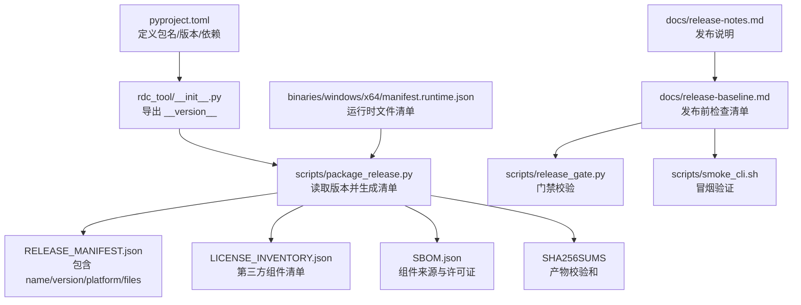
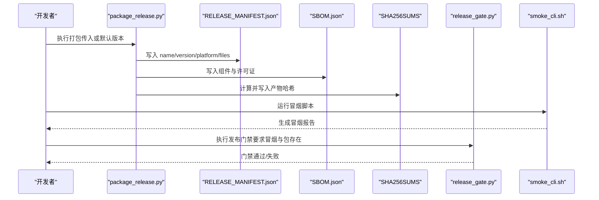
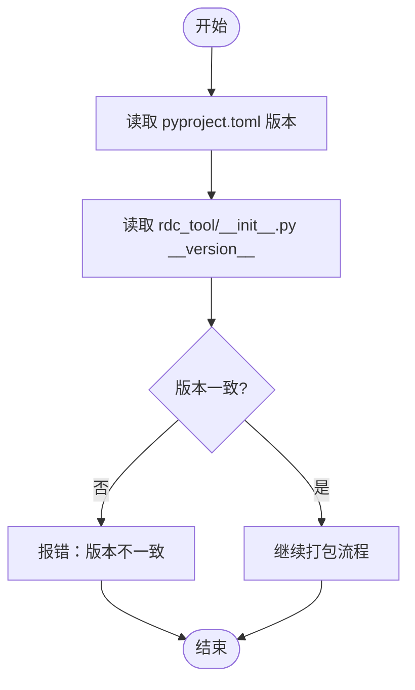
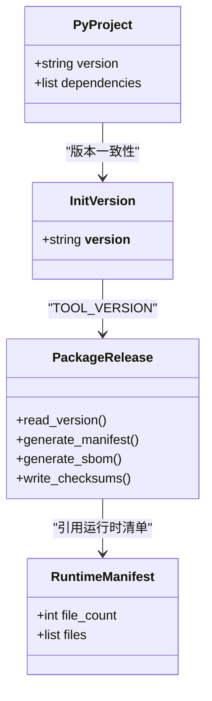
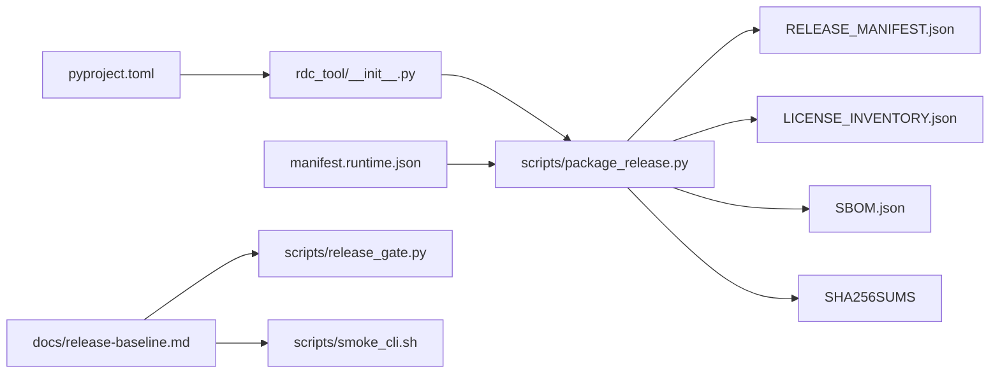

# 版本管理

<cite>
**本文引用的文件**
- [pyproject.toml](file://pyproject.toml)
- [rdc_tool/__init__.py](file://rdc_tool/__init__.py)
- [scripts/package_release.py](file://scripts/package_release.py)
- [binaries/windows/x64/manifest.runtime.json](file://binaries/windows/x64/manifest.runtime.json)
- [docs/release-notes.md](file://docs/release-notes.md)
- [docs/release-baseline.md](file://docs/release-baseline.md)
- [docs/doc-governance.md](file://docs/doc-governance.md)
- [README.md](file://README.md)
- [scripts/smoke_cli.sh](file://scripts/smoke_cli.sh)
- [scripts/release_gate.py](file://scripts/release_gate.py)
</cite>

## 目录
1. [简介](#简介)
2. [项目结构](#项目结构)
3. [核心组件](#核心组件)
4. [架构总览](#架构总览)
5. [详细组件分析](#详细组件分析)
6. [依赖分析](#依赖分析)
7. [性能考虑](#性能考虑)
8. [故障排查指南](#故障排查指南)
9. [结论](#结论)
10. [附录](#附录)

## 简介
本章节概述 RDC-Tool 项目的版本管理策略与规范。该项目采用集中式版本定义、可复现的发布产物与严格的发布门禁，确保版本号、依赖与二进制产物在构建、打包、校验环节保持一致性与可追溯性。版本信息通过包元数据与运行时清单共同表达，并通过脚本自动化生成发布清单、许可证清单与软件物料清单（SBOM），配合测试与冒烟验证形成完整的发布流水线。

## 项目结构
围绕版本管理的核心位置如下：
- 包版本与依赖声明：pyproject.toml
- 运行时版本常量：rdc_tool/__init__.py
- 发布打包与清单生成：scripts/package_release.py
- 运行时二进制清单：binaries/windows/x64/manifest.runtime.json
- 发布说明与基线流程：docs/release-notes.md、docs/release-baseline.md
- 文档治理与生成约束：docs/doc-governance.md
- 入口命令与版本查询：README.md
- 冒烟脚本与发布门禁：scripts/smoke_cli.sh、scripts/release_gate.py

**图示来源**
- [pyproject.toml:5-19](file://pyproject.toml#L5-L19)
- [rdc_tool/__init__.py:1-4](file://rdc_tool/__init__.py#L1-L4)
- [scripts/package_release.py:19-21](file://scripts/package_release.py#L19-L21)
- [scripts/package_release.py:136-156](file://scripts/package_release.py#L136-L156)
- [scripts/package_release.py:190-207](file://scripts/package_release.py#L190-L207)
- [binaries/windows/x64/manifest.runtime.json:1-20](file://binaries/windows/x64/manifest.runtime.json#L1-L20)
- [docs/release-notes.md:1-26](file://docs/release-notes.md#L1-L26)
- [docs/release-baseline.md:1-22](file://docs/release-baseline.md#L1-L22)

**章节来源**
- [pyproject.toml:5-19](file://pyproject.toml#L5-L19)
- [rdc_tool/__init__.py:1-4](file://rdc_tool/__init__.py#L1-L4)
- [scripts/package_release.py:19-21](file://scripts/package_release.py#L19-L21)
- [scripts/package_release.py:136-156](file://scripts/package_release.py#L136-L156)
- [scripts/package_release.py:190-207](file://scripts/package_release.py#L190-L207)
- [binaries/windows/x64/manifest.runtime.json:1-20](file://binaries/windows/x64/manifest.runtime.json#L1-L20)
- [docs/release-notes.md:1-26](file://docs/release-notes.md#L1-L26)
- [docs/release-baseline.md:1-22](file://docs/release-baseline.md#L1-L22)

## 核心组件
- 版本源与语义化约定
  - 包版本在 pyproject.toml 中声明，遵循语义化版本（主版本.次版本.修订号）；当前为 1.0.0。
  - rdc_tool/__init__.py 暴露 __version__，供打包脚本与 CLI 使用。
- 发布打包与清单
  - scripts/package_release.py 读取 TOOL_VERSION，生成 RELEASE_MANIFEST.json、LICENSE_INVENTORY.json、SBOM.json 与 SHA256SUMS，输出 zip 包名包含版本号与平台标识。
- 运行时清单
  - binaries/windows/x64/manifest.runtime.json 记录运行时文件列表与哈希，用于完整性校验与可追溯。
- 发布说明与基线
  - docs/release-notes.md 描述接口收敛与 GA 基线；docs/release-baseline.md 提供发布前执行步骤与冒烟要求。
- 文档治理
  - docs/doc-governance.md 强调操作定义唯一来源、生成物不可二次覆盖，以及预览相关变更需同步测试与文档。

**章节来源**
- [pyproject.toml:5-19](file://pyproject.toml#L5-L19)
- [rdc_tool/__init__.py:1-4](file://rdc_tool/__init__.py#L1-L4)
- [scripts/package_release.py:19-21](file://scripts/package_release.py#L19-L21)
- [scripts/package_release.py:136-156](file://scripts/package_release.py#L136-L156)
- [scripts/package_release.py:190-207](file://scripts/package_release.py#L190-L207)
- [binaries/windows/x64/manifest.runtime.json:1-20](file://binaries/windows/x64/manifest.runtime.json#L1-L20)
- [docs/release-notes.md:1-26](file://docs/release-notes.md#L1-L26)
- [docs/release-baseline.md:1-22](file://docs/release-baseline.md#L1-L22)
- [docs/doc-governance.md:1-15](file://docs/doc-governance.md#L1-L15)

## 架构总览
版本管理的关键流程如下：
- 版本定义：pyproject.toml 与 rdc_tool/__init__.py 共同维护版本。
- 构建与打包：package_release.py 读取版本，复制发布树，生成清单与 SBOM，输出带版本号的 zip 与校验和。
- 运行时清单：manifest.runtime.json 固化运行时文件指纹，便于安装后校验。
- 发布门禁：release-baseline.md 规定先运行验证与冒烟，再执行 release_gate.py 进行门禁。
- 发布说明：release-notes.md 记录变更与基线，作为对外发布的依据。

**图示来源**
- [scripts/package_release.py:19-21](file://scripts/package_release.py#L19-L21)
- [scripts/package_release.py:136-156](file://scripts/package_release.py#L136-L156)
- [scripts/package_release.py:190-207](file://scripts/package_release.py#L190-L207)
- [docs/release-baseline.md:1-22](file://docs/release-baseline.md#L1-L22)
- [scripts/smoke_cli.sh:1-200](file://scripts/smoke_cli.sh#L1-L200)

## 详细组件分析

### 版本源与语义化版本控制实践
- 版本来源
  - pyproject.toml 中的 project.version 是包的权威版本来源。
  - rdc_tool/__init__.py 的 __version__ 被打包脚本导入，确保构建期与运行期一致。
- 语义化版本
  - 采用 X.Y.Z 形式，当前为 1.0.0，符合语义化版本的基本约定。
  - 发布说明与基线文档体现 GA 基线与接口收敛，表明该版本具备稳定的公共契约。

**图示来源**
- [pyproject.toml:5-19](file://pyproject.toml#L5-L19)
- [rdc_tool/__init__.py:1-4](file://rdc_tool/__init__.py#L1-L4)
- [scripts/package_release.py:19-21](file://scripts/package_release.py#L19-L21)

**章节来源**
- [pyproject.toml:5-19](file://pyproject.toml#L5-L19)
- [rdc_tool/__init__.py:1-4](file://rdc_tool/__init__.py#L1-L4)
- [docs/release-notes.md:1-26](file://docs/release-notes.md#L1-L26)

### 版本信息的集中管理与自动更新机制
- 集中管理
  - 版本集中在 pyproject.toml 与 rdc_tool/__init__.py 两处；打包脚本从 rdc_tool.__version__ 获取版本，避免分散维护。
- 自动更新
  - package_release.py 自动生成 RELEASE_MANIFEST.json、LICENSE_INVENTORY.json、SBOM.json 与 SHA256SUMS，并将版本号写入清单与包名。
  - 运行时清单 manifest.runtime.json 固化二进制文件指纹，支持后续完整性校验。

**图示来源**
- [pyproject.toml:5-19](file://pyproject.toml#L5-L19)
- [rdc_tool/__init__.py:1-4](file://rdc_tool/__init__.py#L1-L4)
- [scripts/package_release.py:19-21](file://scripts/package_release.py#L19-L21)
- [scripts/package_release.py:136-156](file://scripts/package_release.py#L136-L156)
- [binaries/windows/x64/manifest.runtime.json:1-20](file://binaries/windows/x64/manifest.runtime.json#L1-L20)

**章节来源**
- [scripts/package_release.py:19-21](file://scripts/package_release.py#L19-L21)
- [scripts/package_release.py:136-156](file://scripts/package_release.py#L136-L156)
- [scripts/package_release.py:190-207](file://scripts/package_release.py#L190-L207)
- [binaries/windows/x64/manifest.runtime.json:1-20](file://binaries/windows/x64/manifest.runtime.json#L1-L20)

### 变更日志与发布说明编写指南
- 发布说明
  - docs/release-notes.md 记录了接口收敛、GA 基线、CLI 命令与发布产物等关键信息，作为对外发布的权威说明。
- 文档治理
  - docs/doc-governance.md 强调操作定义的唯一来源与生成物的不可二次覆盖，确保发布说明与实际实现一致。
- 建议
  - 每次发布应在 release-notes.md 中明确变更范围、影响面与兼容性提示；保持与 tool-reference 与 catalog 的一致性。

**章节来源**
- [docs/release-notes.md:1-26](file://docs/release-notes.md#L1-L26)
- [docs/doc-governance.md:1-15](file://docs/doc-governance.md#L1-L15)

### 版本兼容性检查与向后兼容策略
- 兼容性保障
  - 通过 pytest 与 catalog 校验确保接口与行为稳定；release-baseline.md 要求在发布前运行完整验证。
  - README.md 列出公开命令与 JSON 行为，作为用户契约的一部分。
- 向后兼容
  - 文档治理禁止将废弃名称作为运行时输入或别名映射，避免破坏现有调用方。
  - 发布说明中明确 GA 基线，意味着公共接口在此版本后保持稳定。

**章节来源**
- [docs/release-baseline.md:1-22](file://docs/release-baseline.md#L1-L22)
- [docs/doc-governance.md:1-15](file://docs/doc-governance.md#L1-L15)
- [README.md:1-70](file://README.md#L1-L70)

### 版本回滚与热修复处理流程
- 回滚策略
  - 由于每个发布产物带有 SHA256SUMS 与清单，可通过校验和快速识别与回退到已知版本。
  - 运行时清单 manifest.runtime.json 可用于定位具体二进制文件的变更。
- 热修复
  - 针对紧急问题，可在分支上修复后重新执行发布流程，生成新的版本产物与清单；通过门禁与冒烟确保质量。
  - 建议在 release-notes.md 中记录热修复的影响范围与恢复步骤。

**章节来源**
- [scripts/package_release.py:190-207](file://scripts/package_release.py#L190-L207)
- [binaries/windows/x64/manifest.runtime.json:1-20](file://binaries/windows/x64/manifest.runtime.json#L1-L20)
- [docs/release-notes.md:1-26](file://docs/release-notes.md#L1-L26)

### CI/CD 流水线中的版本标记与发布分支管理
- 发布前检查
  - docs/release-baseline.md 规定了发布前的验证步骤，包括 catalog 校验、参考生成、测试、Markdown 健康检查、打包与门禁。
- 冒烟与门禁
  - smoke_cli.sh 提供 CLI 冒烟验证；release_gate.py 要求冒烟报告与发布包存在，作为门禁条件。
- 分支与标签
  - 仓库未显式包含 CI/CD 配置文件；建议在外部流水线中基于 release-baseline.md 的步骤执行，并在通过后创建版本标签与发布说明。

**章节来源**
- [docs/release-baseline.md:1-22](file://docs/release-baseline.md#L1-L22)
- [scripts/smoke_cli.sh:1-200](file://scripts/smoke_cli.sh#L1-L200)
- [scripts/release_gate.py:1-200](file://scripts/release_gate.py#L1-L200)

### 版本升级迁移指南与依赖版本锁定策略
- 升级迁移
  - 根据 release-notes.md 的变更记录进行迁移；注意接口收敛与命令变化。
  - 使用 README.md 中的命令示例验证升级后的行为。
- 依赖锁定
  - pyproject.toml 声明了依赖范围；打包过程会收集 site-packages 的 dist-info 元数据以生成许可证清单与 SBOM，便于追踪依赖来源。
  - 建议在外部依赖管理工具中固定具体版本，确保构建可重复。

**章节来源**
- [docs/release-notes.md:1-26](file://docs/release-notes.md#L1-L26)
- [README.md:1-70](file://README.md#L1-L70)
- [scripts/package_release.py:108-133](file://scripts/package_release.py#L108-L133)
- [pyproject.toml:13-19](file://pyproject.toml#L13-L19)

## 依赖分析
版本管理涉及的依赖关系如下：
- 包元数据与版本常量驱动打包脚本。
- 打包脚本生成清单与 SBOM，依赖运行时清单进行完整性校验。
- 发布门禁依赖冒烟结果与打包产物。

**图示来源**
- [pyproject.toml:5-19](file://pyproject.toml#L5-L19)
- [rdc_tool/__init__.py:1-4](file://rdc_tool/__init__.py#L1-L4)
- [scripts/package_release.py:19-21](file://scripts/package_release.py#L19-L21)
- [scripts/package_release.py:136-156](file://scripts/package_release.py#L136-L156)
- [scripts/package_release.py:190-207](file://scripts/package_release.py#L190-L207)
- [binaries/windows/x64/manifest.runtime.json:1-20](file://binaries/windows/x64/manifest.runtime.json#L1-L20)
- [docs/release-baseline.md:1-22](file://docs/release-baseline.md#L1-L22)

**章节来源**
- [scripts/package_release.py:19-21](file://scripts/package_release.py#L19-L21)
- [scripts/package_release.py:136-156](file://scripts/package_release.py#L136-L156)
- [scripts/package_release.py:190-207](file://scripts/package_release.py#L190-L207)
- [binaries/windows/x64/manifest.runtime.json:1-20](file://binaries/windows/x64/manifest.runtime.json#L1-L20)
- [docs/release-baseline.md:1-22](file://docs/release-baseline.md#L1-L22)

## 性能考虑
- 打包阶段对大量文件进行复制与哈希计算，建议使用并行与增量构建以减少时间开销。
- 清单与 SBOM 生成应缓存中间结果，避免重复计算。
- 冒烟与门禁应在独立环境中执行，避免与开发环境相互干扰。

[本节为通用指导，不直接分析具体文件]

## 故障排查指南
- 版本不一致
  - 若 package_release.py 检测到请求版本与包版本不一致，将返回错误码；需统一 pyproject.toml 与 rdc_tool/__init__.py 的版本。
- 清单缺失或不完整
  - 检查 RELEASE_MANIFEST.json、LICENSE_INVENTORY.json、SBOM.json 是否生成；确认 site-packages 路径正确。
- 冒烟失败
  - 查看 smoke_cli.sh 的输出与 intermediate/logs 下的日志；确认环境与依赖就绪。
- 门禁失败
  - 确认 release_gate.py 所需的冒烟报告与发布包存在；按 release-baseline.md 逐步执行。

**章节来源**
- [scripts/package_release.py:174-176](file://scripts/package_release.py#L174-L176)
- [scripts/package_release.py:136-156](file://scripts/package_release.py#L136-L156)
- [docs/release-baseline.md:1-22](file://docs/release-baseline.md#L1-L22)
- [scripts/smoke_cli.sh:1-200](file://scripts/smoke_cli.sh#L1-L200)

## 结论
RDC-Tool 的版本管理以集中式版本定义为核心，结合自动化打包、清单生成与严格门禁，确保发布产物的可追溯性与稳定性。通过发布说明与文档治理，保证对外契约的一致性与可维护性。建议在外部 CI/CD 中集成发布基线步骤，以实现端到端的版本控制与发布自动化。

[本节为总结，不直接分析具体文件]

## 附录
- 常用命令
  - 查看版本：参考 README.md 中的命令示例。
  - 生成工具参考与目录：按 docs/doc-governance.md 的指引执行生成脚本。
- 发布清单字段
  - RELEASE_MANIFEST.json：name、version、platform、public_commands、entrypoints、file_count、files。
  - LICENSE_INVENTORY.json：组件名称、版本、许可证、路径。
  - SBOM.json：schema、name、version、platform、components。

**章节来源**
- [README.md:1-70](file://README.md#L1-L70)
- [docs/doc-governance.md:1-15](file://docs/doc-governance.md#L1-L15)
- [scripts/package_release.py:136-156](file://scripts/package_release.py#L136-L156)