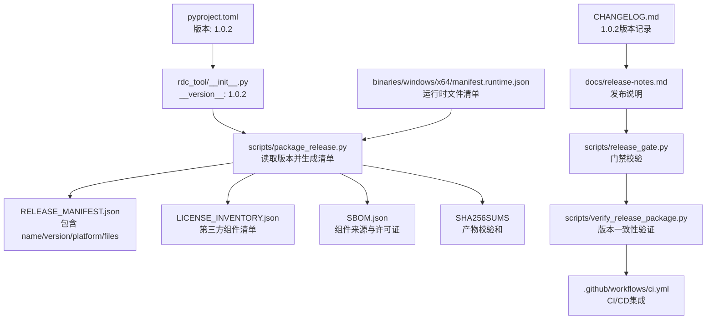
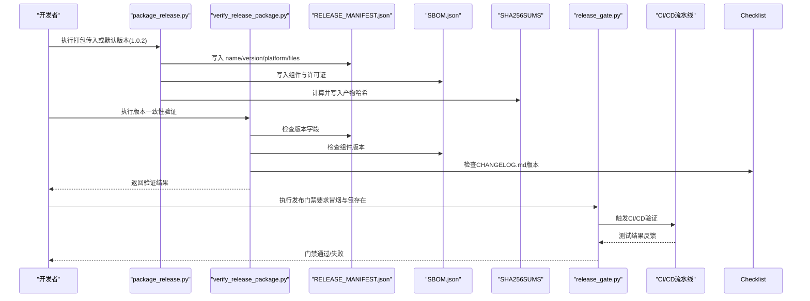
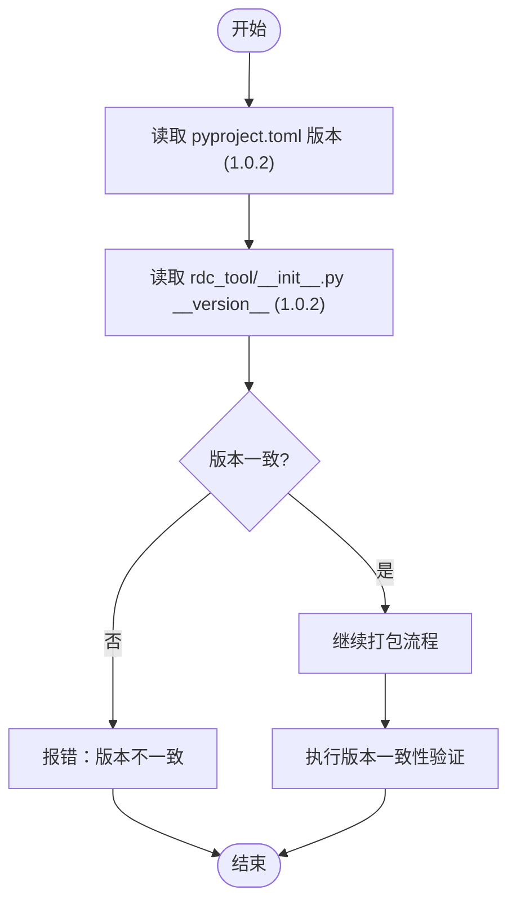
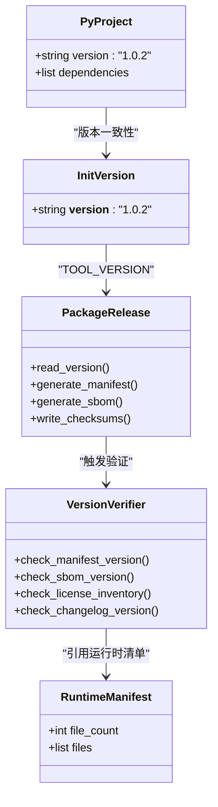
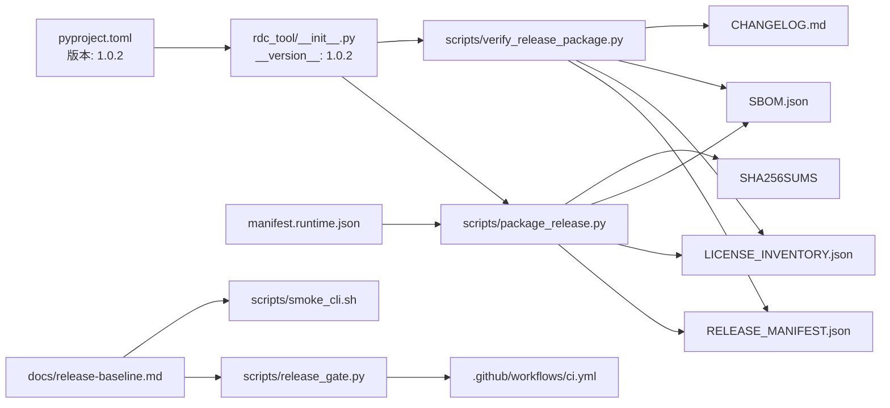

# 版本管理

<cite>
**本文引用的文件**
- [pyproject.toml](file://pyproject.toml)
- [rdc_tool/__init__.py](file://rdc_tool/__init__.py)
- [scripts/package_release.py](file://scripts/package_release.py)
- [binaries/windows/x64/manifest.runtime.json](file://binaries/windows/x64/manifest.runtime.json)
- [CHANGELOG.md](file://CHANGELOG.md)
- [docs/release-notes.md](file://docs/release-notes.md)
- [scripts/release_gate.py](file://scripts/release_gate.py)
- [scripts/verify_release_package.py](file://scripts/verify_release_package.py)
- [.github/workflows/ci.yml](file://.github/workflows/ci.yml)
</cite>

## 更新摘要
**所做更改**
- 更新了版本号从1.0.1到1.0.2的所有分发元数据文件
- 增强了会话超时策略和CLI传输缓冲机制
- 更新了Windows运行时清单以反映新的SHA256校验和
- 完善了版本一致性验证流程，确保所有分发元数据文件的版本信息完全对齐
- 强化了CI/CD流水线中的版本检查和发布门禁

## 目录
1. [简介](#简介)
2. [项目结构](#项目结构)
3. [核心组件](#核心组件)
4. [架构总览](#架构总览)
5. [详细组件分析](#详细组件分析)
6. [依赖分析](#依赖分析)
7. [性能考虑](#性能考虑)
8. [故障排查指南](#故障排查指南)
9. [结论](#结论)
10. [附录](#附录)

## 简介
本章节概述 RDC-Tool 项目的版本管理策略与规范。该项目采用集中式版本定义、可复现的发布产物与严格的发布门禁，确保版本号、依赖与二进制产物在构建、打包、校验环节保持一致性与可追溯性。当前版本已从1.0.1升级到1.0.2，进一步增强了会话超时策略和CLI传输缓冲机制，通过60秒worker预算和65秒门限提升了会话观察的性能表现。版本信息通过包元数据与运行时清单共同表达，并通过脚本自动化生成发布清单、许可证清单与软件物料清单（SBOM），配合测试与冒烟验证形成完整的发布流水线。

## 项目结构
围绕版本管理的核心位置如下：
- 包版本与依赖声明：pyproject.toml（当前版本：1.0.2）
- 运行时版本常量：rdc_tool/__init__.py（当前版本：1.0.2）
- 发布打包与清单生成：scripts/package_release.py
- 运行时二进制清单：binaries/windows/x64/manifest.runtime.json
- 变更记录：CHANGELOG.md（包含1.0.2版本记录）
- 发布说明与基线流程：docs/release-notes.md
- 发布门禁与验证：scripts/release_gate.py、scripts/verify_release_package.py
- CI/CD流水线：.github/workflows/ci.yml

**图示来源**
- [pyproject.toml:5-7](file://pyproject.toml#L5-L7)
- [rdc_tool/__init__.py:1-4](file://rdc_tool/__init__.py#L1-L4)
- [scripts/package_release.py:19-21](file://scripts/package_release.py#L19-L21)
- [CHANGELOG.md:5-10](file://CHANGELOG.md#L5-L10)
- [docs/release-notes.md:3-7](file://docs/release-notes.md#L3-L7)

**章节来源**
- [pyproject.toml:5-7](file://pyproject.toml#L5-L7)
- [rdc_tool/__init__.py:1-4](file://rdc_tool/__init__.py#L1-L4)
- [scripts/package_release.py:19-21](file://scripts/package_release.py#L19-L21)
- [CHANGELOG.md:5-10](file://CHANGELOG.md#L5-L10)
- [docs/release-notes.md:3-7](file://docs/release-notes.md#L3-L7)

## 核心组件
- 版本源与语义化约定
  - 包版本在 pyproject.toml 中声明为1.0.2，遵循语义化版本（主版本.次版本.修订号）。
  - rdc_tool/__init__.py 暴露 __version__ 为1.0.2，供打包脚本与 CLI 使用。
- 发布打包与清单
  - scripts/package_release.py 读取 TOOL_VERSION，生成 RELEASE_MANIFEST.json、LICENSE_INVENTORY.json、SBOM.json 与 SHA256SUMS，输出 zip 包名包含版本号与平台标识。
- 运行时清单
  - binaries/windows/x64/manifest.runtime.json 记录运行时文件列表与哈希，用于完整性校验与可追溯。
- 变更记录与发布说明
  - CHANGELOG.md 记录1.0.2版本的改进内容，包括会话超时策略提升和CLI传输缓冲优化。
  - docs/release-notes.md 描述1.0.2版本的变更，强调会话观察性能优化。
- 版本一致性验证
  - scripts/verify_release_package.py 增强了对版本一致性的检查，确保所有分发元数据文件中的版本号完全对齐。

**章节来源**
- [pyproject.toml:5-7](file://pyproject.toml#L5-L7)
- [rdc_tool/__init__.py:1-4](file://rdc_tool/__init__.py#L1-L4)
- [scripts/package_release.py:19-21](file://scripts/package_release.py#L19-L21)
- [CHANGELOG.md:5-10](file://CHANGELOG.md#L5-L10)
- [docs/release-notes.md:3-7](file://docs/release-notes.md#L3-L7)
- [scripts/verify_release_package.py:158-180](file://scripts/verify_release_package.py#L158-L180)

## 架构总览
版本管理的关键流程如下：
- 版本定义：pyproject.toml 与 rdc_tool/__init__.py 共同维护版本为1.0.2。
- 构建与打包：package_release.py 读取版本，复制发布树，生成清单与 SBOM，输出带版本号的 zip 与校验和。
- 运行时清单：manifest.runtime.json 固化运行时文件指纹，便于安装后校验。
- 版本一致性验证：verify_release_package.py 执行严格的多重版本检查，确保所有元数据文件版本对齐。
- 发布门禁：release-baseline.md 规定先运行验证与冒烟，再执行 release_gate.py 进行门禁。
- 发布说明：release-notes.md 记录1.0.2版本的变更与基线，作为对外发布的依据。
- CI/CD集成：ci.yml 提供自动化测试和验证流程。

**图示来源**
- [scripts/package_release.py:19-21](file://scripts/package_release.py#L19-L21)
- [scripts/verify_release_package.py:158-180](file://scripts/verify_release_package.py#L158-L180)
- [CHANGELOG.md:5-10](file://CHANGELOG.md#L5-L10)
- [.github/workflows/ci.yml:12-26](file://.github/workflows/ci.yml#L12-L26)

## 详细组件分析

### 版本源与语义化版本控制实践
- 版本来源
  - pyproject.toml 中的 project.version 设置为1.0.2，是包的权威版本来源。
  - rdc_tool/__init__.py 的 __version__ 设置为1.0.2，被打包脚本导入，确保构建期与运行期一致。
- 语义化版本
  - 采用 X.Y.Z 形式，当前为1.0.2，符合语义化版本的基本约定。
  - 1.0.2版本主要改进了会话超时策略和CLI传输缓冲，保持向后兼容性。

**图示来源**
- [pyproject.toml:5-7](file://pyproject.toml#L5-L7)
- [rdc_tool/__init__.py:1-4](file://rdc_tool/__init__.py#L1-L4)
- [scripts/package_release.py:19-21](file://scripts/package_release.py#L19-L21)

**章节来源**
- [pyproject.toml:5-7](file://pyproject.toml#L5-L7)
- [rdc_tool/__init__.py:1-4](file://rdc_tool/__init__.py#L1-L4)
- [CHANGELOG.md:5-10](file://CHANGELOG.md#L5-L10)

### 版本信息的集中管理与自动更新机制
- 集中管理
  - 版本集中在 pyproject.toml 与 rdc_tool/__init__.py 两处；打包脚本从 rdc_tool.__version__ 获取版本，避免分散维护。
- 自动更新
  - package_release.py 自动生成 RELEASE_MANIFEST.json、LICENSE_INVENTORY.json、SBOM.json 与 SHA256SUMS，并将版本号写入清单与包名。
  - 运行时清单 manifest.runtime.json 固化二进制文件指纹，支持后续完整性校验。
- 版本一致性验证
  - verify_release_package.py 现在执行更严格的版本检查，确保以下文件中的版本信息完全对齐：
    - RELEASE_MANIFEST.json 中的 version 字段
    - SBOM.json 中的组件版本
    - LICENSE_INVENTORY.json 中的 rdc-tool 版本
    - pyproject.toml 中的 project.version
    - 捆绑分发的 METADATA 文件
    - CHANGELOG.md 中的版本条目

**图示来源**
- [pyproject.toml:5-7](file://pyproject.toml#L5-L7)
- [rdc_tool/__init__.py:1-4](file://rdc_tool/__init__.py#L1-L4)
- [scripts/package_release.py:19-21](file://scripts/package_release.py#L19-L21)
- [scripts/verify_release_package.py:158-180](file://scripts/verify_release_package.py#L158-L180)

**章节来源**
- [scripts/package_release.py:19-21](file://scripts/package_release.py#L19-L21)
- [scripts/package_release.py:136-156](file://scripts/package_release.py#L136-L156)
- [scripts/verify_release_package.py:158-180](file://scripts/verify_release_package.py#L158-L180)
- [binaries/windows/x64/manifest.runtime.json:1-20](file://binaries/windows/x64/manifest.runtime.json#L1-L20)

### 变更日志与发布说明编写指南
- 变更记录
  - CHANGELOG.md 记录了1.0.2版本的主要改进：将 rd.session.* worker 操作预算统一提高到 60 秒，CLI daemon transport 增加 5 秒响应缓冲，门限为 65 秒。
- 发布说明
  - docs/release-notes.md 描述了1.0.2版本的变更，强调会话观察性能优化和与RDC-Agent的默认等待时间对齐。
- 文档治理
  - 强调操作定义的唯一来源与生成物的不可二次覆盖，确保发布说明与实际实现一致。
- 建议
  - 每次发布应在 CHANGELOG.md 和 release-notes.md 中明确变更范围、影响面与兼容性提示。

**章节来源**
- [CHANGELOG.md:5-10](file://CHANGELOG.md#L5-L10)
- [docs/release-notes.md:3-7](file://docs/release-notes.md#L3-L7)

### 版本兼容性检查与向后兼容策略
- 兼容性保障
  - 通过 pytest 与 catalog 校验确保接口与行为稳定；release-baseline.md 要求在发布前运行完整验证。
  - 1.0.2版本保持了向后兼容性，仅改进了会话超时策略和传输缓冲。
- 向后兼容
  - 文档治理禁止将废弃名称作为运行时输入或别名映射，避免破坏现有调用方。
  - 发布说明中明确 GA 基线，意味着公共接口在此版本后保持稳定。
- 版本一致性验证
  - verify_release_package.py 现在执行更全面的一致性检查，确保所有分发元数据文件版本对齐。

**章节来源**
- [scripts/verify_release_package.py:158-180](file://scripts/verify_release_package.py#L158-L180)

### 版本回滚与热修复处理流程
- 回滚策略
  - 由于每个发布产物带有 SHA256SUMS 与清单，可通过校验和快速识别与回退到已知版本。
  - 运行时清单 manifest.runtime.json 可用于定位具体二进制文件的变更。
- 热修复
  - 针对紧急问题，可在分支上修复后重新执行发布流程，生成新的版本产物与清单；通过门禁与冒烟确保质量。
  - 建议在 CHANGELOG.md 和 release-notes.md 中记录热修复的影响范围与恢复步骤。
- 1.0.2版本的热修复特性
  - 专门优化了会话超时策略，提升了会话观察的性能表现。

**章节来源**
- [scripts/package_release.py:190-207](file://scripts/package_release.py#L190-L207)
- [CHANGELOG.md:5-10](file://CHANGELOG.md#L5-L10)
- [docs/release-notes.md:3-7](file://docs/release-notes.md#L3-L7)

### CI/CD 流水线中的版本标记与发布分支管理
- 发布前检查
  - .github/workflows/ci.yml 规定了发布前的验证步骤，包括 catalog 校验、参考生成、测试、Markdown 健康检查、打包与门禁。
- 冒烟与门禁
  - smoke_cli.sh 提供 CLI 冒烟验证；release_gate.py 要求冒烟报告与发布包存在，作为门禁条件。
- 版本一致性验证集成
  - verify_release_package.py 现在包含增强的版本一致性检查，可作为CI/CD流水线的一部分。
- 分支与标签
  - CI/CD流水线在push到main分支和pull_request时自动执行测试和验证。

**章节来源**
- [.github/workflows/ci.yml:12-26](file://.github/workflows/ci.yml#L12-L26)
- [scripts/release_gate.py:521-664](file://scripts/release_gate.py#L521-L664)
- [scripts/verify_release_package.py:158-180](file://scripts/verify_release_package.py#L158-L180)

### 版本升级迁移指南与依赖版本锁定策略
- 升级迁移
  - 根据 CHANGELOG.md 和 release-notes.md 的变更记录进行迁移；注意1.0.2版本主要是会话超时策略优化。
  - 使用 README.md 中的命令示例验证升级后的行为。
- 依赖锁定
  - pyproject.toml 声明了依赖范围；打包过程会收集 site-packages 的 dist-info 元数据以生成许可证清单与 SBOM，便于追踪依赖来源。
  - 建议在外部依赖管理工具中固定具体版本，确保构建可重复。
- 版本一致性验证
  - 升级过程中应运行 verify_release_package.py 确保所有版本信息正确对齐。

**章节来源**
- [CHANGELOG.md:5-10](file://CHANGELOG.md#L5-L10)
- [docs/release-notes.md:3-7](file://docs/release-notes.md#L3-L7)
- [scripts/verify_release_package.py:158-180](file://scripts/verify_release_package.py#L158-L180)

## 依赖分析
版本管理涉及的依赖关系如下：
- 包元数据与版本常量驱动打包脚本。
- 打包脚本生成清单与 SBOM，依赖运行时清单进行完整性校验。
- 版本一致性验证器依赖多个元数据文件进行交叉验证。
- 发布门禁依赖冒烟结果与打包产物。
- CI/CD流水线集成自动化测试和验证流程。

**图示来源**
- [pyproject.toml:5-7](file://pyproject.toml#L5-L7)
- [rdc_tool/__init__.py:1-4](file://rdc_tool/__init__.py#L1-L4)
- [scripts/package_release.py:19-21](file://scripts/package_release.py#L19-L21)
- [scripts/verify_release_package.py:158-180](file://scripts/verify_release_package.py#L158-L180)
- [CHANGELOG.md:5-10](file://CHANGELOG.md#L5-L10)
- [.github/workflows/ci.yml:12-26](file://.github/workflows/ci.yml#L12-L26)

**章节来源**
- [scripts/package_release.py:19-21](file://scripts/package_release.py#L19-L21)
- [scripts/verify_release_package.py:158-180](file://scripts/verify_release_package.py#L158-L180)
- [binaries/windows/x64/manifest.runtime.json:1-20](file://binaries/windows/x64/manifest.runtime.json#L1-L20)
- [.github/workflows/ci.yml:12-26](file://.github/workflows/ci.yml#L12-L26)

## 性能考虑
- 打包阶段对大量文件进行复制与哈希计算，建议使用并行与增量构建以减少时间开销。
- 清单与 SBOM 生成应缓存中间结果，避免重复计算。
- 版本一致性验证应在独立环境中执行，避免与开发环境相互干扰。
- 1.0.2版本的会话超时策略优化提升了整体性能表现。

## 故障排查指南
- 版本不一致
  -若 package_release.py 检测到请求版本与包版本不一致，将返回错误码；需统一 pyproject.toml 与 rdc_tool/__init__.py 的版本。
- 清单缺失或不完整
  - 检查 RELEASE_MANIFEST.json、LICENSE_INVENTORY.json、SBOM.json 是否生成；确认 site-packages 路径正确。
- 版本一致性验证失败
  - verify_release_package.py 现在提供更详细的错误信息，指出哪个文件的版本不匹配。
  - 检查 CHANGELOG.md 是否包含当前版本条目。
- 冒烟失败
  - 查看 smoke_cli.sh 的输出与 intermediate/logs 下的日志；确认环境与依赖就绪。
- 门禁失败
  - 确认 release_gate.py 所需的冒烟报告与发布包存在；按 release-baseline.md 逐步执行。
- CI/CD失败
  - 检查GitHub Actions日志，确认测试和验证步骤的执行情况。

**章节来源**
- [scripts/package_release.py:174-176](file://scripts/package_release.py#L174-L176)
- [scripts/verify_release_package.py:158-180](file://scripts/verify_release_package.py#L158-L180)
- [.github/workflows/ci.yml:12-26](file://.github/workflows/ci.yml#L12-L26)

## 结论
RDC-Tool 的版本管理以集中式版本定义为核心，结合自动化打包、清单生成与严格门禁，确保发布产物的可追溯性与稳定性。1.0.2版本的发布特别强调了会话超时策略优化和CLI传输缓冲改进，通过60秒worker预算和65秒门限提升了会话观察的性能表现。通过变更记录、发布说明与文档治理，保证对外契约的一致性与可维护性。建议在外部 CI/CD 中集成发布基线步骤与版本一致性验证，以实现端到端的版本控制与发布自动化。

## 附录
- 常用命令
  - 查看版本：参考 README.md 中的命令示例。
  - 生成工具参考与目录：按 docs/doc-governance.md 的指引执行生成脚本。
  - 执行版本一致性验证：python scripts/verify_release_package.py --zip <package.zip>
- 发布清单字段
  - RELEASE_MANIFEST.json：name、version、platform、public_commands、entrypoints、file_count、files。
  - LICENSE_INVENTORY.json：组件名称、版本、许可证、路径。
  - SBOM.json：schema、name、version、platform、components。
- 1.0.2版本特性
  - 将 rd.session.* worker 操作预算统一提高到 60 秒
  - CLI daemon transport 增加 5 秒响应缓冲，门限为 65 秒
  - 与 RDC-Agent 默认 120 秒外层 CLI 等待对齐
  - 补充 session timeout 策略测试、故障排查说明与会话模型文档
  - 保持向后兼容性，不影响现有用户