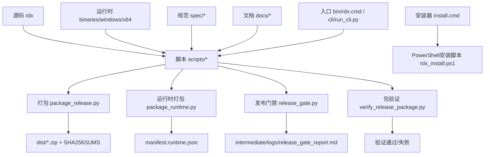
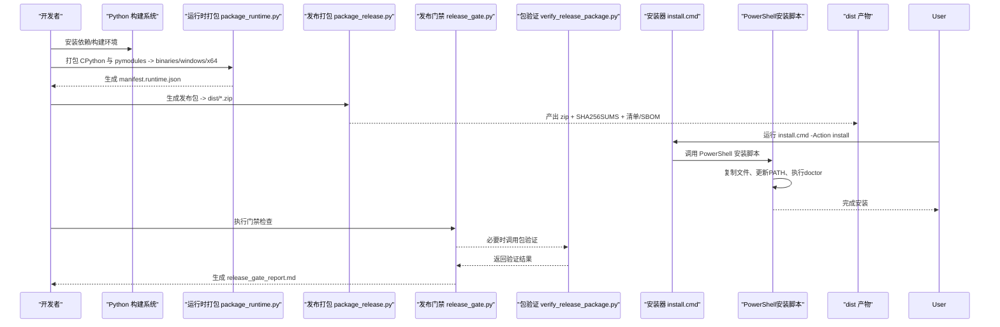
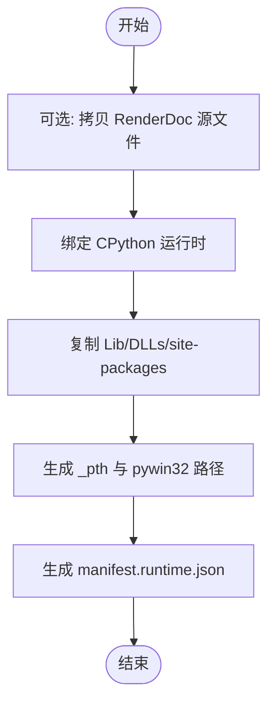
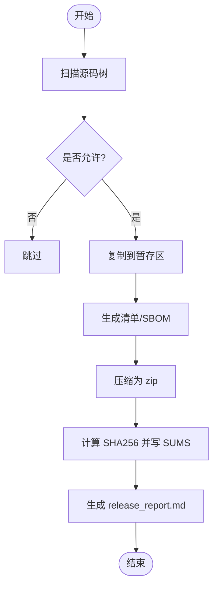
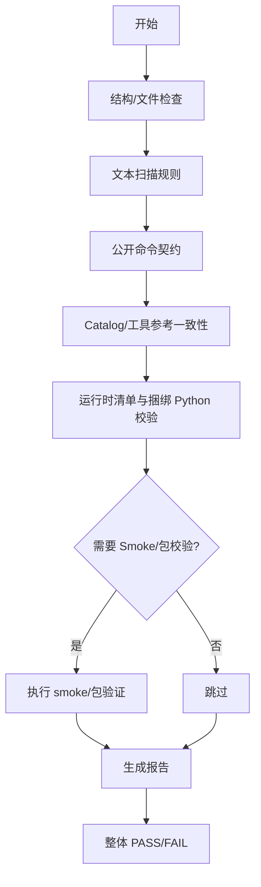
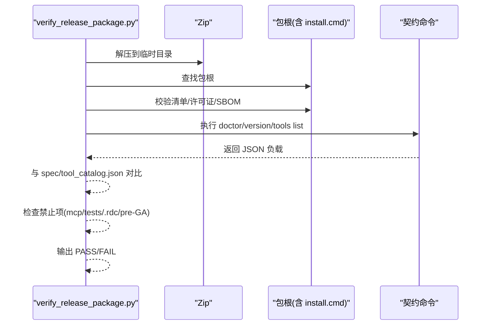
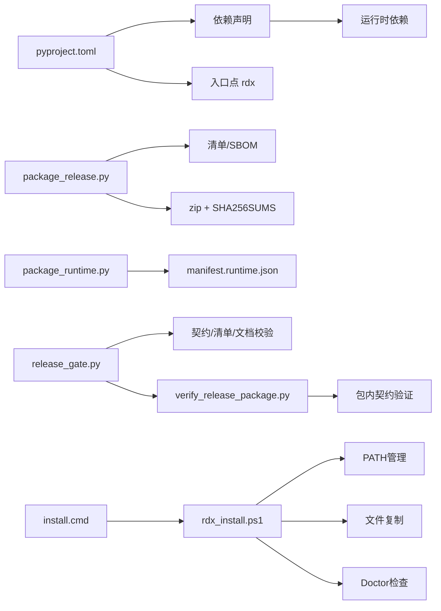

基于我对代码的分析，我现在了解了Windows安装流程简化的具体变化。让我更新部署和发布文档以反映这些变更：

# 部署和发布

<cite>
**本文引用的文件**
- [pyproject.toml](file://pyproject.toml)
- [rdx/__init__.py](file://rdx/__init__.py)
- [scripts/package_release.py](file://scripts/package_release.py)
- [scripts/release_gate.py](file://scripts/release_gate.py)
- [scripts/verify_release_package.py](file://scripts/verify_release_package.py)
- [scripts/generate_release_checksums.py](file://scripts/generate_release_checksums.py)
- [scripts/package_runtime.py](file://scripts/package_runtime.py)
- [scripts/_shared.py](file://scripts/_shared.py)
- [scripts/smoke_cli.sh](file://scripts/smoke_cli.sh)
- [install.cmd](file://install.cmd)
- [scripts/rdx_install.ps1](file://scripts/rdx_install.ps1)
- [bin/rdx.cmd](file://bin/rdx.cmd)
- [THIRD_PARTY_NOTICES.md](file://THIRD_PARTY_NOTICES.md)
- [docs/release-notes.md](file://docs/release-notes.md)
- [docs/install.md](file://docs/install.md)
- [spec/tool_catalog.json](file://spec/tool_catalog.json)
</cite>

## 更新摘要
**所做更改**
- 更新了Windows安装流程部分，反映install.cmd的简化架构
- 移除了复杂的PowerShell运行时代码说明
- 更新了安装脚本的使用方法和参数说明
- 增强了故障排查指南中关于安装问题的内容
- 更新了自动化发布脚本使用指南

## 目录
1. [简介](#简介)
2. [项目结构](#项目结构)
3. [核心组件](#核心组件)
4. [架构总览](#架构总览)
5. [详细组件分析](#详细组件分析)
6. [依赖关系分析](#依赖关系分析)
7. [性能与体积考量](#性能与体积考量)
8. [故障排查指南](#故障排查指南)
9. [结论](#结论)
10. [附录：脚本使用与定制指南](#附录脚本使用与定制指南)

## 简介
本文件面向"构建、打包、验证、发布"的完整流程，覆盖以下目标：
- 构建系统配置与使用（Python 包元数据、依赖声明、入口点）
- 二进制与运行时打包（CPython 捆绑、第三方模块裁剪、清单生成）
- 发布包打包（文件筛选、SBOM/许可证清单、校验和）
- 版本管理策略（版本号来源、变更追踪、发布基线）
- 发布前质量检查（测试套件、文档健康、公开契约、目录结构）
- 分发准备（签名与完整性、文档更新、清单与 SBOM）
- 自动化发布脚本使用方法与定制
- 回滚策略与故障恢复
- 第三方依赖管理与更新流程

## 项目结构
仓库采用"源码 + 脚本 + 预编译/捆绑资源 + 文档 + 规范"的分层组织：
- 源码与工具：rdx、cli、spec、policy
- 构建与发布脚本：scripts/*
- 运行时与平台产物：binaries/windows/x64/python、pymodules
- 用户入口：bin/rdx.cmd、bin/rdx、cli/run_cli.py
- 安装入口：install.cmd（简化版Windows安装器）
- 构建元数据：pyproject.toml、rdx/__init__.py
- 发布产物与中间产物：dist、intermediate

**图表来源**
- [scripts/package_release.py:168-210](file://scripts/package_release.py#L168-L210)
- [scripts/package_runtime.py:288-350](file://scripts/package_runtime.py#L288-L350)
- [scripts/release_gate.py:520-673](file://scripts/release_gate.py#L520-L673)
- [scripts/verify_release_package.py:301-332](file://scripts/verify_release_package.py#L301-L332)
- [install.cmd:1-11](file://install.cmd#L1-L11)
- [scripts/rdx_install.ps1:1-190](file://scripts/rdx_install.ps1#L1-L190)

**章节来源**
- [pyproject.toml:1-45](file://pyproject.toml#L1-L45)
- [rdx/__init__.py:1-4](file://rdx/__init__.py#L1-L4)

## 核心组件
- 构建与打包
  - 包元数据与依赖：pyproject.toml 定义包名、版本、Python 版本要求、依赖、可选依赖、入口点。
  - 版本来源：rdx/__init__.py 提供 __version__，被打包脚本读取用于产物命名与清单。
  - 运行时打包：package_runtime.py 将 CPython 运行时、DLL、Lib、site-packages 等复制到 binaries/windows/x64，并生成 manifest.runtime.json。
  - 发布打包：package_release.py 从源码树复制受控文件到暂存区，生成 RELEASE_MANIFEST.json、LICENSE_INVENTORY.json、SBOM.json，压缩为 zip，并输出 SHA256SUMS。
- Windows安装流程（已简化）
  - **简化后的安装器**：install.cmd 现在是一个薄包装器，仅负责调用 PowerShell 安装脚本，不再包含复杂的运行时代码。
  - **PowerShell安装脚本**：rdx_install.ps1 处理所有安装、升级、卸载和医生检查操作，包括PATH管理和文件复制。
  - **薄启动器**：bin/rdx.cmd 直接调用捆绑的Python和CLI，不经过任何中间层。
- 质量门禁与验证
  - 发布门禁：release_gate.py 执行目录/文件存在性、公开命令契约、目录扫描规则、catalog 一致性、工具参考文档一致性、用户文档约束、Smoke 报告、包完整性等。
  - 包验证：verify_release_package.py 解压后校验清单、许可证清单/SBOM、doctor/launcher/version/tools list 契约、禁止暴露项（mcp/tests/.rdc/pre-GA 标记）。
  - 校验和生成：generate_release_checksums.py 对指定文件或目录计算 SHA256 并输出。
- 安装与运行
  - **简化安装流程**：install.cmd 接受参数并传递给 rdx_install.ps1，支持 install、upgrade、uninstall、doctor 操作。
  - Smoke 测试：smoke_cli.sh 在 bash 环境下执行 CLI 冒烟用例，记录日志与发现项。

**章节来源**
- [pyproject.toml:1-45](file://pyproject.toml#L1-L45)
- [rdx/__init__.py:1-4](file://rdx/__init__.py#L1-L4)
- [scripts/package_runtime.py:288-350](file://scripts/package_runtime.py#L288-L350)
- [scripts/package_release.py:168-210](file://scripts/package_release.py#L168-L210)
- [install.cmd:1-11](file://install.cmd#L1-L11)
- [scripts/rdx_install.ps1:1-190](file://scripts/rdx_install.ps1#L1-L190)
- [bin/rdx.cmd:1-12](file://bin/rdx.cmd#L1-L12)
- [scripts/release_gate.py:520-673](file://scripts/release_gate.py#L520-L673)
- [scripts/verify_release_package.py:301-332](file://scripts/verify_release_package.py#L301-L332)
- [scripts/generate_release_checksums.py:29-51](file://scripts/generate_release_checksums.py#L29-L51)
- [scripts/smoke_cli.sh:1-264](file://scripts/smoke_cli.sh#L1-L264)

## 架构总览
下图展示从源码到发布包的端到端流水线，以及简化的Windows安装流程和验证环节。

**图表来源**
- [scripts/package_runtime.py:288-350](file://scripts/package_runtime.py#L288-L350)
- [scripts/package_release.py:168-210](file://scripts/package_release.py#L168-L210)
- [scripts/release_gate.py:520-673](file://scripts/release_gate.py#L520-L673)
- [scripts/verify_release_package.py:301-332](file://scripts/verify_release_package.py#L301-L332)
- [install.cmd:1-11](file://install.cmd#L1-L11)
- [scripts/rdx_install.ps1:157-187](file://scripts/rdx_install.ps1#L157-L187)

## 详细组件分析

### 构建系统与依赖管理
- 构建后端：setuptools.build_meta，要求 setuptools>=68 与 wheel。
- 包信息：name=rdx-tools，requires-python>=3.11，license=Apache-2.0，作者 RDX。
- 依赖：aiofiles、jinja2、numpy、Pillow、pydantic。
- 可选依赖：dev=pytest。
- 入口点：rdx = rdx.cli:main。
- 包发现：include=["rdx*"]，package-dir 指向根目录。
- pytest 配置：tests 目录，忽略 intermediate/binaries，标记 unit/contract/fixture_integration/gpu_live。

**章节来源**
- [pyproject.toml:1-45](file://pyproject.toml#L1-L45)

### 版本管理策略
- 版本号来源：rdx/__init__.py 中的 __version__，当前为 1.0.0。
- 版本传播：
  - package_release.py 读取 TOOL_VERSION 用于产物命名、清单与报告。
  - release_gate.py 不直接修改版本，但会校验发布包与源码的一致性。
- 变更追踪：
  - 发布说明位于 docs/release-notes.md，描述 GA 基线与 CLI 运行时基线。
  - 工具目录与契约由 spec/tool_catalog.json 维护，包含 fingerprint 与 tool_count，门禁脚本会校验其与代码定义一致。
- 建议实践：
  - 每次发布前统一更新 rdx/__init__.py 的版本号。
  - 同步更新 docs/release-notes.md 的变更记录。
  - 若新增/删除公开操作，需确保 spec/tool_catalog.json 与代码定义一致，门禁会校验指纹与数量。

**章节来源**
- [rdx/__init__.py:1-4](file://rdx/__init__.py#L1-L4)
- [scripts/package_release.py:168-210](file://scripts/package_release.py#L168-L210)
- [docs/release-notes.md:1-26](file://docs/release-notes.md#L1-L26)
- [spec/tool_catalog.json:1-200](file://spec/tool_catalog.json#L1-L200)

### 运行时打包（二进制与 Python 运行时整合）
- 输入：
  - renderdoc_source：可选，拷贝允许后缀的文件（dll/json）及 pymodules 下的 pyd/dll/json。
  - python_home：绝对或相对路径，必须包含 python.exe、python3.dll、vcruntime*.dll、LICENSE.txt。
  - site_packages_source：可选，仅复制 should_bundle_site_package 白名单的包。
- 处理：
  - 复制基础文件、版本化 DLL、DLLs/Lib 子树（跳过 pyc/md/rst/chm 与顶层 site-packages/test 等）。
  - 生成 python{tag}._pth 以启用相对导入与 site import。
  - 若检测到 pywin32，生成 .pth 以加载 win32/lib/pywin32_system32。
- 输出：
  - binaries/windows/x64 下生成 python 子树与 pymodules。
  - 生成 manifest.runtime.json，包含 file_count、files（path/size/sha256），以及 bundled_python 元信息。

**图表来源**
- [scripts/package_runtime.py:55-108](file://scripts/package_runtime.py#L55-L108)
- [scripts/package_runtime.py:135-215](file://scripts/package_runtime.py#L135-L215)
- [scripts/package_runtime.py:246-350](file://scripts/package_runtime.py#L246-L350)

**章节来源**
- [scripts/package_runtime.py:288-350](file://scripts/package_runtime.py#L288-L350)

### 发布包打包（文件筛选、清单与 SBOM）
- 文件筛选：
  - 排除目录：.git、缓存、venv、dist、intermediate 等。
  - 排除后缀：.pyc/.pyo/.pdb/.ilk/.exp/.lib/.rdc。
  - 允许根：bin、binaries、cli、docs、policy、rdx、scripts、spec 以及若干根级文件（README、LICENSE、CHANGELOG、THIRD_PARTY_NOTICES、pyproject.toml、install.cmd 等）。
- 清单与 SBOM：
  - RELEASE_MANIFEST.json：name/version/platform/public_commands/entrypoints/file_count/files。
  - LICENSE_INVENTORY.json：遍历 site-packages/*.dist-info/METADATA 提取 name/version/license/path。
  - SBOM.json：schema/name/version/platform/components。
- 压缩与校验：
  - 输出 dist/rdx-tools-{version}-windows-x64.zip。
  - 生成 SHA256SUMS 与 release_report.md。

**图表来源**
- [scripts/package_release.py:75-105](file://scripts/package_release.py#L75-L105)
- [scripts/package_release.py:108-157](file://scripts/package_release.py#L108-L157)
- [scripts/package_release.py:159-210](file://scripts/package_release.py#L159-L210)

**章节来源**
- [scripts/package_release.py:168-210](file://scripts/package_release.py#L168-L210)

### 发布前质量检查（门禁）
- 结构与必需文件：检查 rdx、bin、cli、spec、policy、docs、tests、运行时目录、intermediate 子目录等是否存在；必需文件如 CHANGELOG.md、THIRD_PARTY_NOTICES.md、docs/tool-reference.md 等。
- 文本扫描规则：
  - 禁止引用 extensions 路径、调试框架术语。
  - 用户文档不得出现 uv.lock、uv sync、python -m venv、pip install 等引导命令。
  - 用户文档示例不得使用 rdx.bat 作为命令示例，应使用 rdx。
- 公开契约：
  - 运行 rdx --help/--version/--json doctor/tools list/context status/list/update/clear/vfs ls 等，校验输出格式与契约。
  - 负向用例：不支持的投影、缺失会话、已移除别名等返回预期错误码。
- Catalog 与文档：
  - 校验 spec/tool_catalog.json 与代码定义一致（名称集合、fingerprint、tool_count）。
  - 校验 docs/tool-reference.md 与代码定义一致。
- 运行时与包：
  - 校验 binaries/windows/x64/manifest.runtime.json 中每个文件的 size/sha256。
  - 校验 bundled Python 布局。
  - 可选：要求 smoke_cli.log 存在且包含 PASS。
  - 可选：要求 dist 中存在已验证的发布包。

**图表来源**
- [scripts/release_gate.py:28-105](file://scripts/release_gate.py#L28-L105)
- [scripts/release_gate.py:187-252](file://scripts/release_gate.py#L187-L252)
- [scripts/release_gate.py:254-397](file://scripts/release_gate.py#L254-L397)
- [scripts/release_gate.py:399-673](file://scripts/release_gate.py#L399-L673)

**章节来源**
- [scripts/release_gate.py:520-673](file://scripts/release_gate.py#L520-L673)

### 包验证（完整性与契约）
- 解压后定位包根（含 install.cmd）。
- 校验 RELEASE_MANIFEST.json 的 public_commands/entrypoints/files。
- 校验 LICENSE_INVENTORY.json 与 SBOM.json。
- 运行 doctor、物理启动器、version --json、tools list --json，并与 spec/tool_catalog.json 对比。
- 负向契约：拒绝 mcp/tests/.rdc/pre-GA 标记泄露。
- 输出：通过则打印 PASS，否则抛出异常并返回非零退出码。

**图表来源**
- [scripts/verify_release_package.py:119-152](file://scripts/verify_release_package.py#L119-L152)
- [scripts/verify_release_package.py:154-233](file://scripts/verify_release_package.py#L154-L233)
- [scripts/verify_release_package.py:235-332](file://scripts/verify_release_package.py#L235-L332)

**章节来源**
- [scripts/verify_release_package.py:301-332](file://scripts/verify_release_package.py#L301-L332)

### 分发准备（签名、完整性、文档更新）
- 完整性：
  - 发布包附带 SHA256SUMS，可通过 generate_release_checksums.py 对任意资产生成校验和。
  - 发布门禁会校验 manifest.runtime.json 中每个 runtime 文件的 size/sha256。
- 签名：
  - 仓库未包含代码签名步骤；可在 CI 中集成 signtool 或其他签名工具，对 install.cmd、bin/rdx.cmd、关键 dll 进行签名，并将签名信息纳入发布工件。
- 文档更新：
  - 发布前需确保 docs/release-notes.md 更新完毕。
  - 若新增/变更公开操作，需保证 docs/tool-reference.md 与代码定义一致（门禁会校验）。
- 许可证合规：
  - LICENSE_INVENTORY.json 与 SBOM.json 由打包脚本自动生成，包含 rdx-tools 与各 site-packages 组件的 license。
  - THIRD_PARTY_NOTICES.md 声明测试用 .rdc 资产不在发布包中。

**章节来源**
- [scripts/generate_release_checksums.py:29-51](file://scripts/generate_release_checksums.py#L29-L51)
- [scripts/package_release.py:108-157](file://scripts/package_release.py#L108-L157)
- [THIRD_PARTY_NOTICES.md:1-16](file://THIRD_PARTY_NOTICES.md#L1-L16)
- [docs/release-notes.md:1-26](file://docs/release-notes.md#L1-L26)

### 自动化发布脚本使用方法与定制
- 典型顺序
  1) 准备运行时：scripts/package_runtime.py
     - 参数：--source（可选）、--python-home、--site-packages-source、--python-version
     - 输出：binaries/windows/x64/python、pymodules、manifest.runtime.json
  2) 打包发布：scripts/package_release.py
     - 参数：--out-dir（默认 dist）、--version（应与 rdx/__init__.py 一致）
     - 输出：dist/rdx-tools-{version}-windows-x64.zip、SHA256SUMS、release_report.md、清单/SBOM
  3) 质量门禁：scripts/release_gate.py
     - 参数：--report（默认 intermediate/logs/release_gate_report.md）、--require-smoke-reports、--require-release-package、--release-package
  4) 包验证：scripts/verify_release_package.py
     - 参数：--zip <路径>
  5) **简化安装流程**：install.cmd 和 scripts/rdx_install.ps1
     - install.cmd 参数：无（自动调用 install 操作）
     - rdx_install.ps1 参数：-Action {install|upgrade|uninstall|doctor}、-InstallDir、-AddToPath、-DryRun
- **简化后的Windows安装流程**
  - **install.cmd**：薄包装器，仅调用 PowerShell 安装脚本，不再包含复杂逻辑
  - **rdx_install.ps1**：处理所有安装相关操作，包括文件复制、PATH管理、doctor检查
  - **bin/rdx.cmd**：薄启动器，直接调用捆绑Python和CLI
- 定制要点
  - 扩展允许/排除规则：修改 package_release.py 的 EXCLUDE_DIRS/EXCLUDE_FILE_SUFFIXES/RELEASE_ROOT_FILES/RELEASE_DIRS。
  - 调整用户文档约束：修改 release_gate.py 的 USER_DOCS 与 USER_PATH_FORBIDDEN_RULES。
  - 控制站点包裁剪：修改 package_runtime.py 的 ALLOW_PATTERNS/ALLOW_PYMODULE_PATTERNS/SKIP_STDLIB_TOP_LEVEL 与 should_bundle_site_package 策略。
  - 增加额外契约检查：在 release_gate.py 中添加新的 _check_* 函数并在 main 中注册。

**章节来源**
- [scripts/package_runtime.py:279-350](file://scripts/package_runtime.py#L279-L350)
- [scripts/package_release.py:168-210](file://scripts/package_release.py#L168-L210)
- [scripts/release_gate.py:520-673](file://scripts/release_gate.py#L520-L673)
- [scripts/verify_release_package.py:301-332](file://scripts/verify_release_package.py#L301-L332)
- [install.cmd:1-11](file://install.cmd#L1-L11)
- [scripts/rdx_install.ps1:1-190](file://scripts/rdx_install.ps1#L1-L190)
- [bin/rdx.cmd:1-12](file://bin/rdx.cmd#L1-L12)
- [scripts/smoke_cli.sh:1-264](file://scripts/smoke_cli.sh#L1-L264)

### 回滚策略与故障恢复
- 回滚策略
  - 基于版本号的归档：保留 dist 历史产物与对应 SHA256SUMS，便于回退到上一稳定版本。
  - 清单驱动的回滚：通过 RELEASE_MANIFEST.json 与 LICENSE_INVENTORY.json 快速核对差异。
  - **简化安装回滚**：rdx_install.ps1 支持 uninstall，可清理安装目录与 PATH 条目，且不会误删非RDX目录。
- 故障恢复
  - 门禁失败：根据 intermediate/logs/release_gate_report.md 逐项修复，常见为 catalog 不一致、文档过时、禁止项泄露、运行时清单校验失败。
  - 包验证失败：依据 verify_release_package.py 的错误信息定位问题（清单/契约/禁止项）。
  - 运行时问题：重新执行 package_runtime.py 并确认 manifest.runtime.json 的 sha256 与实际文件一致。
  - **安装问题**：使用 -DryRun 参数预览安装操作，检查PATH设置和文件复制状态。

**章节来源**
- [scripts/release_gate.py:520-673](file://scripts/release_gate.py#L520-L673)
- [scripts/verify_release_package.py:301-332](file://scripts/verify_release_package.py#L301-L332)
- [scripts/package_runtime.py:288-350](file://scripts/package_runtime.py#L288-L350)
- [scripts/rdx_install.ps1:168-187](file://scripts/rdx_install.ps1#L168-L187)

### 第三方依赖的管理与更新
- 依赖声明位置：pyproject.toml 的 dependencies 与 optional-dependencies。
- 站点包裁剪：package_runtime.py 仅复制 should_bundle_site_package 白名单内的包，避免冗余。
- 许可证与 SBOM：
  - 打包时自动扫描 site-packages/*.dist-info/METADATA，生成 LICENSE_INVENTORY.json 与 SBOM.json。
  - THIRD_PARTY_NOTICES.md 明确测试用 .rdc 资产不包含在发布包中。
- 更新流程建议
  1) 升级依赖至期望版本。
  2) 重新运行 package_runtime.py 以刷新捆绑运行时。
  3) 运行 release_gate.py 与 verify_release_package.py 确保契约与清单一致。
  4) 更新 THIRD_PARTY_NOTICES.md（如有新增第三方资产）。
  5) 更新 docs/release-notes.md 记录变更。

**章节来源**
- [pyproject.toml:1-45](file://pyproject.toml#L1-L45)
- [scripts/package_runtime.py:97-108](file://scripts/package_runtime.py#L97-L108)
- [scripts/package_release.py:108-157](file://scripts/package_release.py#L108-L157)
- [THIRD_PARTY_NOTICES.md:1-16](file://THIRD_PARTY_NOTICES.md#L1-L16)

## 依赖关系分析
- 构建期依赖：setuptools、wheel、pytest（可选 dev）。
- 运行期依赖：aiofiles、jinja2、numpy、Pillow、pydantic。
- 脚本间依赖：
  - release_gate.py 依赖 package_release 的部分常量与工具，依赖 package_runtime 的 bundled Python 布局校验。
  - verify_release_package.py 依赖 _shared 的 JSON 解析工具。
  - package_release.py 与 package_runtime.py 均依赖 _shared 的路径与进程工具。
  - **简化安装依赖**：install.cmd 仅依赖 rdx_install.ps1，不再包含复杂逻辑。

**图表来源**
- [pyproject.toml:1-45](file://pyproject.toml#L1-L45)
- [scripts/package_release.py:168-210](file://scripts/package_release.py#L168-L210)
- [scripts/package_runtime.py:288-350](file://scripts/package_runtime.py#L288-L350)
- [scripts/release_gate.py:520-673](file://scripts/release_gate.py#L520-L673)
- [scripts/verify_release_package.py:301-332](file://scripts/verify_release_package.py#L301-L332)
- [install.cmd:1-11](file://install.cmd#L1-L11)
- [scripts/rdx_install.ps1:157-187](file://scripts/rdx_install.ps1#L157-L187)

**章节来源**
- [pyproject.toml:1-45](file://pyproject.toml#L1-L45)
- [scripts/_shared.py:10-92](file://scripts/_shared.py#L10-L92)

## 性能与体积考量
- 体积优化
  - 过滤 pyc/md/rst/chm 与不必要站点包，减少捆绑体积。
  - 仅复制允许的 dll/json/pyd，避免调试符号与头文件。
- 构建性能
  - 复用已有捆绑 Python 元信息可减少重复探测。
  - 使用 ZIP_DEFLATED 压缩级别 9 平衡体积与时间。
- 验证性能
  - 门禁脚本优先使用 rg 全文搜索，失败时回退到 Python 实现，提升速度同时保证鲁棒性。
- **简化安装性能**
  - 薄包装器减少启动开销，install.cmd 直接调用 PowerShell 脚本。
  - 安装脚本优化了文件复制逻辑，避免不必要的操作。

[本节为通用指导，不直接分析具体文件]

## 故障排查指南
- 常见问题
  - 版本不匹配：package_release.py 会拒绝与 rdx/__init__.py 不一致的 --version。
  - 清单不一致：manifest.runtime.json 中文件 size/sha256 与实际不符，需重新打包运行时。
  - 文档过期：docs/tool-reference.md 与代码定义不一致，需重新生成或修正代码。
  - 禁止项泄露：包中包含 mcp/tests/.rdc 或 pre-GA 标记，需调整打包规则或清理源码。
  - 用户文档违规：出现 uv/pip/venv 引导命令或 rdx.bat 示例，需按规则修正。
  - **安装问题**：PowerShell 权限不足、PATH设置冲突、捆绑Python缺失。
- 诊断步骤
  1) 查看 intermediate/logs/release_gate_report.md 定位失败项。
  2) 运行 verify_release_package.py --zip <包路径> 获取更详细的包内契约错误。
  3) 检查 binaries/windows/x64/manifest.runtime.json 与对应文件。
  4) 检查 LICENSE_INVENTORY.json 与 SBOM.json 是否包含预期组件。
  5) 使用 smoke_cli.sh 复现冒烟失败场景，查看日志与上下文状态。
  6. **安装诊断**：使用 `install.cmd -Action doctor` 检查安装状态，使用 `-DryRun` 预览安装操作。

**章节来源**
- [scripts/package_release.py:168-210](file://scripts/package_release.py#L168-L210)
- [scripts/release_gate.py:520-673](file://scripts/release_gate.py#L520-L673)
- [scripts/verify_release_package.py:301-332](file://scripts/verify_release_package.py#L301-L332)
- [scripts/smoke_cli.sh:229-264](file://scripts/smoke_cli.sh#L229-L264)
- [scripts/rdx_install.ps1:134-149](file://scripts/rdx_install.ps1#L134-L149)

## 结论
本项目提供了完整的构建、打包、验证与发布的自动化流水线，并实现了简化的Windows安装流程：
- 通过 pyproject.toml 集中管理依赖与入口点。
- 通过 package_runtime.py 与 package_release.py 完成运行时与发布包的构建。
- 通过 release_gate.py 与 verify_release_package.py 保障公开契约、文档与清单一致性。
- 通过 SHA256SUMS、清单与 SBOM 确保完整性与许可证合规。
- **简化安装流程**：install.cmd 作为薄包装器，rdx_install.ps1 处理所有安装逻辑，bin/rdx.cmd 直接调用捆绑Python。
- 通过 smoke_cli.sh 支持冒烟验证。
遵循本文流程与定制指南，可实现稳定、可追溯、可回滚的发布体系，并提供简洁可靠的Windows安装体验。

## 附录：脚本使用与定制指南
- 常用命令
  - 打包运行时：python scripts/package_runtime.py --python-home <路径> --site-packages-source <路径>
  - 打包发布：python scripts/package_release.py --out-dir dist --version <版本>
  - 门禁检查：python scripts/release_gate.py --require-release-package --require-smoke-reports
  - 包验证：python scripts/verify_release_package.py --zip dist/rdx-tools-*.zip
  - **简化安装**：install.cmd（自动调用安装）或 powershell -File scripts/rdx_install.ps1 -Action install -AddToPath
  - **高级安装选项**：powershell -File scripts/rdx_install.ps1 -Action upgrade -InstallDir "$env:LOCALAPPDATA\Programs\rdx-tools" -AddToPath -DryRun
  - **安装诊断**：install.cmd -Action doctor
  - **卸载**：install.cmd -Action uninstall
  - 冒烟：bash scripts/smoke_cli.sh --tools-root . --context smoke-<时间戳>
- **简化安装流程说明**
  - install.cmd：薄包装器，仅调用 PowerShell 安装脚本，支持无参数默认安装
  - rdx_install.ps1：完整安装逻辑，支持 install、upgrade、uninstall、doctor 四种操作
  - 安全特性：防止链接劫持、验证安装目录、保护其他安装不被影响
- 定制要点
  - 扩展允许/排除规则：修改 package_release.py 的排除与允许集合。
  - 调整用户文档约束：修改 release_gate.py 的 USER_DOCS 与禁止规则。
  - 控制站点包裁剪：修改 package_runtime.py 的白名单与过滤逻辑。
  - 增加额外契约检查：在 release_gate.py 中添加新规则并在 main 中注册。
  - **安装定制**：修改 rdx_install.ps1 中的安装目录默认值、PATH管理策略、文件复制规则。

**章节来源**
- [scripts/package_runtime.py:279-350](file://scripts/package_runtime.py#L279-L350)
- [scripts/package_release.py:168-210](file://scripts/package_release.py#L168-L210)
- [scripts/release_gate.py:520-673](file://scripts/release_gate.py#L520-L673)
- [scripts/verify_release_package.py:301-332](file://scripts/verify_release_package.py#L301-L332)
- [install.cmd:1-11](file://install.cmd#L1-L11)
- [scripts/rdx_install.ps1:1-190](file://scripts/rdx_install.ps1#L1-L190)
- [bin/rdx.cmd:1-12](file://bin/rdx.cmd#L1-L12)
- [scripts/smoke_cli.sh:18-30](file://scripts/smoke_cli.sh#L18-L30)