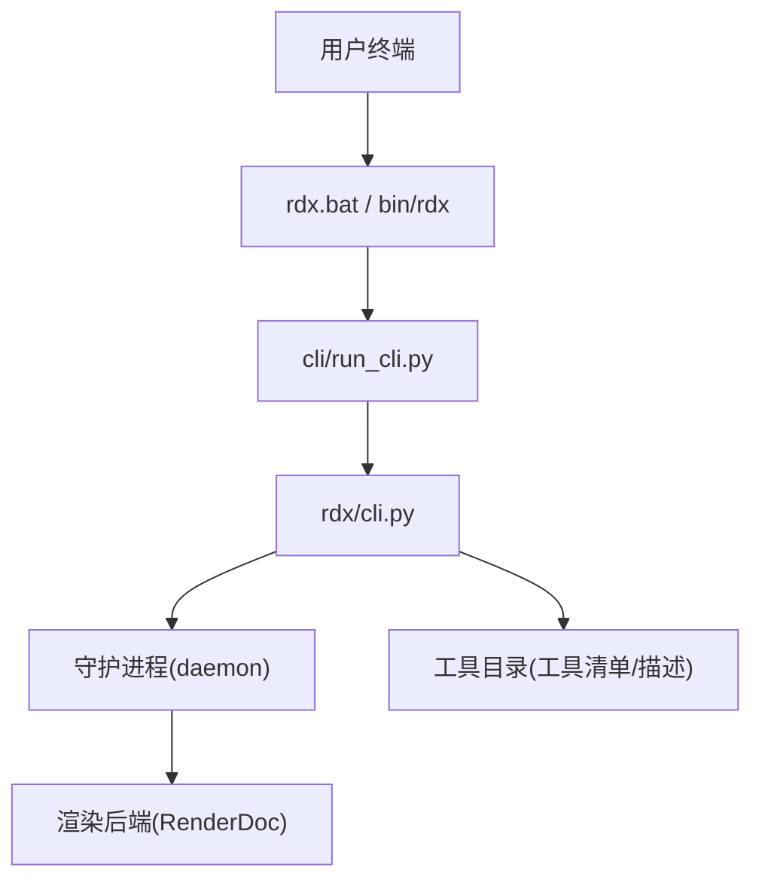
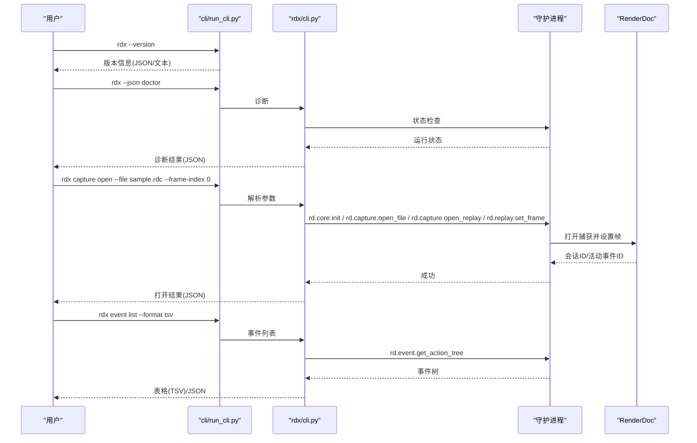
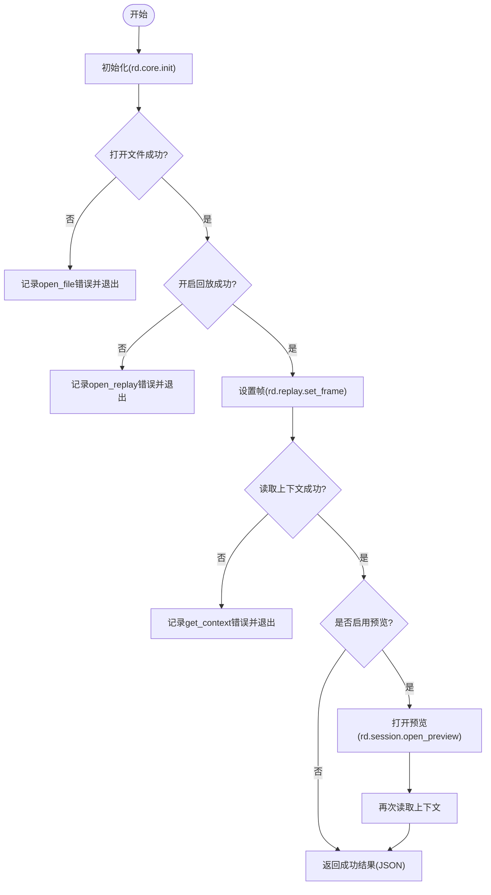
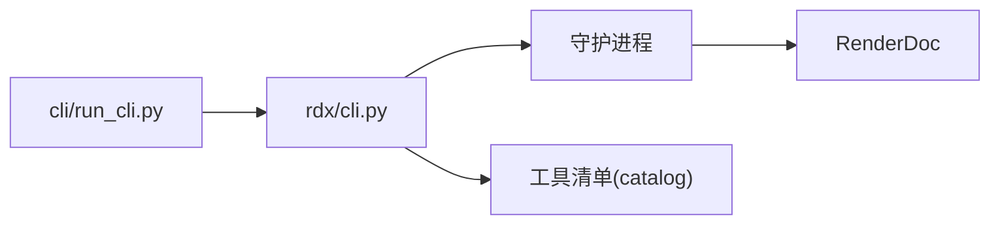

# 快速开始

<cite>
**本文引用的文件**
- [README.md](file://README.md)
- [docs/quickstart.md](file://docs/quickstart.md)
- [docs/install.md](file://docs/install.md)
- [docs/troubleshooting.md](file://docs/troubleshooting.md)
- [cli/run_cli.py](file://cli/run_cli.py)
- [rdx/cli.py](file://rdx/cli.py)
- [scripts/rdx_install.ps1](file://scripts/rdx_install.ps1)
</cite>

## 目录
1. [简介](#简介)
2. [项目结构](#项目结构)
3. [核心组件](#核心组件)
4. [架构总览](#架构总览)
5. [详细组件分析](#详细组件分析)
6. [依赖关系分析](#依赖关系分析)
7. [性能注意事项](#性能注意事项)
8. [故障排除指南](#故障排除指南)
9. [结论](#结论)
10. [附录](#附录)

## 简介
本指南面向首次使用 RDC-Tool（rdx-tools）的用户，目标是帮助你在 Windows x64 平台上快速完成安装与环境验证，并通过常用命令打开 .rdc 捕获文件、查看事件列表、查询管线状态等，实现“最短时间上手”的核心工作流。工具以 JSON 为协议主格式，提供 TSV 表格投影用于列表类命令的输出。

## 项目结构
RDC-Tool 是一个自包含的 Windows x64 包，无需额外安装 Python 或虚拟环境。主要入口包括：
- rdx.bat：Windows 启动器
- bin/rdx：POSIX Shell 启动器
- cli/run_cli.py：Python CLI 启动器
- rdx/cli.py：CLI 命令路由与执行逻辑
- scripts/rdx_install.ps1：Windows 安装/升级/卸载/诊断脚本
- binaries/windows/x64：运行时二进制与内置 Python 环境

图表来源
- [cli/run_cli.py:16-63](file://cli/run_cli.py#L16-L63)
- [rdx/cli.py:62-104](file://rdx/cli.py#L62-L104)

章节来源
- [README.md:1-28](file://README.md#L1-L28)
- [docs/quickstart.md:1-49](file://docs/quickstart.md#L1-L49)

## 核心组件
- 版本检查：支持文本与 JSON 两种输出，便于自动化集成。
- 环境诊断：doctor 命令会检查工具根路径、Python 布局、RenderDoc 组件、工具清单、启动器存在性与守护进程状态。
- 工具列表：tools list/search/describe 可枚举可用操作并获取参数说明。
- 会话上下文：context status/update/list/clear 管理当前上下文与元数据。
- 捕获打开：capture open 打开 .rdc 并进入回放；可选预览模式。
- 事件与管线：event list/show、pipeline show/section 用于查看事件树与管线状态。
- 资源与导出：resource list/show/usage、export screenshot/texture/buffer/mesh。
- 虚拟文件系统：vfs ls/cat/tree/resolve 浏览上下文与资源树。
- 自动补全：completion powershell/bash/zsh/fish。

章节来源
- [rdx/cli.py:535-564](file://rdx/cli.py#L535-L564)
- [rdx/cli.py:410-532](file://rdx/cli.py#L410-L532)
- [rdx/cli.py:694-750](file://rdx/cli.py#L694-L750)
- [rdx/cli.py:780-800](file://rdx/cli.py#L780-L800)
- [rdx/cli.py:1042-1171](file://rdx/cli.py#L1042-L1171)
- [rdx/cli.py:953-1021](file://rdx/cli.py#L953-L1021)
- [rdx/cli.py:888-900](file://rdx/cli.py#L888-L900)
- [rdx/cli.py:689-691](file://rdx/cli.py#L689-L691)

## 架构总览
rdx 通过 CLI 层将用户命令转换为对守护进程的请求，由守护进程协调渲染后端（RenderDoc）执行具体操作，并以统一 JSON 信封返回结果。TSV 仅作为列表类命令的表格投影。

图表来源
- [cli/run_cli.py:164-196](file://cli/run_cli.py#L164-L196)
- [rdx/cli.py:410-532](file://rdx/cli.py#L410-L532)
- [rdx/cli.py:1042-1171](file://rdx/cli.py#L1042-L1171)
- [rdx/cli.py:953-962](file://rdx/cli.py#L953-L962)

## 详细组件分析

### 安装与环境设置（Windows x64）
- 安装包为自包含 zip，解压后通过 PowerShell 脚本进行安装/升级/诊断/卸载。
- 安装过程会复制工具到目标目录，可选择加入用户 PATH，并在完成后执行 doctor 自检。
- 若需先查看将要执行的操作，可使用 DryRun 模式。

常用命令示例（在 PowerShell 中执行）：
- 安装：powershell -ExecutionPolicy Bypass -File scripts/rdx_install.ps1 -Action install -InstallDir "$env:LOCALAPPDATA\Programs\rdx-tools" -AddToPath
- 升级：同上，将 Action 改为 upgrade
- 诊断：powershell -ExecutionPolicy Bypass -File scripts/rdx_install.ps1 -Action doctor -InstallDir "$env:LOCALAPPDATA\Programs\rdx-tools"
- 卸载：powershell -ExecutionPolicy Bypass -File scripts/rdx_install.ps1 -Action uninstall -InstallDir "$env:LOCALAPPDATA\Programs\rdx-tools"

章节来源
- [docs/install.md:1-31](file://docs/install.md#L1-L31)
- [scripts/rdx_install.ps1:1-171](file://scripts/rdx_install.ps1#L1-L171)

### 基础命令行用法
- 版本检查：rdx --version 或 rdx version --json
- 环境诊断：rdx --json doctor
- 工具列表：rdx tools list --json 或 rdx tools search pipeline --json
- 上下文状态：rdx context status --json
- 打开捕获：rdx capture open --file "C:\path\sample.rdc" --frame-index 0
- 事件列表：rdx event list --format tsv
- 管线状态：rdx pipeline show --event-id 42 --format json
- 资源列表：rdx resource list --format tsv
- 自动补全：rdx completion powershell

章节来源
- [README.md:5-28](file://README.md#L5-L28)
- [docs/quickstart.md:1-49](file://docs/quickstart.md#L1-L49)
- [rdx/cli.py:62-104](file://rdx/cli.py#L62-L104)

### 打开 .rdc 捕获文件的工作流
打开捕获涉及初始化、打开文件、开启回放、设置帧、读取上下文，以及可选的预览模式。错误时会将失败步骤、上下文快照与守护进程状态一并返回，便于定位问题。

图表来源
- [rdx/cli.py:1042-1171](file://rdx/cli.py#L1042-L1171)

章节来源
- [rdx/cli.py:1042-1171](file://rdx/cli.py#L1042-L1171)

### 查看事件列表与管线状态
- 事件列表：event list 支持 TSV 表格投影，适合导航与筛选。
- 管线状态：pipeline show 返回摘要信息；pipeline section 可按阶段查看状态。
- 这些命令需要当前上下文存在活跃会话；若无会话，会提示先打开捕获或传入 session-id。

章节来源
- [rdx/cli.py:953-972](file://rdx/cli.py#L953-L972)
- [rdx/cli.py:802-814](file://rdx/cli.py#L802-L814)

### 资源与导出
- 资源列表：resource list 支持 TSV 表格投影。
- 导出：export screenshot/texture/buffer/mesh 可将当前帧或指定资源导出为文件。
- 注意：PNG 为显示映射输出，不等同于 HDR 数据证据；特定格式（HDR/EXR/DDS）若无法生成会结构化报错。

章节来源
- [rdx/cli.py:1012-1021](file://rdx/cli.py#L1012-L1021)
- [docs/troubleshooting.md:29-35](file://docs/troubleshooting.md#L29-L35)

### 虚拟文件系统（VFS）
- vfs ls/cat/tree/resolve 可用于浏览上下文与资源树。
- 仅 vfs ls 支持 TSV 表格投影；其他子命令建议使用 JSON。

章节来源
- [rdx/cli.py:888-900](file://rdx/cli.py#L888-L900)

## 依赖关系分析
- 启动器：cli/run_cli.py 负责解析环境变量、设置工具根路径、检查依赖并调用 rdx/cli.py。
- CLI：rdx/cli.py 负责命令路由、参数解析、JSON/TSV 输出、守护进程通信。
- 守护进程：封装 RenderDoc 操作，提供会话生命周期管理与资源隔离。
- 工具清单：从 catalog 加载可用操作与描述，供 tools list/search/describe 使用。

图表来源
- [cli/run_cli.py:16-63](file://cli/run_cli.py#L16-L63)
- [rdx/cli.py:62-104](file://rdx/cli.py#L62-L104)
- [rdx/cli.py:694-750](file://rdx/cli.py#L694-L750)

章节来源
- [cli/run_cli.py:16-63](file://cli/run_cli.py#L16-L63)
- [rdx/cli.py:694-750](file://rdx/cli.py#L694-L750)

## 性能注意事项
- 列表类命令（event list、resource list、vfs ls）支持 TSV 投影，便于快速浏览与管道处理。
- 复杂嵌套状态（管线、着色器、导出、像素历史、资源详情）应使用 JSON 输出。
- 预览模式会绑定帧缓冲显示，建议在确认会话有效后再开启，避免不必要的开销。

章节来源
- [docs/quickstart.md:33-34](file://docs/quickstart.md#L33-L34)
- [docs/troubleshooting.md:43-46](file://docs/troubleshooting.md#L43-L46)

## 故障排除指南
- 首选诊断：运行 rdx --json doctor，检查工具根路径、Python 布局、RenderDoc 组件、工具清单数量、启动器存在性与守护进程状态。
- 会话状态：使用 rdx context status --json 查看当前上下文；如会话不正确，先清理再重新打开捕获。
- 远程生命周期：若远程回放失败且状态显示 remote_handle_consumed，表示句柄已被占用，需按远程流程恢复而非重用旧句柄。
- 着色器替换：编辑前阅读 edit_plan；当 SPIR-V ASM 需要汇编时，确保 spirv-as 可用；构建失败会返回结构化原因。
- 纹理导出：PNG 为显示映射输出；若请求 HDR/EXR/DDS 但无法生成，会返回结构化失败信息。
- 预览问题：检查 session preview status 与 context status 中的 preview.display，确认帧缓冲范围未被误用。
- Android 连接：优先重试网络/就绪性修复，不要强制停止用户服务或替换端口映射。
- 恢复失败：若出现 stale_session_requires_restart，需关闭并重建隔离会话。

章节来源
- [docs/troubleshooting.md:1-58](file://docs/troubleshooting.md#L1-L58)
- [rdx/cli.py:410-532](file://rdx/cli.py#L410-L532)

## 结论
通过本指南，你可以在 Windows x64 平台快速安装 RDC-Tool，完成环境自检，并使用核心命令打开 .rdc 捕获、查看事件与管线状态、列出资源与导出图像。遇到问题时，优先使用 doctor 与 context status 定位，再根据故障排除建议逐步恢复。

## 附录
- 常用命令速查（来自 README 与 quickstart）：
  - rdx --version
  - rdx version --json
  - rdx --json doctor
  - rdx tools list --json
  - rdx tools describe rd.pipeline.get_state --json
  - rdx context status --json
  - rdx capture open --file "C:\path\capture.rdc" --frame-index 0
  - rdx event list --format tsv
  - rdx pipeline show --event-id 42 --format json
  - rdx resource list --format tsv
  - rdx completion powershell

章节来源
- [README.md:5-28](file://README.md#L5-L28)
- [docs/quickstart.md:1-49](file://docs/quickstart.md#L1-L49)