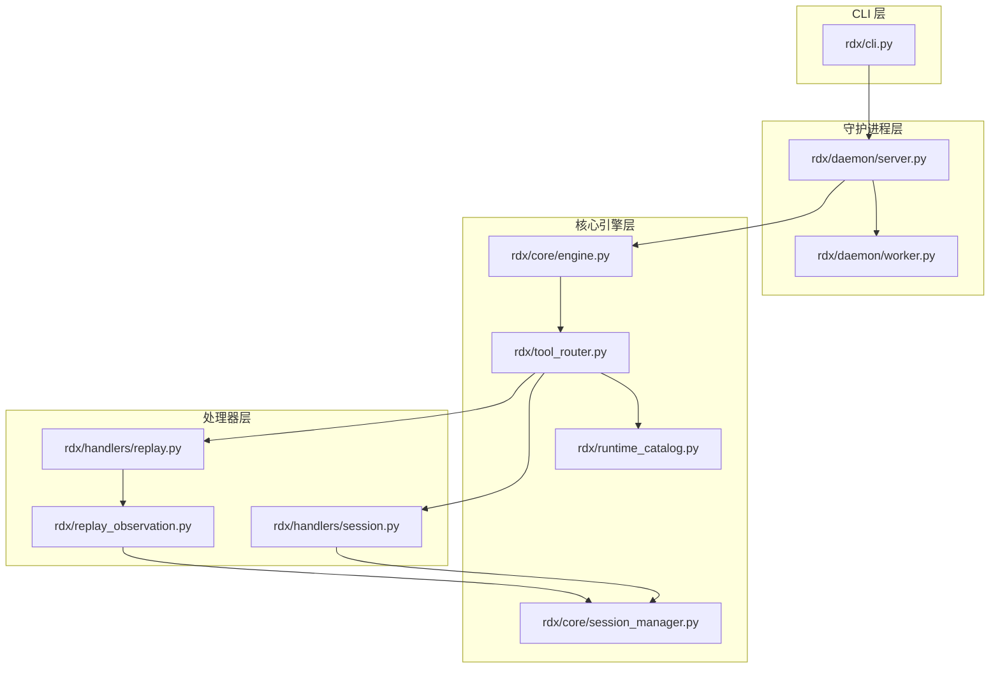
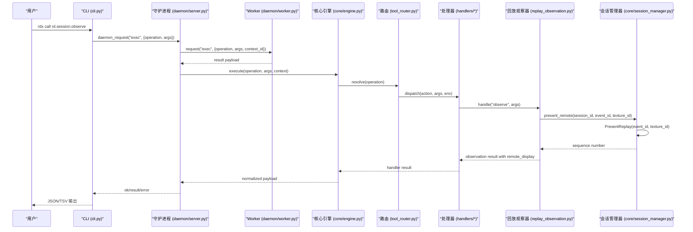
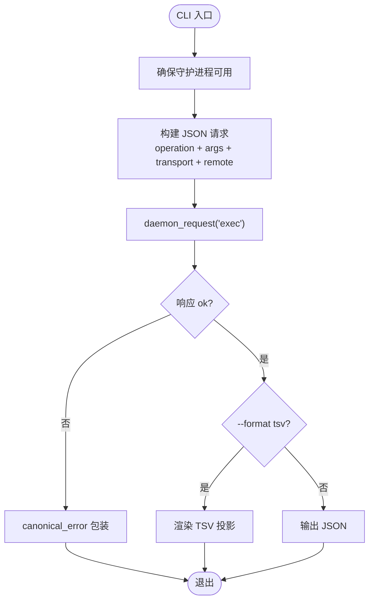
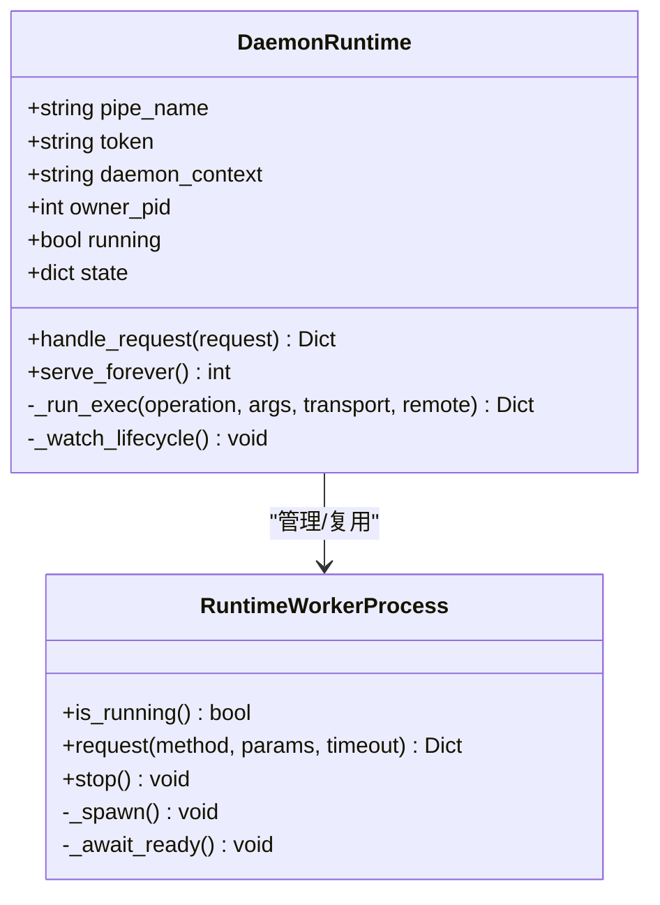
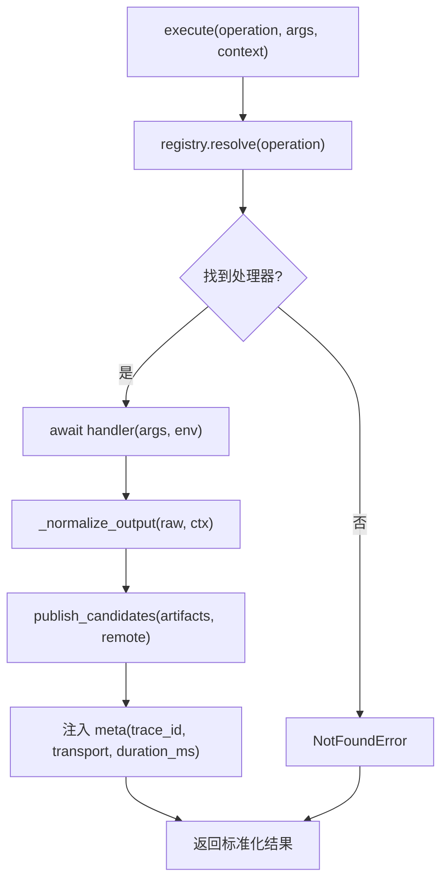
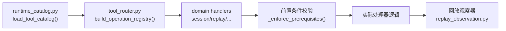
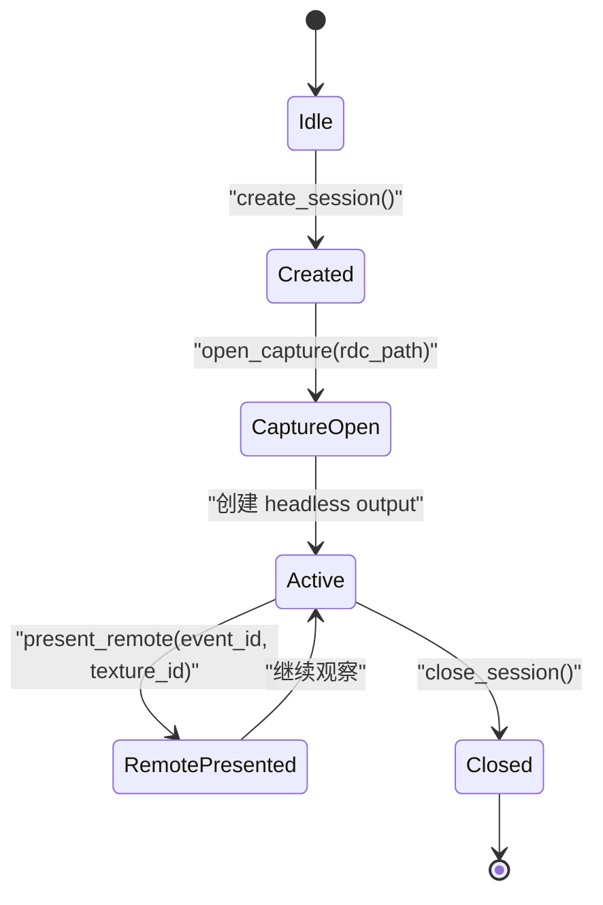
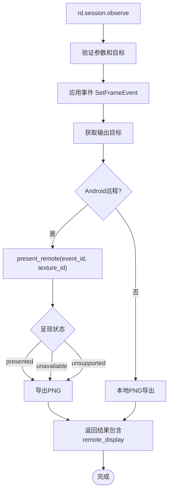
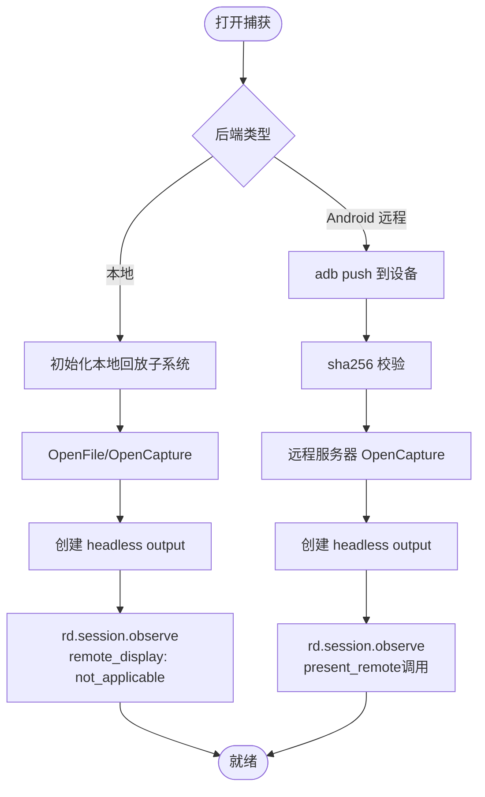
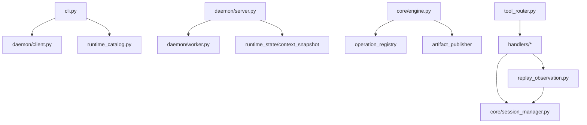

# 架构概览

<cite>
**本文引用的文件**
- [README.md](file://README.md)
- [rdx/cli.py](file://rdx/cli.py)
- [rdx/server.py](file://rdx/server.py)
- [rdx/core/engine.py](file://rdx/core/engine.py)
- [rdx/daemon/server.py](file://rdx/daemon/server.py)
- [rdx/daemon/worker.py](file://rdx/daemon/worker.py)
- [rdx/tool_router.py](file://rdx/tool_router.py)
- [rdx/handlers/session.py](file://rdx/handlers/session.py)
- [rdx/handlers/replay.py](file://rdx/handlers/replay.py)
- [rdx/core/session_manager.py](file://rdx/core/session_manager.py)
- [rdx/runtime_catalog.py](file://rdx/runtime_catalog.py)
- [rdx/config.py](file://rdx/config.py)
- [rdx/operation_definitions.py](file://rdx/operation_definitions.py)
- [rdx/replay_observation.py](file://rdx/replay_observation.py)
</cite>

## 更新摘要
**变更内容**
- 更新了Android远程呈现部分，反映Android原生设备呈现完全集成到会话观察操作中
- 新增了对`rd.session.observe`操作中远程显示输出的详细说明
- 更新了架构图以展示Android远程呈现的完整流程
- 增强了会话管理器中`present_remote`方法的描述

## 目录
1. [简介](#简介)
2. [项目结构](#项目结构)
3. [核心组件](#核心组件)
4. [架构总览](#架构总览)
5. [详细组件分析](#详细组件分析)
6. [依赖关系分析](#依赖关系分析)
7. [性能与可扩展性](#性能与可扩展性)
8. [故障排查指南](#故障排查指南)
9. [结论](#结论)

## 简介
本架构概览面向希望理解 RDC-Tool（rdx-tools）整体设计的开发者。文档聚焦四层职责分离：CLI 层、守护进程层、核心引擎层、处理器层；解释 JSON-first 的 rd.* 操作接口设计理念；说明会话管理与上下文隔离机制；对比本地回放与 Android 远程回放的实现差异；并通过架构图与交互图帮助快速建立全局认知。

**更新** 现在支持Android原生设备呈现完全集成到会话观察操作中，使用拥有远程回放连接进行显示输出。

## 项目结构
RDC-Tool 采用分层与按领域划分的组织方式：
- CLI 层：负责用户入口、参数解析、JSON 输出、与守护进程通信。
- 守护进程层：基于命名管道提供长驻服务，管理 Worker 进程生命周期、上下文状态、心跳与超时。
- 核心引擎层：统一的执行引擎，负责操作路由、参数校验、结果规范化、错误归一化、产物发布。
- 处理器层：按领域（session、replay、capture、buffer、pipeline 等）拆分处理逻辑，通过工具目录注册表动态发现并调用。

**图表来源**
- [rdx/cli.py:234-264](file://rdx/cli.py#L234-L264)
- [rdx/daemon/server.py:572-643](file://rdx/daemon/server.py#L572-L643)
- [rdx/core/engine.py:40-75](file://rdx/core/engine.py#L40-L75)
- [rdx/tool_router.py:131-154](file://rdx/tool_router.py#L131-L154)
- [rdx/runtime_catalog.py:17-28](file://rdx/runtime_catalog.py#L17-L28)
- [rdx/handlers/session.py:8-12](file://rdx/handlers/session.py#L8-L12)
- [rdx/handlers/replay.py:8-9](file://rdx/handlers/replay.py#L8-L9)
- [rdx/replay_observation.py:40-174](file://rdx/replay_observation.py#L40-L174)
- [rdx/core/session_manager.py:302-317](file://rdx/core/session_manager.py#L302-L317)

**章节来源**
- [README.md:1-70](file://README.md#L1-L70)
- [rdx/cli.py:1-120](file://rdx/cli.py#L1-L120)
- [rdx/daemon/server.py:102-164](file://rdx/daemon/server.py#L102-L164)
- [rdx/core/engine.py:1-75](file://rdx/core/engine.py#L1-L75)
- [rdx/tool_router.py:1-54](file://rdx/tool_router.py#L1-L54)

## 核心组件
- CLI 适配器：将命令行参数转换为 JSON 请求，选择上下文，调用守护进程执行，统一输出 JSON/TSV。
- 守护进程：维护多上下文状态、Worker 进程、连接与会话生命周期，提供 exec/status/ping 等方法。
- 核心引擎：统一执行入口，负责操作解析、参数校验、结果标准化、错误映射、产物发布。
- 处理器路由：从工具目录加载 rd.* 操作定义，按 domain.action 分发到对应处理器，并执行前置条件检查。
- 会话管理器：封装本地/远程回放后端，管理 session、capture、controller、headless output 等资源。
- **更新** 回放观察器：专门处理无窗口回放观察，集成Android远程设备呈现功能。

**章节来源**
- [rdx/cli.py:234-327](file://rdx/cli.py#L234-L327)
- [rdx/daemon/server.py:572-643](file://rdx/daemon/server.py#L572-L643)
- [rdx/core/engine.py:40-204](file://rdx/core/engine.py#L40-L204)
- [rdx/tool_router.py:89-154](file://rdx/tool_router.py#L89-L154)
- [rdx/core/session_manager.py:175-206](file://rdx/core/session_manager.py#L175-L206)
- [rdx/replay_observation.py:40-174](file://rdx/replay_observation.py#L40-L174)

## 架构总览
下图展示了从 CLI 到处理器再到后端的完整调用链，以及守护进程的中间协调角色。

**图表来源**
- [rdx/cli.py:243-264](file://rdx/cli.py#L243-L264)
- [rdx/daemon/server.py:616-643](file://rdx/daemon/server.py#L616-L643)
- [rdx/daemon/worker.py:144-170](file://rdx/daemon/worker.py#L144-L170)
- [rdx/core/engine.py:40-75](file://rdx/core/engine.py#L40-L75)
- [rdx/tool_router.py:131-154](file://rdx/tool_router.py#L131-L154)
- [rdx/handlers/session.py:8-12](file://rdx/handlers/session.py#L8-L12)
- [rdx/replay_observation.py:120-132](file://rdx/replay_observation.py#L120-L132)
- [rdx/core/session_manager.py:302-317](file://rdx/core/session_manager.py#L302-L317)

## 详细组件分析

### CLI 层：JSON-first 的用户入口
- 职责：解析参数、构造 JSON 请求、选择上下文、调用守护进程、统一输出 JSON/TSV。
- 关键流程：
  - 确保守护进程可用并获取状态。
  - 通过 daemon_request 发送 exec 请求，携带 operation、args、transport、remote 标志。
  - 支持 --format json|tsv，TSV 时自动注入 tabular projection。
  - 错误统一为 canonical_error，包含 code/category/message/details。
- JSON-first 设计：所有操作以 JSON 对象作为输入和输出，便于脚本化与跨语言调用；TSV 仅用于表格类数据投影。

**图表来源**
- [rdx/cli.py:234-264](file://rdx/cli.py#L234-L264)
- [rdx/cli.py:330-394](file://rdx/cli.py#L330-L394)

**章节来源**
- [rdx/cli.py:54-125](file://rdx/cli.py#L54-L125)
- [rdx/cli.py:234-327](file://rdx/cli.py#L234-L327)
- [rdx/cli.py:330-394](file://rdx/cli.py#L330-L394)

### 守护进程层：长驻服务与上下文隔离
- 职责：监听命名管道、认证、维护上下文状态、管理 Worker 进程、心跳与空闲超时、清理资源。
- 关键特性：
  - 多上下文隔离：每个上下文独立状态文件与 Worker 实例。
  - 客户端附着与心跳：记录 attached_clients，按租约超时清理。
  - 生命周期监控：当所有者丢失或空闲超时时停止守护进程。
  - exec 转发：将操作请求转发给 Worker 进程执行，并刷新上下文快照。
- 上下文快照：同步 session_id、capture_file_id、active_event_id、frame_index 等运行时信息。

**图表来源**
- [rdx/daemon/server.py:102-164](file://rdx/daemon/server.py#L102-L164)
- [rdx/daemon/server.py:572-643](file://rdx/daemon/server.py#L572-L643)
- [rdx/daemon/worker.py:24-45](file://rdx/daemon/worker.py#L24-L45)
- [rdx/daemon/worker.py:144-170](file://rdx/daemon/worker.py#L144-L170)

**章节来源**
- [rdx/daemon/server.py:102-164](file://rdx/daemon/server.py#L102-L164)
- [rdx/daemon/server.py:532-570](file://rdx/daemon/server.py#L532-L570)
- [rdx/daemon/server.py:572-643](file://rdx/daemon/server.py#L572-L643)
- [rdx/daemon/worker.py:24-45](file://rdx/daemon/worker.py#L24-L45)
- [rdx/daemon/worker.py:121-170](file://rdx/daemon/worker.py#L121-L170)

### 核心引擎层：统一执行与规范化
- 职责：解析操作、调用处理器、标准化输出、错误映射、产物发布、元数据注入。
- 关键点：
  - ExecutionContext 携带 transport、remote、trace_id、metadata、progress_reporter。
  - _normalize_output 兼容多种返回格式，统一为 canonical_success/canonical_error。
  - 自动收集 artifacts，支持远程模式下的产物发布。
  - 记录 duration_ms、trace_id、transport 等元信息。

**图表来源**
- [rdx/core/engine.py:40-75](file://rdx/core/engine.py#L40-L75)
- [rdx/core/engine.py:77-204](file://rdx/core/engine.py#L77-L204)

**章节来源**
- [rdx/core/engine.py:21-75](file://rdx/core/engine.py#L21-L75)
- [rdx/core/engine.py:77-204](file://rdx/core/engine.py#L77-L204)

### 处理器层：按领域划分与前置条件校验
- 职责：按 domain.action 路由到具体处理器，执行参数校验与前置条件检查。
- 关键点：
  - 工具目录由 operation_definitions.py 驱动，支持描述、分组、输入 schema、前置条件。
  - 前置条件包括 capture_file_id、session_id、remote_id、active_event_id、capability.remote 等。
  - 处理器内部可委托 server_runtime 的分发方法，如 _dispatch_session/_dispatch_replay。
- **更新** 会话处理器现在支持回放观察操作，通过专用的回放观察器处理Android远程呈现。

**图表来源**
- [rdx/runtime_catalog.py:17-28](file://rdx/runtime_catalog.py#L17-L28)
- [rdx/tool_router.py:89-154](file://rdx/tool_router.py#L89-L154)
- [rdx/handlers/session.py:8-12](file://rdx/handlers/session.py#L8-L12)
- [rdx/handlers/replay.py:8-9](file://rdx/handlers/replay.py#L8-L9)
- [rdx/replay_observation.py:40-174](file://rdx/replay_observation.py#L40-L174)

**章节来源**
- [rdx/runtime_catalog.py:31-91](file://rdx/runtime_catalog.py#L31-L91)
- [rdx/tool_router.py:89-154](file://rdx/tool_router.py#L89-L154)
- [rdx/handlers/session.py:8-12](file://rdx/handlers/session.py#L8-L12)
- [rdx/handlers/replay.py:8-9](file://rdx/handlers/replay.py#L8-L9)

### 会话管理与上下文隔离
- 会话模型：SessionManager 维护多个 SessionState，区分本地与远程后端，管理 controller、output、remote_server。
- 上下文隔离：守护进程按 daemon_context 隔离状态文件与 Worker 实例；CLI 通过 --daemon-context 选择上下文。
- 关键能力：
  - create_session：根据 backend_config 初始化本地或远程会话。
  - open_capture：打开捕获文件，设置 headless output，推断能力。
  - close_session：释放控制器、输出、远程连接等。
- **更新** 新增`present_remote`方法，通过拥有远程回放连接进行Android设备呈现，使用`PresentReplay`接口获取新鲜序列号确认。

**图表来源**
- [rdx/core/session_manager.py:175-206](file://rdx/core/session_manager.py#L175-L206)
- [rdx/core/session_manager.py:208-251](file://rdx/core/session_manager.py#L208-L251)
- [rdx/core/session_manager.py:253-282](file://rdx/core/session_manager.py#L253-L282)
- [rdx/core/session_manager.py:302-317](file://rdx/core/session_manager.py#L302-L317)

**章节来源**
- [rdx/core/session_manager.py:118-174](file://rdx/core/session_manager.py#L118-L174)
- [rdx/core/session_manager.py:175-206](file://rdx/core/session_manager.py#L175-L206)
- [rdx/core/session_manager.py:208-251](file://rdx/core/session_manager.py#L208-L251)
- [rdx/core/session_manager.py:253-282](file://rdx/core/session_manager.py#L253-L282)

### 回放观察器：无窗口回放与Android远程呈现
- 职责：处理无窗口回放观察，支持事件应用、纹理导出和Android远程设备呈现。
- 关键特性：
  - 原子性操作：事件应用与图像导出在同一上下文中执行。
  - Android远程呈现：通过`present_remote`方法调用拥有连接的远程服务器。
  - 呈现状态报告：返回`remote_display`字段，包含status、event_id、texture_id、sequence等信息。
  - 序列号验证：确保每次呈现都获得新鲜的正序列号，防止重复使用旧确认。
- **更新** 完全集成到会话观察操作中，不再需要独立的预览窗口生命周期。

**图表来源**
- [rdx/replay_observation.py:40-174](file://rdx/replay_observation.py#L40-L174)
- [rdx/core/session_manager.py:302-317](file://rdx/core/session_manager.py#L302-L317)

**章节来源**
- [rdx/replay_observation.py:1-174](file://rdx/replay_observation.py#L1-L174)
- [rdx/core/session_manager.py:302-317](file://rdx/core/session_manager.py#L302-L317)

### 本地回放与 Android 远程回放的实现差异
- 本地回放：
  - 初始化 RenderDoc replay 子系统，打开 .rdc 文件，创建 controller 与 headless output。
  - 直接在本机进程内执行回放，资源在本地释放。
  - 无Android远程呈现功能，`remote_display.status`为`not_applicable`。
- Android 远程回放：
  - 通过 adb 将捕获文件推送到设备指定目录，使用 sha256 校验一致性。
  - 通过远程 RenderDoc 服务器打开捕获，创建 controller 与 headless output。
  - **更新** 完全集成到`rd.session.observe`操作中，通过`present_remote`方法进行设备呈现。
  - 支持进度回调与失败清理，确保远端临时文件正确删除。
  - 呈现状态通过`remote_display`字段报告，包含`presented`、`unavailable`、`unsupported`、`not_applicable`四种状态。

**图表来源**
- [rdx/core/session_manager.py:301-307](file://rdx/core/session_manager.py#L301-L307)
- [rdx/core/session_manager.py:347-371](file://rdx/core/session_manager.py#L347-L371)
- [rdx/core/session_manager.py:373-440](file://rdx/core/session_manager.py#L373-L440)
- [rdx/core/session_manager.py:442-507](file://rdx/core/session_manager.py#L442-L507)
- [rdx/replay_observation.py:120-132](file://rdx/replay_observation.py#L120-L132)

**章节来源**
- [rdx/core/session_manager.py:301-307](file://rdx/core/session_manager.py#L301-L307)
- [rdx/core/session_manager.py:347-371](file://rdx/core/session_manager.py#L347-L371)
- [rdx/core/session_manager.py:373-440](file://rdx/core/session_manager.py#L373-L440)
- [rdx/core/session_manager.py:442-507](file://rdx/core/session_manager.py#L442-L507)
- [rdx/replay_observation.py:120-132](file://rdx/replay_observation.py#L120-L132)

## 依赖关系分析
- CLI 依赖守护进程客户端与服务路径、工具目录、运行时路径。
- 守护进程依赖 Worker 进程、上下文状态、运行时路径。
- 核心引擎依赖操作注册表、产物发布器、错误映射。
- 处理器依赖 server_runtime 的分发方法与会话管理器。
- **更新** 回放观察器依赖会话管理器的`present_remote`方法进行Android远程呈现。
- 工具目录由 operation_definitions.py 驱动，保证公开接口的稳定性与可发现性。

**图表来源**
- [rdx/cli.py:17-46](file://rdx/cli.py#L17-L46)
- [rdx/daemon/server.py:17-29](file://rdx/daemon/server.py#L17-L29)
- [rdx/core/engine.py:12-16](file://rdx/core/engine.py#L12-L16)
- [rdx/tool_router.py:10-30](file://rdx/tool_router.py#L10-L30)
- [rdx/handlers/session.py:5-12](file://rdx/handlers/session.py#L5-L12)
- [rdx/replay_observation.py:11-12](file://rdx/replay_observation.py#L11-L12)

**章节来源**
- [rdx/cli.py:17-46](file://rdx/cli.py#L17-L46)
- [rdx/daemon/server.py:17-29](file://rdx/daemon/server.py#L17-L29)
- [rdx/core/engine.py:12-16](file://rdx/core/engine.py#L12-L16)
- [rdx/tool_router.py:10-30](file://rdx/tool_router.py#L10-L30)

## 性能与可扩展性
- 异步执行：核心引擎与处理器支持异步，避免阻塞事件循环。
- 资源隔离：守护进程按上下文隔离 Worker 与状态，减少干扰。
- 超时控制：Worker 请求与守护进程空闲超时防止资源泄漏。
- 产物发布：自动收集 artifacts，支持远程模式下的产物上传。
- **更新** Android远程呈现优化：通过拥有连接复用和序列号验证，确保呈现操作的可靠性和性能。
- 可扩展点：新增 rd.* 操作只需在 operation_definitions.py 中声明，并在对应处理器中实现逻辑。

## 故障排查指南
- 守护进程未运行：CLI 会尝试 ensure_daemon，若失败则返回 canonical_error。
- Worker 启动失败：守护进程会重试并清理状态，必要时重启 Worker。
- 远程复制失败：Android 推送后通过 sha256 校验，失败时抛出明确错误并清理远端文件。
- 会话冲突：重复 session_id 会报错，需确保唯一性。
- 前置条件缺失：工具目录中的 prerequisites 会在执行前校验，缺失时返回结构化错误。
- **更新** Android远程呈现故障：
  - `presented`状态：需要成功的原生GPU呈现和新鲜正序列号。
  - `unavailable`状态：表面、传输或渲染失败，不重用旧的完成序列。
  - `unsupported`状态：缺少原生绑定能力，需要安装匹配的运行时和辅助程序。
  - `not_applicable`状态：本地回放，不支持远程呈现。

**章节来源**
- [rdx/cli.py:234-264](file://rdx/cli.py#L234-L264)
- [rdx/daemon/server.py:532-570](file://rdx/daemon/server.py#L532-L570)
- [rdx/core/session_manager.py:373-440](file://rdx/core/session_manager.py#L373-L440)
- [rdx/tool_router.py:89-128](file://rdx/tool_router.py#L89-L128)
- [rdx/replay_observation.py:120-132](file://rdx/replay_observation.py#L120-L132)

## 结论
RDC-Tool 通过清晰的四层架构实现了 CLI、守护进程、核心引擎与处理器的职责分离，结合 JSON-first 的 rd.* 操作接口与工具目录驱动的设计，提供了稳定、可扩展且易于集成的调试与回放能力。会话管理与上下文隔离确保了多任务场景下的资源安全与状态清晰；本地与 Android 远程回放的双后端支持满足了不同平台的调试需求。

**更新** 最新的Android原生设备呈现功能已完全集成到会话观察操作中，通过`rd.session.observe`提供统一的API接口，使用拥有远程回放连接进行显示输出，支持完整的呈现状态报告和序列号验证机制。开发者可基于此架构快速扩展新操作、优化性能或集成新的后端。