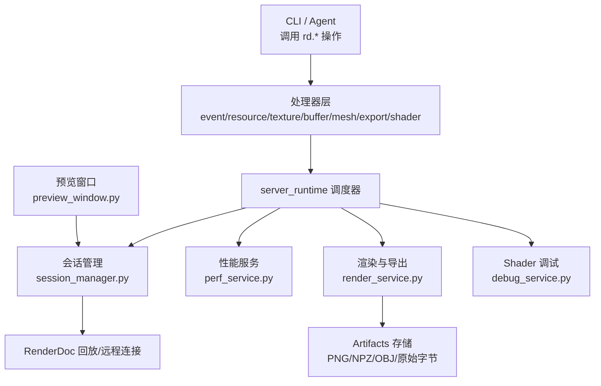
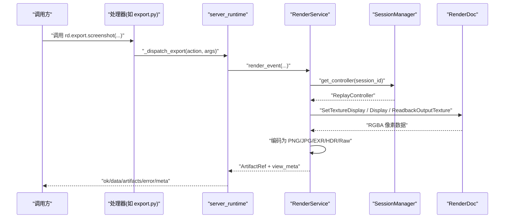
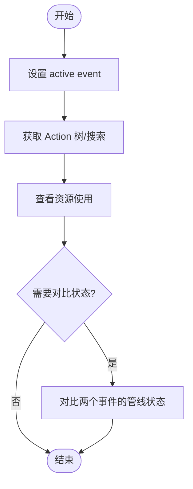
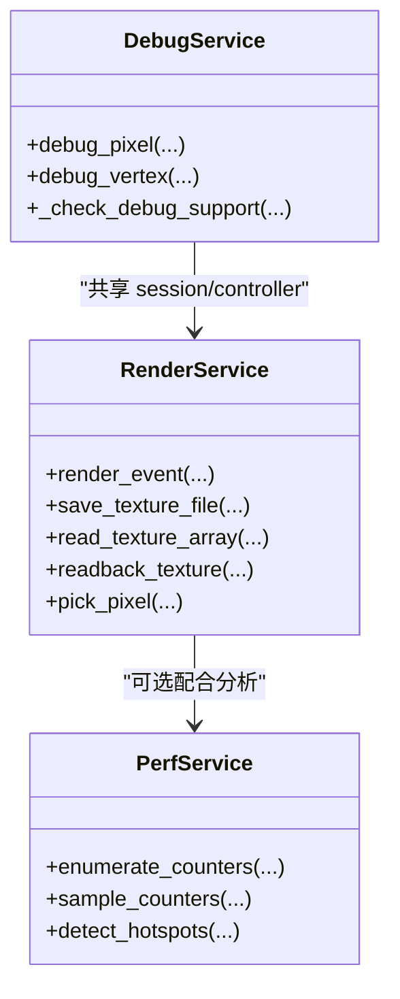
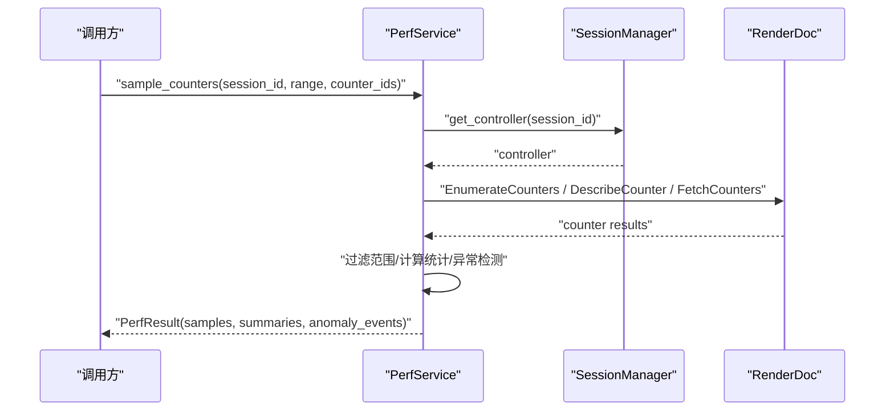
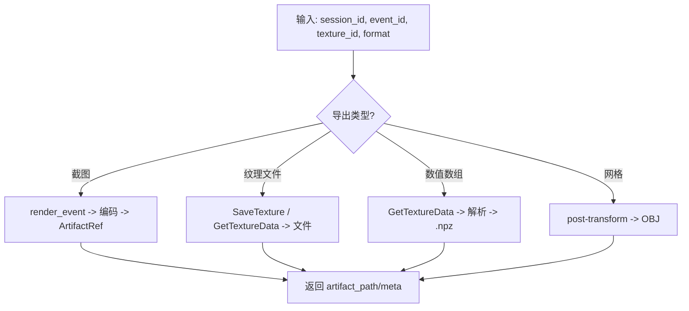
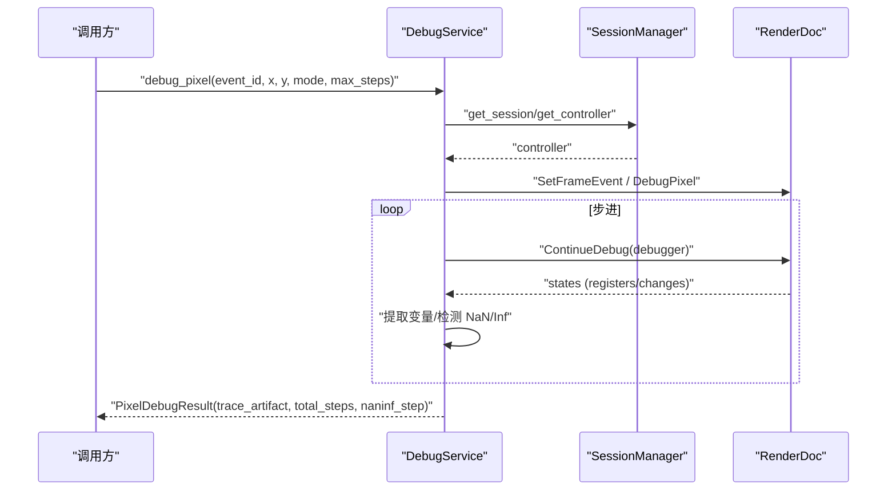
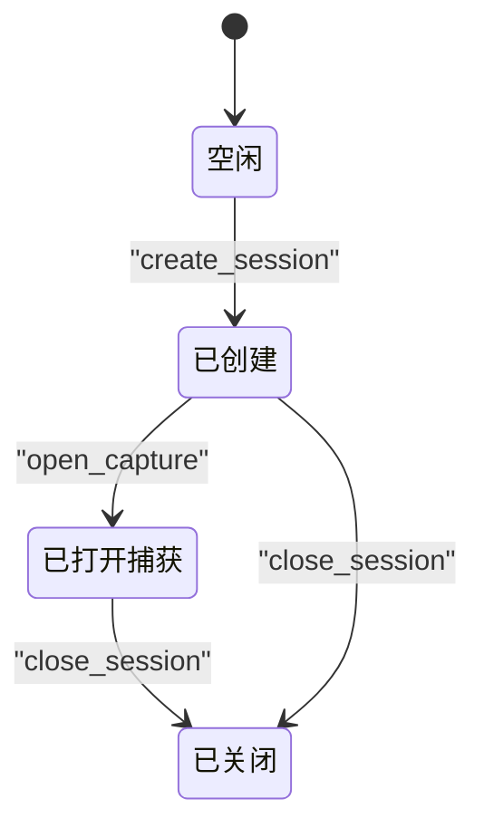
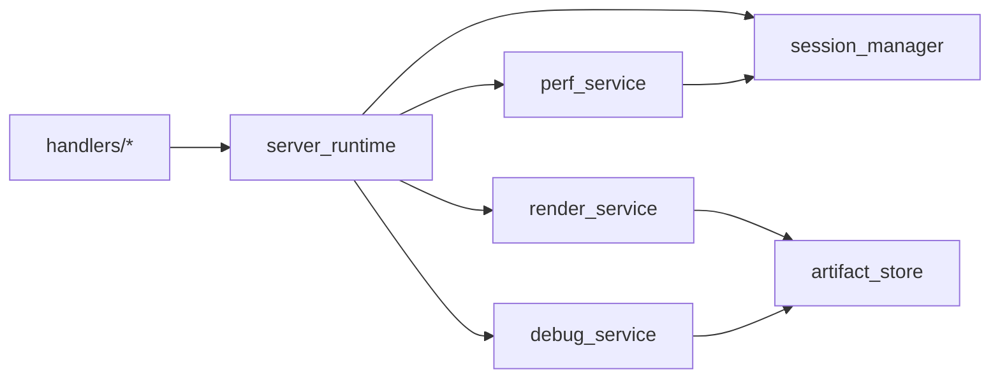

# 核心功能

<cite>
**本文引用的文件**
- [README.md](file://README.md)
- [session_manager.py](file://rdc_tool/core/session_manager.py)
- [preview_window.py](file://rdc_tool/preview_window.py)
- [perf_service.py](file://rdc_tool/core/perf_service.py)
- [render_service.py](file://rdc_tool/core/render_service.py)
- [debug_service.py](file://rdc_tool/core/debug_service.py)
- [event.py](file://rdc_tool/handlers/event.py)
- [resource.py](file://rdc_tool/handlers/resource.py)
- [texture.py](file://rdc_tool/handlers/texture.py)
- [buffer.py](file://rdc_tool/handlers/buffer.py)
- [mesh.py](file://rdc_tool/handlers/mesh.py)
- [export.py](file://rdc_tool/handlers/export.py)
- [shader.py](file://rdc_tool/handlers/shader.py)
- [tool-reference.md](file://docs/tool-reference.md)
</cite>

## 目录
1. [简介](#简介)
2. [项目结构](#项目结构)
3. [核心组件](#核心组件)
4. [架构总览](#架构总览)
5. [详细组件分析](#详细组件分析)
6. [依赖关系分析](#依赖关系分析)
7. [性能考虑](#性能考虑)
8. [故障排查指南](#故障排查指南)
9. [结论](#结论)
10. [附录：常用操作与输出格式速查](#附录：常用操作与输出格式速查)

## 简介
RDC-Tool（rdc-tools）是一个以 CLI 为主的 RenderDoc .rdc 回放与分析工具集，提供 JSON-first 的 rd.* 操作，覆盖事件浏览、资源探查、性能分析、导出、Shader 调试与预览窗口控制等能力。它通过会话管理实现多上下文隔离，并通过 headless 渲染与 readback 将 GPU 数据转换为可分析的图像或数值产物。

## 项目结构
- 入口与文档：README.md 提供了命令行示例、会话状态说明与预览窗口契约；docs/tool-reference.md 汇总了全部工具分组与接口摘要。
- 核心服务：
  - 会话管理：session_manager.py 负责本地/远程回放生命周期、控制器获取、headless 输出创建与清理。
  - 性能分析：perf_service.py 封装 GPU 计数器枚举、采样、热点检测与整帧耗时测量。
  - 渲染与导出：render_service.py 提供截图、纹理导出、像素读取与统计、overlay 可视化。
  - Shader 调试：debug_service.py 支持像素/顶点级逐步执行、变量检查、NaN/Inf 定位与 trace 持久化。
- 处理器层：handlers/* 将 rd.* 动作分发到 server_runtime 对应调度器，再落到具体服务。
- 预览窗口：preview_window.py 在 Windows 上创建独立窗口，自动适配 framebuffer 尺寸并支持用户手动调整。

**图示来源**
- [session_manager.py:175-251](file://rdc_tool/core/session_manager.py#L175-L251)
- [perf_service.py:235-308](file://rdc_tool/core/perf_service.py#L235-L308)
- [render_service.py:357-521](file://rdc_tool/core/render_service.py#L357-L521)
- [debug_service.py:54-267](file://rdc_tool/core/debug_service.py#L54-L267)
- [preview_window.py:192-301](file://rdc_tool/preview_window.py#L192-L301)

**章节来源**
- [README.md:1-70](file://README.md#L1-L70)
- [tool-reference.md:1-253](file://docs/tool-reference.md#L1-L253)

## 核心组件
- 会话管理（SessionManager）
  - 创建/关闭会话、打开捕获、获取控制器与输出、远端复制与 ADB 传输、headless 输出创建与清理。
  - 暴露 capabilities（API、是否支持 shader debug、patch、counters）。
- 性能服务（PerfService）
  - 枚举 GPU counters、按 event 范围采样、计算 per-counter 统计与异常事件、检测 top-K 慢事件。
  - 整帧 GPU 耗时测量（FrameGPUDuration），返回单位秒的正样本序列。
- 渲染与导出（RenderService）
  - 渲染指定 event 为图像 artifact（png/jpg/exr/hdr/raw/npz），支持 subresource、通道、overlay、HDR 乘数、flipY、rawOutput。
  - 纹理导出 save_texture_file、read_texture_array/readback_texture、pick_pixel。
- Shader 调试（DebugService）
  - 像素/顶点级逐步执行，提取寄存器/变量，检测 NaN/Inf，持久化 trace JSON artifact。
  - 支持 D3D11/D3D12/Vulkan，OpenGL/ES 不支持。
- 预览窗口（PreviewWindowHost）
  - 创建独立窗口，根据 framebuffer 尺寸自适应缩放，支持用户手动覆盖尺寸，报告 window/client/fit 信息。

**章节来源**
- [session_manager.py:118-299](file://rdc_tool/core/session_manager.py#L118-L299)
- [perf_service.py:212-618](file://rdc_tool/core/perf_service.py#L212-L618)
- [render_service.py:346-800](file://rdc_tool/core/render_service.py#L346-L800)
- [debug_service.py:43-614](file://rdc_tool/core/debug_service.py#L43-L614)
- [preview_window.py:192-437](file://rdc_tool/preview_window.py#L192-L437)

## 架构总览
RDC 采用“处理器层 + 服务层 + 后端”的分层设计：
- 处理器层：每个领域一个 handler（event/resource/texture/buffer/mesh/export/shader），统一转发到 server_runtime 调度器。
- 服务层：各 Service 无状态、异步友好，依赖 session_manager 获取 ReplayController/ReplayOutput，依赖 artifact_store 持久化产物。
- 后端：RenderDoc Python binding，延迟导入以避免在无回放环境加载失败。

**图示来源**
- [export.py:8-9](file://rdc_tool/handlers/export.py#L8-L9)
- [render_service.py:357-521](file://rdc_tool/core/render_service.py#L357-L521)
- [session_manager.py:260-273](file://rdc_tool/core/session_manager.py#L260-L273)

## 详细组件分析

### 事件浏览与 API 检查
- 能力：列出 Action 树、搜索节点、获取父链/调用栈、查看资源使用、对比管线状态差异、列举 Pass。
- 典型流程：选择 session → 设置 active event → 查询 action details/tree → 结合 resource usage 定位问题。
- 输出：结构化 JSON，包含根节点、分页、过滤结果、调用栈、资源绑定摘要等。

**图示来源**
- [tool-reference.md:104-116](file://docs/tool-reference.md#L104-L116)

**章节来源**
- [event.py:8-9](file://rdc_tool/handlers/event.py#L8-L9)
- [tool-reference.md:104-116](file://docs/tool-reference.md#L104-L116)

### 资源探查（纹理、缓冲区、着色器、管线）
- 纹理：list_all/filter → get_details/get_usage → get_data/readback_texture → compute_stats/diff/histogram/pixel history/value/region values → render_overlay。
- 缓冲区：get_data/get_structured_data/search_pattern → mesh decode/index/post-transform。
- 着色器：get_shader/get_reflection/get_disassembly/get_source/list_entry_points/bindpoint mapping/constant block layout/contents。
- 管线：get_state/get_stage_state/get_resource_bindings/get_constant_buffers/get_vertex_buffers/get_index_buffer。

**图示来源**
- [render_service.py:346-800](file://rdc_tool/core/render_service.py#L346-L800)
- [debug_service.py:43-614](file://rdc_tool/core/debug_service.py#L43-L614)
- [perf_service.py:212-618](file://rdc_tool/core/perf_service.py#L212-L618)

**章节来源**
- [resource.py:8-9](file://rdc_tool/handlers/resource.py#L8-L9)
- [texture.py:8-9](file://rdc_tool/handlers/texture.py#L8-L9)
- [buffer.py:8-9](file://rdc_tool/handlers/buffer.py#L8-L9)
- [mesh.py:8-9](file://rdc_tool/handlers/mesh.py#L8-L9)
- [tool-reference.md:172-230](file://docs/tool-reference.md#L172-L230)

### 性能分析与计数器采样
- 枚举计数器：返回 counter_id/name/description/unit/result_type。
- 采样：按 event 范围抓取，生成 per-event samples、per-counter summaries（min/max/mean/p95）、异常事件（z-score > 3）。
- 热点检测：基于 EventGPUDuration/GPUDuration 等名称匹配，返回 top-K 最慢事件（微秒）。
- 整帧耗时：FrameGPUDuration，返回正样本列表（秒），排除初始内容恢复，包含调度间隙。

**图示来源**
- [perf_service.py:314-487](file://rdc_tool/core/perf_service.py#L314-L487)

**章节来源**
- [perf_service.py:235-618](file://rdc_tool/core/perf_service.py#L235-L618)
- [tool-reference.md:135-142](file://docs/tool-reference.md#L135-L142)

### 导出能力（截图、纹理数据、网格数据）
- 截图：render_event 或专用导出，支持 overlay、channels、HDR、flipY、raw_output，输出 PNG/JPG/EXR/HDR/Raw。
- 纹理数据：save_texture_file（直接保存）、readback_texture（.npz 数值容器）、read_texture_array（内存数组+统计）。
- 网格数据：导出 OBJ（post-VS 位置、拓扑、索引），支持 float32 位置与常见拓扑。

**图示来源**
- [render_service.py:357-646](file://rdc_tool/core/render_service.py#L357-L646)
- [tool-reference.md:118-127](file://docs/tool-reference.md#L118-L127)

**章节来源**
- [export.py:8-9](file://rdc_tool/handlers/export.py#L8-L9)
- [tool-reference.md:118-127](file://docs/tool-reference.md#L118-L127)

### Shader 调试（断点、变量、调用栈）
- 启动调试：debug_start（pixel/vertex），remote 下先探测 capability matrix。
- 断点管理：set_breakpoints/clear_breakpoints，continue/step/run_to。
- 变量检查：get_variables（支持 name_filter/expand_depth），evaluate_expression（可选）。
- 调用栈：get_callstack。
- 结果：trace JSON artifact（步骤、寄存器/变量、NaN/Inf 标记），total_steps，首个 NaN/Inf step。

**图示来源**
- [debug_service.py:54-267](file://rdc_tool/core/debug_service.py#L54-L267)
- [tool-reference.md:82-97](file://docs/tool-reference.md#L82-L97)

**章节来源**
- [shader.py:8-9](file://rdc_tool/handlers/shader.py#L8-L9)
- [debug_service.py:43-614](file://rdc_tool/core/debug_service.py#L43-L614)
- [tool-reference.md:82-97](file://docs/tool-reference.md#L82-L97)

### 会话管理与预览窗口控制
- 会话隔离：create_session/open_capture/close_session，支持 local/remote 后端；capabilities 暴露 shader_debug/patch/counters。
- 预览窗口：open_preview/status/off，geometry_snapshot 报告 window/client/manual_override；apply_framebuffer_geometry 根据 framebuffer 尺寸自适应显示。
- 上下文快照：context status/update，notes/focus/metadata，sessions 表与恢复摘要。

**图示来源**
- [session_manager.py:175-258](file://rdc_tool/core/session_manager.py#L175-L258)
- [preview_window.py:221-301](file://rdc_tool/preview_window.py#L221-L301)
- [tool-reference.md:183-198](file://docs/tool-reference.md#L183-L198)

**章节来源**
- [session_manager.py:118-569](file://rdc_tool/core/session_manager.py#L118-L569)
- [preview_window.py:192-437](file://rdc_tool/preview_window.py#L192-L437)
- [README.md:44-50](file://README.md#L44-L50)
- [tool-reference.md:183-198](file://docs/tool-reference.md#L183-L198)

## 依赖关系分析
- 处理器到服务：所有 handlers 仅做转发，实际逻辑集中在 core/services。
- 服务到后端：renderdoc 模块延迟导入，避免非回放环境加载失败；所有阻塞调用通过线程池执行。
- 服务间耦合：低耦合，通过 session_manager 协议访问 controller/output；artifact_store 抽象产物存储。

**图示来源**
- [event.py:8-9](file://rdc_tool/handlers/event.py#L8-L9)
- [resource.py:8-9](file://rdc_tool/handlers/resource.py#L8-L9)
- [texture.py:8-9](file://rdc_tool/handlers/texture.py#L8-L9)
- [buffer.py:8-9](file://rdc_tool/handlers/buffer.py#L8-L9)
- [mesh.py:8-9](file://rdc_tool/handlers/mesh.py#L8-L9)
- [export.py:8-9](file://rdc_tool/handlers/export.py#L8-L9)
- [shader.py:8-9](file://rdc_tool/handlers/shader.py#L8-L9)

**章节来源**
- [render_service.py:39-56](file://rdc_tool/core/render_service.py#L39-L56)
- [perf_service.py:69-96](file://rdc_tool/core/perf_service.py#L69-L96)
- [debug_service.py:573-595](file://rdc_tool/core/debug_service.py#L573-L595)

## 性能考虑
- 计数器采样可能较慢，建议限制 event_range 与 stride，优先使用 enumerate_counters 筛选必要 counter。
- 热点检测默认扫描全捕获，top_k 控制输出规模；整帧耗时测量会多次 FetchCounters，注意 warmup/samples 配置。
- 纹理 readback 与导出涉及 GPU→CPU 拷贝与大对象序列化，建议按需选择 subresource/region/format。
- 预览窗口自动缩放避免全屏重绘开销，用户手动调整会触发 resize 处理。

[本节为通用指导，不直接分析具体文件]

## 故障排查指南
- 会话错误：session_not_found、capture_already_open、controller_missing、output_missing、remote_capture_copy_failed 等，需检查 session_id、捕获路径、远端连接与 ADB 传输。
- RenderDoc 状态：_check_status 包装的错误包含 renderdoc_status/status_text 与 fix_hint，应据此重试或修复环境。
- 性能计数不可用：缺少 renderdoc 模块或不支持的 backend/queue 配置，需更新运行时或启用相应能力。
- 导出失败：SaveTexture 返回状态码与 status_text，检查 file_format、subresource、目标路径权限。
- Shader 调试不可用：当前 API/driver 不支持（OpenGL/ES），或 remote backend 明确不支持 debug，优先返回 capability-style 错误。

**章节来源**
- [session_manager.py:91-115](file://rdc_tool/core/session_manager.py#L91-L115)
- [session_manager.py:384-440](file://rdc_tool/core/session_manager.py#L384-L440)
- [render_service.py:161-195](file://rdc_tool/core/render_service.py#L161-L195)
- [perf_service.py:235-308](file://rdc_tool/core/perf_service.py#L235-L308)
- [debug_service.py:427-466](file://rdc_tool/core/debug_service.py#L427-L466)

## 结论
RDC-Tool 以清晰的处理器-服务-后端分层，提供完整的 GPU 调试与分析闭环：从事件浏览与资源探查，到性能计数器采样与热点定位，再到截图/纹理/网格导出与 Shader 级调试，辅以会话隔离与预览窗口控制，满足从自动化脚本到专家级调试的多层次需求。

[本节为总结性内容，不直接分析具体文件]

## 附录：常用操作与输出格式速查
- 事件浏览
  - 操作：rd.event.get_action_tree / rd.event.search_actions / rd.event.get_resource_usage / rd.event.diff_pipeline_state
  - 输出：root/pagination/matches/usage/diff 等结构化 JSON
- 资源探查
  - 纹理：rd.texture.get_data/.compute_stats/.diff/.get_histogram/.get_pixel_value/.get_region_values/.render_overlay
  - 缓冲：rd.buffer.get_data/.get_structured_data/.search_pattern
  - 网格：rd.mesh.decode_index_data/.get_drawcall_mesh_config/.get_post_transform_data
  - 管线：rd.pipeline.get_state/.get_resource_bindings/.get_constant_buffers/.get_vertex_buffers/.get_index_buffer
  - 着色器：rd.shader.get_reflection/.get_disassembly/.get_source/.get_bindpoint_mapping/.get_constant_block_layout/.get_constant_buffer_contents
- 性能分析
  - 操作：rd.perf.enumerate_counters / rd.perf.sample_counters / rd.perf.get_event_durations / rd.perf.get_frame_timing
  - 输出：counters/samples/summaries/anomaly_events/durations/frame_timing
- 导出
  - 截图：rd.export.screenshot → image_path/artifact_path/meta
  - 纹理：rd.export.texture → saved_path/meta（支持 png/jpg/exr/hdr/raw/dds/tga/bmp）
  - 网格：rd.export.mesh → saved_path（OBJ）
- Shader 调试
  - 操作：rd.shader.debug_start / rd.debug.set_breakpoints / rd.debug.continue / rd.debug.step / rd.debug.run_to / rd.debug.get_variables / rd.debug.get_callstack / rd.debug.finish
  - 输出：shader_debug_id/initial_state/trace_artifact/variables/callstack

**章节来源**
- [tool-reference.md:82-253](file://docs/tool-reference.md#L82-L253)