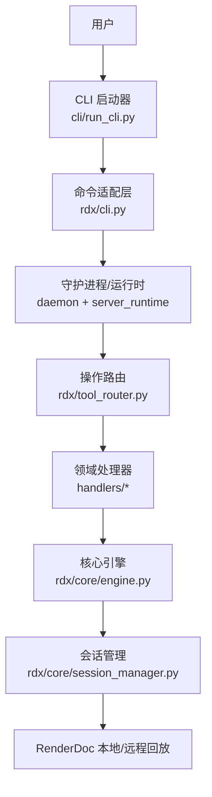
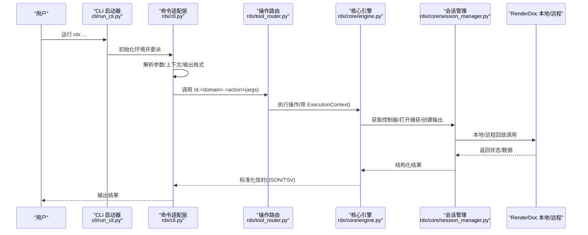
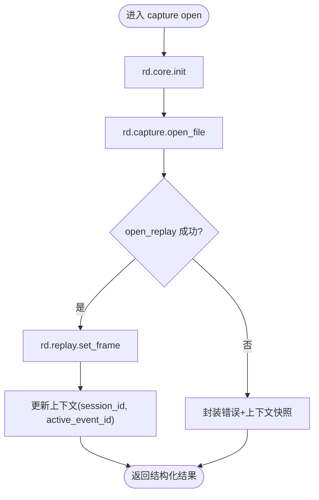
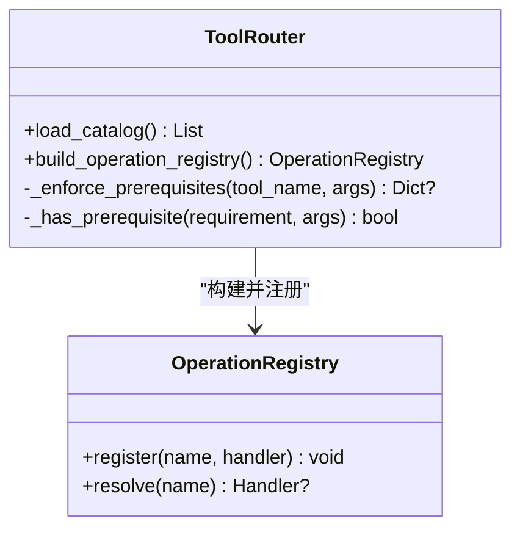
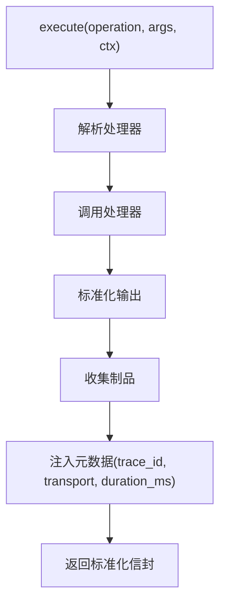
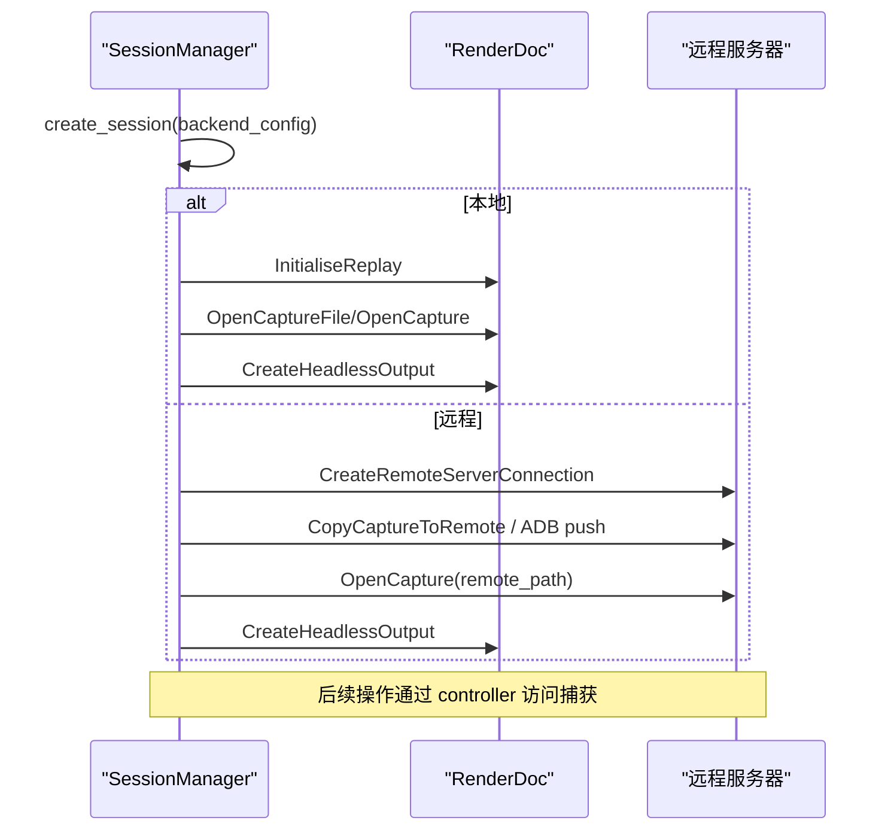
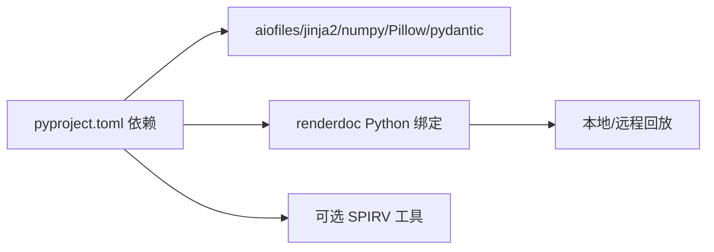

# 项目介绍

<cite>
**本文引用的文件**
- [README.md](file://README.md)
- [pyproject.toml](file://pyproject.toml)
- [THIRD_PARTY_NOTICES.md](file://THIRD_PARTY_NOTICES.md)
- [cli/run_cli.py](file://cli/run_cli.py)
- [rdx/cli.py](file://rdx/cli.py)
- [rdx/tool_router.py](file://rdx/tool_router.py)
- [rdx/core/engine.py](file://rdx/core/engine.py)
- [rdx/core/session_manager.py](file://rdx/core/session_manager.py)
- [rdx/models.py](file://rdx/models.py)
- [docs/quickstart.md](file://docs/quickstart.md)
- [docs/session-model.md](file://docs/session-model.md)
- [docs/tools.md](file://docs/tools.md)
</cite>

## 目录
1. [简介](#简介)
2. [项目结构](#项目结构)
3. [核心组件](#核心组件)
4. [架构总览](#架构总览)
5. [详细组件分析](#详细组件分析)
6. [依赖关系分析](#依赖关系分析)
7. [性能与稳定性考量](#性能与稳定性考量)
8. [故障排查指南](#故障排查指南)
9. [结论](#结论)
10. [附录](#附录)

## 简介
RDC-Tool（包名 rdx-tools）是一个面向 RenderDoc .rdc 捕获文件的命令行工具集，目标是提供“本地优先”的 GPU 调试与分析体验，同时支持 Windows x64 本地回放与 Android 远程回放。它通过 JSON 优先的 `rd.*` 操作暴露能力，CLI 入口为 `rdx`，并可通过 `rdx tools list` 动态发现可用工具。

核心价值主张：
- 以 CLI 为中心、JSON 协议为契约，便于自动化、脚本化与 Agent 集成。
- 统一会话与资源生命周期管理，屏蔽本地/远端差异。
- 面向 GPU 调试与分析的丰富能力：事件浏览、管线状态查询、着色器与资源探索、截图导出、像素历史、性能计数器采样等。
- 可插拔的操作注册与前置条件校验，保证调用方按正确顺序使用工具。

许可证与第三方依赖：
- 本项目采用 Apache-2.0 许可证。
- 测试用 .rdc 示例遵循 MIT 许可，不包含在发布包中；完整第三方声明见 Third-Party Notices。

章节来源
- [README.md:1-70](file://README.md#L1-L70)
- [pyproject.toml:5-19](file://pyproject.toml#L5-L19)
- [THIRD_PARTY_NOTICES.md:1-16](file://THIRD_PARTY_NOTICES.md#L1-L16)

## 项目结构
仓库采用分层与领域划分相结合的组织方式：
- 顶层 CLI 启动器与包装：`cli/run_cli.py` 负责环境初始化、依赖检查、版本/诊断输出，并委托到 `rdx.cli`。
- 命令适配层：`rdx/cli.py` 解析参数、维护上下文、与守护进程通信、格式化输出（JSON/TSV）。
- 路由与注册：`rdx/tool_router.py` 基于目录域将 `rd.<domain>.<action>` 映射到具体处理器，并执行前置条件校验。
- 核心引擎：`rdx/core/engine.py` 提供统一的异步执行引擎，规范化输入输出、收集元数据与制品。
- 会话与后端：`rdx/core/session_manager.py` 抽象本地/远程回放会话、打开捕获、创建无头输出、清理资源。
- 数据模型：`rdx/models.py` 定义会话、捕获、事件树、管线快照、实验、报告等结构化类型。
- 文档：`docs/` 包含快速开始、会话模型、工具清单、安装与排障等。

图表来源
- [cli/run_cli.py:16-63](file://cli/run_cli.py#L16-L63)
- [rdx/cli.py:234-264](file://rdx/cli.py#L234-L264)
- [rdx/tool_router.py:131-154](file://rdx/tool_router.py#L131-L154)
- [rdx/core/engine.py:30-75](file://rdx/core/engine.py#L30-L75)
- [rdx/core/session_manager.py:175-251](file://rdx/core/session_manager.py#L175-L251)

章节来源
- [cli/run_cli.py:16-63](file://cli/run_cli.py#L16-L63)
- [rdx/cli.py:62-104](file://rdx/cli.py#L62-L104)
- [rdx/tool_router.py:34-57](file://rdx/tool_router.py#L34-L57)
- [rdx/core/engine.py:30-75](file://rdx/core/engine.py#L30-L75)
- [rdx/core/session_manager.py:175-251](file://rdx/core/session_manager.py#L175-L251)

## 核心组件
- CLI 启动器：负责 Python 路径与环境准备、依赖缺失检测、版本与诊断输出，并将控制权交给 `rdx.cli`。
- 命令适配层：实现 `version`、`doctor`、`tools`、`context`、`capture`、`event`、`pipeline`、`shader`、`export`、`pixel`、`resource`、`diff`、`assert`、`completion` 等高层命令，统一 JSON/TSV 输出。
- 操作路由：根据 `rd.<domain>.<action>` 名称查找对应处理器，并在执行前进行参数校验与前置条件检查（如是否已打开捕获、是否存在 session_id、是否启用 remote 等）。
- 核心引擎：统一封装执行生命周期，标准化结果信封（schema_version、tool_version、result_kind、ok、data、artifacts、error、meta），记录 trace_id、transport、duration_ms。
- 会话管理器：抽象本地/远程回放会话，管理渲染控制器、无头输出、远程连接、捕获拷贝与清理，识别图形 API 与能力。
- 数据模型：以 Pydantic 模型描述会话、捕获、事件树、管线快照、着色器、补丁、实验、报告、性能计数器等，确保跨层数据结构一致。

章节来源
- [cli/run_cli.py:66-79](file://cli/run_cli.py#L66-L79)
- [rdx/cli.py:234-394](file://rdx/cli.py#L234-L394)
- [rdx/tool_router.py:89-154](file://rdx/tool_router.py#L89-L154)
- [rdx/core/engine.py:30-204](file://rdx/core/engine.py#L30-L204)
- [rdx/core/session_manager.py:148-251](file://rdx/core/session_manager.py#L148-L251)
- [rdx/models.py:128-157](file://rdx/models.py#L128-L157)

## 架构总览
RDX 采用“CLI → 守护进程/运行时 → 操作路由 → 领域处理器 → 核心引擎 → 会话/后端”的分层架构。CLI 仅负责交互与协议适配；真正的回放与 GPU 访问由会话管理器驱动 RenderDoc 本地或远程接口完成。操作路由集中管理工具发现、参数校验与前置条件，使新增工具无需改动上层逻辑。

图表来源
- [cli/run_cli.py:226-271](file://cli/run_cli.py#L226-L271)
- [rdx/cli.py:234-264](file://rdx/cli.py#L234-L264)
- [rdx/tool_router.py:131-154](file://rdx/tool_router.py#L131-L154)
- [rdx/core/engine.py:40-75](file://rdx/core/engine.py#L40-L75)
- [rdx/core/session_manager.py:347-440](file://rdx/core/session_manager.py#L347-L440)

## 详细组件分析

### 命令适配层（rdx/cli.py）
- 职责：解析 CLI 参数、维护上下文（notes/focus/metadata）、选择 daemon context、统一 JSON/TSV 输出、错误归一化。
- 关键流程：
  - 版本/诊断：`version`、`doctor` 输出环境与依赖信息。
  - 工具发现：`tools list/search/describe` 基于目录加载与指纹。
  - 会话上下文：`context status/update/list/clear` 读写上下文快照。
  - 捕获打开：`capture open` 串联 `rd.core.init`、`rd.capture.open_file`、`rd.capture.open_replay`、`rd.replay.set_frame`，并更新上下文。
  - 列表导航：`event list`、`resource list`、`vfs ls/tree/cat/resolve` 支持 TSV 投影。
  - 高级分析：`pipeline show`、`shader source/disasm/constants`、`export screenshot/texture/buffer/mesh`、`pixel value/history`、`diff/assert pipeline/image`。
  - Shell 补全：`completion powershell/bash/zsh/fish`。

图表来源
- [rdx/cli.py:234-394](file://rdx/cli.py#L234-L394)
- [tests/test_cli_capture_open.py:15-90](file://tests/test_cli_capture_open.py#L15-L90)

章节来源
- [rdx/cli.py:62-104](file://rdx/cli.py#L62-L104)
- [rdx/cli.py:234-394](file://rdx/cli.py#L234-L394)
- [tests/test_cli_capture_open.py:15-90](file://tests/test_cli_capture_open.py#L15-L90)

### 操作路由与前置条件（rdx/tool_router.py）
- 职责：将 `rd.<domain>.<action>` 映射到处理器，执行参数校验与前置条件检查（如 `session_id`、`capture_file_id`、`active_event_id`、`capability.remote`）。
- 设计要点：
  - 基于目录的处理器注册，新增领域只需添加模块与映射。
  - 前置条件支持 `when` 条件（如 `options.remote_id_present`），避免误用。
  - 失败时返回结构化错误，包含 `via_tools` 与修复提示。

图表来源
- [rdx/tool_router.py:34-57](file://rdx/tool_router.py#L34-L57)
- [rdx/tool_router.py:89-154](file://rdx/tool_router.py#L89-L154)

章节来源
- [rdx/tool_router.py:89-154](file://rdx/tool_router.py#L89-L154)

### 核心引擎（rdx/core/engine.py）
- 职责：统一执行生命周期，标准化输出信封，收集 artifacts、trace_id、transport、duration_ms，异常映射为规范错误。
- 关键点：
  - 支持多种原始返回格式（字符串 JSON、字典、success/error 信封、ok/data 信封），自动归一化。
  - 通过 ArtifactPublisher 收集产物（截图、纹理、日志等）。
  - 异常统一映射为 `CoreError`，便于上层处理。

图表来源
- [rdx/core/engine.py:40-75](file://rdx/core/engine.py#L40-L75)
- [rdx/core/engine.py:77-204](file://rdx/core/engine.py#L77-L204)

章节来源
- [rdx/core/engine.py:30-204](file://rdx/core/engine.py#L30-L204)

### 会话管理（rdx/core/session_manager.py）
- 职责：抽象本地/远程回放会话，管理控制器、无头输出、远程连接、捕获拷贝与清理，识别图形 API 与能力。
- 关键流程：
  - 创建会话：区分本地/远程，必要时初始化 RenderDoc 回放子系统或建立远程连接。
  - 打开捕获：本地直接打开 `.rdc`；远程通过 CopyCaptureToRemote 或 ADB 推送至设备，再 OpenCapture。
  - 无头输出：创建 HeadlessWindowingData 并生成 Texture 输出用于截图/预览。
  - 清理：有序关闭输出、控制器、捕获文件、远程连接，必要时关闭全局回放子系统。

图表来源
- [rdx/core/session_manager.py:175-251](file://rdx/core/session_manager.py#L175-L251)
- [rdx/core/session_manager.py:309-440](file://rdx/core/session_manager.py#L309-L440)
- [rdx/core/session_manager.py:509-568](file://rdx/core/session_manager.py#L509-L568)

章节来源
- [rdx/core/session_manager.py:148-251](file://rdx/core/session_manager.py#L148-L251)
- [rdx/core/session_manager.py:309-440](file://rdx/core/session_manager.py#L309-L440)
- [rdx/core/session_manager.py:509-568](file://rdx/core/session_manager.py#L509-L568)

### 数据模型（rdx/models.py）
- 作用：以强类型描述会话、捕获、事件树、管线快照、着色器、补丁、实验、报告、性能计数器等，保障跨层一致性。
- 重点模型：
  - SessionInfo/CaptureInfo：会话与捕获基本信息。
  - EventNode/EventFlags：事件树节点与标志。
  - PipelineSnapshot/ShaderInfo/RenderTargetInfo：管线状态与着色器信息。
  - ExperimentResult/ReportBundle：实验与报告聚合。
  - PerfResult/CounterSample/CounterSummary：性能计数器采样与汇总。

章节来源
- [rdx/models.py:128-157](file://rdx/models.py#L128-L157)
- [rdx/models.py:173-181](file://rdx/models.py#L173-L181)
- [rdx/models.py:280-301](file://rdx/models.py#L280-L301)
- [rdx/models.py:479-483](file://rdx/models.py#L479-L483)

## 依赖关系分析
- 运行时依赖：Python ≥ 3.11，以及 aiofiles、jinja2、numpy、Pillow、pydantic 等。
- 外部绑定：通过 `renderdoc` Python 模块访问本地/远程回放能力；若不可用则相关功能降级或报错。
- 工具链：可选 SPIRV 工具（spirv-as/spirv-dis）用于着色器反汇编与替换场景。
- 发布包：Windows x64 自包含 zip，附带 Python 运行时与二进制；Android 远程回放需设备与 ADB。

图表来源
- [pyproject.toml:5-19](file://pyproject.toml#L5-L19)

章节来源
- [pyproject.toml:5-19](file://pyproject.toml#L5-L19)

## 性能与稳定性考量
- 非阻塞执行：核心引擎与会话管理大量使用异步与线程池 offload，避免阻塞事件循环。
- 超时与心跳：CLI 对 daemon exec 设置超时策略，守护进程状态探测与清理防止僵尸会话。
- 幂等与恢复：捕获打开在相同上下文内幂等；失败时返回恢复建议与上下文快照，便于重试。
- 资源清理：会话关闭时有序释放输出、控制器、捕获文件与远程连接，必要时关闭全局回放子系统。
- 输出稳定：JSON 为主协议，TSV 仅用于列表/导航的表格投影，避免破坏嵌套结构的可读性。

章节来源
- [rdx/core/engine.py:40-75](file://rdx/core/engine.py#L40-L75)
- [rdx/core/session_manager.py:517-568](file://rdx/core/session_manager.py#L517-L568)
- [docs/session-model.md:11-14](file://docs/session-model.md#L11-L14)
- [docs/tools.md:30-34](file://docs/tools.md#L30-L34)

## 故障排查指南
- 环境诊断：使用 `rdx --json doctor` 检查依赖、Python 布局、RenderDoc 组件、SPIRV 工具与目录完整性。
- 常见错误：
  - 依赖缺失：CLI 会列出缺失项并返回结构化错误；按提示安装或配置环境变量。
  - 捕获无效：本地/远程打开失败会返回分类信息与修复提示，验证 `.rdc` 与运行时兼容性。
  - 远程连接失败：确认 endpoint 可达、设备在线、ADB 可用；查看 `remote_handle_consumed` 状态。
  - 预览/截图失败：检查 `preview.display` 几何与 framebuffer 范围；确认目标事件存在颜色附件。
- 上下文隔离：通过 `--daemon-context <id>` 隔离不同会话命名空间；使用 `context clear` 清理状态。

章节来源
- [rdx/cli.py:410-532](file://rdx/cli.py#L410-L532)
- [docs/quickstart.md:23-49](file://docs/quickstart.md#L23-L49)
- [docs/session-model.md:1-10](file://docs/session-model.md#L1-L10)

## 结论
RDC-Tool 以 CLI 与 JSON 协议为核心，构建了从命令适配、操作路由、核心引擎到会话管理的清晰分层，既满足本地 Windows x64 的高效调试，又覆盖 Android 远程回放的复杂场景。其设计强调：
- 可组合的工具生态（操作注册与前置条件）
- 稳定的协议与输出（JSON 为主、TSV 为辅）
- 健壮的生命周期管理（会话、资源、远程连接）
- 可扩展的数据模型（Pydantic 强类型）

这些特性使其成为 GPU 调试与分析工作流的可靠基础设施，既适合初学者快速上手，也为有经验的开发者提供了足够的扩展点与深度控制。

## 附录
- 快速开始：参考 docs/quickstart.md 中的常用命令序列。
- 会话模型：参考 docs/session-model.md 了解上下文、预览与观察语义。
- 工具清单：参考 docs/tools.md 了解高层命令与底层 `rd.*` 操作的关系。

章节来源
- [docs/quickstart.md:1-49](file://docs/quickstart.md#L1-L49)
- [docs/session-model.md:1-82](file://docs/session-model.md#L1-L82)
- [docs/tools.md:1-39](file://docs/tools.md#L1-L39)