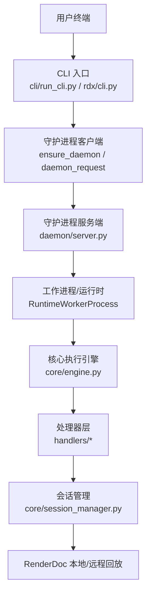
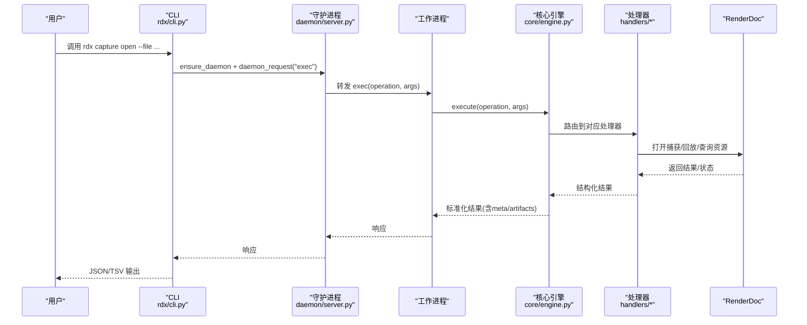
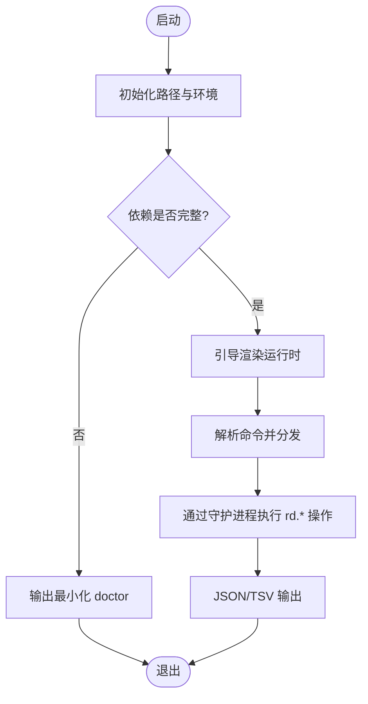
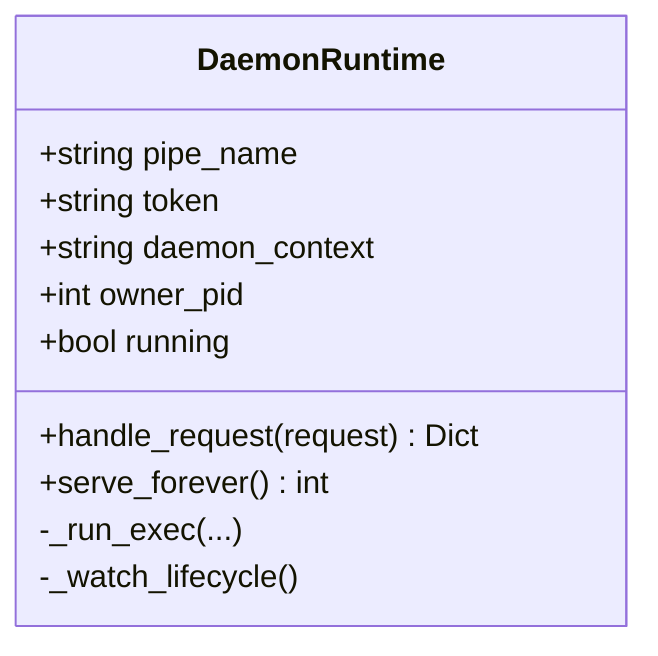
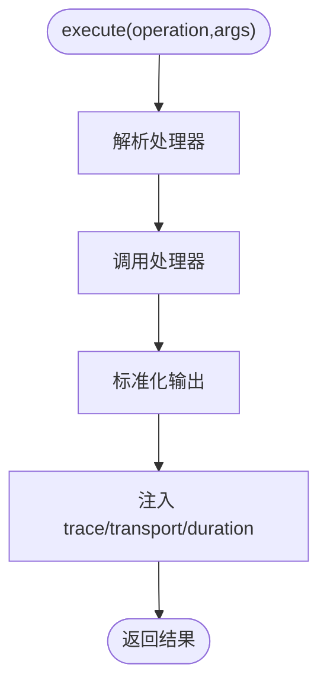
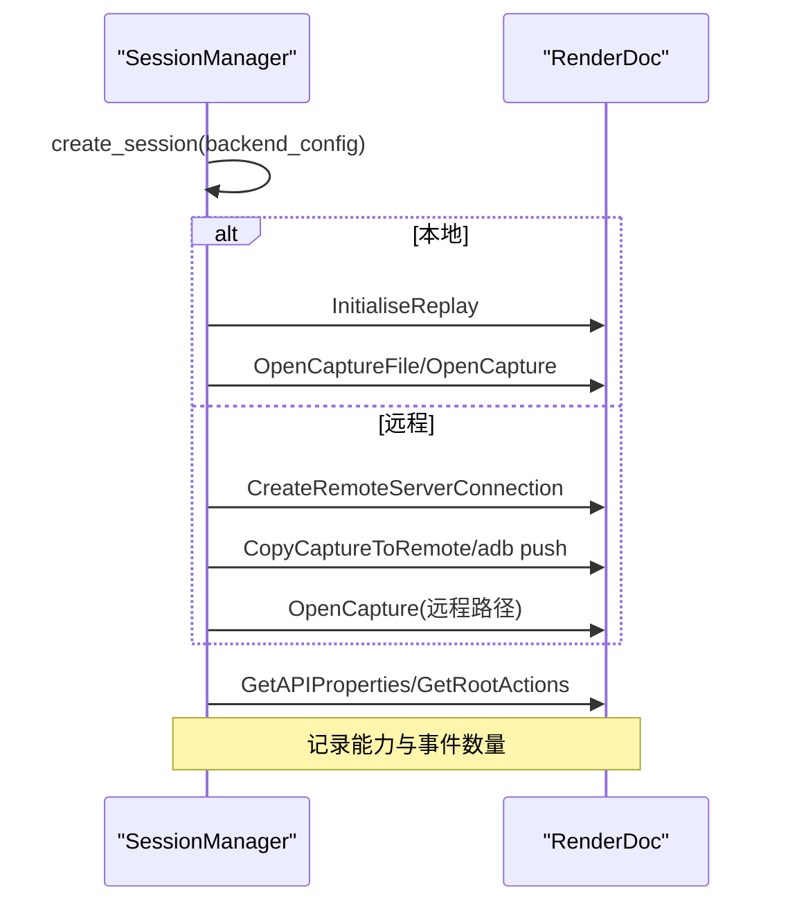
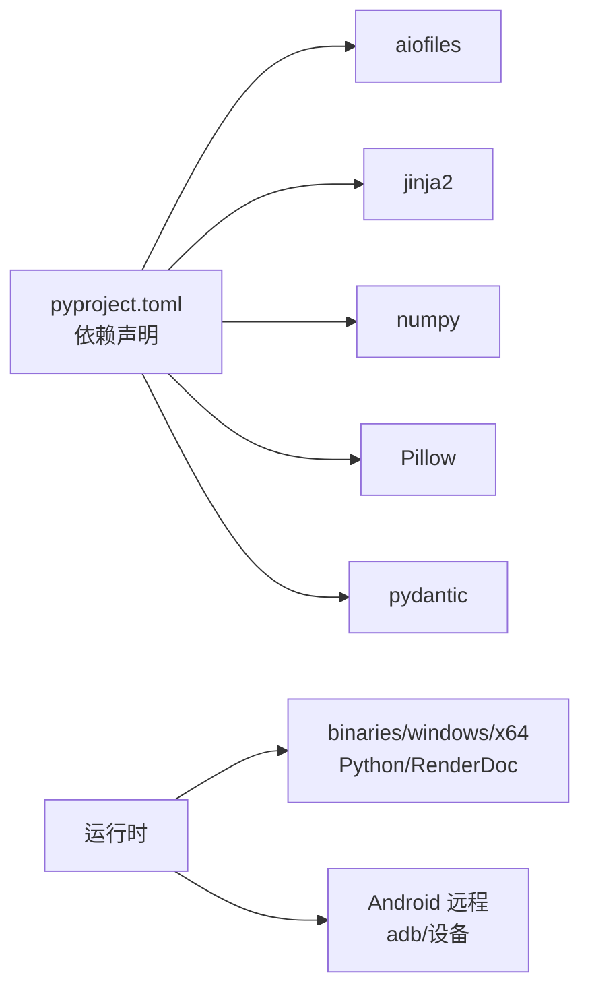

# 项目概述

<cite>
**本文引用的文件**
- [README.md](file://README.md)
- [pyproject.toml](file://pyproject.toml)
- [THIRD_PARTY_NOTICES.md](file://THIRD_PARTY_NOTICES.md)
- [cli/run_cli.py](file://cli/run_cli.py)
- [rdx/cli.py](file://rdx/cli.py)
- [rdx/core/engine.py](file://rdx/core/engine.py)
- [rdx/daemon/server.py](file://rdx/daemon/server.py)
- [rdx/core/session_manager.py](file://rdx/core/session_manager.py)
- [rdx/handlers/capture.py](file://rdx/handlers/capture.py)
- [rdx/handlers/resource.py](file://rdx/handlers/resource.py)
- [docs/install.md](file://docs/install.md)
- [docs/quickstart.md](file://docs/quickstart.md)
</cite>

## 目录
1. [简介](#简介)
2. [项目结构](#项目结构)
3. [核心组件](#核心组件)
4. [架构总览](#架构总览)
5. [详细组件分析](#详细组件分析)
6. [依赖关系分析](#依赖关系分析)
7. [性能与稳定性考量](#性能与稳定性考量)
8. [故障排查指南](#故障排查指南)
9. [结论](#结论)
10. [附录：快速开始与常用命令](#附录快速开始与常用命令)

## 简介
RDC-Tool（包名 rdx-tools）是一个面向 RenderDoc .rdc 捕获文件的命令行工具集，支持 Windows x64 本地回放与 Android 远程回放。它通过 JSON 优先的 rd.* 操作暴露能力，提供 GPU 调试、分析、会话管理、资源查询、事件浏览、管线状态对比、截图导出等能力。CLI 入口为 rdx，内部通过守护进程（daemon）与工作进程协同，统一调度渲染后端（RenderDoc），并对外输出结构化结果（JSON/TSV）。

- 目标平台：Windows x64（本地），Android（远程回放）
- 协议风格：JSON-first，TSV 用于列表类投影
- 许可证：Apache-2.0；测试用第三方素材遵循其上游许可，不包含在发布包中

**章节来源**
- [README.md:1-70](file://README.md#L1-L70)
- [pyproject.toml:5-19](file://pyproject.toml#L5-L19)
- [THIRD_PARTY_NOTICES.md:1-16](file://THIRD_PARTY_NOTICES.md#L1-L16)

## 项目结构
仓库采用分层组织：
- 顶层 CLI 启动器与包装脚本
- rdx 核心库：引擎、会话管理、处理器、运行时路径、配置、进度、超时策略等
- daemon 子模块：基于命名管道的守护进程与服务端处理
- handlers：按功能域划分的处理器（capture、resource、pipeline、shader 等）
- docs：安装、快速开始、工具参考、会话模型等文档
- scripts：打包、校验、冒烟脚本
- binaries：内置 Python、RenderDoc 相关二进制与清单
- tests：单元测试与集成测试

**图表来源**
- [cli/run_cli.py:226-282](file://cli/run_cli.py#L226-L282)
- [rdx/cli.py:234-264](file://rdx/cli.py#L234-L264)
- [rdx/daemon/server.py:572-643](file://rdx/daemon/server.py#L572-L643)
- [rdx/core/engine.py:30-76](file://rdx/core/engine.py#L30-L76)
- [rdx/core/session_manager.py:175-251](file://rdx/core/session_manager.py#L175-L251)

**章节来源**
- [README.md:5-27](file://README.md#L5-L27)
- [docs/quickstart.md:1-49](file://docs/quickstart.md#L1-L49)

## 核心组件
- CLI 启动器与参数解析：负责环境初始化、依赖检查、版本/诊断信息输出，并将命令路由到 rdx 主 CLI
- 守护进程（Daemon）：基于 Windows 命名管道提供进程间通信，维护上下文、会话、工作进程生命周期与心跳/租约机制
- 核心执行引擎（CoreEngine）：统一编排操作执行、异常映射、结果规范化、产物收集与元数据注入
- 会话管理器（SessionManager）：封装 RenderDoc 本地/远程回放的生命周期，包括创建会话、打开捕获、设置帧、关闭清理等
- 处理器（Handlers）：按领域拆分（capture、resource、pipeline、shader、export 等），将高层操作映射到底层服务
- 运行时与路径：管理工具根、Python 运行时、二进制、日志与工件目录

**章节来源**
- [cli/run_cli.py:16-67](file://cli/run_cli.py#L16-L67)
- [rdx/cli.py:54-118](file://rdx/cli.py#L54-L118)
- [rdx/daemon/server.py:102-165](file://rdx/daemon/server.py#L102-L165)
- [rdx/core/engine.py:21-76](file://rdx/core/engine.py#L21-L76)
- [rdx/core/session_manager.py:118-251](file://rdx/core/session_manager.py#L118-L251)

## 架构总览
系统采用“CLI -> Daemon -> Worker -> CoreEngine -> Handlers -> RenderDoc”的分层架构。CLI 仅做参数解析与结果展示；实际执行由守护进程协调工作进程完成，保证长时任务与资源隔离。核心引擎负责统一的错误与结果格式，确保上层稳定消费。

**图表来源**
- [rdx/cli.py:234-264](file://rdx/cli.py#L234-L264)
- [rdx/daemon/server.py:616-643](file://rdx/daemon/server.py#L616-L643)
- [rdx/core/engine.py:40-76](file://rdx/core/engine.py#L40-L76)
- [rdx/core/session_manager.py:208-251](file://rdx/core/session_manager.py#L208-L251)

## 详细组件分析

### CLI 启动器与主 CLI
- 启动器（cli/run_cli.py）：
  - 解析 RDX_TOOLS_ROOT、初始化 Python 路径与环境变量
  - 依赖缺失检测，必要时输出最小化 doctor 结果
  - 引导渲染运行时后，委派给 rdx.cli.main
- 主 CLI（rdx/cli.py）：
  - 提供 version、doctor、tools list/search/describe、context、session preview、capture、vfs、event、pipeline、shader、export、diff、assert、completion 等命令
  - 通过 _daemon_exec 统一调用守护进程执行 rd.* 操作
  - 支持 TSV 投影与 JSON 输出，统一错误信封

**图表来源**
- [cli/run_cli.py:16-67](file://cli/run_cli.py#L16-L67)
- [cli/run_cli.py:226-282](file://cli/run_cli.py#L226-L282)
- [rdx/cli.py:62-118](file://rdx/cli.py#L62-L118)
- [rdx/cli.py:234-264](file://rdx/cli.py#L234-L264)

**章节来源**
- [cli/run_cli.py:16-67](file://cli/run_cli.py#L16-L67)
- [cli/run_cli.py:226-282](file://cli/run_cli.py#L226-L282)
- [rdx/cli.py:62-118](file://rdx/cli.py#L62-L118)
- [rdx/cli.py:234-264](file://rdx/cli.py#L234-L264)

### 守护进程（Daemon）
- 使用 Windows 命名管道作为 IPC 通道
- 维护上下文、会话、工作进程状态，支持多上下文隔离
- 心跳与租约机制，自动清理空闲或失联客户端
- 统一 exec 路由，转发至工作进程执行具体操作

**图表来源**
- [rdx/daemon/server.py:102-165](file://rdx/daemon/server.py#L102-L165)
- [rdx/daemon/server.py:572-643](file://rdx/daemon/server.py#L572-L643)
- [rdx/daemon/server.py:657-690](file://rdx/daemon/server.py#L657-L690)

**章节来源**
- [rdx/daemon/server.py:102-165](file://rdx/daemon/server.py#L102-L165)
- [rdx/daemon/server.py:572-643](file://rdx/daemon/server.py#L572-L643)
- [rdx/daemon/server.py:657-690](file://rdx/daemon/server.py#L657-L690)

### 核心执行引擎（CoreEngine）
- 统一执行入口：resolve -> handler -> normalize_output
- 异常映射：将业务异常转换为标准错误信封
- 结果归一化：兼容多种返回格式，补充 meta、artifacts、projections
- 追踪与计时：trace_id、transport、duration_ms

**图表来源**
- [rdx/core/engine.py:40-76](file://rdx/core/engine.py#L40-L76)
- [rdx/core/engine.py:77-204](file://rdx/core/engine.py#L77-L204)

**章节来源**
- [rdx/core/engine.py:21-76](file://rdx/core/engine.py#L21-L76)
- [rdx/core/engine.py:77-204](file://rdx/core/engine.py#L77-L204)

### 会话管理器（SessionManager）
- 会话创建：区分本地与远程后端，初始化渲染子系统或建立远程连接
- 打开捕获：本地 OpenCaptureFile/OpenCapture；远程 CopyCaptureToRemote/adb_android 拷贝并 OpenCapture
- 能力探测：API 类型、着色器调试、补丁能力、计数器支持
- 清理：输出、控制器、捕获文件、远程连接的有序释放

**图表来源**
- [rdx/core/session_manager.py:175-251](file://rdx/core/session_manager.py#L175-L251)
- [rdx/core/session_manager.py:301-383](file://rdx/core/session_manager.py#L301-L383)
- [rdx/core/session_manager.py:384-441](file://rdx/core/session_manager.py#L384-L441)
- [rdx/core/session_manager.py:442-508](file://rdx/core/session_manager.py#L442-L508)

**章节来源**
- [rdx/core/session_manager.py:118-251](file://rdx/core/session_manager.py#L118-L251)
- [rdx/core/session_manager.py:301-508](file://rdx/core/session_manager.py#L301-L508)

### 处理器（Handlers）
- 以模块为单位组织，如 capture、resource、pipeline、shader、export 等
- 每个处理器实现 handle(action, args, env)，委托给 server_runtime 进行具体调度
- 与核心引擎配合，形成稳定的操作契约

**章节来源**
- [rdx/handlers/capture.py:1-11](file://rdx/handlers/capture.py#L1-L11)
- [rdx/handlers/resource.py:1-11](file://rdx/handlers/resource.py#L1-L11)

## 依赖关系分析
- 构建与运行：
  - Python >= 3.11
  - 依赖：aiofiles、jinja2、numpy、Pillow、pydantic
  - 入口脚本：rdx = rdx.cli:main
- 外部运行时：
  - 内置 Python 与 RenderDoc 二进制（windows\x64）
  - Android 远程回放需要 adb 与设备可达性
- 第三方许可：
  - 项目整体 Apache-2.0
  - 测试用 .rdc 样本来自 rdc-cli，MIT 许可，不随发布包分发

**图表来源**
- [pyproject.toml:5-19](file://pyproject.toml#L5-L19)
- [THIRD_PARTY_NOTICES.md:1-16](file://THIRD_PARTY_NOTICES.md#L1-L16)

**章节来源**
- [pyproject.toml:5-19](file://pyproject.toml#L5-L19)
- [THIRD_PARTY_NOTICES.md:1-16](file://THIRD_PARTY_NOTICES.md#L1-L16)

## 性能与稳定性考量
- 异步与线程：
  - 核心引擎与守护进程使用异步与多线程，避免阻塞 UI/CLI
  - 长时间任务通过守护进程与工作进程隔离，提升稳定性
- 超时与租约：
  - 守护进程对客户端心跳与租约进行管理，空闲超时自动回收
  - 操作级超时策略可配置，避免卡死
- 资源清理：
  - 会话管理器在关闭时有序释放输出、控制器、捕获文件与远程连接
- 产物与日志：
  - 核心引擎自动收集产物候选，便于后续归档与分析
  - 日志与工件目录分离，便于定位问题

[本节为通用指导，不直接分析具体文件]

## 故障排查指南
- 环境不完整：
  - 使用 rdx --json doctor 检查依赖、Python 布局、RenderDoc 文件完整性、SPIR-V 工具可用性
- 守护进程异常：
  - 通过 rdx daemon status 查看运行状态与活跃请求数
  - 若出现未响应，尝试 rdx daemon stop/start 重置
- 捕获打开失败：
  - 确认 .rdc 有效且受当前 RenderDoc 版本支持
  - 远程模式需确认远端可达、端口正确、复制成功
- 预览不可用：
  - 使用 session preview on/status/off 控制，并在 context status 中检查 preview.display
- 常见错误分类：
  - renderdoc_error、remote_replay_runtime、rdc_invalid_or_unsupported 等，结合 details 中的 fix_hint 修复

**章节来源**
- [rdx/cli.py:410-533](file://rdx/cli.py#L410-L533)
- [rdx/daemon/server.py:532-570](file://rdx/daemon/server.py#L532-L570)
- [rdx/core/session_manager.py:347-441](file://rdx/core/session_manager.py#L347-L441)

## 结论
RDC-Tool 通过清晰的 CLI/Daemon/CoreEngine/Handlers 分层，提供了稳定、可扩展的 RenderDoc .rdc 处理能力。它既适合本地快速调试，也支持 Android 远程回放场景。借助 JSON 优先的协议与结构化错误，便于自动化与集成。建议在生产环境中结合 doctor 自检、守护进程监控与完善的日志/工件管理，以获得最佳体验。

[本节为总结，不直接分析具体文件]

## 附录：快速开始与常用命令
- 安装与升级：
  - 解压自包含包后，使用安装脚本安装或升级，并可加入 PATH
- 基础命令示例：
  - rdx --version / rdx version --json
  - rdx --json doctor
  - rdx tools search pipeline --json
  - rdx context status --json
  - rdx capture open --file "C:\path\sample.rdc" --frame-index 0
  - rdx vfs ls --path / --format tsv
  - rdx event list --format tsv
  - rdx pipeline show --event-id 42 --format json
  - rdx resource list --format tsv
  - rdx completion powershell
- 预览控制：
  - rdx session preview on/status/off
  - 在 context status 中检查 preview.display

**章节来源**
- [docs/install.md:1-31](file://docs/install.md#L1-L31)
- [docs/quickstart.md:1-49](file://docs/quickstart.md#L1-L49)
- [README.md:5-27](file://README.md#L5-L27)