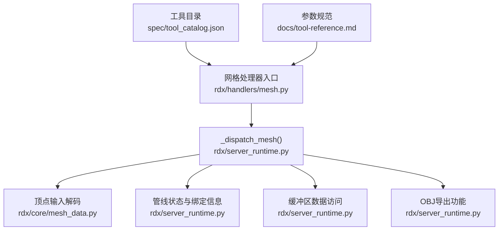
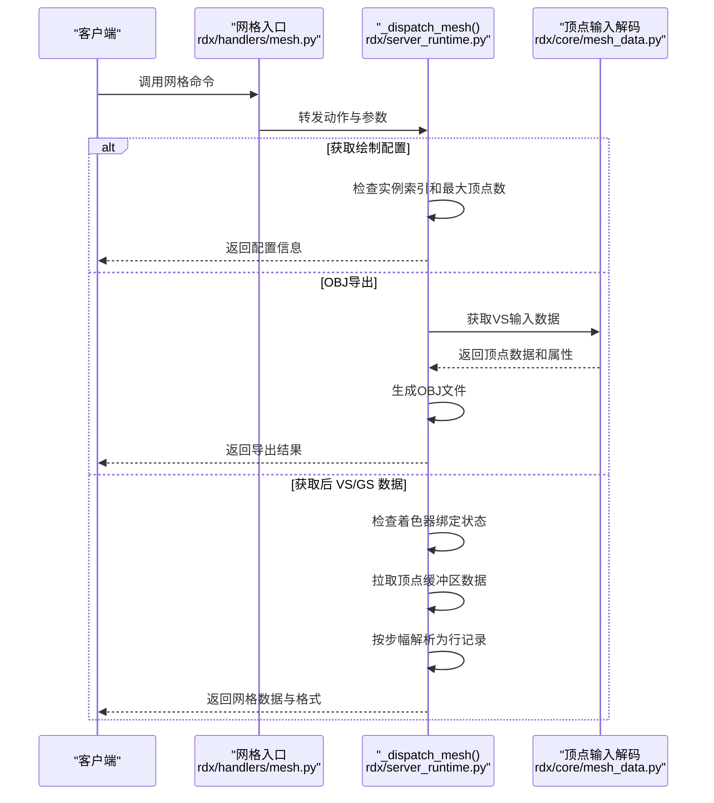
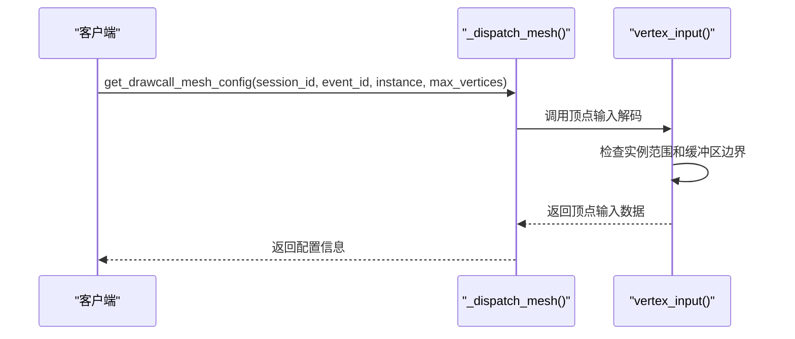
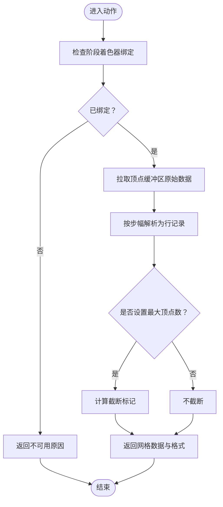
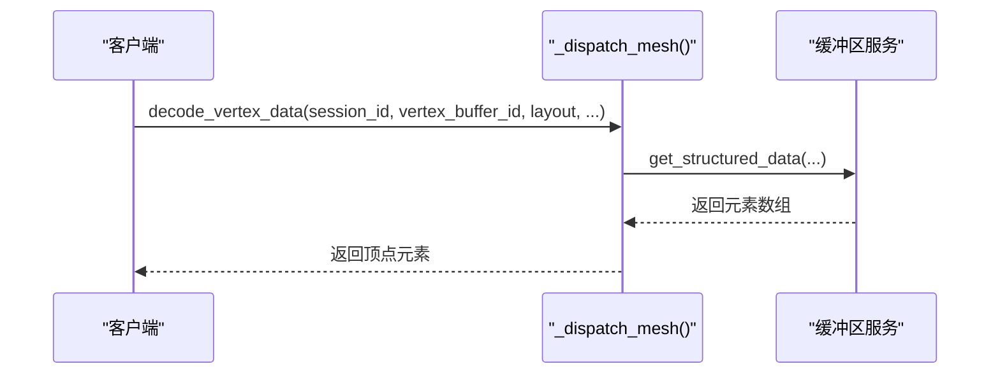
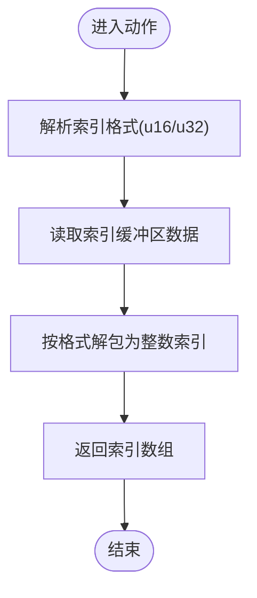
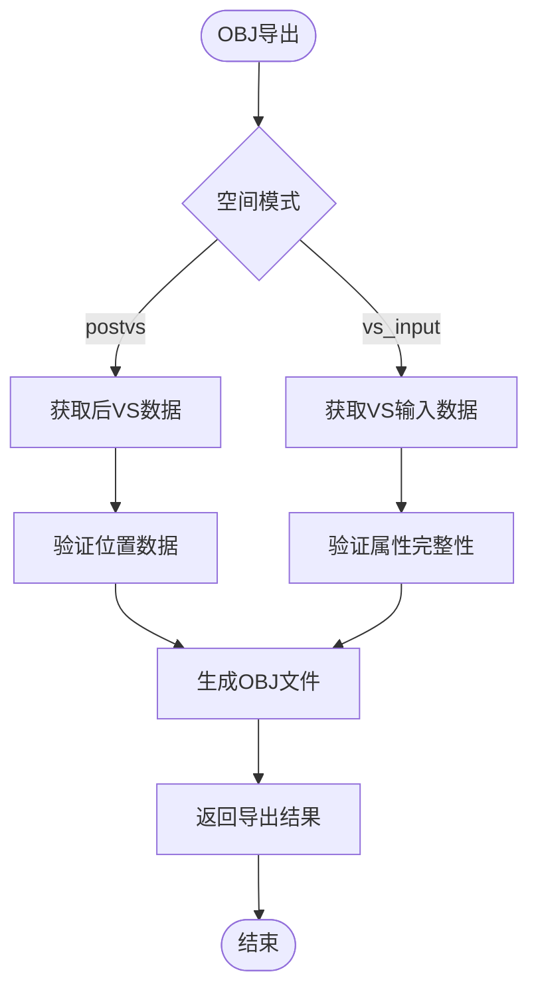
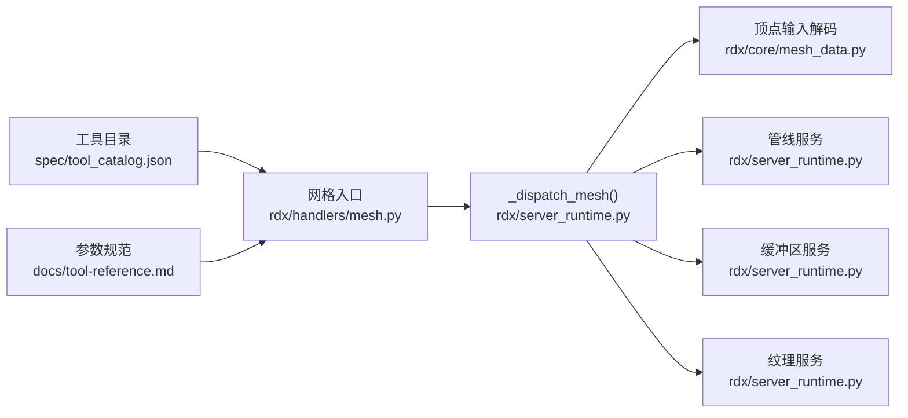

# 网格处理器

<cite>
**本文引用的文件**
- [rdx/handlers/mesh.py](file://rdx/handlers/mesh.py)
- [rdx/server_runtime.py](file://rdx/server_runtime.py)
- [rdx/core/mesh_data.py](file://rdx/core/mesh_data.py)
- [spec/tool_catalog.json](file://spec/tool_catalog.json)
- [docs/tool-reference.md](file://docs/tool-reference.md)
- [tests/test_mesh_data.py](file://tests/test_mesh_data.py)
</cite>

## 更新摘要
**所做更改**
- 更新了顶点输入解码功能，支持从原生绑定进行有界顶点输入解码
- 新增了明确的VS输入空间导出功能，支持position/normal/UV属性
- 添加了Wavefront OBJ格式生成功能
- 更新了get_drawcall_mesh_config的实例和最大顶点数参数
- 增强了网格数据处理的边界检查和错误处理

## 目录
1. [简介](#简介)
2. [项目结构](#项目结构)
3. [核心组件](#核心组件)
4. [架构总览](#架构总览)
5. [详细组件分析](#详细组件分析)
6. [依赖分析](#依赖分析)
7. [性能考虑](#性能考虑)
8. [故障排查指南](#故障排查指南)
9. [结论](#结论)
10. [附录](#附录)

## 简介
本文件系统性梳理网格处理器在工具链中的职责与实现，覆盖以下主题：
- **增强的网格数据处理**：支持从原生绑定的有界顶点输入解码，提供精确的缓冲区边界检查
- **明确的VS输入空间导出**：支持位置、法线和UV属性的显式导出，保持原始坐标空间
- **Wavefront OBJ格式生成**：支持多种拓扑类型的OBJ文件导出，包括三角形列表/条带、线列表和点列表
- **改进的绘制配置获取**：新增实例索引和最大顶点数参数，提供更精细的控制
- **拓扑结构与资源绑定**：从管线快照中抽取拓扑类型、顶点输入布局与绑定信息
- **数据处理流程**：从捕获事件中提取后顶点着色器/几何着色器阶段的顶点数据，按步幅解析为行记录，并支持截断控制
- **工具接口**：通过统一的调度入口暴露一组 mesh 相关命令，便于外部调用与集成

## 项目结构
网格处理器位于运行时服务层，对外通过 handler 将请求转发到运行时分发函数，再由运行时根据动作名执行具体逻辑。关键文件如下：
- rdx/handlers/mesh.py：网格相关命令的入口分发，直接委托给运行时分发函数。
- rdx/server_runtime.py：网格处理的核心实现，包含多种 mesh 动作（如获取绘制配置、获取后 VS/GS 数据、解码顶点/索引数据、生成网格预览等）。
- rdx/core/mesh_data.py：顶点输入解码的核心逻辑，支持有界缓冲读取和格式解析。
- spec/tool_catalog.json 与 docs/tool-reference.md：工具目录与参数规范，用于描述可用的 mesh 命令及其参数。
- tests/test_mesh_data.py：网格数据处理的测试用例，验证各种场景的正确性。

**图表来源**
- [rdx/handlers/mesh.py:8-9](file://rdx/handlers/mesh.py#L8-L9)
- [rdx/server_runtime.py:8376-8478](file://rdx/server_runtime.py#L8376-L8478)
- [rdx/core/mesh_data.py:46-119](file://rdx/core/mesh_data.py#L46-L119)

**章节来源**
- [rdx/handlers/mesh.py:8-9](file://rdx/handlers/mesh.py#L8-L9)
- [rdx/server_runtime.py:8376-8478](file://rdx/server_runtime.py#L8376-L8478)
- [rdx/core/mesh_data.py:46-119](file://rdx/core/mesh_data.py#L46-L119)
- [spec/tool_catalog.json](file://spec/tool_catalog.json)
- [docs/tool-reference.md](file://docs/tool-reference.md)

## 核心组件
- 网格处理器入口：负责接收动作名与参数，统一转交给运行时分发函数。
- 运行时分发函数：根据动作名执行不同网格处理逻辑，包括：
  - 获取绘制配置：返回拓扑与绑定列表，支持实例索引和最大顶点数限制。
  - 获取后 VS/GS 数据：拉取顶点缓冲区并按步幅解析为行记录。
  - 解码顶点数据：基于布局定义从结构化缓冲区读取元素。
  - 解码索引数据：按 u16/u32 格式解析索引缓冲区。
  - 生成网格预览：将网格渲染结果作为纹理输出。
  - **新增**：Wavefront OBJ导出：支持VS输入空间和后VS数据的OBJ格式导出。
- 顶点输入解码器：从原生绑定进行有界顶点输入解码，提供精确的缓冲区边界检查。
- 工具目录与文档：提供命令名称、参数签名与默认值等元信息，便于自动化与脚本集成。

**章节来源**
- [rdx/handlers/mesh.py:8-9](file://rdx/handlers/mesh.py#L8-L9)
- [rdx/server_runtime.py:8376-8478](file://rdx/server_runtime.py#L8376-L8478)
- [rdx/core/mesh_data.py:46-119](file://rdx/core/mesh_data.py#L46-L119)
- [spec/tool_catalog.json](file://spec/tool_catalog.json)
- [docs/tool-reference.md](file://docs/tool-reference.md)

## 架构总览
网格处理的端到端流程如下：
- 客户端调用网格命令（如获取后 VS 数据、解码顶点数据、导出OBJ等）。
- 入口 handler 将请求转发至运行时分发函数。
- 分发函数根据动作名选择对应处理分支：
  - 若为"获取后 VS/GS 数据"，则先检查是否已绑定相应阶段的着色器；若未绑定，则返回不可用原因；否则拉取顶点缓冲区数据并按步幅解析。
  - 若为"解码顶点数据"，则委托缓冲区模块按布局定义读取结构化数据。
  - 若为"解码索引数据"，则按指定格式（u16/u32）解析索引缓冲区。
  - 若为"获取绘制配置"，则从管线快照中抽取拓扑与绑定信息，支持实例索引和最大顶点数限制。
  - 若为"网格预览"，则生成预览纹理并返回。
  - **新增**：若为"OBJ导出"，则根据空间类型（postvs或vs_input）生成相应的OBJ文件。
- 所有分支最终以统一的响应格式返回结果，包含成功标志、数据与可选的错误详情。

**图表来源**
- [rdx/handlers/mesh.py:8-9](file://rdx/handlers/mesh.py#L8-L9)
- [rdx/server_runtime.py:8376-8478](file://rdx/server_runtime.py#L8376-L8478)
- [rdx/core/mesh_data.py:46-119](file://rdx/core/mesh_data.py#L46-L119)

## 详细组件分析

### 组件一：绘制配置获取（get_drawcall_mesh_config）
- 功能：从管线快照中获取当前绘制事件的拓扑类型与顶点输入绑定列表，支持实例索引和最大顶点数限制。
- **更新**：新增 instance 和 max_vertices 参数，允许更精细地控制顶点输入解码的范围。
- 关键点：
  - 需要会话 ID；可选事件 ID、实例索引与最大顶点数。
  - 返回拓扑字符串、绑定项列表和顶点输入信息。
  - 顶点输入包含 source=vs_input、vertex_rows、attributes（position/normal/uv状态）、layout、index_binding、truncated。
- 复杂度：O(B + V)，B 为绑定数量，V 为顶点数量。

**图表来源**
- [rdx/server_runtime.py:8377-8388](file://rdx/server_runtime.py#L8377-L8388)
- [rdx/core/mesh_data.py:46-119](file://rdx/core/mesh_data.py#L46-L119)

**章节来源**
- [rdx/server_runtime.py:8377-8388](file://rdx/server_runtime.py#L8377-L8388)
- [rdx/core/mesh_data.py:46-119](file://rdx/core/mesh_data.py#L46-L119)
- [spec/tool_catalog.json:2673-2724](file://spec/tool_catalog.json#L2673-L2724)

### 组件二：后处理网格数据获取（get_post_transform_data）
- 功能：获取经过顶点/几何着色器阶段后的顶点数据，按步幅解析为行记录，并支持最大顶点数限制。
- 关键点：
  - 需要会话 ID；可选事件 ID、实例索引、视图索引与最大顶点数。
  - 若目标阶段未绑定着色器或资源为空，则返回不可用原因。
  - 成功时返回网格格式信息、行记录、顶点计数与截断标记。
- 处理流程：
  - 检查着色器绑定状态。
  - 拉取顶点缓冲区原始字节。
  - 按步幅切片并生成行记录。
  - 计算截断标记（当显式限制最大顶点数时）。

**图表来源**
- [rdx/server_runtime.py:8389-8478](file://rdx/server_runtime.py#L8389-L8478)

**章节来源**
- [rdx/server_runtime.py:8389-8478](file://rdx/server_runtime.py#L8389-L8478)

### 组件三：顶点数据解码（decode_vertex_data）
- 功能：基于布局定义从顶点缓冲区读取结构化元素，返回顶点字段的结构化数组。
- 关键点：
  - 需要会话 ID、顶点缓冲区 ID 与布局定义（含步幅与属性列表）。
  - 支持偏移、顶点数量与最大元素数控制。
  - 成功时返回元素数组；失败时透传底层错误。
- 复杂度：O(N)，N 为读取的元素数量。

**图表来源**
- [rdx/server_runtime.py:8357-8373](file://rdx/server_runtime.py#L8357-L8373)

**章节来源**
- [rdx/server_runtime.py:8357-8373](file://rdx/server_runtime.py#L8357-L8373)

### 组件四：索引数据解码（decode_index_data）
- 功能：从索引缓冲区读取索引数据，支持 u16 与 u32 两种格式。
- 关键点：
  - 需要会话 ID 与索引缓冲区 ID；可选格式（默认 u32）、索引数量、偏移与最大读取长度。
  - 成功时返回索引整数数组；失败时返回底层错误。
- 复杂度：O(K)，K 为索引数量。

**图表来源**
- [rdx/server_runtime.py:8374-8401](file://rdx/server_runtime.py#L8374-L8401)

**章节来源**
- [rdx/server_runtime.py:8374-8401](file://rdx/server_runtime.py#L8374-L8401)

### 组件五：网格预览（get_mesh_preview）
- 功能：生成网格的可视化预览纹理，便于调试与展示。
- 关键点：
  - 需要会话 ID 与事件 ID。
  - 内部可能涉及管线状态、渲染目标与着色器组合的协调。
- 输出：预览纹理资源或相关标识。

**章节来源**
- [rdx/server_runtime.py:8402-8401](file://rdx/server_runtime.py#L8402-L8401)

### 组件六：Wavefront OBJ导出（_export_mesh_file）
- **新增功能**：支持从VS输入空间或后VS数据导出Wavefront OBJ格式。
- 功能：将网格数据导出为标准的OBJ文件格式，支持多种拓扑类型。
- 关键点：
  - 支持两种空间模式：postvs（仅位置）和vs_input（位置/法线/UV）。
  - 支持多种拓扑：TriangleList、TriangleStrip、LineList、PointList。
  - 对VS输入模式要求float语义的position/normal/uv属性。
  - 提供详细的错误处理和边界检查。
- 输出：OBJ文件路径和导出统计信息。

**图表来源**
- [rdx/server_runtime.py:8101-8172](file://rdx/server_runtime.py#L8101-L8172)

**章节来源**
- [rdx/server_runtime.py:8101-8172](file://rdx/server_runtime.py#L8101-L8172)
- [rdx/core/mesh_data.py:121-148](file://rdx/core/mesh_data.py#L121-L148)

## 依赖分析
- 入口依赖：网格入口仅依赖运行时分发函数，耦合度低，便于扩展新动作。
- 运行时依赖：分发函数依赖管线服务（获取拓扑与绑定）、缓冲区服务（读取原始数据与结构化数据）、纹理服务（生成预览）和顶点输入解码器。
- **新增依赖**：顶点输入解码器提供有界的缓冲区读取和格式解析功能。
- 工具目录与文档：提供命令与参数的权威说明，确保调用一致性与可维护性。

**图表来源**
- [rdx/handlers/mesh.py:8-9](file://rdx/handlers/mesh.py#L8-L9)
- [rdx/server_runtime.py:8376-8478](file://rdx/server_runtime.py#L8376-L8478)
- [rdx/core/mesh_data.py:46-119](file://rdx/core/mesh_data.py#L46-L119)
- [spec/tool_catalog.json](file://spec/tool_catalog.json)
- [docs/tool-reference.md](file://docs/tool-reference.md)

**章节来源**
- [rdx/handlers/mesh.py:8-9](file://rdx/handlers/mesh.py#L8-L9)
- [rdx/server_runtime.py:8376-8478](file://rdx/server_runtime.py#L8376-L8478)
- [rdx/core/mesh_data.py:46-119](file://rdx/core/mesh_data.py#L46-L119)
- [spec/tool_catalog.json](file://spec/tool_catalog.json)
- [docs/tool-reference.md](file://docs/tool-reference.md)

## 性能考虑
- 步幅解析与截断：按步幅解析顶点数据时，建议合理设置最大顶点数以避免过大数据集带来的内存与传输压力。
- 格式选择：索引数据解码时优先使用合适的数据类型（u16/u32），减少带宽与内存占用。
- 结构化读取：顶点数据解码采用布局驱动，避免逐字段硬编码带来的重复工作量与错误风险。
- 预览生成：网格预览可能涉及额外的渲染开销，建议在调试场景中按需启用。
- **新增**：有界读取优化：顶点输入解码使用有界缓冲区读取，避免不必要的完整数据复制。
- **新增**：OBJ导出优化：根据拓扑类型选择合适的导出策略，减少文件体积。

## 故障排查指南
- 后 VS/GS 数据不可用：
  - 检查目标阶段是否已绑定着色器；若未绑定，将返回明确的不可用原因。
  - 确认事件 ID 与实例/视图索引正确。
- 顶点/索引数据为空：
  - 检查缓冲区 ID 是否有效且非空资源。
  - 确认偏移与大小参数是否越界。
- 结构化解码失败：
  - 检查布局定义是否与实际缓冲区一致（步幅、属性偏移与格式）。
  - 确认读取范围内的数据完整性。
- 预览生成异常：
  - 检查渲染目标与着色器状态是否满足预览需求。
- **新增**：顶点输入解码失败：
  - 检查实例索引是否在有效范围内。
  - 确认缓冲区边界和属性偏移是否正确。
  - 验证顶点格式是否受支持（Regular类型，宽度1/2/4/8字节）。
- **新增**：OBJ导出失败：
  - 对于VS输入模式，确认position/normal/uv属性存在且为float类型。
  - 检查拓扑类型是否受支持。
  - 确认没有截断的顶点数据。

**章节来源**
- [rdx/server_runtime.py:8389-8478](file://rdx/server_runtime.py#L8389-L8478)
- [rdx/core/mesh_data.py:46-119](file://rdx/core/mesh_data.py#L46-L119)
- [rdx/server_runtime.py:8101-8172](file://rdx/server_runtime.py#L8101-L8172)
- [tests/test_mesh_data.py:31-78](file://tests/test_mesh_data.py#L31-L78)

## 结论
网格处理器通过统一的入口与分发机制，实现了对后处理网格数据、顶点/索引解码以及网格预览的完整支持。**最新更新**包括增强的顶点输入解码功能、明确的VS输入空间导出和Wavefront OBJ格式生成。其设计具备良好的可扩展性与可维护性，能够满足从调试到分析的多样化需求。建议在实际使用中结合工具目录与参数规范，确保命令调用的一致性与稳定性。

## 附录

### 常用命令与参数速览
- 获取绘制配置：get_drawcall_mesh_config
  - 参数：session_id, [event_id], [instance], [max_vertices]
  - 返回：拓扑与绑定列表，包含顶点输入信息
- 获取后 VS 数据：get_post_transform_data
  - 参数：session_id, [event_id], [instance], [view_index], [max_vertices], stage
  - 返回：网格格式、行记录、顶点计数与截断标记
- 获取后 GS 数据：get_post_gs_data
  - 参数：session_id, [event_id], [instance], [view_index], [max_vertices], stage
  - 返回：网格格式、行记录、顶点计数与截断标记
- 解码顶点数据：decode_vertex_data
  - 参数：session_id, vertex_buffer_id, layout, [vertex_offset], [vertex_count], [base_vertex]
  - 返回：顶点元素数组
- 解码索引数据：decode_index_data
  - 参数：session_id, index_buffer_id, [format], [index_count], [index_offset]
  - 返回：索引数组
- 网格预览：get_mesh_preview
  - 参数：session_id, event_id
  - 返回：预览纹理
- **新增**：OBJ导出：export_mesh
  - 参数：session_id, output_path, [event_id], format=obj, space=postvs|vs_input, include_attributes=false|true
  - 返回：保存的文件路径、导出格式、空间类型、属性信息和统计信息

**章节来源**
- [spec/tool_catalog.json](file://spec/tool_catalog.json)
- [docs/tool-reference.md](file://docs/tool-reference.md)
- [rdx/server_runtime.py:8101-8172](file://rdx/server_runtime.py#L8101-L8172)
- [rdx/core/mesh_data.py:121-148](file://rdx/core/mesh_data.py#L121-L148)

### 新增功能详细说明

#### 有界顶点输入解码
- **功能**：从原生绑定进行有界的顶点输入解码，提供精确的缓冲区边界检查。
- **特点**：
  - 支持实例索引和每实例属性。
  - 提供严格的缓冲区边界验证。
  - 支持多种顶点格式（Float、UInt、SInt、UNorm、SNorm）。
  - 自动识别POSITION、NORMAL、TEXCOORD语义。
- **错误处理**：区分MeshReadError（读取失败）和ValueError（格式不支持）。

#### Wavefront OBJ导出
- **功能**：将网格数据导出为标准的Wavefront OBJ格式。
- **支持的模式**：
  - postvs：仅导出位置数据，适用于后顶点着色器数据。
  - vs_input：导出位置、法线和UV，需要VS输入空间的float语义属性。
- **支持的拓扑**：TriangleList、TriangleStrip、LineList、PointList。
- **输出格式**：标准OBJ文件，包含v（顶点）、vt（纹理坐标）、vn（法线）和f（面）语句。

**章节来源**
- [rdx/core/mesh_data.py:14-35](file://rdx/core/mesh_data.py#L14-L35)
- [rdx/core/mesh_data.py:121-148](file://rdx/core/mesh_data.py#L121-L148)
- [rdx/server_runtime.py:8101-8172](file://rdx/server_runtime.py#L8101-L8172)
- [tests/test_mesh_data.py:31-78](file://tests/test_mesh_data.py#L31-L78)