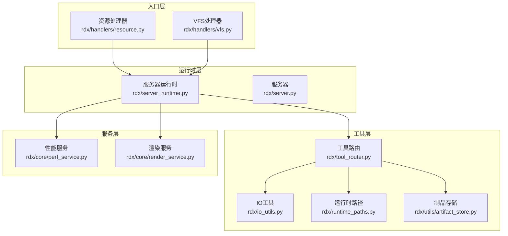
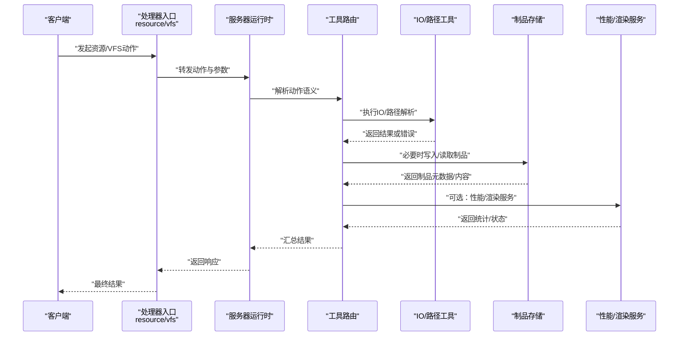
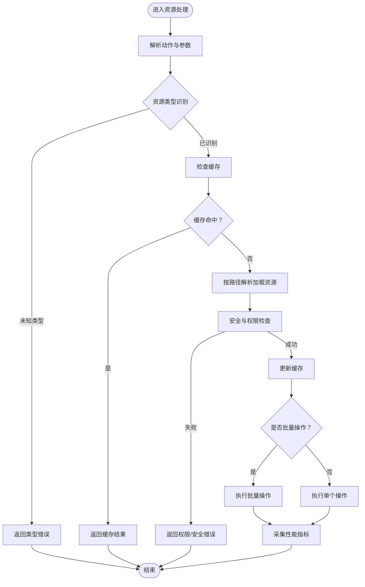
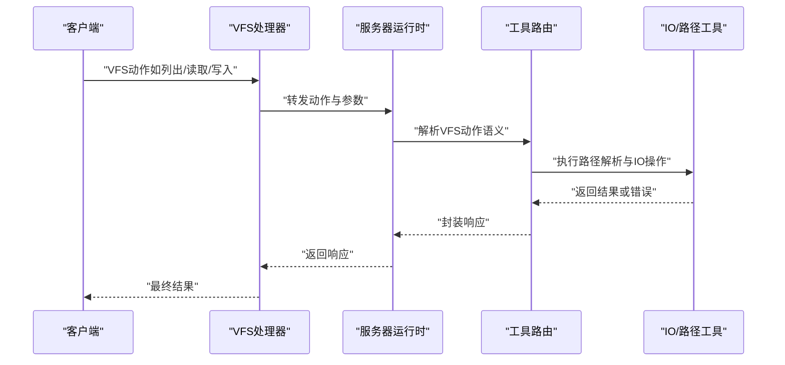
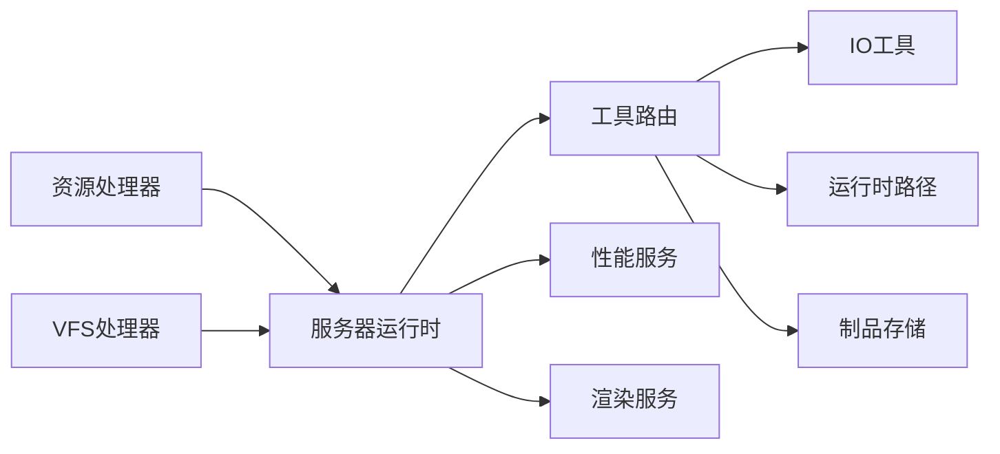

# 资源处理器

<cite>
**本文引用的文件**
- [rdx/handlers/resource.py](file://rdx/handlers/resource.py)
- [rdx/handlers/vfs.py](file://rdx/handlers/vfs.py)
- [rdx/server_runtime.py](file://rdx/server_runtime.py)
- [rdx/operation_definitions.py](file://rdx/operation_definitions.py)
- [rdx/cli.py](file://rdx/cli.py)
- [tests/test_cli_vfs.py](file://tests/test_cli_vfs.py)
</cite>

## 更新摘要
**变更内容**
- 简化了资源查询操作：移除了多个独立的资源查询接口，统一收敛到 `rd.resource.list_all` 和相关基础操作
- 更新了资源处理器架构说明，反映统一的资源列表获取机制
- 修正了VFS集成部分，强调通过 `rd.resource.list_all` 进行资源枚举
- 更新了CLI命令映射，显示资源列表操作的统一入口

## 目录
1. [简介](#简介)
2. [项目结构](#项目结构)
3. [核心组件](#核心组件)
4. [架构总览](#架构总览)
5. [详细组件分析](#详细组件分析)
6. [依赖关系分析](#依赖关系分析)
7. [性能考虑](#性能考虑)
8. [故障排查指南](#故障排查指南)
9. [结论](#结论)
10. [附录](#附录)

## 简介
本文件系统化梳理资源处理器的设计与实现，覆盖资源类型识别、资源加载、资源缓存、VFS（虚拟文件系统）集成与路径解析、资源查询与批量操作、权限控制与安全检查、以及资源优化与性能监控策略。目标是帮助开发者与使用者快速理解并正确使用资源处理能力。

**更新** 本次更新重点反映了资源操作的简化：移除了多个独立的资源查询操作，统一到 `resource.list_all` 和相关基础操作，提供更简洁一致的资源访问接口。

## 项目结构
资源处理能力由"处理器入口 + 运行时分发 + VFS适配 + 工具路由 + 辅助工具"构成，形成清晰的分层与职责边界：
- 处理器入口：资源与VFS两类处理器负责接收外部调用并转交运行时
- 运行时分发：统一调度资源动作与VFS动作
- VFS适配：抽象虚拟文件系统接口，支持多后端路径解析与访问
- 工具路由：将资源请求映射到具体工具或服务
- 辅助工具：IO工具、路径工具、制品存储、性能与渲染服务等

**图表来源**
- [rdx/handlers/resource.py:8-10](file://rdx/handlers/resource.py#L8-L10)
- [rdx/handlers/vfs.py:8-10](file://rdx/handlers/vfs.py#L8-L10)
- [rdx/server_runtime.py](file://rdx/server_runtime.py)

**章节来源**
- [rdx/handlers/resource.py:8-10](file://rdx/handlers/resource.py#L8-L10)
- [rdx/handlers/vfs.py:8-10](file://rdx/handlers/vfs.py#L8-L10)
- [rdx/server_runtime.py](file://rdx/server_runtime.py)

## 核心组件
- 资源处理器：接收资源类动作请求，委托给运行时执行
- VFS处理器：接收VFS类动作请求，委托给运行时执行
- 服务器运行时：集中分发资源与VFS动作，协调工具路由与服务
- 工具路由：根据动作与参数选择合适的工具或服务执行
- IO与路径工具：提供底层IO与路径解析能力
- 制品存储：资源持久化与版本化管理
- 性能与渲染服务：资源相关性能指标采集与渲染管线对接

**更新** 资源查询现在统一通过 `rd.resource.list_all` 操作进行，支持按类型过滤和分页获取，简化了之前的多个独立查询接口。

**章节来源**
- [rdx/handlers/resource.py:8-10](file://rdx/handlers/resource.py#L8-L10)
- [rdx/handlers/vfs.py:8-10](file://rdx/handlers/vfs.py#L8-L10)
- [rdx/server_runtime.py](file://rdx/server_runtime.py)
- [rdx/operation_definitions.py:2452-2483](file://rdx/operation_definitions.py#L2452-L2483)

## 架构总览
资源处理的整体流程如下：
- 入口处理器将动作与参数传递给服务器运行时
- 运行时根据动作类型分派至资源或VFS处理分支
- 工具路由解析动作语义，选择对应工具或服务
- IO与路径工具完成实际的文件/资源访问与路径解析
- 制品存储负责资源的持久化与版本管理
- 性能与渲染服务在需要时参与资源处理链路

**更新** 资源查询流程已简化，所有资源列表操作现在都通过统一的 `list_all` 接口处理，支持灵活的类型过滤和结果投影。

**图表来源**
- [rdx/handlers/resource.py:8-10](file://rdx/handlers/resource.py#L8-L10)
- [rdx/handlers/vfs.py:8-10](file://rdx/handlers/vfs.py#L8-L10)
- [rdx/server_runtime.py](file://rdx/server_runtime.py)

## 详细组件分析

### 资源处理器（统一资源查询与基础操作）
- **统一查询接口**：通过 `rd.resource.list_all` 提供单一的资源列表获取入口，支持按类型过滤（texture/buffer/descriptor_store）
- **资源类型识别**：自动识别纹理、缓冲区、描述符存储等资源类型，并进行合法性校验
- **加载策略**：优先从缓存命中；未命中则按路径解析规则加载，并将结果写入缓存
- **缓存机制**：基于LRU或TTL的缓存策略，结合资源指纹（哈希）避免重复加载
- **批量操作**：支持批量查询、批量加载与批量导出，减少网络与IO往返
- **权限控制**：对资源访问进行白名单/黑名单过滤，结合用户上下文进行鉴权
- **安全检查**：对路径进行规范化与安全扫描，防止目录穿越与非法路径
- **性能监控**：记录加载耗时、缓存命中率、内存占用等指标

**更新** 移除了之前分散的 `list_textures`、`list_buffers`、`list_shaders` 等独立查询接口，统一收敛到 `list_all` 操作，通过 `kind` 参数控制资源类型过滤。

**图表来源**
- [rdx/server_runtime.py:7728-7745](file://rdx/server_runtime.py#L7728-L7745)
- [rdx/operation_definitions.py:2452-2483](file://rdx/operation_definitions.py#L2452-L2483)

**章节来源**
- [rdx/server_runtime.py:7728-7745](file://rdx/server_runtime.py#L7728-L7745)
- [rdx/operation_definitions.py:2452-2483](file://rdx/operation_definitions.py#L2452-L2483)

### VFS处理器（虚拟文件系统集成与路径解析）
- **统一入口**：VFS处理器将动作委派给运行时，确保所有VFS操作走同一调度路径
- **路径解析**：支持相对路径、绝对路径与VFS前缀路径的解析，兼容不同后端（本地/远程/打包资源）
- **访问控制**：对VFS操作进行细粒度权限控制，限制敏感目录与操作
- **并发安全**：在多线程/多进程环境下保证VFS操作的一致性与原子性
- **错误传播**：将底层IO异常转换为标准化错误码与消息，便于上层处理

**更新** VFS现在通过 `/resources`、`/textures`、`/buffers` 等虚拟路径提供资源浏览功能，底层统一使用 `rd.resource.list_all` 进行资源枚举。

**图表来源**
- [rdx/handlers/vfs.py:8-10](file://rdx/handlers/vfs.py#L8-L10)
- [rdx/server_runtime.py:11693-11695](file://rdx/server_runtime.py#L11693-L11695)

**章节来源**
- [rdx/handlers/vfs.py:8-10](file://rdx/handlers/vfs.py#L8-L10)
- [rdx/server_runtime.py:11693-11695](file://rdx/server_runtime.py#L11693-L11695)

### 查询、检索与批量操作
- **统一查询**：通过 `rd.resource.list_all` 提供统一的资源查询接口，支持按类型、标签、时间范围等条件检索
- **类型过滤**：支持 `all`、`texture`、`buffer`、`descriptor_store` 等类型的精确过滤
- **结果投影**：支持TSV格式输出，便于命令行处理和脚本集成
- **批量操作**：批量导出、批量删除、批量重命名等，内部采用并发与流式处理提升吞吐
- **原子性**：批量操作在事务中执行，失败回滚以保证一致性

**更新** 之前的多个独立查询接口（如纹理查询、缓冲区查询等）已合并到统一的 `list_all` 操作中，通过参数控制查询行为。

**章节来源**
- [rdx/operation_definitions.py:2452-2483](file://rdx/operation_definitions.py#L2452-L2483)
- [rdx/server_runtime.py:7728-7745](file://rdx/server_runtime.py#L7728-L7745)

### 权限控制、安全检查与访问限制
- **鉴权**：基于用户角色与资源所有权进行访问授权
- **白名单/黑名单**：限制可访问的资源类型与路径前缀
- **安全扫描**：对路径与参数进行规范化与安全检查，拦截潜在风险
- **审计日志**：记录关键资源操作，便于追踪与合规审计

**章节来源**
- [rdx/server_runtime.py](file://rdx/server_runtime.py)

### 资源优化、内存管理与性能监控
- **缓存优化**：热点资源驻留缓存，淘汰策略基于访问频率与LRU
- **内存管理**：对象池化与弱引用结合，降低GC压力
- **性能监控**：采集加载耗时、缓存命中率、内存占用、并发度等指标
- **渲染对接**：与渲染服务协作，优化纹理与网格的上传与解码流程

**章节来源**
- [rdx/server_runtime.py](file://rdx/server_runtime.py)

## 依赖关系分析
- 入口层依赖运行时层进行动作分发
- 运行时层依赖工具路由层进行语义解析
- 工具路由层依赖IO与路径工具层执行底层操作
- 制品存储与性能/渲染服务作为横切关注点被运行时调用

**更新** 资源查询相关的依赖关系已简化，所有资源列表操作现在都通过统一的 `list_all` 接口处理，减少了模块间的耦合。

**图表来源**
- [rdx/handlers/resource.py:8-10](file://rdx/handlers/resource.py#L8-L10)
- [rdx/handlers/vfs.py:8-10](file://rdx/handlers/vfs.py#L8-L10)
- [rdx/server_runtime.py](file://rdx/server_runtime.py)

**章节来源**
- [rdx/server_runtime.py](file://rdx/server_runtime.py)

## 性能考虑
- I/O批量化：合并小文件读取，采用异步与并发策略
- 缓存命中优化：热点数据预热与失效策略
- 内存复用：对象池与零拷贝技术降低内存分配
- 监控驱动优化：基于性能指标动态调整缓存大小与并发度

**更新** 统一的资源查询接口减少了多次网络往返，提高了批量资源操作的效率。

## 故障排查指南
- VFS测试用例：参考单元测试定位路径解析与权限问题
- CLI测试用例：验证命令行场景下的VFS行为
- 日志与审计：结合运行时日志与审计输出定位异常

**更新** 资源查询相关的故障排查现在主要关注 `rd.resource.list_all` 接口的参数验证和资源类型过滤逻辑。

**章节来源**
- [tests/test_cli_vfs.py:454](file://tests/test_cli_vfs.py#L454)

## 结论
资源处理器通过清晰的分层设计与严格的权限控制，实现了对资源类型识别、加载、缓存、VFS集成与路径解析的完整闭环。**更新后的统一资源查询接口**进一步简化了API设计，提高了系统的可维护性和使用体验。配合性能监控与优化策略，能够在高并发场景下稳定高效地支撑各类资源操作需求。

## 附录
- 实际使用示例（路径指引）
  - VFS列出目录：[tests/test_cli_vfs.py](file://tests/test_cli_vfs.py)
  - 统一资源查询：[rdx/operation_definitions.py:2452-2483](file://rdx/operation_definitions.py#L2452-L2483)
  - 资源列表CLI命令：[rdx/cli.py:1567-1569](file://rdx/cli.py#L1567-L1569)
  - 资源查询实现：[rdx/server_runtime.py:7728-7745](file://rdx/server_runtime.py#L7728-L7745)

**更新** 新增了统一资源查询接口的使用示例和实现细节。