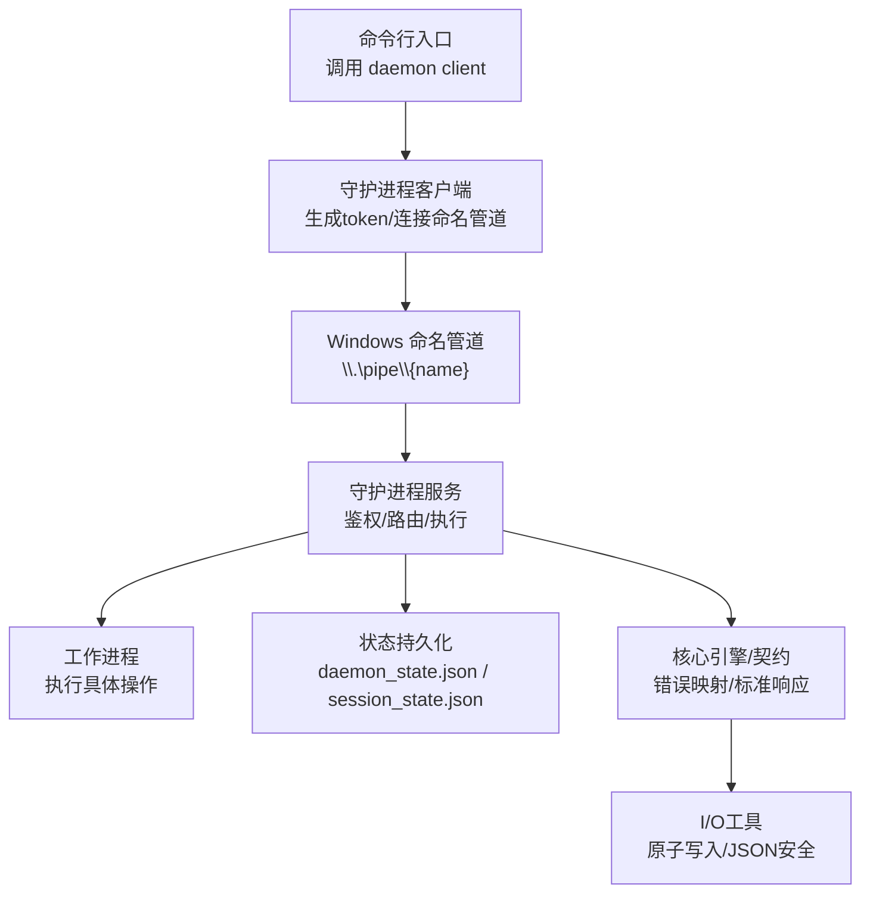
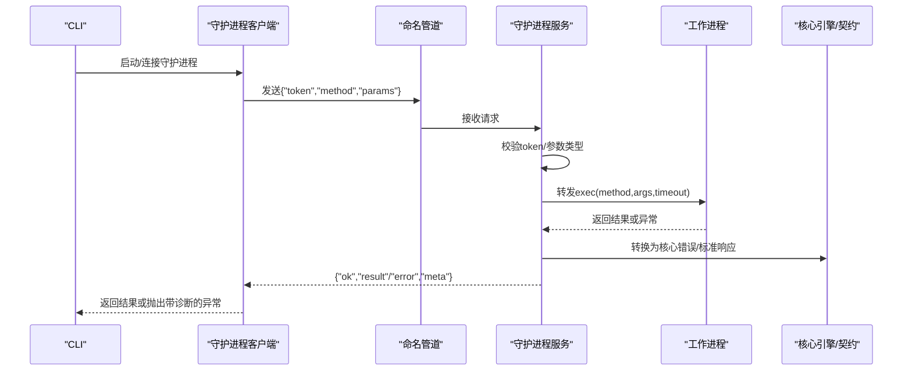
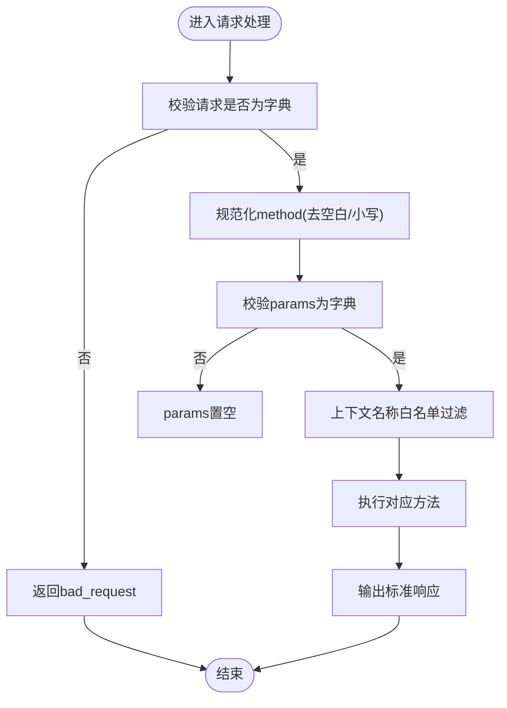
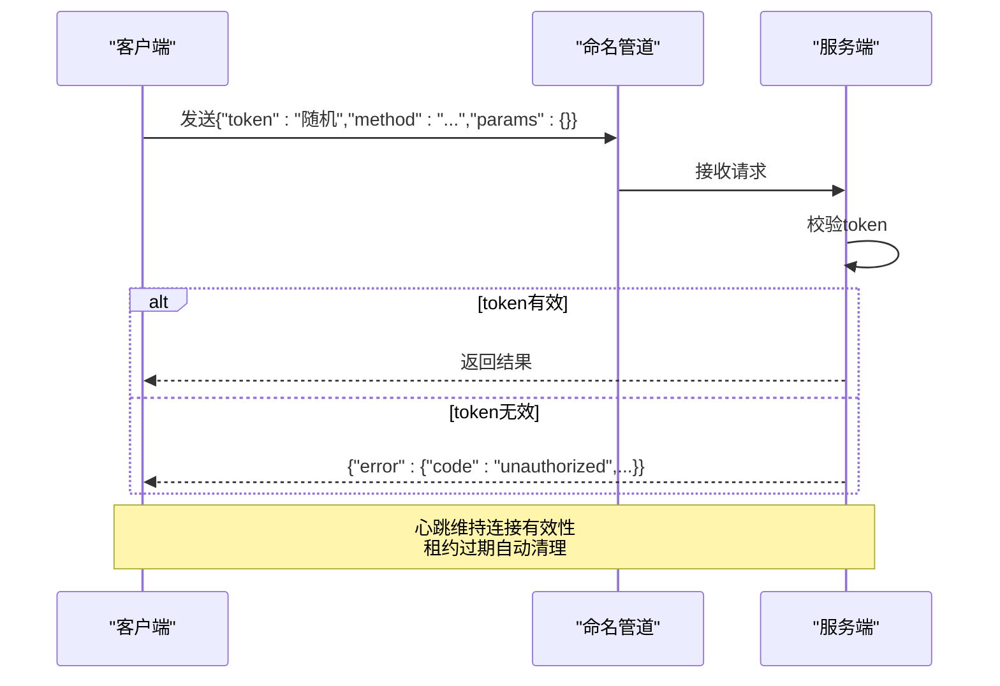
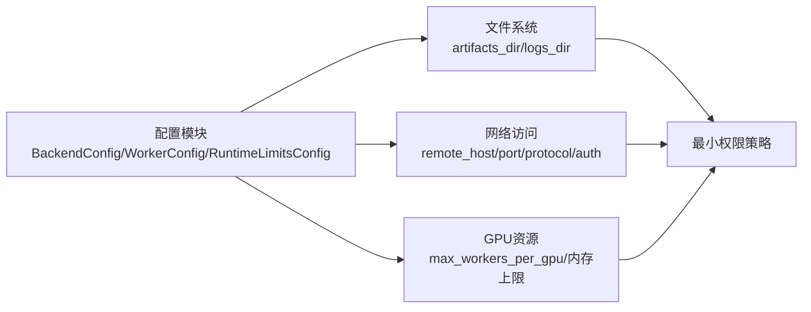
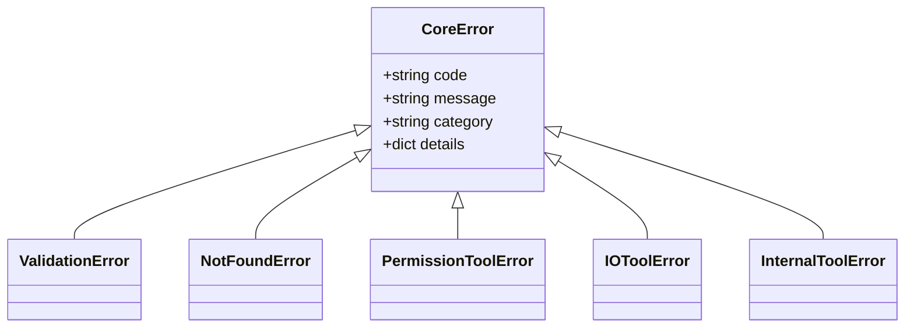
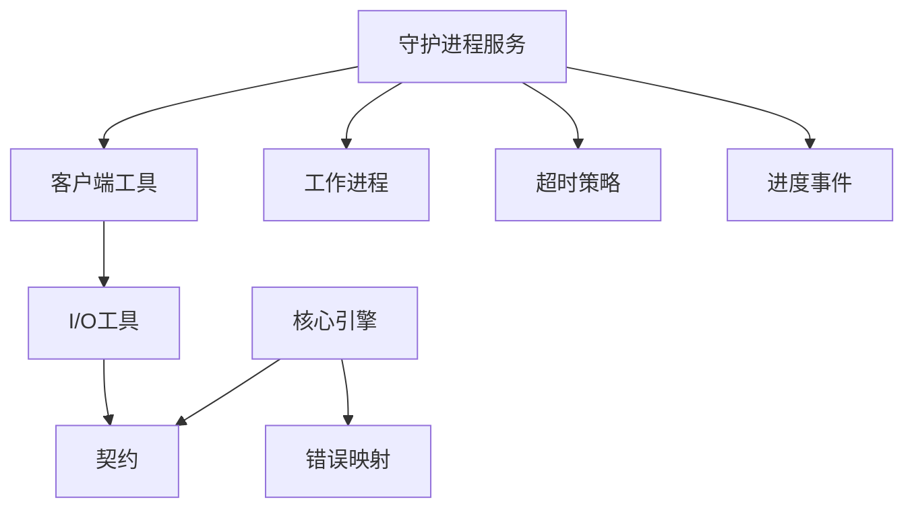

# 安全与防护

<cite>
**本文引用的文件**
- [rdx/daemon/server.py](file://rdx/daemon/server.py)
- [rdx/daemon/client.py](file://rdx/daemon/client.py)
- [rdx/core/errors.py](file://rdx/core/errors.py)
- [rdx/core/contracts.py](file://rdx/core/contracts.py)
- [rdx/io_utils.py](file://rdx/io_utils.py)
- [rdx/server.py](file://rdx/server.py)
- [rdx/config.py](file://rdx/config.py)
</cite>

## 目录
1. [简介](#简介)
2. [项目结构](#项目结构)
3. [核心组件](#核心组件)
4. [架构总览](#架构总览)
5. [详细组件分析](#详细组件分析)
6. [依赖关系分析](#依赖关系分析)
7. [性能与安全权衡](#性能与安全权衡)
8. [故障排查指南](#故障排查指南)
9. [结论](#结论)
10. [附录：安全配置清单](#附录：安全配置清单)

## 简介
本文件面向RDC-Tool的安全与防护，聚焦以下方面：输入验证与清洗、进程间通信（命名管道）安全、资源访问控制、错误处理与异常安全、安全配置、常见威胁防护以及安全测试与漏洞扫描方法论。文档基于仓库中的守护进程、客户端、核心错误体系、契约输出、I/O工具与运行时调度等源码进行分析，给出可操作的加固建议与实践。

## 项目结构
RDC-Tool在本地通过Windows命名管道实现CLI与守护进程的进程间通信；守护进程负责会话生命周期管理、工作进程编排与状态持久化；核心层提供统一的操作执行、错误映射与标准化响应；I/O工具提供原子写入与JSON序列化安全能力；配置模块集中暴露运行时限制与环境变量开关。

**图表来源**
- [rdx/daemon/client.py:467-515](file://rdx/daemon/client.py#L467-L515)
- [rdx/daemon/server.py:657-690](file://rdx/daemon/server.py#L657-L690)
- [rdx/server.py:62-145](file://rdx/server.py#L62-L145)
- [rdx/core/contracts.py:98-164](file://rdx/core/contracts.py#L98-L164)
- [rdx/io_utils.py:19-42](file://rdx/io_utils.py#L19-L42)

**章节来源**
- [rdx/daemon/server.py:1-728](file://rdx/daemon/server.py#L1-L728)
- [rdx/daemon/client.py:1-902](file://rdx/daemon/client.py#L1-L902)
- [rdx/server.py:1-150](file://rdx/server.py#L1-L150)
- [rdx/core/contracts.py:1-248](file://rdx/core/contracts.py#L1-L248)
- [rdx/io_utils.py:1-161](file://rdx/io_utils.py#L1-L161)
- [rdx/config.py:1-186](file://rdx/config.py#L1-L186)

## 核心组件
- 守护进程服务端：监听命名管道，校验请求令牌，路由方法，维护上下文与会话状态，协调工作进程执行，记录活动与超时清理。
- 守护进程客户端：启动/发现守护进程，生成并传递随机令牌，封装RPC调用，处理超时与诊断信息。
- 核心错误体系：将各类异常映射为统一的核心错误类型，便于上层统一处理与脱敏。
- 契约输出：统一成功/失败响应格式，包含trace_id、transport、duration_ms等元数据，便于审计与追踪。
- I/O工具：安全的JSON序列化与原子写入，避免并发写导致的损坏或信息泄露。
- 运行时调度：统一入口执行操作，记录日志，捕获异常并转换为标准错误响应。

**章节来源**
- [rdx/daemon/server.py:102-169](file://rdx/daemon/server.py#L102-L169)
- [rdx/daemon/client.py:467-515](file://rdx/daemon/client.py#L467-L515)
- [rdx/core/errors.py:9-119](file://rdx/core/errors.py#L9-L119)
- [rdx/core/contracts.py:98-164](file://rdx/core/contracts.py#L98-L164)
- [rdx/io_utils.py:19-42](file://rdx/io_utils.py#L19-L42)
- [rdx/server.py:62-145](file://rdx/server.py#L62-L145)

## 架构总览
下图展示了从CLI到守护进程再到工作进程的关键调用链，包括鉴权、参数校验、执行与响应标准化。

**图表来源**
- [rdx/daemon/client.py:467-515](file://rdx/daemon/client.py#L467-L515)
- [rdx/daemon/server.py:572-643](file://rdx/daemon/server.py#L572-L643)
- [rdx/server.py:62-145](file://rdx/server.py#L62-L145)
- [rdx/core/contracts.py:98-164](file://rdx/core/contracts.py#L98-L164)

## 详细组件分析

### 输入验证与清洗
- 参数类型检查：守护进程对请求体进行字典校验，方法名规范化为小写且去空白，参数对象若非字典则回退为空字典，避免后续逻辑误用。
- 上下文名称清洗：上下文ID在用于文件名时进行白名单过滤（仅允许字母数字及“-”“_”“.”），防止路径穿越与非法字符注入。
- JSON序列化安全：使用安全的JSON序列化器对字符串值进行UTF-8编码校验，遇到不可编码字符以反斜杠转义替换，避免破坏日志或状态文件。
- 原子写入：所有状态与日志采用临时文件+原子替换的方式写入，减少并发竞争导致的数据损坏风险。

**图表来源**
- [rdx/daemon/server.py:572-643](file://rdx/daemon/server.py#L572-L643)
- [rdx/daemon/client.py:76-85](file://rdx/daemon/client.py#L76-L85)
- [rdx/io_utils.py:19-42](file://rdx/io_utils.py#L19-L42)

**章节来源**
- [rdx/daemon/server.py:572-643](file://rdx/daemon/server.py#L572-L643)
- [rdx/daemon/client.py:76-85](file://rdx/daemon/client.py#L76-L85)
- [rdx/io_utils.py:19-42](file://rdx/io_utils.py#L19-L42)

### 进程间通信安全（命名管道）
- 令牌认证：每次请求必须携带token，服务端严格比对，不匹配即拒绝。
- 随机令牌生成：客户端启动守护进程时使用高熵随机令牌，降低被猜测风险。
- 连接隔离：每个守护进程绑定唯一命名管道地址，避免跨上下文串扰。
- 心跳与租约：客户端定期心跳，服务端按租约与空闲超时清理无效客户端，防止僵尸连接占用资源。
- 超时保护：客户端对请求设置超时，并在超时后收集诊断信息（活跃请求计数、当前操作摘要、守护进程状态片段），便于定位问题。

**图表来源**
- [rdx/daemon/client.py:623-733](file://rdx/daemon/client.py#L623-L733)
- [rdx/daemon/server.py:166-169](file://rdx/daemon/server.py#L166-L169)
- [rdx/daemon/server.py:181-211](file://rdx/daemon/server.py#L181-L211)
- [rdx/daemon/server.py:532-570](file://rdx/daemon/server.py#L532-L570)

**章节来源**
- [rdx/daemon/client.py:467-515](file://rdx/daemon/client.py#L467-L515)
- [rdx/daemon/server.py:166-169](file://rdx/daemon/server.py#L166-L169)
- [rdx/daemon/server.py:532-570](file://rdx/daemon/server.py#L532-L570)

### 资源访问控制
- 文件系统权限：状态文件与工件存储路径由配置与环境变量决定，建议使用最小权限原则运行进程，限制对关键目录的写权限。
- 网络访问限制：远程后端配置支持协议与认证模式选择，默认应禁用不必要的网络访问；如需启用，应限定目标主机与端口，并使用强认证。
- GPU资源隔离：通过配置项限制每GPU最大工作进程数与估计内存上限，避免单实例耗尽GPU资源；结合系统级隔离（如容器/用户态沙箱）进一步约束。

**图表来源**
- [rdx/config.py:15-43](file://rdx/config.py#L15-L43)
- [rdx/config.py:82-130](file://rdx/config.py#L82-L130)

**章节来源**
- [rdx/config.py:15-43](file://rdx/config.py#L15-L43)
- [rdx/config.py:82-130](file://rdx/config.py#L82-L130)

### 错误处理与异常安全
- 统一错误映射：核心层将常见异常（文件不存在、权限不足、参数错误、IO错误等）映射为标准错误类别与代码，便于上层统一处理与脱敏。
- 标准响应格式：成功与失败均遵循统一契约，包含schema_version、tool_version、result_kind、ok、data/artifacts/error/meta/projections等字段，确保下游消费一致。
- 敏感信息脱敏：错误消息与details中应避免直接输出敏感内容；日志记录需对路径、标识符等进行必要脱敏。
- 诊断信息收集：客户端在超时或异常时收集活跃操作、守护进程状态片段与恢复提示，帮助快速定位问题。

**图表来源**
- [rdx/core/errors.py:9-119](file://rdx/core/errors.py#L9-L119)

**章节来源**
- [rdx/core/errors.py:9-119](file://rdx/core/errors.py#L9-L119)
- [rdx/core/contracts.py:98-164](file://rdx/core/contracts.py#L98-L164)
- [rdx/server.py:108-145](file://rdx/server.py#L108-L145)

### 安全配置指南
- 最小权限原则：以受限用户运行守护进程与工作进程，限制对状态目录、工件目录的写权限；避免使用管理员权限。
- 安全头设置：若通过HTTP/HTTPS暴露接口（例如远程后端），应强制TLS、禁用弱密码套件、启用HSTS与CSP等安全头。
- 审计日志配置：开启结构化日志，记录操作开始/结束、trace_id、transport、duration_ms、错误类别与代码；对敏感字段进行脱敏；日志落盘采用原子写入。
- 环境变量控制：通过环境变量调整日志级别、工件存储路径、报告输出路径、GPU供应商与SPIRV工具路径等，避免硬编码敏感信息。

**章节来源**
- [rdx/config.py:135-186](file://rdx/config.py#L135-L186)
- [rdx/core/contracts.py:98-164](file://rdx/core/contracts.py#L98-L164)
- [rdx/io_utils.py:117-147](file://rdx/io_utils.py#L117-L147)

### 常见威胁与防护措施
- 注入攻击（命令/路径/SQL等）：对所有外部输入进行类型与白名单校验；上下文名称与路径使用白名单过滤；避免直接拼接用户输入到命令或路径。
- 缓冲区溢出：在Python层主要体现为内存与字符串处理；使用安全的序列化与原子写入，避免构造恶意payload导致解析崩溃；对外部二进制交互（如SPIRV工具）进行输入长度与格式校验。
- 拒绝服务（DoS）：通过租约与空闲超时清理僵尸连接；限制并发活跃请求；设置合理的超时与重试退避；限制最大上下文、会话与捕获文件大小。
- 身份伪造与越权：强制令牌认证；禁止匿名访问；区分上下文隔离；对敏感操作增加二次确认或权限检查。

[本节为概念性说明，不直接分析具体文件]

### 安全测试与漏洞扫描方法论
- 单元测试覆盖：针对输入校验、错误映射、原子写入、上下文清洗等关键路径编写用例，覆盖边界与异常分支。
- 集成测试：模拟守护进程与客户端交互，验证令牌认证、心跳与租约清理、超时与诊断信息收集。
- 模糊测试：对JSON解析、路径处理、命令参数等进行模糊输入测试，检测崩溃与异常路径。
- 静态分析与依赖扫描：使用SAST工具扫描代码缺陷；对第三方依赖进行漏洞扫描与更新；对内置Python环境进行基线核查。
- 渗透测试：对命名管道与远程接口进行授权绕过、注入、重放等攻击面测试；评估最小权限与隔离效果。

[本节为方法论说明，不直接分析具体文件]

## 依赖关系分析
核心组件之间的依赖如下：
- 守护进程服务端依赖客户端工具（状态读取/保存）、工作进程、超时策略与进度事件。
- 客户端依赖状态持久化工具、I/O原子写入与子进程管理。
- 核心引擎依赖契约与错误映射，提供统一执行与日志记录。
- I/O工具提供安全的JSON序列化与原子写入，被多处复用。

**图表来源**
- [rdx/daemon/server.py:17-30](file://rdx/daemon/server.py#L17-L30)
- [rdx/daemon/client.py:16-21](file://rdx/daemon/client.py#L16-L21)
- [rdx/server.py:7-11](file://rdx/server.py#L7-L11)
- [rdx/core/contracts.py:1-20](file://rdx/core/contracts.py#L1-L20)
- [rdx/core/errors.py:9-119](file://rdx/core/errors.py#L9-L119)

**章节来源**
- [rdx/daemon/server.py:17-30](file://rdx/daemon/server.py#L17-L30)
- [rdx/daemon/client.py:16-21](file://rdx/daemon/client.py#L16-L21)
- [rdx/server.py:7-11](file://rdx/server.py#L7-L11)
- [rdx/core/contracts.py:1-20](file://rdx/core/contracts.py#L1-L20)
- [rdx/core/errors.py:9-119](file://rdx/core/errors.py#L9-L119)

## 性能与安全权衡
- 超时与重试：合理设置请求与工作进程超时，避免长时间阻塞；重试需具备幂等性与退避策略。
- 并发与锁：守护进程内部使用线程锁保护状态变更，避免竞态条件；但需注意锁粒度与死锁风险。
- 日志与审计：结构化日志有助于审计与排障，但需平衡性能开销与隐私保护，避免记录敏感信息。
- 资源限制：通过配置限制最大上下文、会话、捕获大小与估计内存，防止资源耗尽；结合系统级隔离提升稳定性。

[本节为通用指导，不直接分析具体文件]

## 故障排查指南
- 守护进程未就绪：客户端会轮询等待，若超时则抛出带诊断信息的异常；检查守护进程状态文件与进程存活情况。
- 令牌不匹配：服务端返回未授权错误；检查客户端与服务端是否使用同一上下文与令牌。
- 连接泄漏：通过心跳与租约机制清理无效客户端；若出现异常，检查客户端是否正确detach与心跳。
- 状态文件损坏：使用原子写入与备份机制；若损坏，清理并重建状态文件。
- 工作进程异常：服务端捕获异常并返回worker_error；检查工作进程日志与资源使用情况。

**章节来源**
- [rdx/daemon/client.py:467-515](file://rdx/daemon/client.py#L467-L515)
- [rdx/daemon/server.py:572-643](file://rdx/daemon/server.py#L572-L643)
- [rdx/io_utils.py:67-115](file://rdx/io_utils.py#L67-L115)

## 结论
RDC-Tool在进程间通信、输入验证、错误处理与资源限制等方面具备较为完善的安全基础。建议在生产环境中进一步强化最小权限、网络访问控制、审计日志与依赖安全管理，并结合自动化测试与扫描持续保障安全性与稳定性。

[本节为总结性内容，不直接分析具体文件]

## 附录：安全配置清单
- 进程权限：以受限用户运行，限制对状态与工件目录的写权限。
- 网络访问：默认禁用远程访问；启用时强制TLS与强认证，限定目标与端口。
- 日志审计：开启结构化日志，记录trace_id、transport、duration_ms、错误类别与代码；对敏感字段脱敏。
- 环境变量：通过环境变量配置日志级别、工件存储路径、报告输出路径、GPU供应商与工具路径等。
- 资源限制：设置最大上下文、会话、捕获大小与估计内存；限制每GPU工作进程数。

**章节来源**
- [rdx/config.py:135-186](file://rdx/config.py#L135-L186)
- [rdx/core/contracts.py:98-164](file://rdx/core/contracts.py#L98-L164)
- [rdx/io_utils.py:117-147](file://rdx/io_utils.py#L117-L147)