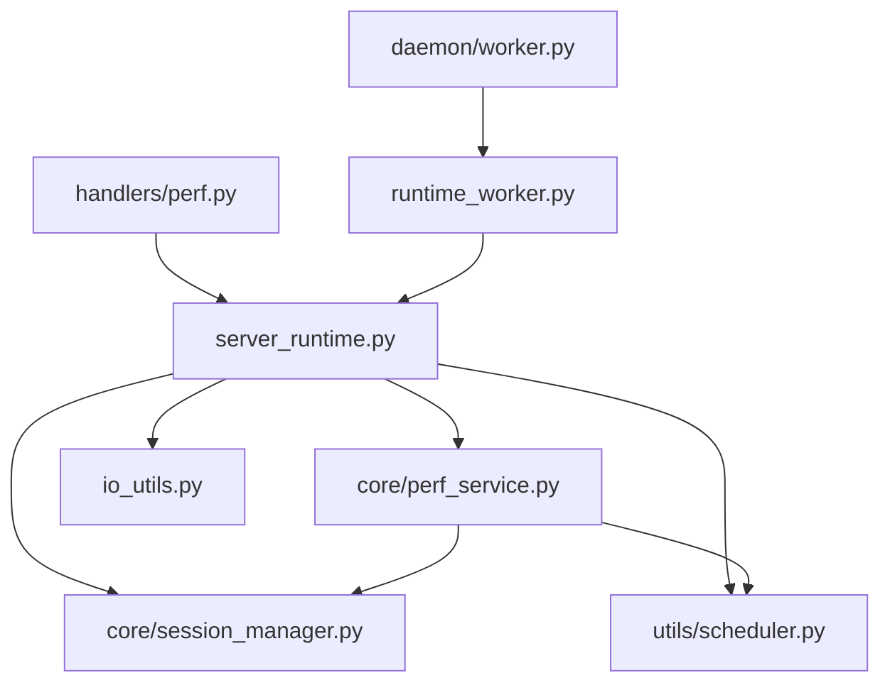
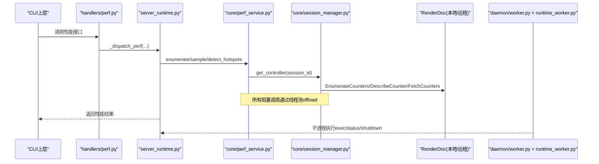
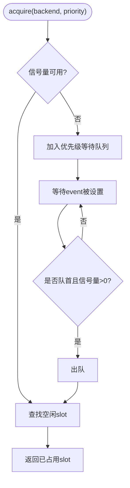
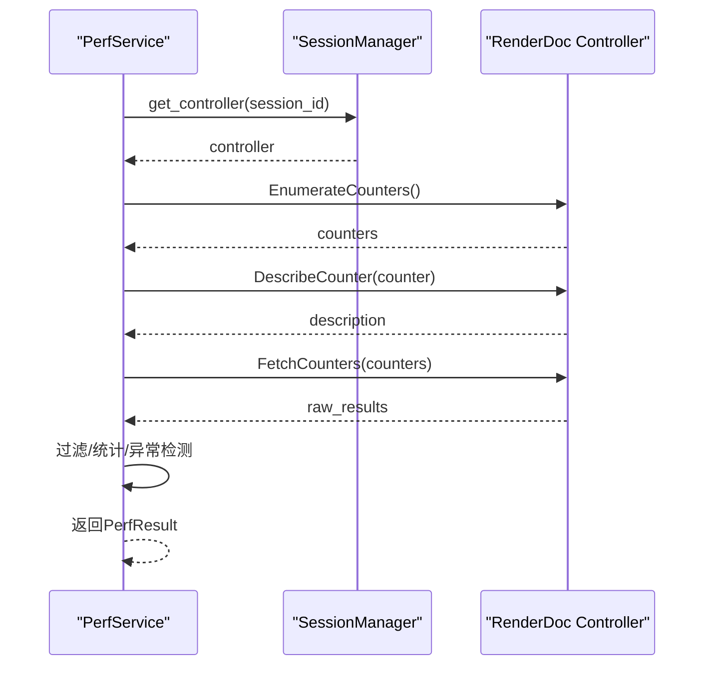
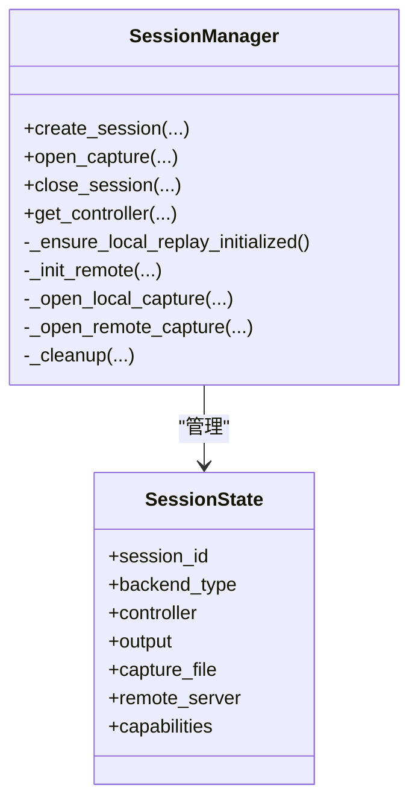
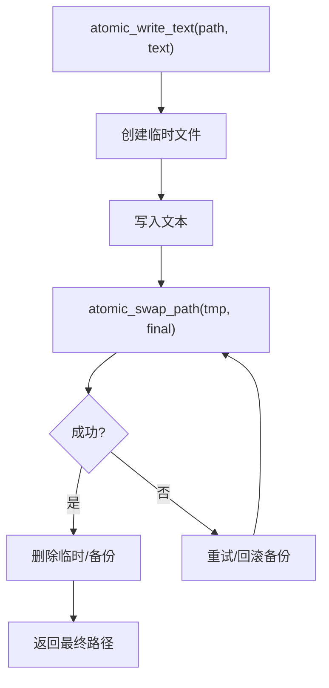
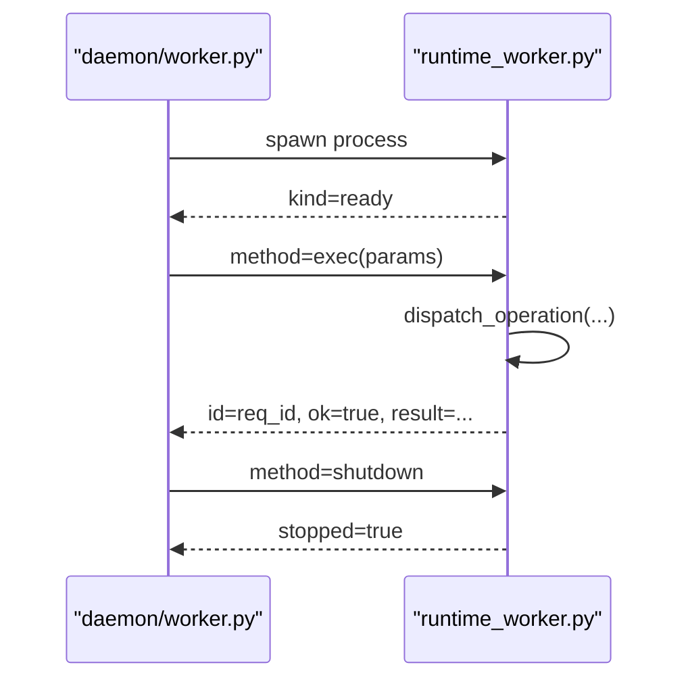
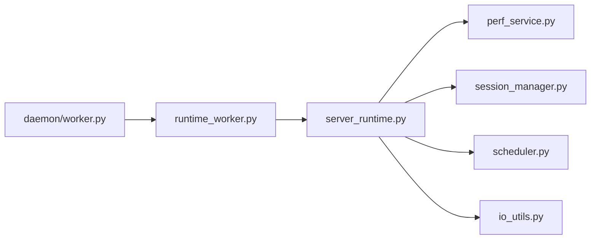

# 性能优化

<cite>
**本文引用的文件**
- [perf_service.py](file://rdx/core/perf_service.py)
- [scheduler.py](file://rdx/utils/scheduler.py)
- [session_manager.py](file://rdx/core/session_manager.py)
- [io_utils.py](file://rdx/io_utils.py)
- [runtime_worker.py](file://rdx/runtime_worker.py)
- [worker.py](file://rdx/daemon/worker.py)
- [models.py](file://rdx/models.py)
- [server_runtime.py](file://rdx/server_runtime.py)
- [buffer.py](file://rdx/handlers/buffer.py)
- [perf.py](file://rdx/handlers/perf.py)
</cite>

## 目录
1. [简介](#简介)
2. [项目结构](#项目结构)
3. [核心组件](#核心组件)
4. [架构总览](#架构总览)
5. [详细组件分析](#详细组件分析)
6. [依赖关系分析](#依赖关系分析)
7. [性能考量](#性能考量)
8. [故障排查指南](#故障排查指南)
9. [结论](#结论)
10. [附录](#附录)

## 简介
本文件聚焦 RDC-Tool 的性能优化，围绕以下主题展开：
- GPU worker 调度器设计：优先级队列、异步并发控制与资源管理策略
- 内存管理最佳实践：大对象处理、缓存策略与垃圾回收优化
- I/O 优化技术：异步文件操作、批量处理与缓冲策略
- 并发处理机制：任务调度、锁管理与死锁预防
- 性能监控与分析：性能计数器、采样分析与瓶颈识别
- 基准测试案例与优化前后对比（方法论）
- 大规模数据处理：分块处理、流式传输与内存限制控制

## 项目结构
RDC-Tool 将“性能相关”的能力拆分为服务层、会话管理层、调度器、I/O 工具与运行时进程等模块：
- 性能服务：提供 GPU 计数器枚举、采样、热点检测
- 会话管理：封装 RenderDoc 本地/远程回放控制器生命周期
- 调度器：按后端类型隔离并发，支持优先级等待队列
- I/O 工具：原子写入、JSON 安全序列化、追加日志
- 运行时：独立 worker 进程通过标准输入输出通信，单线程回放上下文
- 模型：统一的数据结构定义（含性能结果、会话能力等）

图表来源
- [perf.py:8-9](file://rdx/handlers/perf.py#L8-L9)
- [server_runtime.py:68-72](file://rdx/server_runtime.py#L68-L72)
- [perf_service.py:212-318](file://rdx/core/perf_service.py#L212-L318)
- [session_manager.py:148-264](file://rdx/core/session_manager.py#L148-L264)
- [scheduler.py:101-260](file://rdx/utils/scheduler.py#L101-L260)
- [io_utils.py:67-161](file://rdx/io_utils.py#L67-L161)
- [worker.py:24-203](file://rdx/daemon/worker.py#L24-L203)
- [runtime_worker.py:65-167](file://rdx/runtime_worker.py#L65-L167)

章节来源
- [perf_service.py:1-618](file://rdx/core/perf_service.py#L1-L618)
- [scheduler.py:1-342](file://rdx/utils/scheduler.py#L1-L342)
- [session_manager.py:1-569](file://rdx/core/session_manager.py#L1-L569)
- [io_utils.py:1-161](file://rdx/io_utils.py#L1-L161)
- [runtime_worker.py:1-167](file://rdx/runtime_worker.py#L1-L167)
- [worker.py:1-203](file://rdx/daemon/worker.py#L1-L203)
- [models.py:460-483](file://rdx/models.py#L460-L483)
- [server_runtime.py:1-800](file://rdx/server_runtime.py#L1-L800)

## 核心组件
- PerfService：对 RenderDoc 的 GPU 计数器进行异步封装，提供枚举、采样、热点检测；内部使用线程池执行阻塞调用，避免阻塞事件循环。
- WorkerScheduler：为每种后端（local/remote）维护信号量上限与优先级等待队列，确保高优先级交互任务优先获得 GPU replay 槽位。
- SessionManager：管理会话、回放控制器、远端连接与无头输出；所有与 RenderDoc 的同步调用均通过线程池 offload。
- io_utils：提供原子写入、JSON 安全序列化、追加 JSONL 日志，减少 I/O 竞争并保证一致性。
- runtime_worker：独立进程承载渲染回放，固定单线程 executor 保持原生上下文稳定；通过 stdin/stdout 与父进程通信。
- daemon worker：进程生命周期管理、请求派发、超时与就绪等待。

章节来源
- [perf_service.py:212-618](file://rdx/core/perf_service.py#L212-L618)
- [scheduler.py:39-342](file://rdx/utils/scheduler.py#L39-L342)
- [session_manager.py:148-569](file://rdx/core/session_manager.py#L148-L569)
- [io_utils.py:13-161](file://rdx/io_utils.py#L13-L161)
- [runtime_worker.py:65-167](file://rdx/runtime_worker.py#L65-L167)
- [worker.py:24-203](file://rdx/daemon/worker.py#L24-L203)

## 架构总览
下图展示从 handler 到服务层再到底层资源的调用链，以及 worker 进程的边界。

图表来源
- [perf.py:8-9](file://rdx/handlers/perf.py#L8-L9)
- [server_runtime.py:68-72](file://rdx/server_runtime.py#L68-L72)
- [perf_service.py:235-487](file://rdx/core/perf_service.py#L235-L487)
- [session_manager.py:260-264](file://rdx/core/session_manager.py#L260-L264)
- [worker.py:144-170](file://rdx/daemon/worker.py#L144-L170)
- [runtime_worker.py:97-155](file://rdx/runtime_worker.py#L97-L155)

## 详细组件分析

### GPU Worker 调度器（优先级队列、异步并发、资源管理）
- 设计要点
  - 每个后端（local/remote）独立信号量，限制最大并发槽位数
  - 优先级等待队列：数值越小优先级越高；同优先级按 FIFO 打破并列
  - acquire/release 加锁保护内部状态变更，释放时唤醒最高优先级等待者
  - 若注册槽位不足，动态创建虚拟槽位以避免死等
- 复杂度
  - 等待队列排序 O(k log k)，k 为等待者数量；典型场景下 k 较小
  - 获取/释放均为 O(log k) 或 O(1)（快速路径）
- 错误处理
  - 未知后端类型抛出参数错误
  - 未注册的 slot 释放时报错
  - 虚拟槽位仅在并发许可多于注册槽位时出现

图表来源
- [scheduler.py:173-260](file://rdx/utils/scheduler.py#L173-L260)
- [scheduler.py:261-300](file://rdx/utils/scheduler.py#L261-L300)

章节来源
- [scheduler.py:1-342](file://rdx/utils/scheduler.py#L1-L342)

### 性能服务（计数器枚举、采样、热点检测）
- 关键流程
  - 延迟导入 renderdoc，失败则降级并提示不可用
  - 通过 session_manager 获取 controller，再在默认线程池中执行阻塞 API
  - 采样时构建 counter 描述映射，过滤 event 范围，计算统计与异常事件
  - 热点检测基于 GPU duration 名称匹配，提取 top-K 最慢事件
- 数据模型
  - CounterSample、CounterSummary、PerfResult 用于结构化输出
- 性能特征
  - 使用 asyncio.to_thread/run_in_executor 避免阻塞事件循环
  - 统计计算纯 Python 实现，避免外部依赖开销

图表来源
- [perf_service.py:235-487](file://rdx/core/perf_service.py#L235-L487)
- [models.py:460-483](file://rdx/models.py#L460-L483)

章节来源
- [perf_service.py:1-618](file://rdx/core/perf_service.py#L1-L618)
- [models.py:460-483](file://rdx/models.py#L460-L483)

### 会话管理（本地/远程回放、无头输出、清理）
- 关键点
  - 本地回放初始化一次，复用全局环境
  - 远端复制捕获文件并打开，支持进度回调
  - 创建无头输出以支持纹理输出
  - 清理阶段有序关闭 output/controller/capture_file/remote_server
- 并发与锁
  - 使用 asyncio.Lock 保护会话字典与初始化标志
  - 所有 RenderDoc 调用通过线程池 offload

图表来源
- [session_manager.py:148-569](file://rdx/core/session_manager.py#L148-L569)

章节来源
- [session_manager.py:1-569](file://rdx/core/session_manager.py#L1-L569)

### I/O 工具（原子写入、JSON 安全、追加日志）
- 原子写入
  - 先写临时文件，再原子替换目标路径，失败重试与备份恢复
  - 清理临时文件与备份，避免残留
- JSON 安全
  - 递归清洗非 UTF-8 字符串，避免编码错误
  - safe_stream_write 捕获编码异常并回退
- 追加 JSONL
  - 读取现有内容，拼接新行后整体原子写入，保证行完整性

图表来源
- [io_utils.py:67-161](file://rdx/io_utils.py#L67-L161)

章节来源
- [io_utils.py:1-161](file://rdx/io_utils.py#L1-L161)

### 运行时 Worker（进程边界、单线程回放上下文、通信协议）
- 进程启动
  - 设置环境变量（context_id、二进制目录、Python 模块目录等）
  - 输出 ready 消息，包含运行信息
- 执行模型
  - 使用 asyncio.Runner 并设置单线程 executor，避免 per-request 执行器导致原生上下文失效
  - 通过 stdin 接收 JSON 请求，stdout 输出响应
- 方法
  - exec：分发 operation
  - clear_context：清理上下文
  - status：返回运行状态
  - shutdown：优雅退出

图表来源
- [worker.py:69-170](file://rdx/daemon/worker.py#L69-L170)
- [runtime_worker.py:65-167](file://rdx/runtime_worker.py#L65-L167)

章节来源
- [runtime_worker.py:1-167](file://rdx/runtime_worker.py#L1-L167)
- [worker.py:1-203](file://rdx/daemon/worker.py#L1-L203)

### 处理器路由（handler -> server_runtime）
- perf 与 buffer 处理器仅做转发，实际逻辑在服务层实现，便于集中管理与扩展

章节来源
- [perf.py:8-9](file://rdx/handlers/perf.py#L8-L9)
- [buffer.py:8-9](file://rdx/handlers/buffer.py#L8-L9)

## 依赖关系分析
- 服务耦合
  - PerfService 依赖 SessionManager 获取控制器，间接依赖 RenderDoc
  - ServerRuntime 聚合多个服务（Perf、Pipeline、Render、EventGraph、PatchEngine），并通过 contextvars 传递上下文
- 进程边界
  - daemon/worker 与 runtime_worker 通过标准 IO 通信，避免共享内存带来的复杂性与风险
- 资源隔离
  - 调度器按后端隔离并发，防止 local/remote 互相影响
  - 会话管理器集中管理控制器与输出，避免资源泄漏

图表来源
- [server_runtime.py:68-72](file://rdx/server_runtime.py#L68-L72)
- [perf_service.py:212-318](file://rdx/core/perf_service.py#L212-L318)
- [session_manager.py:148-264](file://rdx/core/session_manager.py#L148-L264)
- [scheduler.py:101-260](file://rdx/utils/scheduler.py#L101-L260)
- [io_utils.py:67-161](file://rdx/io_utils.py#L67-L161)
- [worker.py:24-203](file://rdx/daemon/worker.py#L24-L203)
- [runtime_worker.py:65-167](file://rdx/runtime_worker.py#L65-L167)

章节来源
- [server_runtime.py:1-800](file://rdx/server_runtime.py#L1-L800)

## 性能考量
- 异步与阻塞
  - 所有 RenderDoc 调用通过线程池 offload，避免阻塞事件循环
  - 单线程 executor 在 worker 中保持原生上下文稳定，降低切换成本
- 并发控制
  - 使用信号量限制每后端最大并发；优先级队列保障交互任务低延迟
  - 锁粒度最小化，仅在必要时保护共享状态
- I/O 优化
  - 原子写入与备份恢复，避免部分写入导致的损坏
  - JSON 安全序列化与追加日志，减少编码错误与 I/O 竞争
- 内存与资源
  - 会话清理有序释放控制器、输出与远端连接，避免资源泄漏
  - 估计回放内存与捕获大小限制，防止过大负载导致 OOM
- 监控与分析
  - 性能计数器采样与热点检测，定位慢事件
  - 运行时上下文指标（活跃会话/捕获计数）辅助容量规划

[本节为通用指导，不直接分析具体文件]

## 故障排查指南
- GPU 计数器不可用
  - 检查 renderdoc 模块是否可导入；若无，返回空列表并提示更新运行时
  - 确认当前后端/队列配置是否支持整回放时间戳
- 控制器缺失或会话无效
  - 获取控制器前校验会话是否存在且已打开捕获
  - 远端复制捕获失败时，检查网络、设备序列号与远程路径权限
- 原子写入失败
  - 查看重试次数与最后错误原因；检查磁盘空间与权限
  - 备份文件存在时尝试回滚，确保最终一致性
- Worker 进程异常
  - 就绪超时或 EOF 表示子进程崩溃或未正常启动
  - 请求超时需检查服务端处理耗时与系统负载

章节来源
- [perf_service.py:69-96](file://rdx/core/perf_service.py#L69-L96)
- [perf_service.py:235-318](file://rdx/core/perf_service.py#L235-L318)
- [session_manager.py:347-440](file://rdx/core/session_manager.py#L347-L440)
- [io_utils.py:67-161](file://rdx/io_utils.py#L67-L161)
- [worker.py:121-170](file://rdx/daemon/worker.py#L121-L170)
- [runtime_worker.py:97-167](file://rdx/runtime_worker.py#L97-L167)

## 结论
RDC-Tool 在性能优化方面采用分层设计与明确边界：
- 服务层负责高性能算法与统计，屏蔽底层阻塞调用
- 调度器保障 GPU 资源公平与优先级，避免交互任务抖动
- I/O 工具确保一致性与可靠性，减少竞争与错误
- 进程边界隔离原生上下文，提升稳定性与可维护性
- 通过计数器采样与热点检测，形成闭环的性能分析与优化流程

[本节为总结，不直接分析具体文件]

## 附录

### 性能监控与分析工具使用指南
- 性能计数器
  - 枚举：列出可用计数器及其元数据（名称、单位、结果类型）
  - 采样：指定事件范围与计数器集合，返回样本、摘要与异常事件
  - 热点检测：基于 GPU duration 名称匹配，返回 top-K 最慢事件
- 采样与分析
  - 使用 warmup 轮次预热，剔除不稳定初始值
  - 使用 p95 与 z-score 异常检测，识别极端值与热点
- 瓶颈识别
  - 结合事件树与热点事件，定位绘制/计算密集区域
  - 配合会话指标（活跃会话/捕获数）评估系统负载

章节来源
- [perf_service.py:235-618](file://rdx/core/perf_service.py#L235-L618)
- [models.py:460-483](file://rdx/models.py#L460-L483)

### 基准测试案例与方法论
- 建议用例
  - 帧级 GPU 时长测量：多轮采样，报告均值、p95、方差
  - 事件级热点检测：top-K 慢事件，附带事件名与持续时间
  - 并发压力测试：不同优先级任务混合提交，观察延迟分布
- 指标采集
  - 使用 PerfService 的 measure_frame_gpu 与 detect_hotspots
  - 记录会话指标与运行时限制（捕获大小、估计内存）
- 优化前后对比
  - 对比同一 capture 在不同配置下的 p95 与热点变化
  - 调整调度器并发上限与优先级，观察交互任务延迟改善

[本节为方法论，不直接分析具体文件]

### 大规模数据处理最佳实践
- 分块处理
  - 将大捕获按事件范围分段采样，避免一次性加载过多数据
- 流式传输
  - 远端复制捕获时使用进度回调，支持中断与恢复
- 内存限制控制
  - 依据捕获大小估算回放内存，结合运行时限制防止 OOM
  - 合理设置快照保留策略与最近操作数量，控制内存占用

章节来源
- [session_manager.py:373-440](file://rdx/core/session_manager.py#L373-L440)
- [server_runtime.py:269-410](file://rdx/server_runtime.py#L269-L410)