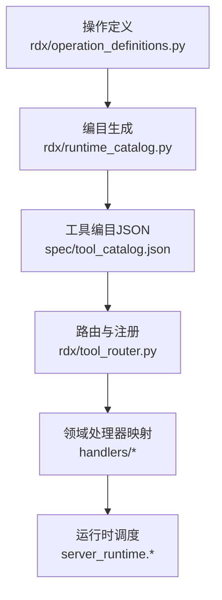
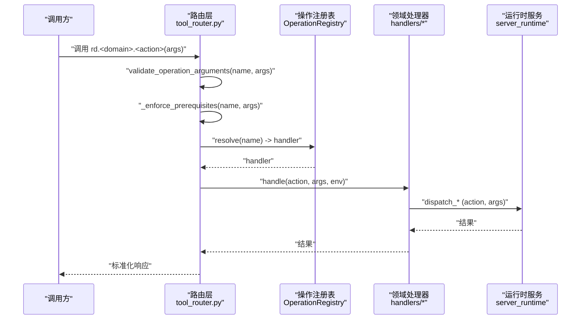
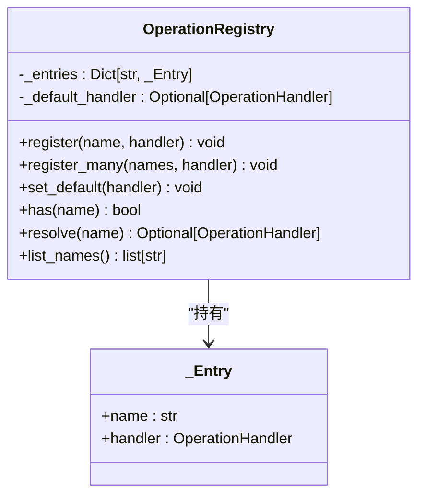
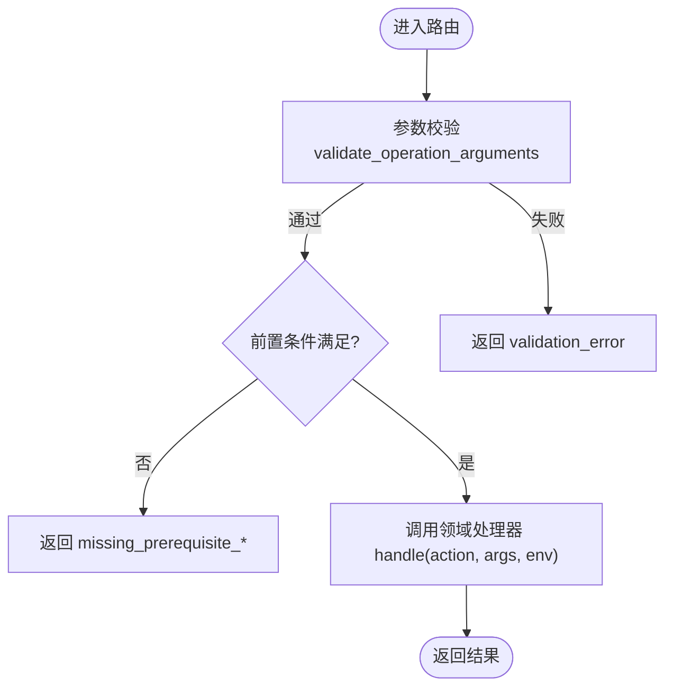
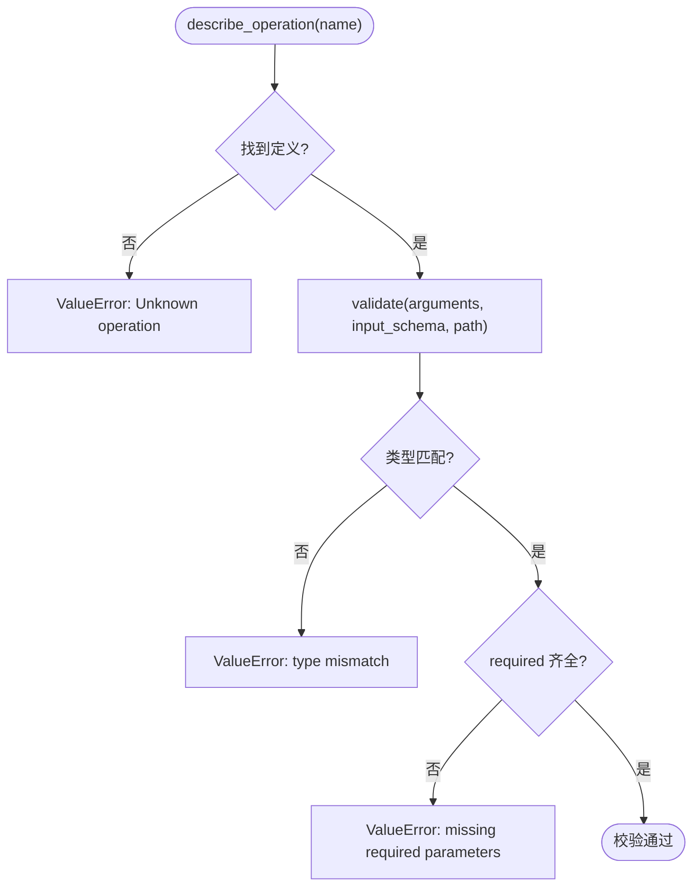
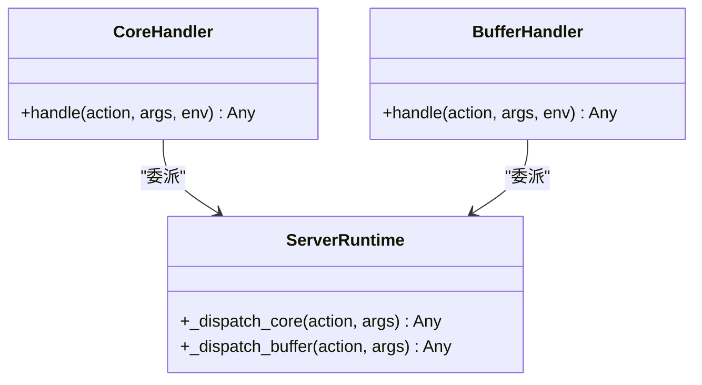
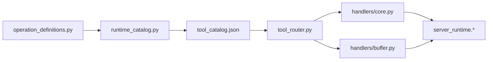

# 扩展开发

<cite>
**本文引用的文件**
- [operation_registry.py](file://rdx/core/operation_registry.py)
- [tool_router.py](file://rdx/tool_router.py)
- [runtime_catalog.py](file://rdx/runtime_catalog.py)
- [operation_definitions.py](file://rdx/operation_definitions.py)
- [tool_catalog.json](file://spec/tool_catalog.json)
- [core.py](file://rdx/handlers/core.py)
- [buffer.py](file://rdx/handlers/buffer.py)
- [generate_tool_reference.py](file://scripts/generate_tool_reference.py)
- [tool-reference.md](file://docs/tool-reference.md)
</cite>

## 目录
1. [简介](#简介)
2. [项目结构](#项目结构)
3. [核心组件](#核心组件)
4. [架构总览](#架构总览)
5. [详细组件分析](#详细组件分析)
6. [依赖关系分析](#依赖关系分析)
7. [性能考虑](#性能考虑)
8. [故障排查指南](#故障排查指南)
9. [结论](#结论)
10. [附录](#附录)

## 简介
本指南面向希望在 RDC-Tool 中开发扩展的工程师，围绕插件架构、操作注册表、动态模块加载与接口抽象展开，系统说明自定义处理器的开发流程（接口规范、参数校验、错误处理与日志记录）、第三方集成方法（外部 API 调用、数据格式转换、状态同步）、扩展生命周期管理（初始化、配置加载、资源清理），并提供从简单查询处理器到复杂分析工具的完整示例思路。最后给出测试策略与打包分发、版本管理的最佳实践。

## 项目结构
RDC-Tool 的扩展能力建立在“声明式工具定义 + 目录化处理器路由 + 运行时编目”的分层架构之上：
- 声明式定义：在单一模块集中描述所有公开操作的元信息（名称、分组、输入 Schema、前置条件、作用域与副作用等）。
- 编目生成：将声明式定义转换为可消费的 JSON 编目，供发现、文档与校验使用。
- 路由与注册：根据编目自动构建操作注册表，按命名空间将请求分派到对应处理器模块。
- 处理器实现：每个领域（如 buffer、capture、core）提供统一的 handle(action, args, env) 异步入口，内部再委派给具体服务或运行时。

**图表来源**
- [operation_definitions.py:1-800](file://rdx/operation_definitions.py#L1-L800)
- [runtime_catalog.py:17-35](file://rdx/runtime_catalog.py#L17-L35)
- [tool_catalog.json:1-120](file://spec/tool_catalog.json#L1-L120)
- [tool_router.py:32-57](file://rdx/tool_router.py#L32-L57)

**章节来源**
- [operation_definitions.py:1-800](file://rdx/operation_definitions.py#L1-L800)
- [runtime_catalog.py:17-35](file://rdx/runtime_catalog.py#L17-L35)
- [tool_catalog.json:1-120](file://spec/tool_catalog.json#L1-L120)
- [tool_router.py:32-57](file://rdx/tool_router.py#L32-L57)

## 核心组件
- 操作注册表：维护操作名到处理函数的映射，支持批量注册、默认处理器与列表查询。
- 路由与前置校验：基于编目解析工具名、命名空间与动作，执行参数校验与前置条件检查，再将请求转发至领域处理器。
- 运行时编目：从代码级定义生成稳定可复现的工具编目，并实现严格的参数验证器。
- 处理器门面：各领域处理器仅暴露统一签名，屏蔽底层差异，便于扩展与维护。

**章节来源**
- [operation_registry.py:12-45](file://rdx/core/operation_registry.py#L12-L45)
- [tool_router.py:60-154](file://rdx/tool_router.py#L60-L154)
- [runtime_catalog.py:31-91](file://rdx/runtime_catalog.py#L31-L91)
- [core.py:8-10](file://rdx/handlers/core.py#L8-L10)
- [buffer.py:8-10](file://rdx/handlers/buffer.py#L8-L10)

## 架构总览
下图展示一次典型操作调用的端到端流程：客户端发起调用 → 路由层解析 → 参数校验 → 前置条件检查 → 领域处理器 → 运行时服务 → 返回结果。

**图表来源**
- [tool_router.py:131-154](file://rdx/tool_router.py#L131-L154)
- [runtime_catalog.py:38-91](file://rdx/runtime_catalog.py#L38-L91)
- [core.py:8-10](file://rdx/handlers/core.py#L8-L10)
- [buffer.py:8-10](file://rdx/handlers/buffer.py#L8-L10)

## 详细组件分析

### 操作注册表 OperationRegistry
- 设计要点
  - 以字典存储操作名到处理器的映射，支持批量注册与默认处理器回退。
  - 提供 has/resolve/list_names 等查询能力，便于路由层按需查找与调试。
- 复杂度
  - 注册 O(1)，查找 O(1)，列表 O(n log n)（排序）。
- 扩展点
  - 通过 register/register_many 注入新操作；通过 set_default 设置未知操作的回退逻辑。

**图表来源**
- [operation_registry.py:12-45](file://rdx/core/operation_registry.py#L12-L45)

**章节来源**
- [operation_registry.py:12-45](file://rdx/core/operation_registry.py#L12-L45)

### 路由与前置校验 tool_router
- 功能职责
  - 从编目加载工具清单，构建操作名到领域处理器的映射。
  - 对每次调用执行参数校验与前置条件检查，失败时返回结构化错误。
  - 成功则调用领域处理器 handle(action, args, env)。
- 前置条件机制
  - 支持 when 条件（如 options.remote_id_present）与运行时快照判断（session_id、remote_id 等）。
  - 缺失前置时返回包含 code/category/details 的错误对象，便于上层定位修复步骤。
- 可扩展性
  - 新增领域只需在 _DOMAIN_HANDLERS 中注册映射，并在 handlers 下提供 handle 函数。

**图表来源**
- [tool_router.py:64-128](file://rdx/tool_router.py#L64-L128)
- [tool_router.py:131-154](file://rdx/tool_router.py#L131-L154)

**章节来源**
- [tool_router.py:60-154](file://rdx/tool_router.py#L60-L154)

### 运行时编目 runtime_catalog
- 编目生成
  - 从代码级定义复制并计算指纹，输出 schema_version、tool_count、groups、tools 等元信息。
- 参数校验器
  - 递归校验类型、枚举、长度、数值范围、required/properties/additionalProperties、oneOf/not 等约束。
  - 校验失败抛出 ValueError，由路由层捕获并转为标准化错误。
- 扩展点
  - 新增操作仅需在 operation_definitions.py 中添加条目，即可被编目与校验覆盖。

**图表来源**
- [runtime_catalog.py:31-91](file://rdx/runtime_catalog.py#L31-L91)

**章节来源**
- [runtime_catalog.py:17-35](file://rdx/runtime_catalog.py#L17-L35)
- [runtime_catalog.py:31-91](file://rdx/runtime_catalog.py#L31-L91)

### 处理器门面与领域实现
- 统一签名
  - 每个领域处理器提供 async def handle(action, args, env) -> Any，内部委派给 server_runtime 的具体 dispatch_* 方法。
- 示例
  - core 与 buffer 处理器均遵循该约定，便于路由层统一调用。

**图表来源**
- [core.py:8-10](file://rdx/handlers/core.py#L8-L10)
- [buffer.py:8-10](file://rdx/handlers/buffer.py#L8-L10)

**章节来源**
- [core.py:8-10](file://rdx/handlers/core.py#L8-L10)
- [buffer.py:8-10](file://rdx/handlers/buffer.py#L8-L10)

### 文档与发现
- 工具参考文档由脚本从代码级定义自动生成，保证文档与实现一致。
- 可通过 tools list/search/describe 进行发现与检索。

**章节来源**
- [generate_tool_reference.py:68-135](file://scripts/generate_tool_reference.py#L68-L135)
- [tool-reference.md:1-10](file://docs/tool-reference.md#L1-L10)

## 依赖关系分析
- 低耦合高内聚
  - 操作定义与路由解耦：定义变更不影响路由逻辑。
  - 路由与处理器解耦：新增领域无需改动路由核心。
  - 编目与实现解耦：校验器只依赖定义，不感知业务细节。
- 关键依赖链
  - operation_definitions.py → runtime_catalog.py → tool_catalog.json → tool_router.py → handlers/* → server_runtime.*

**图表来源**
- [operation_definitions.py:1-800](file://rdx/operation_definitions.py#L1-L800)
- [runtime_catalog.py:17-35](file://rdx/runtime_catalog.py#L17-L35)
- [tool_catalog.json:1-120](file://spec/tool_catalog.json#L1-L120)
- [tool_router.py:32-57](file://rdx/tool_router.py#L32-L57)
- [core.py:8-10](file://rdx/handlers/core.py#L8-L10)
- [buffer.py:8-10](file://rdx/handlers/buffer.py#L8-L10)

**章节来源**
- [tool_router.py:32-57](file://rdx/tool_router.py#L32-L57)
- [runtime_catalog.py:17-35](file://rdx/runtime_catalog.py#L17-L35)

## 性能考虑
- 路由与校验
  - 参数校验为递归遍历 Schema，建议在高频路径上避免过深的嵌套结构。
  - 前置条件检查读取上下文快照，应避免频繁大对象拷贝。
- 处理器实现
  - 尽量复用运行时服务提供的缓存与批处理能力。
  - 对大对象输出优先使用 artifact 文件而非直接返回 JSON。
- 编目与文档
  - 编目生成仅在构建/发布阶段运行，不影响运行时性能。

[本节为通用指导，不直接分析具体文件]

## 故障排查指南
- 常见错误分类
  - 参数校验失败：validation_error，检查 input_schema 与传入参数类型、必填项、枚举值、范围等。
  - 前置条件缺失：missing_prerequisite_*，根据 details.via_tools 提示先调用必要的前置操作。
  - 未识别操作：Unknown operation，确认操作名是否在定义中存在且拼写正确。
- 定位建议
  - 查看最近操作历史与运行时指标，辅助定位问题上下文。
  - 使用 get_logs 获取更详细的诊断信息。

**章节来源**
- [tool_router.py:64-128](file://rdx/tool_router.py#L64-L128)
- [runtime_catalog.py:31-91](file://rdx/runtime_catalog.py#L31-L91)
- [tool-reference.md:66-80](file://docs/tool-reference.md#L66-L80)

## 结论
RDC-Tool 的扩展体系以“声明式定义 + 编目驱动 + 路由分发”为核心，提供了清晰的扩展边界与稳定的契约。通过 OperationRegistry 与 tool_router，开发者可以低成本地新增领域与操作；借助 runtime_catalog 的参数校验与前置条件机制，确保扩展行为的可预测性与健壮性。结合统一的处理器门面与运行时服务，扩展既能快速落地，又易于维护与演进。

[本节为总结性内容，不直接分析具体文件]

## 附录

### 自定义处理器开发流程
- 步骤概览
  1) 在 operation_definitions.py 中声明新操作（名称、分组、Schema、前置条件、作用域与副作用）。
  2) 在 handlers/<domain>.py 中实现 handle(action, args, env)，内部委派给 server_runtime 的相应 dispatch_*。
  3) 若为新领域，需在 tool_router.py 的 _DOMAIN_HANDLERS 中注册映射。
  4) 重新生成编目与文档，确保 discoverable 与一致性。
- 参数验证
  - 使用 runtime_catalog.validate_operation_arguments 进行强约束校验，避免在处理器中重复实现。
- 错误处理
  - 统一返回结构化错误（success、error_message、code、category、details），便于上层消费。
- 日志记录
  - 通过核心日志接口记录关键路径与异常堆栈，配合 get_logs 进行排障。

**章节来源**
- [operation_definitions.py:1-800](file://rdx/operation_definitions.py#L1-L800)
- [runtime_catalog.py:38-91](file://rdx/runtime_catalog.py#L38-L91)
- [tool_router.py:131-154](file://rdx/tool_router.py#L131-L154)

### 第三方集成方法
- 外部 API 调用
  - 在处理器中封装 HTTP 调用，统一超时、重试与错误码映射。
  - 将远程状态变化同步到上下文快照或 session 状态，保持前后一致。
- 数据格式转换
  - 在处理器入口处做入参规范化，在出口处做出参标准化，减少下游适配成本。
- 状态同步
  - 使用 session/context 管理远端连接与句柄，确保生命周期与资源释放。

[本节为通用指导，不直接分析具体文件]

### 扩展生命周期管理
- 初始化
  - 通过 rd.core.init 建立运行时环境（临时目录、对象池、可选 remote）。
- 配置加载
  - 使用 rd.core.get_config/set_config 读写全局配置，影响后续行为。
- 资源清理
  - 使用 rd.core.shutdown 关闭运行时并释放会话、连接与临时文件句柄。

**章节来源**
- [tool-reference.md:66-80](file://docs/tool-reference.md#L66-L80)

### 扩展开发示例思路
- 简单查询处理器
  - 目标：在现有 buffer 领域新增一个轻量查询操作。
  - 做法：在 operation_definitions.py 添加条目；在 handlers/buffer.py 的 handle 中委派；在 tool_router 已存在映射，无需额外注册。
- 复杂分析工具
  - 目标：组合多个操作完成跨事件分析。
  - 做法：新增 macro/namespaced 操作，编排底层 canonical 工具，聚合结果并输出 artifacts。

[本节为概念性示例，不直接分析具体文件]

### 测试策略
- 单元测试
  - 针对参数校验器与前置条件逻辑编写用例，覆盖边界与异常分支。
- 集成测试
  - 模拟完整调用链路：定义 → 编目 → 路由 → 处理器 → 运行时，验证端到端行为。
- 模拟环境搭建
  - 使用最小化的上下文与 session 快照，构造可复现的测试场景。

[本节为通用指导，不直接分析具体文件]

### 打包、分发与版本管理
- 打包
  - 使用脚本生成工具参考文档，确保文档与实现一致；发布前运行完整性检查。
- 分发
  - 将操作定义与处理器作为独立模块纳入包体，保持向后兼容的命名空间。
- 版本管理
  - 通过编目指纹追踪定义变更；重大变更需升级 schema_version 并保留迁移指引。

**章节来源**
- [generate_tool_reference.py:116-135](file://scripts/generate_tool_reference.py#L116-L135)
- [runtime_catalog.py:24-28](file://rdx/runtime_catalog.py#L24-L28)