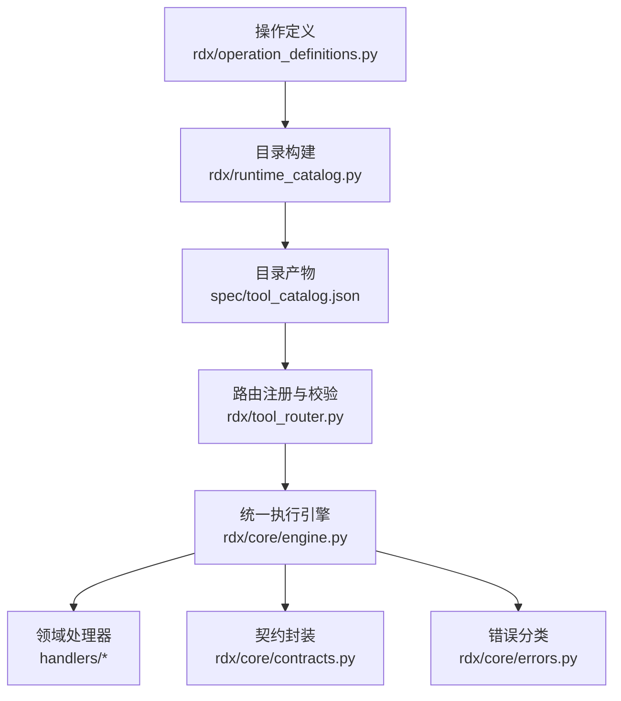
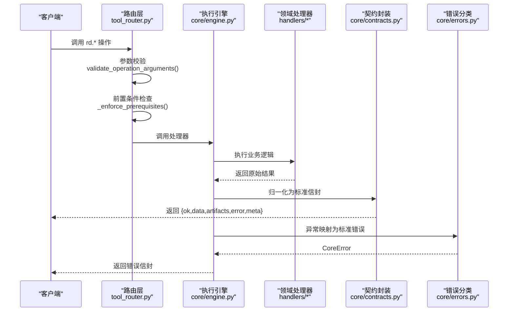
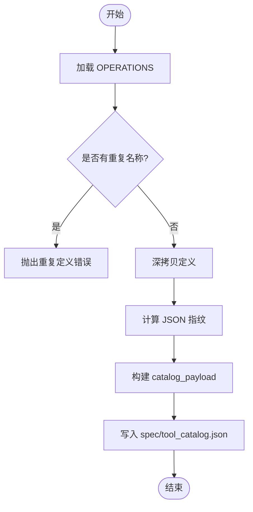
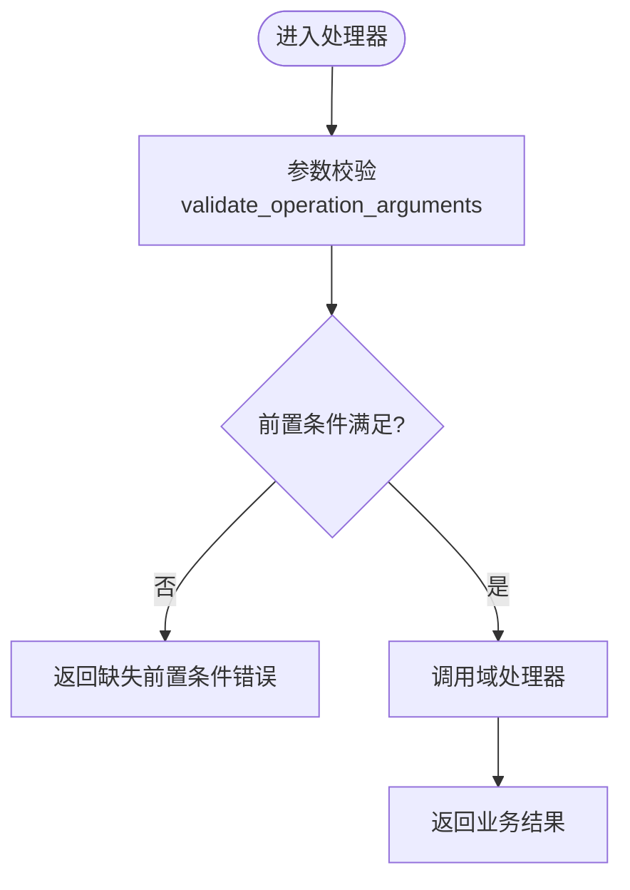
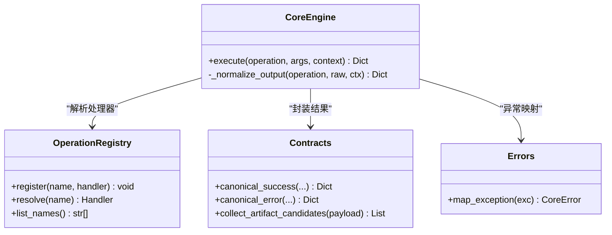
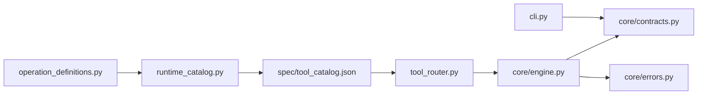

# 接口升级

<cite>
**本文引用的文件**
- [docs/tool-interface-upgrade.md](file://docs/tool-interface-upgrade.md)
- [docs/public-contract.md](file://docs/public-contract.md)
- [rdx/operation_definitions.py](file://rdx/operation_definitions.py)
- [rdx/runtime_catalog.py](file://rdx/runtime_catalog.py)
- [spec/tool_catalog.json](file://spec/tool_catalog.json)
- [rdx/tool_router.py](file://rdx/tool_router.py)
- [rdx/core/contracts.py](file://rdx/core/contracts.py)
- [rdx/core/engine.py](file://rdx/core/engine.py)
- [rdx/core/errors.py](file://rdx/core/errors.py)
- [rdx/cli.py](file://rdx/cli.py)
</cite>

## 目录
1. [简介](#简介)
2. [项目结构](#项目结构)
3. [核心组件](#核心组件)
4. [架构总览](#架构总览)
5. [详细组件分析](#详细组件分析)
6. [依赖关系分析](#依赖关系分析)
7. [性能考虑](#性能考虑)
8. [故障排查指南](#故障排查指南)
9. [结论](#结论)
10. [附录：升级案例与迁移实践](#附录：升级案例与迁移实践)

## 简介
本文件面向 RDC-Tool 的接口升级与兼容性管理，聚焦以下目标：
- 明确工具接口的演进策略：向后兼容保证、废弃标记与迁移路径。
- 说明操作定义的版本管理机制：版本检测、条件执行与降级支持。
- 阐述公共契约管理：接口规范定义、变更影响评估与兼容性测试。
- 提供升级案例研究：重大版本升级、功能增强与缺陷修复的迁移指南。
- 解释客户端适配策略：自动检测、手动配置与回滚机制。
- 给出升级最佳实践：渐进式部署、灰度发布与监控告警。
- 指导如何编写兼容新旧版本的代码：条件分支、特性检测与优雅降级。

## 项目结构
RDC-Tool 通过“代码即契约”的方式维护公开接口集合，所有公开操作定义集中在单一模块，运行时由目录发现生成 JSON 目录，并在路由层进行参数校验与前置条件检查，最终分发到各域处理器执行。

图表来源
- [rdx/operation_definitions.py:1-20](file://rdx/operation_definitions.py#L1-L20)
- [rdx/runtime_catalog.py:13-28](file://rdx/runtime_catalog.py#L13-L28)
- [spec/tool_catalog.json:1-25](file://spec/tool_catalog.json#L1-L25)
- [rdx/tool_router.py:56-156](file://rdx/tool_router.py#L56-L156)
- [rdx/core/engine.py:30-75](file://rdx/core/engine.py#L30-L75)
- [rdx/core/contracts.py:98-164](file://rdx/core/contracts.py#L98-L164)
- [rdx/core/errors.py:9-121](file://rdx/core/errors.py#L9-L121)

章节来源
- [rdx/operation_definitions.py:1-20](file://rdx/operation_definitions.py#L1-L20)
- [rdx/runtime_catalog.py:13-28](file://rdx/runtime_catalog.py#L13-L28)
- [spec/tool_catalog.json:1-25](file://spec/tool_catalog.json#L1-L25)
- [rdx/tool_router.py:56-156](file://rdx/tool_router.py#L56-L156)
- [rdx/core/engine.py:30-75](file://rdx/core/engine.py#L30-L75)
- [rdx/core/contracts.py:98-164](file://rdx/core/contracts.py#L98-L164)
- [rdx/core/errors.py:9-121](file://rdx/core/errors.py#L9-L121)

## 核心组件
- 操作定义与目录：以 Python 列表集中声明所有公开操作，包含名称、分组、描述、参数 schema、前置条件、作用域与副作用等元数据；运行时复制并计算指纹，生成稳定目录。
- 路由与前置条件：根据目录将操作名解析为域处理器，调用前按 input_schema 校验参数，并按 prerequisites 与 when 条件检查运行期上下文（如 session_id、remote_id）。
- 统一执行引擎：负责异常映射、输出归一化、制品发布、耗时统计与 trace_id 注入。
- 契约与错误：统一成功/失败信封格式，包含 schema_version、tool_version、result_kind、ok、data、artifacts、error、meta、projections；错误按类别标准化。
- CLI 与版本信息：CLI 暴露 rdx version --json 等能力，输出 schema_version、平台、入口点与兼容性元数据。

章节来源
- [rdx/operation_definitions.py:1-800](file://rdx/operation_definitions.py#L1-L800)
- [rdx/runtime_catalog.py:17-91](file://rdx/runtime_catalog.py#L17-L91)
- [rdx/tool_router.py:60-156](file://rdx/tool_router.py#L60-L156)
- [rdx/core/engine.py:30-200](file://rdx/core/engine.py#L30-L200)
- [rdx/core/contracts.py:14-164](file://rdx/core/contracts.py#L14-L164)
- [rdx/core/errors.py:9-121](file://rdx/core/errors.py#L9-L121)
- [rdx/cli.py:535-550](file://rdx/cli.py#L535-L550)

## 架构总览
下图展示一次工具调用的端到端流程，包括目录发现、参数校验、前置条件检查、处理器执行、结果归一化与错误处理。

图表来源
- [rdx/tool_router.py:80-156](file://rdx/tool_router.py#L80-L156)
- [rdx/core/engine.py:40-75](file://rdx/core/engine.py#L40-L75)
- [rdx/core/contracts.py:98-164](file://rdx/core/contracts.py#L98-L164)
- [rdx/core/errors.py:90-121](file://rdx/core/errors.py#L90-L121)

## 详细组件分析

### 操作定义与目录管理
- 单一定义源：所有公开操作在 operation_definitions.py 中以结构化字典声明，包含 name、group、description、parameter_raw、returns_raw、param_names、prerequisites、namespace、input_schema、scope、effects、evidence_kind、path_inputs。
- 目录构建：runtime_catalog.py 读取 OPERATIONS，去重校验后复制并计算 JSON 指纹，生成 catalog_payload，供 CLI 和外部消费者使用。
- 目录产物：spec/tool_catalog.json 是生成的只读产物，包含 schema_version、source_path、fingerprint、tool_count、groups、tools。

图表来源
- [rdx/runtime_catalog.py:17-28](file://rdx/runtime_catalog.py#L17-L28)
- [spec/tool_catalog.json:1-25](file://spec/tool_catalog.json#L1-L25)

章节来源
- [rdx/operation_definitions.py:1-800](file://rdx/operation_definitions.py#L1-L800)
- [rdx/runtime_catalog.py:17-91](file://rdx/runtime_catalog.py#L17-L91)
- [spec/tool_catalog.json:1-25](file://spec/tool_catalog.json#L1-L25)

### 路由与前置条件检查
- 路由注册：tool_router.py 从 server_runtime._load_tool_catalog() 获取目录，建立 _TOOL_INDEX，并为每个 rd.* 操作创建异步处理器，先做参数校验，再做前置条件检查，最后调用对应域处理器。
- 前置条件：支持 requires 字段（capture_file_id、session_id、remote_id、active_event_id、capability.remote），以及 when 条件（如 options.remote_id_present）控制是否生效。
- 参数校验：validate_operation_arguments 基于 input_schema 进行类型、枚举、长度、范围、required、additionalProperties、oneOf/not 等约束检查。

图表来源
- [rdx/tool_router.py:80-156](file://rdx/tool_router.py#L80-L156)
- [rdx/runtime_catalog.py:38-91](file://rdx/runtime_catalog.py#L38-L91)

章节来源
- [rdx/tool_router.py:60-156](file://rdx/tool_router.py#L60-L156)
- [rdx/runtime_catalog.py:38-91](file://rdx/runtime_catalog.py#L38-L91)

### 统一执行引擎与契约封装
- 执行流程：CoreEngine.execute 解析操作、调用处理器、捕获异常、归一化输出、注入 trace_id/transport/duration_ms。
- 输出归一化：支持多种原始返回格式（字符串 JSON、旧 success/error_message、新 ok/data/artifacts/error/meta），统一转换为 canonical_success/canonical_error。
- 制品发布：collect_artifact_candidates 收集路径/URL，ArtifactPublisher 发布制品。
- 错误分类：map_exception 将常见异常映射为 CoreError 子类，确保错误类别稳定。

图表来源
- [rdx/core/engine.py:30-200](file://rdx/core/engine.py#L30-L200)
- [rdx/core/contracts.py:98-164](file://rdx/core/contracts.py#L98-L164)
- [rdx/core/errors.py:90-121](file://rdx/core/errors.py#L90-L121)

章节来源
- [rdx/core/engine.py:30-200](file://rdx/core/engine.py#L30-L200)
- [rdx/core/contracts.py:98-164](file://rdx/core/contracts.py#L98-L164)
- [rdx/core/errors.py:90-121](file://rdx/core/errors.py#L90-L121)

### 版本管理与兼容性检测
- 版本常量：SCHEMA_VERSION = "3.0.0"，用于信封与 CLI 版本输出。
- CLI 版本输出：rdx version --json 输出 tool_version、schema_version、platform、entrypoints、compatibility 等元数据。
- 目录指纹：catalog_payload 中的 fingerprint 用于检测目录变化，便于客户端判断是否需要更新或切换行为。
- 未知操作与参数：public contract 明确未知操作与未知参数在执行前失败，不保留别名转发，避免隐式兼容导致的不确定性。

章节来源
- [rdx/core/contracts.py:14-24](file://rdx/core/contracts.py#L14-L24)
- [rdx/cli.py:535-550](file://rdx/cli.py#L535-L550)
- [rdx/runtime_catalog.py:24-28](file://rdx/runtime_catalog.py#L24-L28)
- [docs/public-contract.md:1-26](file://docs/public-contract.md#L1-L26)

## 依赖关系分析
- 低耦合高内聚：操作定义与目录构建独立于 GPU/runtime 启动；路由层仅依赖目录与处理器映射；执行引擎统一封装契约与错误。
- 直接依赖：
  - tool_router 依赖 runtime_catalog、server_runtime、各 handlers。
  - engine 依赖 contracts、errors、operation_registry、artifact_publisher。
  - cli 依赖 contracts、runtime_paths、version payload。
- 间接依赖：
  - 处理器依赖具体服务（pipeline_service、render_service、session_manager 等），但对外仅暴露统一信封。

图表来源
- [rdx/operation_definitions.py:1-20](file://rdx/operation_definitions.py#L1-L20)
- [rdx/runtime_catalog.py:13-28](file://rdx/runtime_catalog.py#L13-L28)
- [spec/tool_catalog.json:1-25](file://spec/tool_catalog.json#L1-L25)
- [rdx/tool_router.py:56-156](file://rdx/tool_router.py#L56-L156)
- [rdx/core/engine.py:30-75](file://rdx/core/engine.py#L30-L75)
- [rdx/core/contracts.py:98-164](file://rdx/core/contracts.py#L98-L164)
- [rdx/core/errors.py:90-121](file://rdx/core/errors.py#L90-L121)
- [rdx/cli.py:535-550](file://rdx/cli.py#L535-L550)

章节来源
- [rdx/tool_router.py:56-156](file://rdx/tool_router.py#L56-L156)
- [rdx/core/engine.py:30-75](file://rdx/core/engine.py#L30-L75)
- [rdx/core/contracts.py:98-164](file://rdx/core/contracts.py#L98-L164)
- [rdx/core/errors.py:90-121](file://rdx/core/errors.py#L90-L121)
- [rdx/cli.py:535-550](file://rdx/cli.py#L535-L550)

## 性能考虑
- 目录构建与指纹计算在启动时完成，避免运行时重复开销。
- 参数校验在路由层尽早失败，减少无效调用。
- 执行引擎记录 duration_ms，便于性能分析与瓶颈定位。
- 制品发布按需进行，避免不必要的 I/O。

[本节提供通用指导，无需特定文件引用]

## 故障排查指南
- 未知操作或参数：路由层会返回 validation_error 或 missing_prerequisite_* 错误，检查操作名与参数是否符合 input_schema 与 prerequisites。
- 前置条件缺失：当缺少 capture_file_id、session_id、remote_id 等时，返回结构化错误，提示需先调用哪些工具。
- 异常映射：map_exception 将常见异常映射为稳定类别，便于上层统一处理与告警。
- 版本不一致：通过 rdx version --json 检查 schema_version 与 tool_version，结合 catalog fingerprint 判断目录是否变化。

章节来源
- [rdx/tool_router.py:64-128](file://rdx/tool_router.py#L64-L128)
- [rdx/core/engine.py:62-75](file://rdx/core/engine.py#L62-L75)
- [rdx/core/errors.py:90-121](file://rdx/core/errors.py#L90-L121)
- [rdx/cli.py:535-550](file://rdx/cli.py#L535-L550)

## 结论
RDC-Tool 采用“代码即契约”的接口管理模式，通过集中定义、目录生成、严格校验与统一信封，实现清晰的接口演进与强一致的兼容性边界。删除与替换策略在文档中明确记录，运行时不提供别名转发，确保客户端必须显式适配新版本。配合版本检测、前置条件与错误分类，可在升级过程中实现可控的迁移与回滚。

[本节总结性内容，无需特定文件引用]

## 附录：升级案例与迁移实践

### 接口演进策略
- 向后兼容保证：通过稳定的 JSON 信封与 schema_version，客户端可识别协议版本；新增可选参数与扩展字段遵循 additionalProperties=false 的严格模式，避免歧义。
- 废弃标记：docs/tool-interface-upgrade.md 列出已移除操作及替代方案，作为迁移依据；运行时不接受旧名称。
- 迁移路径规划：优先使用现有 primitive 组合替代宏与包装；必要时新增独立操作，不以恢复旧名称为目标。

章节来源
- [docs/tool-interface-upgrade.md:1-204](file://docs/tool-interface-upgrade.md#L1-L204)
- [docs/public-contract.md:1-26](file://docs/public-contract.md#L1-L26)

### 操作定义的版本管理
- 版本检测：通过 rdx version --json 获取 schema_version 与 tool_version；catalog fingerprint 用于检测目录变化。
- 条件执行：prerequisites 的 when 条件支持选项级开关（如 options.remote_id_present），实现条件化前置检查。
- 降级支持：未知操作与未知参数在执行前失败，客户端应基于能力矩阵与目录信息进行降级或回退。

章节来源
- [rdx/cli.py:535-550](file://rdx/cli.py#L535-L550)
- [rdx/runtime_catalog.py:24-28](file://rdx/runtime_catalog.py#L24-L28)
- [rdx/tool_router.py:80-128](file://rdx/tool_router.py#L80-L128)

### 公共契约管理
- 接口规范定义：operation_definitions.py 中的 input_schema 与 prerequisites 构成契约；catalog 与 reference 由代码生成，保持一致。
- 变更影响评估：对照 docs/tool-interface-upgrade.md 的删除/替换表，评估对上游的影响；必要时补充 primitive 参数或结果。
- 兼容性测试：通过 CLI 健康检查与目录指纹比对，验证环境完整性与目录一致性。

章节来源
- [rdx/operation_definitions.py:1-800](file://rdx/operation_definitions.py#L1-L800)
- [docs/tool-interface-upgrade.md:206-332](file://docs/tool-interface-upgrade.md#L206-L332)
- [rdx/cli.py:509-532](file://rdx/cli.py#L509-L532)

### 升级案例研究
- 重大版本升级：移除大量旧入口，改用统一查询与可编程组合；客户端需更新调用链，使用新的 primitive 组合替代宏。
- 功能增强：恢复部分必要能力（如 capture thumbnail、structured API queries、descriptor stores、完整 pipeline sections），提升诊断与分析能力。
- 缺陷修复：修正 viewport/scissor、blend、depth/stencil 等状态读取缺口，提供更完整的原始证据。

章节来源
- [docs/tool-interface-upgrade.md:206-332](file://docs/tool-interface-upgrade.md#L206-L332)

### 客户端适配策略
- 自动检测：使用 rdx version --json 与 catalog fingerprint 检测版本与目录变化；根据 capabilities 与 tool graph 选择合适操作。
- 手动配置：通过 --daemon-context 隔离上下文；根据 remote capability matrix 选择后端。
- 回滚机制：未知操作失败时，客户端应回退到已知兼容的操作集；必要时重启会话或切换上下文。

章节来源
- [docs/public-contract.md:1-26](file://docs/public-contract.md#L1-L26)
- [rdx/tool_router.py:80-128](file://rdx/tool_router.py#L80-L128)
- [rdx/core/engine.py:40-75](file://rdx/core/engine.py#L40-L75)

### 升级最佳实践
- 渐进式部署：先在非生产环境验证目录指纹与能力矩阵，再逐步推广。
- 灰度发布：小范围启用新功能，观察错误率与性能指标，确认稳定后再全量。
- 监控告警：基于 duration_ms、错误类别与最近操作统计设置阈值告警，快速定位问题。

[本节提供通用指导，无需特定文件引用]

### 兼容新旧版本的代码编写
- 条件分支：基于 capabilities 与 tool graph 选择操作；对缺失能力走降级路径。
- 特性检测：使用 rdx.core.get_capabilities 与 rdx.core.list_tools 探测可用能力与工具。
- 优雅降级：当新操作不可用时，回退到旧操作或组合 primitive；失败时返回结构化错误，便于上层处理。

章节来源
- [rdx/operation_definitions.py:1-800](file://rdx/operation_definitions.py#L1-L800)
- [rdx/tool_router.py:80-128](file://rdx/tool_router.py#L80-L128)
- [rdx/core/engine.py:40-75](file://rdx/core/engine.py#L40-L75)