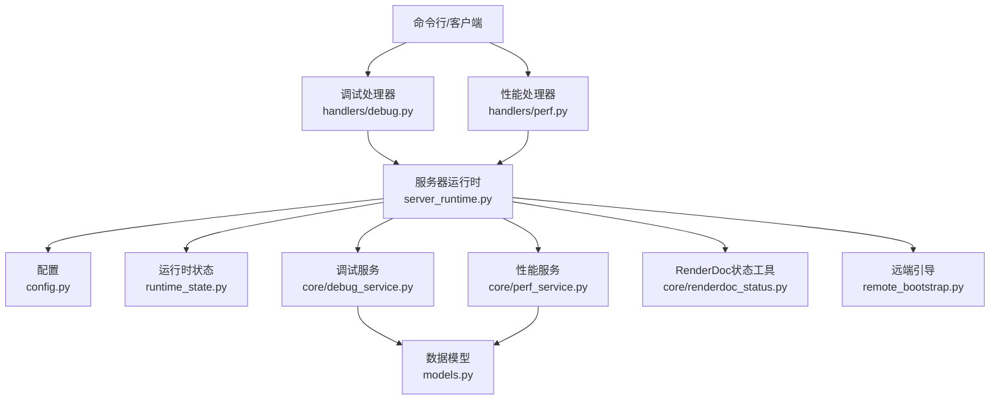
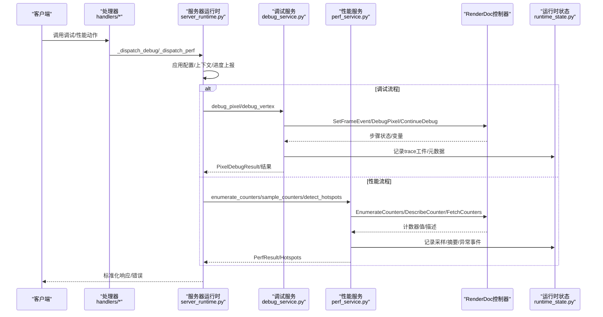
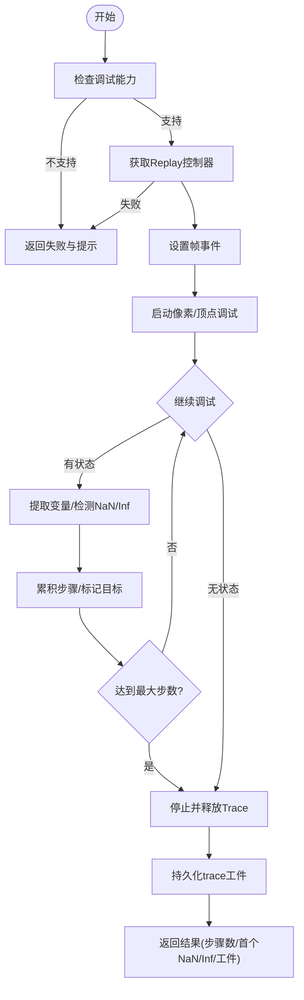
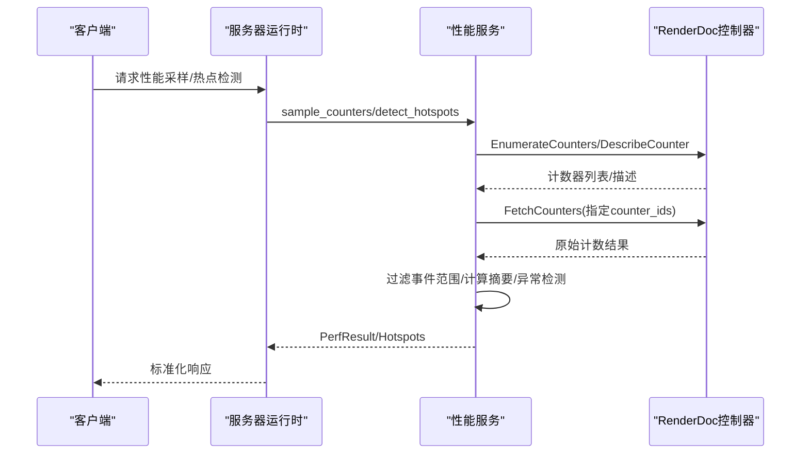
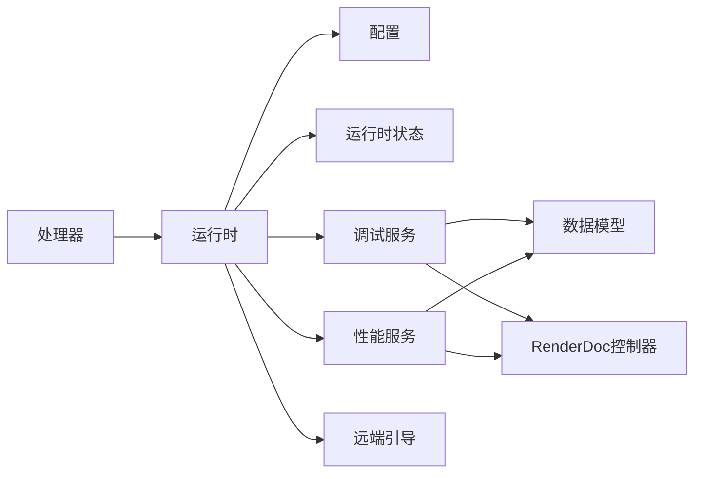

# 监控与调试

<cite>
**本文引用的文件**
- [debug_service.py](file://rdx/core/debug_service.py)
- [perf_service.py](file://rdx/core/perf_service.py)
- [server_runtime.py](file://rdx/server_runtime.py)
- [config.py](file://rdx/config.py)
- [models.py](file://rdx/models.py)
- [renderdoc_status.py](file://rdx/core/renderdoc_status.py)
- [runtime_state.py](file://rdx/runtime_state.py)
- [debug.py](file://rdx/handlers/debug.py)
- [perf.py](file://rdx/handlers/perf.py)
- [remote_bootstrap.py](file://rdx/remote_bootstrap.py)
</cite>

## 目录
1. [简介](#简介)
2. [项目结构](#项目结构)
3. [核心组件](#核心组件)
4. [架构总览](#架构总览)
5. [详细组件分析](#详细组件分析)
6. [依赖关系分析](#依赖关系分析)
7. [性能考量](#性能考量)
8. [故障排除指南](#故障排除指南)
9. [结论](#结论)
10. [附录](#附录)

## 简介
本指南面向RDC-Tool的高级用户与维护者，聚焦内置监控与调试能力：性能指标采集、资源使用监控、健康检查、日志级别控制、调试输出格式化、远程调试支持、问题诊断工具链（堆栈跟踪、内存泄漏检测、性能瓶颈定位）、实时监控（指标导出、告警规则、可视化仪表板）、系统化故障排除方法以及自定义监控与调试工具的构建实践。内容基于代码库中的服务层实现与运行时编排进行说明，并提供可操作的流程图与时序图帮助理解数据与控制流。

## 项目结构
RDC-Tool的监控与调试能力主要由以下层次构成：
- 处理器层：将外部调用路由到具体功能模块（如调试、性能）。
- 运行时层：统一调度、上下文管理、状态持久化、配置注入、错误标准化。
- 服务层：封装底层RenderDoc能力，提供异步接口（调试、性能计数等）。
- 模型层：定义结构化数据模型，保证跨层一致性与可序列化。
- 配置与环境：通过环境变量与配置对象驱动行为（日志级别、路径、限制等）。
- 远端引导：支持Android/远程设备连接与生命周期管理。

图表来源
- [debug.py:1-11](file://rdx/handlers/debug.py#L1-L11)
- [perf.py:1-11](file://rdx/handlers/perf.py#L1-L11)
- [server_runtime.py:1-120](file://rdx/server_runtime.py#L1-L120)
- [config.py:117-186](file://rdx/config.py#L117-L186)
- [runtime_state.py:104-149](file://rdx/runtime_state.py#L104-L149)
- [debug_service.py:43-120](file://rdx/core/debug_service.py#L43-L120)
- [perf_service.py:212-320](file://rdx/core/perf_service.py#L212-L320)
- [renderdoc_status.py:10-105](file://rdx/core/renderdoc_status.py#L10-L105)
- [remote_bootstrap.py:1-784](file://rdx/remote_bootstrap.py#L1-L784)

章节来源
- [debug.py:1-11](file://rdx/handlers/debug.py#L1-L11)
- [perf.py:1-11](file://rdx/handlers/perf.py#L1-L11)
- [server_runtime.py:1-120](file://rdx/server_runtime.py#L1-L120)
- [config.py:117-186](file://rdx/config.py#L117-L186)
- [runtime_state.py:104-149](file://rdx/runtime_state.py#L104-L149)

## 核心组件
- 调试服务（DebugService）：围绕RenderDoc的Shader调试原语，提供像素/顶点着色器逐步执行、NaN/Inf检测、trace持久化、最大步数保护。
- 性能服务（PerfService）：枚举GPU计数器、采样指定事件范围、生成每事件样本与统计摘要、异常事件检测、热点事件识别。
- 服务器运行时（ServerRuntime）：统一入口、上下文与进度上报、配置应用、状态持久化、错误标准化、预览与远端集成。
- 配置（RdxConfig）：集中管理后端、重放、工件存储、数据库、二分搜索、补丁、报告、置信度权重、快照保留、运行时限制、日志级别等。
- 数据模型（Models）：定义会话、捕获、事件树、异常、着色器、补丁、实验、二分、性能计数器、报告等结构化类型。
- RenderDoc状态工具：统一解析RenderDoc返回的状态码与文本，构造错误详情并抛出标准化异常。
- 运行时状态：持久化上下文、会话、捕获、恢复信息、操作历史、度量指标；提供并发安全写入与读取。
- 处理器：将外部调用分发到运行时调度器，保持轻量路由职责。
- 远端引导：Android/远程设备的连接、端口转发、生命周期管理与描述。

章节来源
- [debug_service.py:43-120](file://rdx/core/debug_service.py#L43-L120)
- [perf_service.py:212-320](file://rdx/core/perf_service.py#L212-L320)
- [server_runtime.py:230-390](file://rdx/server_runtime.py#L230-L390)
- [config.py:117-186](file://rdx/config.py#L117-L186)
- [models.py:103-140](file://rdx/models.py#L103-L140)
- [renderdoc_status.py:10-105](file://rdx/core/renderdoc_status.py#L10-L105)
- [runtime_state.py:104-149](file://rdx/runtime_state.py#L104-L149)
- [debug.py:1-11](file://rdx/handlers/debug.py#L1-L11)
- [perf.py:1-11](file://rdx/handlers/perf.py#L1-L11)
- [remote_bootstrap.py:1-784](file://rdx/remote_bootstrap.py#L1-L784)

## 架构总览
下图展示从处理器到服务层的调用链路与数据流向，包括渲染后端状态处理与运行时状态持久化。

图表来源
- [debug.py:1-11](file://rdx/handlers/debug.py#L1-L11)
- [perf.py:1-11](file://rdx/handlers/perf.py#L1-L11)
- [server_runtime.py:230-390](file://rdx/server_runtime.py#L230-L390)
- [debug_service.py:54-267](file://rdx/core/debug_service.py#L54-L267)
- [perf_service.py:235-487](file://rdx/core/perf_service.py#L235-L487)
- [runtime_state.py:448-472](file://rdx/runtime_state.py#L448-L472)

## 详细组件分析

### 调试服务（DebugService）
- 能力概述：
  - 像素着色器调试：步进执行、NaN/Inf检测、模式选择（run_to_naninf/full_trace）、最大步数上限。
  - 顶点着色器调试：按顶点/实例索引步进执行，收集寄存器变量。
  - Trace持久化：将步骤与变量序列化为JSON工件，便于离线分析。
  - 能力检测：根据会话能力或API启发式判断是否支持Shader调试。
- 关键流程：
  - 获取Replay控制器，设置帧事件，启动调试会话。
  - 循环ContinueDebug，提取变量，检测NaN/Inf，累积步骤。
  - 释放Trace资源，避免驱动资源泄露。
  - 持久化trace工件，包含会话、事件、像素坐标、模式、步骤摘要。
- 错误处理：
  - 不支持的API/驱动时返回ok=False并附带notes。
  - renderdoc模块不可用时提示环境配置。
  - ContinueDebug异常被捕获并记录警告，防止中断整体流程。

图表来源
- [debug_service.py:54-267](file://rdx/core/debug_service.py#L54-L267)
- [debug_service.py:427-490](file://rdx/core/debug_service.py#L427-L490)
- [debug_service.py:573-614](file://rdx/core/debug_service.py#L573-L614)

章节来源
- [debug_service.py:43-120](file://rdx/core/debug_service.py#L43-L120)
- [debug_service.py:122-267](file://rdx/core/debug_service.py#L122-L267)
- [debug_service.py:271-421](file://rdx/core/debug_service.py#L271-L421)
- [debug_service.py:427-490](file://rdx/core/debug_service.py#L427-L490)
- [debug_service.py:573-614](file://rdx/core/debug_service.py#L573-L614)

### 性能服务（PerfService）
- 能力概述：
  - 枚举GPU计数器及其描述（名称、单位、结果类型）。
  - 在指定事件范围内采样计数器，生成per-event样本与per-counter摘要（最小、最大、均值、P95、热点事件）。
  - 异常事件检测：基于z-score阈值（mean + 3*std）识别异常事件。
  - 热点检测：基于GPU duration计数器识别最慢事件Top-K。
  - 整帧测量：读取原生全回放GPU时间戳，用于整体性能评估。
- 关键流程：
  - 延迟导入renderdoc模块，避免在无环境时阻塞加载。
  - 通过线程池执行同步控制器调用，避免阻塞异步事件循环。
  - 过滤事件范围，构建样本与摘要，计算统计量与异常集合。
  - 返回PerfResult，包含samples、summaries、anomaly_events。
- 错误处理：
  - 控制器获取失败、枚举/描述/抓取失败均抛出运行时错误并记录日志。
  - 计数器值非有限或格式不匹配时拒绝并提示更新运行时。

图表来源
- [perf_service.py:235-487](file://rdx/core/perf_service.py#L235-L487)
- [perf_service.py:493-618](file://rdx/core/perf_service.py#L493-L618)
- [perf_service.py:28-64](file://rdx/core/perf_service.py#L28-L64)

章节来源
- [perf_service.py:212-320](file://rdx/core/perf_service.py#L212-L320)
- [perf_service.py:314-487](file://rdx/core/perf_service.py#L314-L487)
- [perf_service.py:493-618](file://rdx/core/perf_service.py#L493-L618)

### 服务器运行时（ServerRuntime）
- 职责：
  - 统一调度处理器调用，应用配置与上下文，记录操作阶段与进度。
  - 管理会话、捕获、预览、远端连接、着色器替换等运行时资源。
  - 标准化错误与响应，确保跨层一致性。
  - 持久化上下文状态与最近操作，提供度量指标。
- 关键点：
  - 配置应用：支持动态调整日志级别、工件目录、二分策略、置信度权重、运行时限制等。
  - 上下文容量：限制同时存在的上下文数量，防止资源耗尽。
  - 预览同步：自动同步预览状态，确保UI与后端一致。
  - 远端集成：支持Android/远程设备连接与生命周期管理。

章节来源
- [server_runtime.py:230-390](file://rdx/server_runtime.py#L230-L390)
- [server_runtime.py:413-468](file://rdx/server_runtime.py#L413-L468)
- [server_runtime.py:647-800](file://rdx/server_runtime.py#L647-L800)

### 配置与环境（RdxConfig）
- 环境变量覆盖：
  - RDX_RENDERDOC_PATH：补充renderdoc模块路径。
  - RDX_ARTIFACT_STORE/RDX_DATA_DIR/RDX_REPORT_DIR：工件、数据库、报告输出路径。
  - RDX_LOG_LEVEL：日志级别。
  - RDX_GPU_VENDOR/RDX_SPIRV_TOOLS_PATH/RDX_HEADLESS：后端与编译工具相关。
  - RDX_BISECT_*：二分搜索策略与置信度权重。
  - RDX_CONTEXT_ARTIFACT_*：上下文工件保留限制。
  - RDX_MAX_*：运行时限制（上下文、会话、捕获文件大小、内存估计等）。
- 配置结构：
  - BackendConfig、ReplayConfig、WorkerConfig、ArtifactConfig、DatabaseConfig、BisectConfig、PatchConfig、ReportConfig、ConfidenceWeightsConfig、SnapshotRetentionConfig、RuntimeLimitsConfig、AdaptiveBisectConfig。

章节来源
- [config.py:117-186](file://rdx/config.py#L117-L186)

### 数据模型（Models）
- 关键模型：
  - ArtifactRef、ErrorDetail、ToolResponse：通用响应封装。
  - SessionCapabilities、SessionInfo、CaptureInfo：会话与捕获元数据。
  - EventNode、PipelineSnapshot：事件树与管线快照。
  - DebugStep、PixelDebugResult：调试轨迹与结果。
  - CounterSample、CounterSummary、PerfResult：性能采样与摘要。
  - PatchSpec、ExperimentResult、BisectResult：补丁、实验与二分定位。
- 作用：
  - 保证跨层数据结构一致性与可序列化性。
  - 为监控与调试输出提供稳定契约。

章节来源
- [models.py:103-140](file://rdx/models.py#L103-L140)
- [models.py:319-332](file://rdx/models.py#L319-L332)
- [models.py:463-483](file://rdx/models.py#L463-L483)

### RenderDoc状态工具（renderdoc_status）
- 功能：
  - 解析RenderDoc状态对象，提取OK标志、消息文本、代码名称与原始代码。
  - 构建结构化错误详情，包含来源层、操作、后端类型、捕获上下文、分类与修复建议。
  - 抛出标准化异常，便于上层统一处理。
- 适用场景：
  - 调试与性能服务中遇到RenderDoc返回状态时的错误归一化。

章节来源
- [renderdoc_status.py:10-105](file://rdx/core/renderdoc_status.py#L10-L105)

### 运行时状态（runtime_state）
- 功能：
  - 持久化上下文状态（会话、捕获、恢复信息、预览、限制、度量、最近操作）。
  - 并发安全写入（文件锁+内存锁），原子追加日志。
  - 提供读取、清理、列出上下文ID等工具函数。
- 监控价值：
  - 通过metrics字段观察操作计数、错误计数、恢复尝试、活跃会话/捕获数量、最近操作耗时分布。
  - 通过recent_operations追踪操作阶段与结果，辅助问题定位。

章节来源
- [runtime_state.py:104-149](file://rdx/runtime_state.py#L104-L149)
- [runtime_state.py:255-290](file://rdx/runtime_state.py#L255-L290)
- [runtime_state.py:448-472](file://rdx/runtime_state.py#L448-L472)

### 处理器（handlers/debug.py, handlers/perf.py）
- 职责：
  - 接收外部调用，转发至服务器运行时的调度方法。
  - 保持处理器轻量，避免业务逻辑耦合。
- 扩展点：
  - 新增动作可通过注册机制接入运行时调度器。

章节来源
- [debug.py:1-11](file://rdx/handlers/debug.py#L1-L11)
- [perf.py:1-11](file://rdx/handlers/perf.py#L1-L11)

### 远端引导（remote_bootstrap）
- 功能：
  - Android远程设备连接、端口转发、APK安装/启动、配置推送。
  - 连接预算与超时控制，取消信号支持。
  - 描述远端设备与连接状态，便于监控与诊断。
- 监控价值：
  - 通过describe_android_remote获取传输、设备、端口、安装模式等信息，辅助远端问题定位。

章节来源
- [remote_bootstrap.py:1-784](file://rdx/remote_bootstrap.py#L1-L784)

## 依赖关系分析
- 组件耦合：
  - 处理器仅依赖运行时调度，低耦合。
  - 运行时依赖配置、状态、服务、远端引导，形成核心编排层。
  - 服务层依赖RenderDoc控制器与数据模型，屏蔽底层差异。
- 外部依赖：
  - RenderDoc Python绑定（延迟导入，可选环境）。
  - 文件系统（工件、日志、状态持久化）。
  - 线程池（异步执行同步控制器调用）。
- 潜在循环依赖：
  - 当前结构清晰，未见明显循环依赖；服务层通过session_manager松耦合访问控制器。

图表来源
- [debug.py:1-11](file://rdx/handlers/debug.py#L1-L11)
- [perf.py:1-11](file://rdx/handlers/perf.py#L1-L11)
- [server_runtime.py:230-390](file://rdx/server_runtime.py#L230-L390)
- [debug_service.py:43-120](file://rdx/core/debug_service.py#L43-L120)
- [perf_service.py:212-320](file://rdx/core/perf_service.py#L212-L320)
- [models.py:103-140](file://rdx/models.py#L103-L140)
- [remote_bootstrap.py:1-784](file://rdx/remote_bootstrap.py#L1-L784)

章节来源
- [server_runtime.py:230-390](file://rdx/server_runtime.py#L230-L390)
- [debug_service.py:43-120](file://rdx/core/debug_service.py#L43-L120)
- [perf_service.py:212-320](file://rdx/core/perf_service.py#L212-L320)

## 性能考量
- 异步与线程池：
  - 性能服务通过run_in_executor将同步控制器调用卸载到线程池，避免阻塞事件循环。
- 计数器采样效率：
  - 批量EnumerateCounters/DescribeCounter/FetchCounters减少往返开销。
  - 事件范围过滤降低无效数据处理。
- 统计计算：
  - P95与标准差计算采用纯Python实现，避免引入重型依赖。
- 资源释放：
  - 调试服务在finally块中释放Trace，防止驱动资源泄露。
- 日志与度量：
  - 运行时状态记录最近操作耗时分布，便于性能基线与回归检测。

[本节为一般性指导，无需特定文件来源]

## 故障排除指南
- 常见问题分类：
  - RenderDoc不可用：模块未找到或版本不匹配，导致调试/性能功能不可用。
  - 控制器获取失败：会话不存在或后端异常。
  - 计数器查询失败：驱动不支持或运行时版本过旧。
  - 状态解析失败：RenderDoc返回状态无法识别。
- 根因分析步骤：
  - 检查日志级别与运行时日志，确认错误上下文。
  - 验证会话能力与API支持（调试/计数器）。
  - 查看运行时状态中的recent_operations与metrics，定位失败阶段。
  - 使用RenderDoc状态工具提取结构化错误详情。
- 解决方案验证：
  - 重新连接远端设备或重启渲染后端。
  - 更新RenderDoc运行时以支持所需计数器/调试能力。
  - 调整配置（如工件路径、日志级别、运行时限制）后重试。

章节来源
- [renderdoc_status.py:57-105](file://rdx/core/renderdoc_status.py#L57-L105)
- [runtime_state.py:448-472](file://rdx/runtime_state.py#L448-L472)
- [config.py:136-186](file://rdx/config.py#L136-L186)

## 结论
RDC-Tool的监控与调试体系以服务层为核心，结合运行时编排、配置与环境变量、持久化状态与结构化模型，提供了完整的性能指标采集、调试轨迹记录、健康检查与错误标准化能力。通过异步与线程池优化、资源释放保障与统计异常检测，系统在保证稳定性的同时具备可扩展性。用户可基于处理器与服务层扩展自定义监控与调试工具，并结合运行时状态与日志进行系统化故障排除。

[本节为总结性内容，无需特定文件来源]

## 附录
- 实时监控实现建议：
  - 指标导出：利用PerfResult与运行时状态中的metrics字段，定期导出JSON/TSV供外部系统消费。
  - 告警规则：基于PerfService的anomaly_events与运行时状态的operation_error_count设定阈值告警。
  - 可视化仪表板：将recent_operations与PerfResult聚合为时序图与热力图，直观展示性能趋势与热点事件。
- 调试最佳实践：
  - 断点使用：在调试服务中通过max_steps与run_to_naninf模式模拟“断点”，快速定位NaN/Inf发生位置。
  - 变量检查：提取寄存器变量并持久化为工件，便于离线分析。
  - 状态快照：利用运行时状态保存上下文快照，复现问题场景。
- 自定义工具构建：
  - 新增处理器：在handlers下添加新模块，实现handle(action, args, env)并注册到运行时调度器。
  - 扩展服务：在服务层封装新的RenderDoc能力或第三方工具，遵循异步接口与错误标准化约定。
  - 配置注入：通过RdxConfig与环境变量暴露可调参数，保持灵活性与可测试性。

[本节为概念性内容，无需特定文件来源]