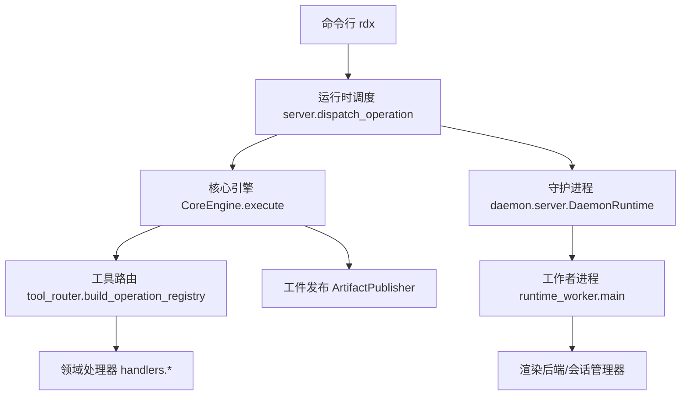
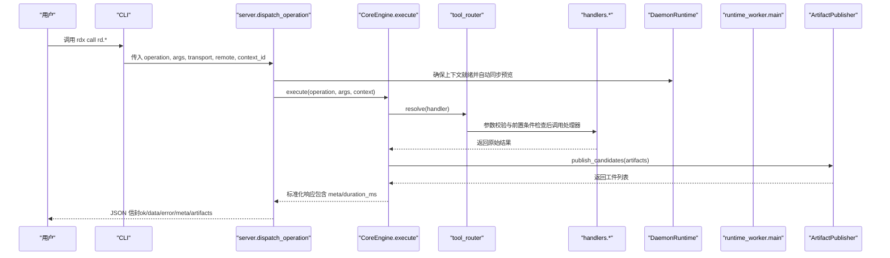
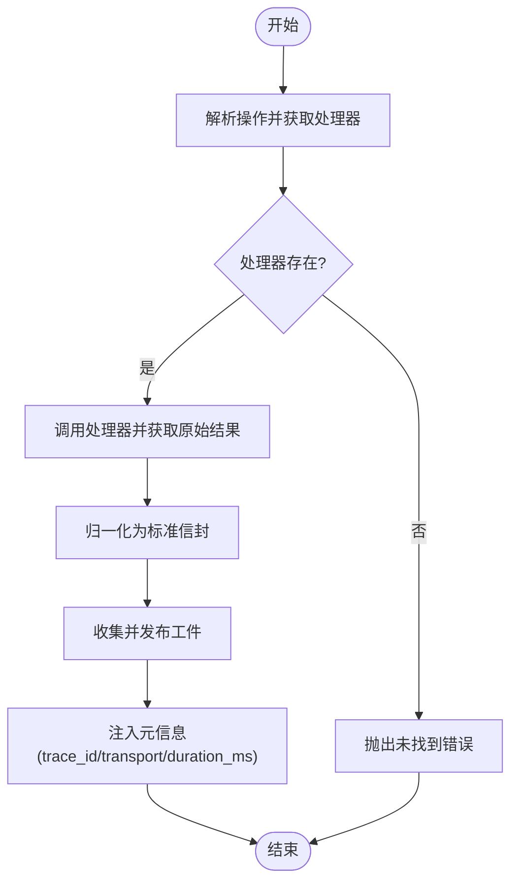
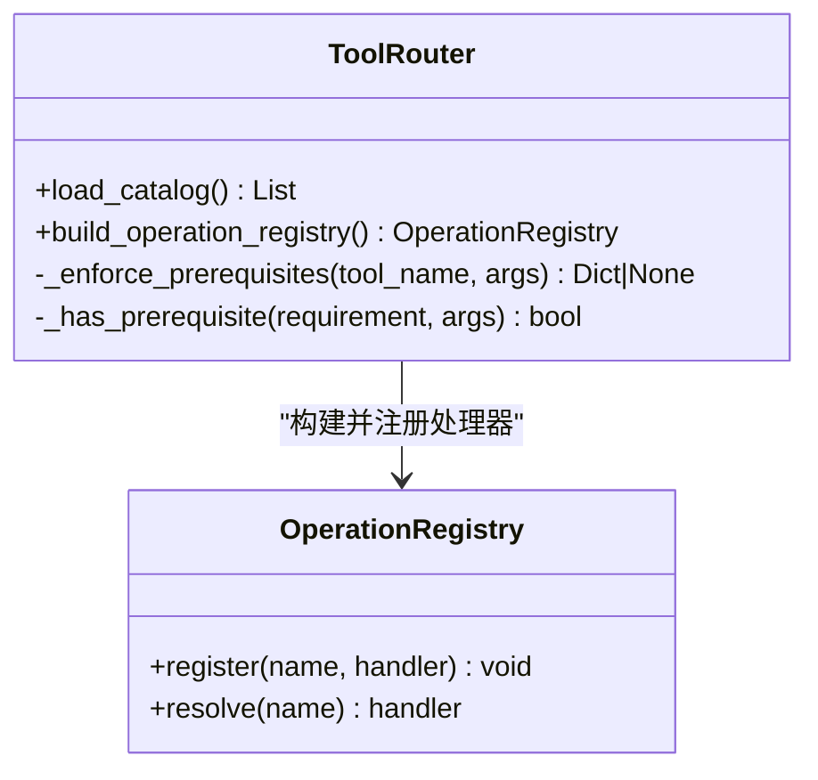
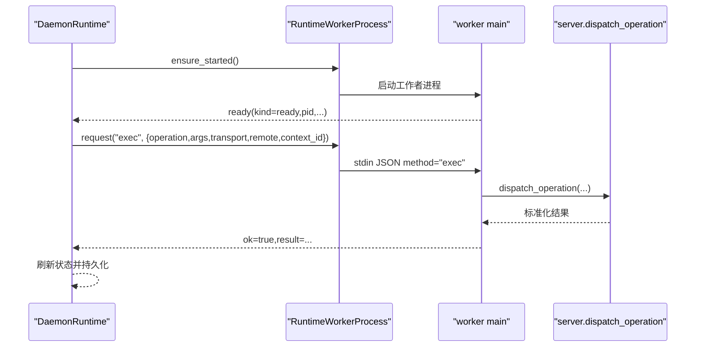
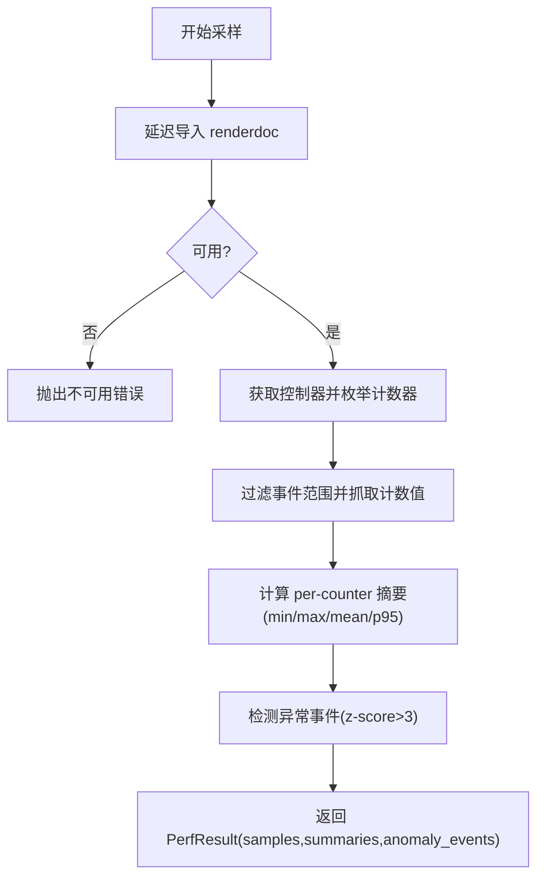
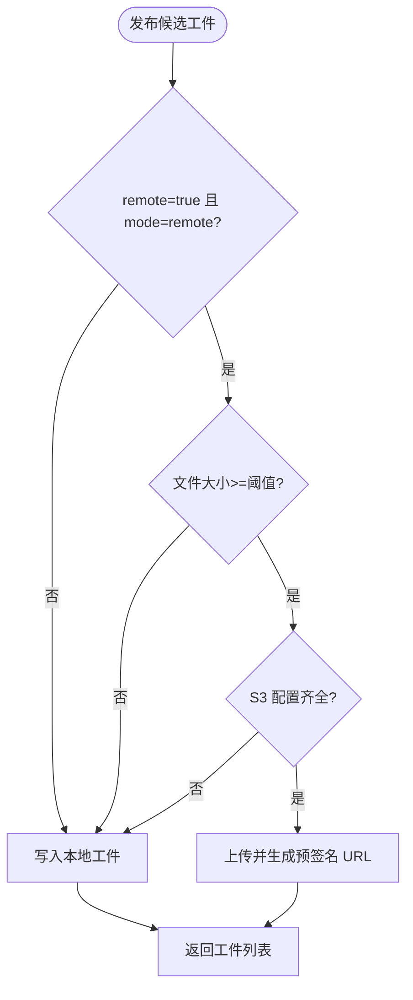
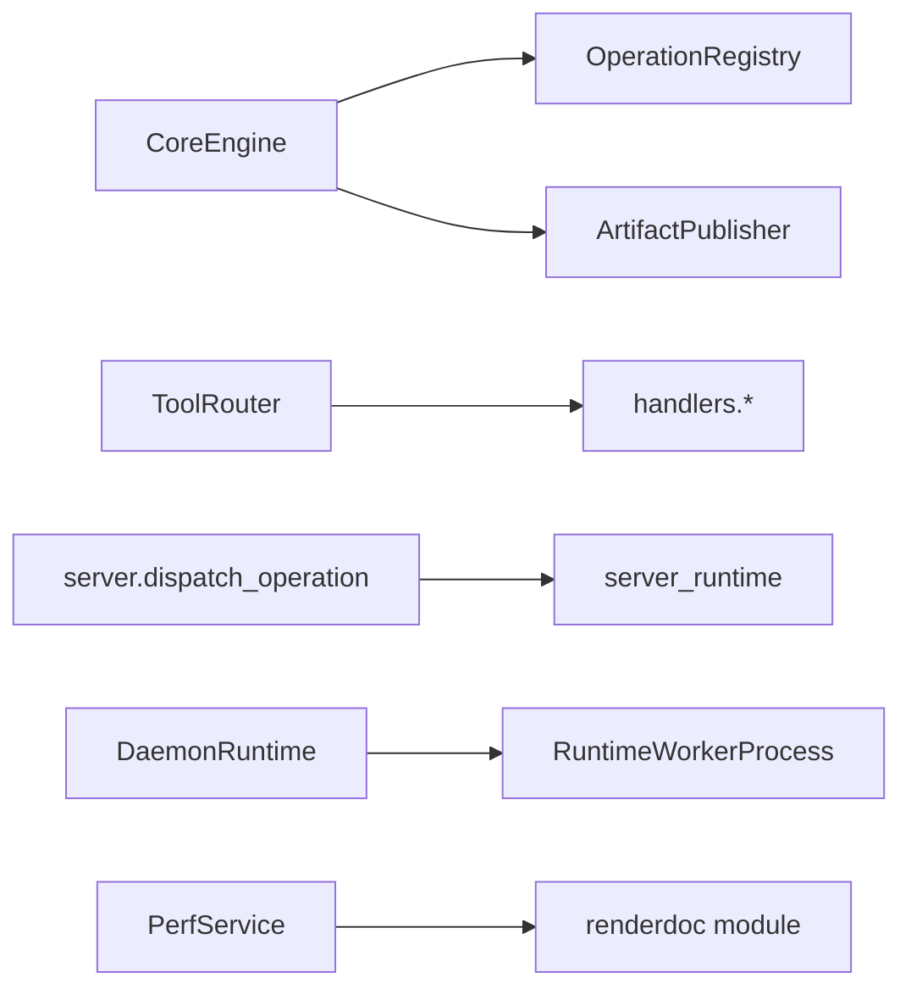

# 高级主题

<cite>
**本文引用的文件**
- [README.md](file://README.md)
- [rdx/server.py](file://rdx/server.py)
- [rdx/core/engine.py](file://rdx/core/engine.py)
- [rdx/tool_router.py](file://rdx/tool_router.py)
- [rdx/config.py](file://rdx/config.py)
- [rdx/core/perf_service.py](file://rdx/core/perf_service.py)
- [rdx/runtimeworker.py](file://rdx/runtime_worker.py)
- [rdx/daemon/server.py](file://rdx/daemon/server.py)
- [rdx/core/artifact_publisher.py](file://rdx/core/artifact_publisher.py)
- [docs/configuration.md](file://docs/configuration.md)
- [docs/tool-interface-upgrade.md](file://docs/tool-interface-upgrade.md)
- [docs/troubleshooting.md](file://docs/troubleshooting.md)
- [docs/tools.md](file://docs/tools.md)
- [docs/stability.md](file://docs/stability.md)
</cite>

## 目录
1. [简介](#简介)
2. [项目结构](#项目结构)
3. [核心组件](#核心组件)
4. [架构总览](#架构总览)
5. [详细组件分析](#详细组件分析)
6. [依赖关系分析](#依赖关系分析)
7. [性能与并发优化](#性能与并发优化)
8. [大规模数据处理最佳实践](#大规模数据处理最佳实践)
9. [安全考虑与防护](#安全考虑与防护)
10. [工具接口演进与迁移指南](#工具接口演进与迁移指南)
11. [高级配置与定制化](#高级配置与定制化)
12. [基准测试、监控与可观测性](#基准测试监控与可观测性)
13. [故障排查与调试技巧](#故障排查与调试技巧)
14. [结论](#结论)

## 简介
本章节面向高级用户与专家，聚焦 RDX-Tool 在高性能回放、远程 Android 回放、会话上下文管理、操作路由、工件发布、GPU 性能采样、守护进程与工作者进程协作等方面的设计与实现。文档围绕以下目标展开：
- 深入说明内存管理与 I/O 优化策略
- 解释并发处理机制与隔离模型
- 阐述插件化扩展、自定义处理器与第三方集成方式
- 提供工具接口升级与向后兼容策略
- 给出高级配置项与定制能力
- 总结大规模数据处理的实践建议
- 覆盖安全考量与防护措施
- 提供性能基准、监控方案与高级调试技巧

## 项目结构
RDX-Tool 采用“CLI + 守护进程 + 工作者进程”的三层架构：
- CLI 通过统一入口调用 `rd.*` 操作，输出稳定的 JSON 信封
- 守护进程负责命名管道通信、生命周期管理、上下文状态持久化与工作者调度
- 工作者进程承载 RenderDoc 后端执行，保证图形状态与回放线程的稳定性
- 核心引擎负责操作解析、参数校验、前置条件检查、结果归一化与工件发布
- 工具路由基于目录与动作将 `rd.domain.action` 分发到具体处理器模块
- 性能服务封装 GPU 计数器枚举、采样、热点检测等能力
- 工件发布支持本地与 S3 远端上传，按大小阈值与模式选择存储后端

**图表来源**
- [rdx/server.py:62-145](file://rdx/server.py#L62-L145)
- [rdx/core/engine.py:40-75](file://rdx/core/engine.py#L40-L75)
- [rdx/tool_router.py:131-154](file://rdx/tool_router.py#L131-L154)
- [rdx/daemon/server.py:452-492](file://rdx/daemon/server.py#L452-L492)
- [rdx/runtimeworker.py:91-161](file://rdx/runtimeworker.py#L91-L161)
- [rdx/core/artifact_publisher.py:60-118](file://rdx/core/artifact_publisher.py#L60-L118)

**章节来源**
- [README.md:1-70](file://README.md#L1-L70)
- [docs/tools.md:1-39](file://docs/tools.md#L1-L39)

## 核心组件
- 核心引擎：统一执行入口，负责异常映射、耗时统计、trace_id 注入、结果归一化与工件发布
- 工具路由：从目录/动作映射到处理器，并执行参数校验与前置条件检查
- 运行时调度：封装上下文选择、进度上报、预览同步、操作记录与日志
- 守护进程：命名管道服务、客户端心跳、租约与空闲超时、状态持久化、工作者生命周期管理
- 工作者进程：单线程异步运行器，绑定持久回放线程，避免每请求创建导致原生上下文失效
- 性能服务：GPU 计数器枚举、描述、采样、热点检测，使用线程池执行阻塞调用
- 工件发布：根据模式与大小阈值选择本地或 S3 存储，生成 URL 或路径引用

**章节来源**
- [rdx/core/engine.py:21-75](file://rdx/core/engine.py#L21-L75)
- [rdx/tool_router.py:34-57](file://rdx/tool_router.py#L34-L57)
- [rdx/server.py:38-145](file://rdx/server.py#L38-L145)
- [rdx/daemon/server.py:102-165](file://rdx/daemon/server.py#L102-L165)
- [rdx/runtimeworker.py:65-161](file://rdx/runtimeworker.py#L65-L161)
- [rdx/core/perf_service.py:212-618](file://rdx/core/perf_service.py#L212-L618)
- [rdx/core/artifact_publisher.py:15-118](file://rdx/core/artifact_publisher.py#L15-L118)

## 架构总览
下图展示了从 CLI 到守护进程、工作者进程再到渲染后端的完整调用链，以及工件发布的分支逻辑。

**图表来源**
- [rdx/server.py:62-145](file://rdx/server.py#L62-L145)
- [rdx/core/engine.py:40-203](file://rdx/core/engine.py#L40-L203)
- [rdx/tool_router.py:131-154](file://rdx/tool_router.py#L131-L154)
- [rdx/core/artifact_publisher.py:60-118](file://rdx/core/artifact_publisher.py#L60-L118)

## 详细组件分析

### 核心引擎与结果归一化
- 执行流程：解析操作、查找处理器、调用处理器、归一化输出、注入 trace_id/transport/duration_ms、异常映射为结构化错误
- 归一化策略：支持多种历史格式（success/error_message/ok/data），统一转换为 schema_version/tool_version/result_kind/ok/data/artifacts/meta/projections
- 工件发布：收集候选工件，按模式与大小阈值决定是否上传至 S3，否则保留本地路径

**图表来源**
- [rdx/core/engine.py:40-203](file://rdx/core/engine.py#L40-L203)

**章节来源**
- [rdx/core/engine.py:21-203](file://rdx/core/engine.py#L21-L203)

### 工具路由与前置条件
- 路由表：将 domain 映射到对应处理器模块，action 由处理器内部分派
- 参数校验：依据 catalog 定义验证参数合法性
- 前置条件：基于上下文快照与运行时状态判断 capture/session/remote/capability 是否满足要求
- 失败处理：返回结构化错误，包含 prerequisite、via_tools、reason 等信息

**图表来源**
- [rdx/tool_router.py:34-57](file://rdx/tool_router.py#L34-L57)
- [rdx/tool_router.py:89-154](file://rdx/tool_router.py#L89-L154)

**章节来源**
- [rdx/tool_router.py:1-156](file://rdx/tool_router.py#L1-L156)

### 守护进程与工作者进程协作
- 守护进程：命名管道监听、认证、心跳、租约与空闲超时、状态持久化、工作者启动与回收
- 工作者进程：单线程异步运行器，绑定持久回放线程；stdin/stdout JSON 协议；exec/clear_context/status/shutdown 方法
- 生命周期：父进程丢失或空闲超时触发停止；活动操作追踪与进度事件上报

**图表来源**
- [rdx/daemon/server.py:452-492](file://rdx/daemon/server.py#L452-L492)
- [rdx/runtimeworker.py:91-161](file://rdx/runtimeworker.py#L91-L161)

**章节来源**
- [rdx/daemon/server.py:102-728](file://rdx/daemon/server.py#L102-L728)
- [rdx/runtimeworker.py:1-167](file://rdx/runtimeworker.py#L1-L167)

### 性能服务与 GPU 计数器
- 延迟导入 renderdoc 模块，避免无后端环境加载失败
- 线程池执行阻塞调用（EnumerateCounters/DescribeCounter/FetchCounters）
- 全回放帧时长测量：校验 counter 单位与类型，遍历根事件构建范围，采样 warmup+samples 次
- 热点检测：识别 EventGPUDuration/GPUDuration/GPU Duration，排序取 top-K
- 异常检测：z-score > 3 的事件标记为异常

**图表来源**
- [rdx/core/perf_service.py:28-63](file://rdx/core/perf_service.py#L28-L63)
- [rdx/core/perf_service.py:235-487](file://rdx/core/perf_service.py#L235-L487)
- [rdx/core/perf_service.py:493-618](file://rdx/core/perf_service.py#L493-L618)

**章节来源**
- [rdx/core/perf_service.py:1-618](file://rdx/core/perf_service.py#L1-L618)

### 工件发布与存储策略
- 模式控制：通过环境变量切换 local/remote
- 阈值控制：大于等于最小字节数才上传远端
- 远端存储：可选 S3，生成预签名 URL 并附带 source_path 与 size_bytes
- 去重：URL 与 path::key 去重，避免重复工件

**图表来源**
- [rdx/core/artifact_publisher.py:15-118](file://rdx/core/artifact_publisher.py#L15-L118)

**章节来源**
- [rdx/core/artifact_publisher.py:1-124](file://rdx/core/artifact_publisher.py#L1-L124)

## 依赖关系分析
- 核心引擎依赖操作注册表与工件发布器
- 工具路由依赖运行时目录处理器与 catalog 定义
- 运行时调度依赖 server_runtime 进行上下文与预览同步
- 守护进程依赖工作者进程与上下文状态持久化
- 性能服务依赖 renderdoc 模块与 session_manager 提供的控制器

**图表来源**
- [rdx/core/engine.py:30-75](file://rdx/core/engine.py#L30-L75)
- [rdx/tool_router.py:34-57](file://rdx/tool_router.py#L34-L57)
- [rdx/server.py:38-145](file://rdx/server.py#L38-L145)
- [rdx/daemon/server.py:358-374](file://rdx/daemon/server.py#L358-L374)
- [rdx/core/perf_service.py:69-96](file://rdx/core/perf_service.py#L69-L96)

**章节来源**
- [rdx/core/engine.py:1-204](file://rdx/core/engine.py#L1-L204)
- [rdx/tool_router.py:1-156](file://rdx/tool_router.py#L1-L156)
- [rdx/server.py:1-150](file://rdx/server.py#L1-L150)
- [rdx/daemon/server.py:1-728](file://rdx/daemon/server.py#L1-L728)
- [rdx/core/perf_service.py:1-618](file://rdx/core/perf_service.py#L1-L618)

## 性能与并发优化
- 线程池执行：GPU 计数器读取与描述通过线程池 offload，避免阻塞事件循环
- 单线程异步运行器：工作者进程使用 asyncio.Runner 并设置默认线程池大小为 1，保证回放线程稳定
- 预热与采样：全回放帧时长测量支持 warmup 与 samples，减少抖动影响
- 资源限制：配置项包含最大上下文数、每上下文会话数、捕获文件数与大小上限、估计回放内存倍数等
- 工件大小阈值：远端上传仅对较大工件生效，降低网络开销
- 进度上报：ProgressReporter 与 ProgressSink 提供操作阶段与百分比更新

**章节来源**
- [rdx/core/perf_service.py:223-229](file://rdx/core/perf_service.py#L223-L229)
- [rdx/runtimeworker.py:91-95](file://rdx/runtimeworker.py#L91-L95)
- [rdx/core/perf_service.py:28-63](file://rdx/core/perf_service.py#L28-L63)
- [rdx/config.py:82-90](file://rdx/config.py#L82-L90)
- [rdx/core/artifact_publisher.py:17-33](file://rdx/core/artifact_publisher.py#L17-L33)
- [rdx/server.py:84-88](file://rdx/server.py#L84-L88)

## 大规模数据处理最佳实践
- 使用 list 与投影命令进行导航，避免全量展开资源树
- 对于大对象（纹理/缓冲），优先使用 get_data 或导出操作，仅在需要持久证据时生成工件
- 统计类操作（compute_stats/histograms）在内存中计算，不产生工件；注意输入范围与格式有效性
- 使用 VFS 探索运行时文件系统，结合 event/pipeline/resource 的精确查询定位问题
- 对远程回放，遵循 handle 消费语义，避免重用已消费的 remote_handle

**章节来源**
- [docs/tools.md:20-39](file://docs/tools.md#L20-L39)
- [docs/troubleshooting.md:29-35](file://docs/troubleshooting.md#L29-L35)
- [README.md:44-50](file://README.md#L44-L50)

## 安全考虑与防护
- 守护进程令牌认证：所有请求需携带 token，非法则拒绝
- 租约与心跳：客户端 attach/heartbeat/detach 维护连接生命周期，过期清理
- 所有者保护：owner_pid 丢失且租约到期时守护进程停止，防止僵尸进程占用资源
- 工件上传安全：S3 访问凭据通过环境变量配置，仅当配置齐全时启用远端上传
- 输入校验：工具路由对参数进行严格校验，前置条件检查避免非法状态执行

**章节来源**
- [rdx/daemon/server.py:166-169](file://rdx/daemon/server.py#L166-L169)
- [rdx/daemon/server.py:415-439](file://rdx/daemon/server.py#L415-L439)
- [rdx/daemon/server.py:548-569](file://rdx/daemon/server.py#L548-L569)
- [rdx/core/artifact_publisher.py:35-58](file://rdx/core/artifact_publisher.py#L35-L58)
- [rdx/tool_router.py:143-151](file://rdx/tool_router.py#L143-L151)

## 工具接口演进与迁移指南
- 删除与合并：大量旧入口被移除或合并到统一查询（如 pipeline.get_state sections）
- 新操作：新增 mesh.get_post_transform_data(stage=vs|gs)
- 迁移策略：使用 tools search/describe 发现当前契约，参考 tool-interface-upgrade 文档定位替代操作
- 兼容性：CLI 与 JSON 信封字段保持稳定，消费者应校验 catalog 与指纹而非包版本
- 诊断与报告：不再提供固定宏，交由 Skill/调用方组合 primitive 完成

**章节来源**
- [docs/tool-interface-upgrade.md:1-332](file://docs/tool-interface-upgrade.md#L1-L332)
- [docs/stability.md:1-50](file://docs/stability.md#L1-L50)
- [docs/tools.md:1-39](file://docs/tools.md#L1-L39)

## 高级配置与定制化
- 后端配置：local/remote、GPU 厂商与索引、远程主机/端口/协议/认证
- 回放配置：headless、优化等级、输出分辨率、纹理回读上限、回放超时
- 工作者配置：每 GPU 最大工作线程、远程控制器数、任务队列大小、工作超时
- 工件配置：存储路径、最大存储大小、哈希算法、压缩开关
- 数据库配置：metadata.db 与 fingerprints.db 路径
- Bisect 配置：搜索策略、迭代次数、置信度阈值、早期停止、置信度曲线
- Patch 配置：最大补丁操作、崩溃自动回滚、保留原始着色器、SPIRV/DXC 路径
- 报告配置：输出路径、HTML/Markdown/JSON 生成、缩略图嵌入、最大嵌入宽度
- 运行时限制：上下文/会话/捕获数量与大小上限、估计回放内存倍数、最近操作数
- 自适应二分：模式与历史存储路径
- 环境变量覆盖：RDX_RENDERDOC_PATH、RDX_ARTIFACT_STORE、RDX_DATA_DIR、RDX_REPORT_DIR、RDX_LOG_LEVEL、RDX_GPU_VENDOR、RDX_SPIRV_TOOLS_PATH、RDX_HEADLESS、RDX_BISECT_*、RDX_CONTEXT_ARTIFACT_*、RDX_MAX_*、RDX_REPLAY_MEMORY_MULTIPLIER

**章节来源**
- [rdx/config.py:15-186](file://rdx/config.py#L15-L186)
- [docs/configuration.md:1-20](file://docs/configuration.md#L1-L20)

## 基准测试、监控与可观测性
- 性能基准：
  - 全回放帧时长测量：measure_frame_gpu，返回 unit=seconds、scope=single_queue_complete_replay、range[first_event_id,last_event_id]、samples/warmup、includes_replay_scheduling_gaps/includes_initial_contents/original_application_frame_time/counter_id
  - 热点检测：detect_hotspots，返回 event_id/duration_us/rank
  - 计数器采样：sample_counters，返回 samples/summaries/anomaly_events
- 监控指标：
  - 操作耗时：meta.duration_ms
  - 传输与追踪：meta.transport/meta.trace_id
  - 守护进程状态：active_request_count/last_activity_at/attached_clients/worker.running/pid
  - 进度事件：stage/message/progress_pct/details
- 可观测性：
  - 日志级别：RDX_LOG_LEVEL
  - 中间产物：intermediate/runtime/logs/artifacts
  - Doctor 诊断：rdx --json doctor 报告工具根、Python 运行时、RenderDoc 布局、catalog 数量、启动器与守护进程状态

**章节来源**
- [rdx/core/perf_service.py:28-63](file://rdx/core/perf_service.py#L28-L63)
- [rdx/core/perf_service.py:493-618](file://rdx/core/perf_service.py#L493-L618)
- [rdx/core/engine.py:56-75](file://rdx/core/engine.py#L56-L75)
- [rdx/daemon/server.py:129-159](file://rdx/daemon/server.py#L129-L159)
- [rdx/daemon/server.py:287-298](file://rdx/daemon/server.py#L287-L298)
- [docs/configuration.md:9-19](file://docs/configuration.md#L9-L19)
- [docs/troubleshooting.md:3-5](file://docs/troubleshooting.md#L3-L5)

## 故障排查与调试技巧
- Doctor 与环境：首先运行 rdx --json doctor，确认工具根、Python、RenderDoc 布局、catalog 数量、启动器与守护进程状态
- 会话状态：rdx context status 查看活跃上下文；必要时 clear 并重新打开 .rdc；使用 update 留下 agent 可见恢复备注
- 远程生命周期：remote_handle_consumed 表示句柄已被 open_replay 消费，需重新连接或通过远程工作流恢复
- 回放重开：open_replay 复用同上下文同捕获的现有会话；关闭后再开；守护超时后检查上下文与操作历史；stale_session_requires_restart 提供恢复命令
- 着色器替换：编辑前读取 edit_plan；SPIR-V ASM 编辑后使用 spirv-as 汇编；DXIL/DXBC 默认只读；构建失败包含 replacement_attempted/cleanup_attempted/context_preserved
- 纹理导出：明确 file_format；PNG 为显示映射输出，非 HDR 证据；不支持格式失败关闭；空输出不等于成功获取
- 预览问题：检查 session preview status 与 session_id；preview.display 不应混淆 viewport/scissor
- Android 连接：复用 helper 进程；ADB 查询失败、缺失 socket、模糊 socket、原生 busy/incompatible 分别处理；SaveTexture DataNotAvailable 为读取失败，保留请求/applied EID 并报告原生失败
- 恢复查询失败：缺失嵌入缩略图、缺失初始化溯源、不支持 GPU 时间戳覆盖、读取失败是不同的结果；不要以回放图像替代缩略图或以事件时长和替代整帧时间

**章节来源**
- [docs/troubleshooting.md:3-58](file://docs/troubleshooting.md#L3-L58)
- [README.md:44-50](file://README.md#L44-L50)

## 结论
RDX-Tool 通过核心引擎、工具路由、守护进程与工作者进程的协同，提供了稳定、可扩展、可观测的渲染回放与分析平台。其设计强调：
- 统一的 JSON 契约与稳定的 CLI 入口
- 严格的参数校验与前置条件检查
- 灵活的工件发布策略与远端存储支持
- 高性能的 GPU 计数器采样与热点检测
- 健壮的守护进程生命周期管理与资源隔离
- 完善的配置体系与高级定制能力
- 清晰的接口演进与迁移指南

在生产环境中，建议结合性能基准、监控指标与故障排查指南，持续优化内存与 I/O 使用，合理配置并发与资源限制，确保安全与稳定性。