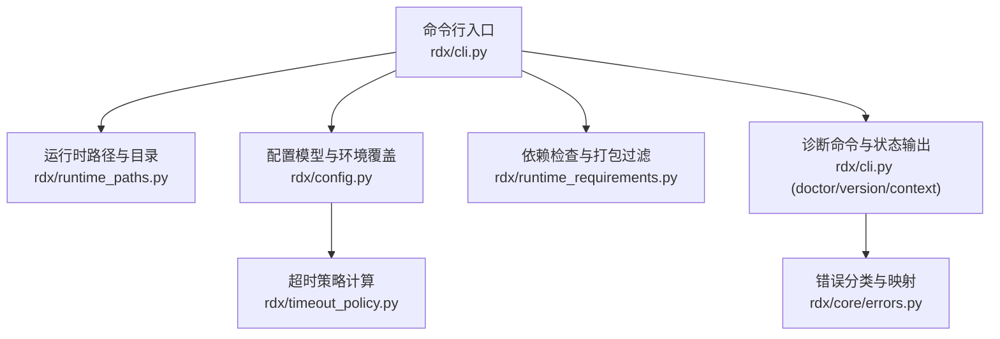
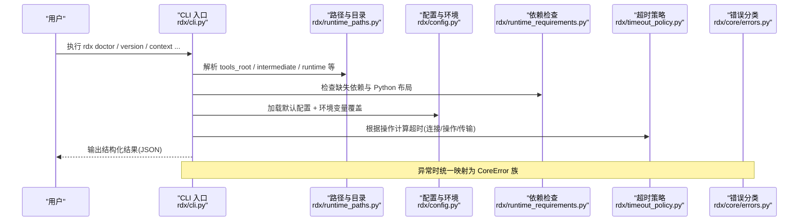
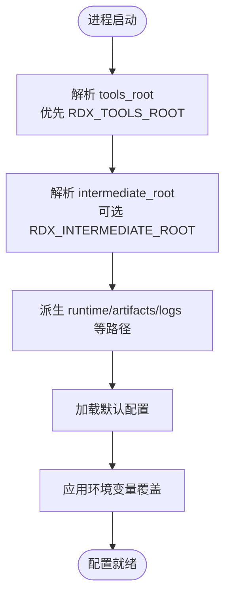
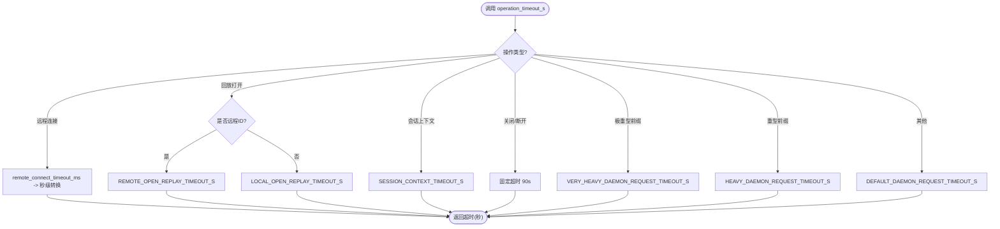
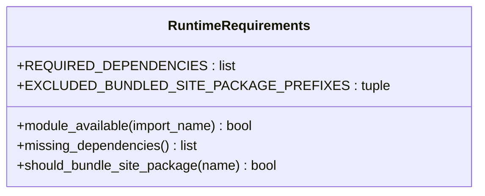
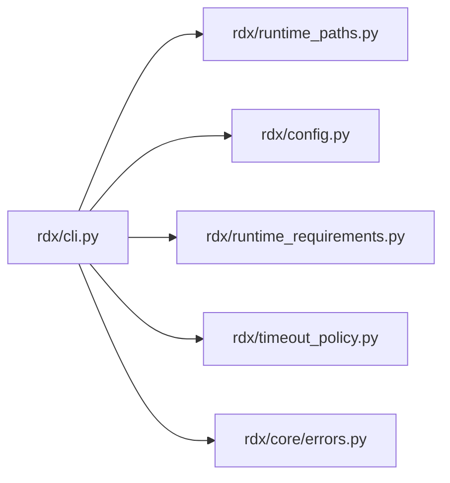

# 高级配置

<cite>
**本文引用的文件**
- [rdx/config.py](file://rdx/config.py)
- [rdx/timeout_policy.py](file://rdx/timeout_policy.py)
- [rdx/runtime_requirements.py](file://rdx/runtime_requirements.py)
- [rdx/runtime_paths.py](file://rdx/runtime_paths.py)
- [rdx/cli.py](file://rdx/cli.py)
- [rdx/core/errors.py](file://rdx/core/errors.py)
- [docs/configuration.md](file://docs/configuration.md)
- [docs/troubleshooting.md](file://docs/troubleshooting.md)
- [pyproject.toml](file://pyproject.toml)
</cite>

## 目录
1. [简介](#简介)
2. [项目结构](#项目结构)
3. [核心组件](#核心组件)
4. [架构总览](#架构总览)
5. [详细组件分析](#详细组件分析)
6. [依赖关系分析](#依赖关系分析)
7. [性能调优](#性能调优)
8. [故障诊断与排错](#故障诊断与排错)
9. [结论](#结论)
10. [附录：场景化配置模板](#附录：场景化配置模板)

## 简介
本指南面向需要深度定制 RDC-Tool（RDX）运行时行为的高级用户与集成方，聚焦以下主题：
- 运行时配置的层次结构与优先级：全局、用户与环境变量。
- 超时策略与重试机制的调优：操作超时、连接超时、传输缓冲与重型操作的差异化处理。
- 依赖检查与管理：环境验证、组件检测与兼容性检查。
- 性能参数调优：内存限制、并发度与缓存策略。
- 不同使用场景的推荐配置模板：开发、测试、生产。
- 配置热重载与动态调整能力。
- 配置验证与错误诊断工具使用方法。

## 项目结构
RDX 的配置由数据类模型集中定义，并通过环境变量注入；路径解析、运行时目录创建、依赖检查与诊断命令共同构成“可观测、可配置、可恢复”的运行基座。

**图示来源**
- [rdx/cli.py:412-532](file://rdx/cli.py#L412-L532)
- [rdx/runtime_paths.py:14-123](file://rdx/runtime_paths.py#L14-L123)
- [rdx/config.py:15-185](file://rdx/config.py#L15-L185)
- [rdx/runtime_requirements.py:7-73](file://rdx/runtime_requirements.py#L7-L73)
- [rdx/timeout_policy.py:43-104](file://rdx/timeout_policy.py#L43-L104)
- [rdx/core/errors.py:9-121](file://rdx/core/errors.py#L9-L121)

**章节来源**
- [rdx/cli.py:412-532](file://rdx/cli.py#L412-L532)
- [rdx/runtime_paths.py:14-123](file://rdx/runtime_paths.py#L14-L123)
- [rdx/config.py:15-185](file://rdx/config.py#L15-L185)
- [rdx/runtime_requirements.py:7-73](file://rdx/runtime_requirements.py#L7-L73)
- [rdx/timeout_policy.py:43-104](file://rdx/timeout_policy.py#L43-L104)
- [rdx/core/errors.py:9-121](file://rdx/core/errors.py#L9-L121)

## 核心组件
- 配置模型与环境覆盖：通过数据类组织后端、回放、工作进程、工件存储、数据库、二分搜索、补丁、报告、置信度权重、快照保留、运行时限制、自适应二分等子配置；支持从环境变量批量覆盖。
- 运行时路径与目录：统一解析 tools_root、intermediate、runtime、artifacts、logs 等路径，并保证目录存在。
- 依赖检查：声明必需 Python 依赖，提供缺失检测与打包过滤规则。
- 超时策略：按操作类型与负载等级计算操作超时、传输超时与守护进程执行超时。
- 诊断与错误：doctor 命令汇总环境与运行态信息；统一的错误分类便于上层稳定映射退出码与消息。

**章节来源**
- [rdx/config.py:15-185](file://rdx/config.py#L15-L185)
- [rdx/runtime_paths.py:14-123](file://rdx/runtime_paths.py#L14-L123)
- [rdx/runtime_requirements.py:7-73](file://rdx/runtime_requirements.py#L7-L73)
- [rdx/timeout_policy.py:43-104](file://rdx/timeout_policy.py#L43-L104)
- [rdx/cli.py:412-532](file://rdx/cli.py#L412-L532)
- [rdx/core/errors.py:9-121](file://rdx/core/errors.py#L9-L121)

## 架构总览
下图展示 CLI 启动到诊断输出的关键流程，以及配置、路径、依赖、超时的协作关系。

**图示来源**
- [rdx/cli.py:412-532](file://rdx/cli.py#L412-L532)
- [rdx/runtime_paths.py:14-123](file://rdx/runtime_paths.py#L14-L123)
- [rdx/config.py:135-185](file://rdx/config.py#L135-L185)
- [rdx/runtime_requirements.py:45-73](file://rdx/runtime_requirements.py#L45-L73)
- [rdx/timeout_policy.py:51-104](file://rdx/timeout_policy.py#L51-L104)
- [rdx/core/errors.py:90-121](file://rdx/core/errors.py#L90-L121)

## 详细组件分析

### 配置层次与优先级
- 默认配置：所有配置项均有合理默认值，涵盖后端、回放、工作进程、工件、数据库、二分搜索、补丁、报告、置信度权重、快照保留、运行时限制、自适应二分等。
- 环境变量覆盖：通过 from_env 方法将环境变量映射到具体配置字段，包括 RenderDoc 模块路径、工件存储路径、数据目录、报告目录、日志级别、GPU 厂商、SPIRV-Tools 路径、无头模式、二分置信度权重与配置文件、上下文与捕获限制、回放内存估算与乘数等。
- 路径与环境根：tools_root 优先读取 RDX_TOOLS_ROOT，否则回退到包根；intermediate 可通过 RDX_INTERMEDIATE_ROOT 隔离；runtime、artifacts、logs 均派生自 intermediate。

**图示来源**
- [rdx/runtime_paths.py:14-123](file://rdx/runtime_paths.py#L14-L123)
- [rdx/config.py:135-185](file://rdx/config.py#L135-L185)

**章节来源**
- [rdx/config.py:15-185](file://rdx/config.py#L15-L185)
- [rdx/runtime_paths.py:14-123](file://rdx/runtime_paths.py#L14-L123)
- [docs/configuration.md:3-19](file://docs/configuration.md#L3-L19)

### 超时策略与重试机制
- 操作超时：按操作名与参数决定基础超时，如远程连接、本地/远程回放打开、会话上下文、关闭/断开、重型与极重型操作前缀匹配。
- 传输超时：在操作超时基础上增加守护进程响应缓冲时间；远程连接额外增加连接缓冲。
- 守护进程/工作进程超时：分别基于传输或操作超时计算。
- 测试夹具超时：取默认与传输超时的最大值，避免过短导致误判。

**图示来源**
- [rdx/timeout_policy.py:43-104](file://rdx/timeout_policy.py#L43-L104)

**章节来源**
- [rdx/timeout_policy.py:43-104](file://rdx/timeout_policy.py#L43-L104)

### 依赖检查与管理
- 必需依赖：声明 pydantic、numpy、Pillow、jinja2、aiofiles 等，并提供缺失检测函数。
- 打包过滤：排除测试、构建与不必要模块，确保分发产物精简。
- 诊断集成：doctor 命令会检查依赖缺失、Python 布局、RenderDoc 组件与工具目录完整性。

**图示来源**
- [rdx/runtime_requirements.py:7-73](file://rdx/runtime_requirements.py#L7-L73)

**章节来源**
- [rdx/runtime_requirements.py:7-73](file://rdx/runtime_requirements.py#L7-L73)
- [rdx/cli.py:412-532](file://rdx/cli.py#L412-L532)

### 性能参数与资源限制
- 运行时限制：最大上下文数、每上下文会话数、捕获文件数、捕获大小上限、估计回放内存上限、回放内存乘数、最近操作记录数。
- 工件与报告：工件存储路径与大小上限、哈希算法、压缩开关；报告输出目录与格式开关、缩略图嵌入与尺寸限制。
- 工作进程：每 GPU 最大工作进程数、远程控制器数量、任务队列大小、工作进程超时。
- 二进制与路径：渲染后端路径、Python 运行时路径、Android 二进制路径、pymodules 路径等。

**章节来源**
- [rdx/config.py:37-130](file://rdx/config.py#L37-L130)
- [rdx/runtime_paths.py:60-123](file://rdx/runtime_paths.py#L60-L123)

### 配置的热重载与动态调整
- 当前实现以进程内配置对象为主，通过环境变量在进程启动时一次性覆盖。
- 运行时状态持久化于 cli_runtime_dir 下的 JSON/JSONL 文件，支持上下文切换、会话管理与指标统计。
- 对于需要“热更新”的场景，建议通过外部进程管理工具重启 CLI/守护进程，或在调用层按需重建配置对象后重新发起请求。

**章节来源**
- [rdx/config.py:135-185](file://rdx/config.py#L135-L185)
- [rdx/runtime_state.py:41-149](file://rdx/runtime_state.py#L41-L149)

## 依赖关系分析
- CLI 依赖路径解析、配置加载、依赖检查、超时策略与错误分类。
- 配置依赖运行时路径以确定默认存储位置。
- 诊断命令聚合多项检查结果，形成统一的结构化输出。

**图示来源**
- [rdx/cli.py:412-532](file://rdx/cli.py#L412-L532)
- [rdx/runtime_paths.py:14-123](file://rdx/runtime_paths.py#L14-L123)
- [rdx/config.py:135-185](file://rdx/config.py#L135-L185)
- [rdx/runtime_requirements.py:7-73](file://rdx/runtime_requirements.py#L7-L73)
- [rdx/timeout_policy.py:43-104](file://rdx/timeout_policy.py#L43-L104)
- [rdx/core/errors.py:9-121](file://rdx/core/errors.py#L9-L121)

**章节来源**
- [rdx/cli.py:412-532](file://rdx/cli.py#L412-L532)
- [rdx/runtime_paths.py:14-123](file://rdx/runtime_paths.py#L14-L123)
- [rdx/config.py:135-185](file://rdx/config.py#L135-L185)
- [rdx/runtime_requirements.py:7-73](file://rdx/runtime_requirements.py#L7-L73)
- [rdx/timeout_policy.py:43-104](file://rdx/timeout_policy.py#L43-L104)
- [rdx/core/errors.py:9-121](file://rdx/core/errors.py#L9-L121)

## 性能调优
- 内存与并发
  - 通过运行时限制控制上下文与会话数量、捕获文件大小与数量、估计回放内存与乘数，避免 OOM 与资源争用。
  - 工作进程与任务队列大小影响吞吐与延迟，需结合 GPU 驱动与系统资源评估。
- 超时与重试
  - 针对重型/极重型操作设置更长的超时；远程连接与回放打开使用专用超时；必要时在调用层实现指数退避重试。
- 工件与报告
  - 启用工件压缩可减少磁盘占用；合理设置报告目录与生成格式，避免不必要的 I/O。
- 路径与缓存
  - 使用 RDX_INTERMEDIATE_ROOT 隔离中间产物，减少跨任务干扰；保持 artifacts/logs 位于高速磁盘以提升吞吐。

[本节为通用指导，不直接分析具体文件]

## 故障诊断与排错
- 使用 rdx --json doctor 快速定位环境问题：工具根、Python 运行时、RenderDoc 组件、目录完整性、目录清单与守护进程状态。
- 使用 rdx context status/update/clear 管理上下文与会话；当出现 session_required 或 stale_session_requires_restart 时，按提示清理或重连。
- 错误分类：内部将常见异常映射为结构化错误（验证、未找到、权限、IO、内部错误等），便于上层统一处理与告警。
- 远程与 Android：远程连接失败、句柄被消费、ADB/Socket 问题与重试策略请参考排错文档。

**章节来源**
- [rdx/cli.py:412-532](file://rdx/cli.py#L412-L532)
- [docs/troubleshooting.md:1-58](file://docs/troubleshooting.md#L1-L58)
- [rdx/core/errors.py:9-121](file://rdx/core/errors.py#L9-L121)

## 结论
RDX 的配置体系以数据类为中心，通过环境变量灵活覆盖；配合路径解析、依赖检查、超时策略与诊断命令，形成稳定、可观测、可恢复的运行环境。生产部署应重点关注运行时限制、超时与工件管理，并结合场景化模板进行调优。

[本节为总结性内容，不直接分析具体文件]

## 附录：场景化配置模板
以下为各环境的推荐配置要点（以环境变量形式覆盖）。请结合实际硬件与网络条件微调。

- 开发环境
  - 日志级别：RDX_LOG_LEVEL=DEBUG
  - 工件存储：RDX_ARTIFACT_STORE=<SSD路径>/dev-artifacts
  - 报告目录：RDX_REPORT_DIR=<SSD路径>/dev-reports
  - 无头模式：RDX_HEADLESS=true
  - 运行时限制：适当提高 max_contexts 与 max_sessions_per_context，提升并行调试效率
  - 超时：保持默认或适度增大重型操作超时

- 测试环境
  - 中间根：RDX_INTERMEDIATE_ROOT=<隔离目录>/test-runtime
  - 工件与报告：指向独立目录，便于清理与归档
  - 运行时限制：限制 max_capture_size_bytes 与 max_estimated_replay_memory_bytes，防止 CI 节点过载
  - 超时：对重型操作设置更长超时，避免偶发抖动导致误失败
  - 依赖：确保必需依赖可用，必要时在镜像中预装

- 生产环境
  - 工件存储：RDX_ARTIFACT_STORE=<高性能存储>/prod-artifacts，开启压缩
  - 报告目录：RDX_REPORT_DIR=<日志服务器>/reports
  - 运行时限制：严格限制上下文与会话数量、捕获大小与内存估算，保障稳定性
  - 超时：保守设置，结合业务 SLA 调整；远程连接与回放打开使用专用超时
  - 日志级别：RDX_LOG_LEVEL=INFO 或 WARN，降低 I/O 压力
  - 路径隔离：RDX_INTERMEDIATE_ROOT 隔离多实例运行

[本节为概念性模板，不直接分析具体文件]