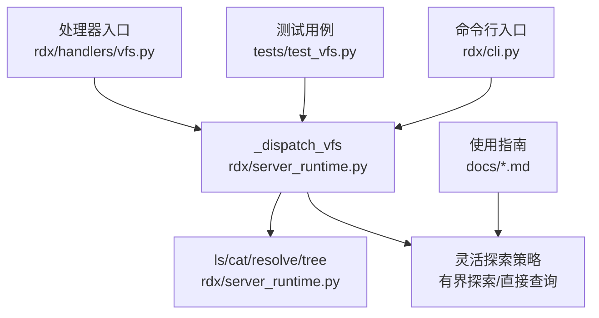
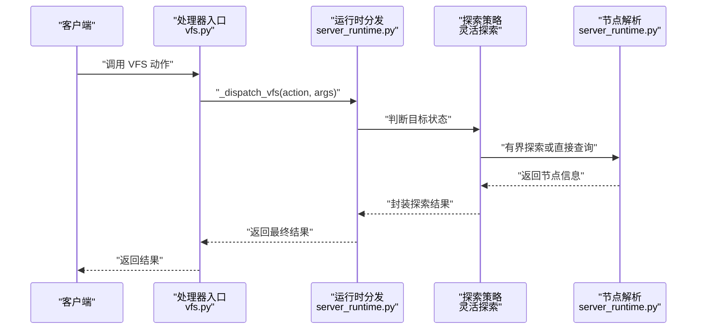
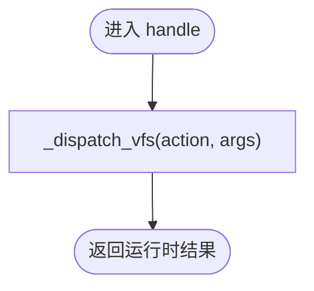
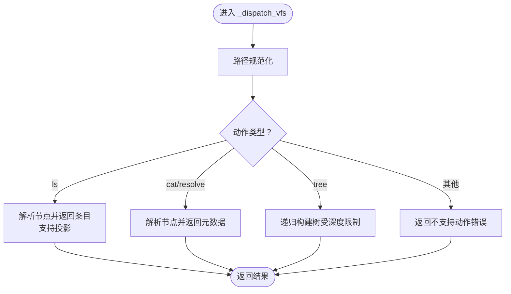
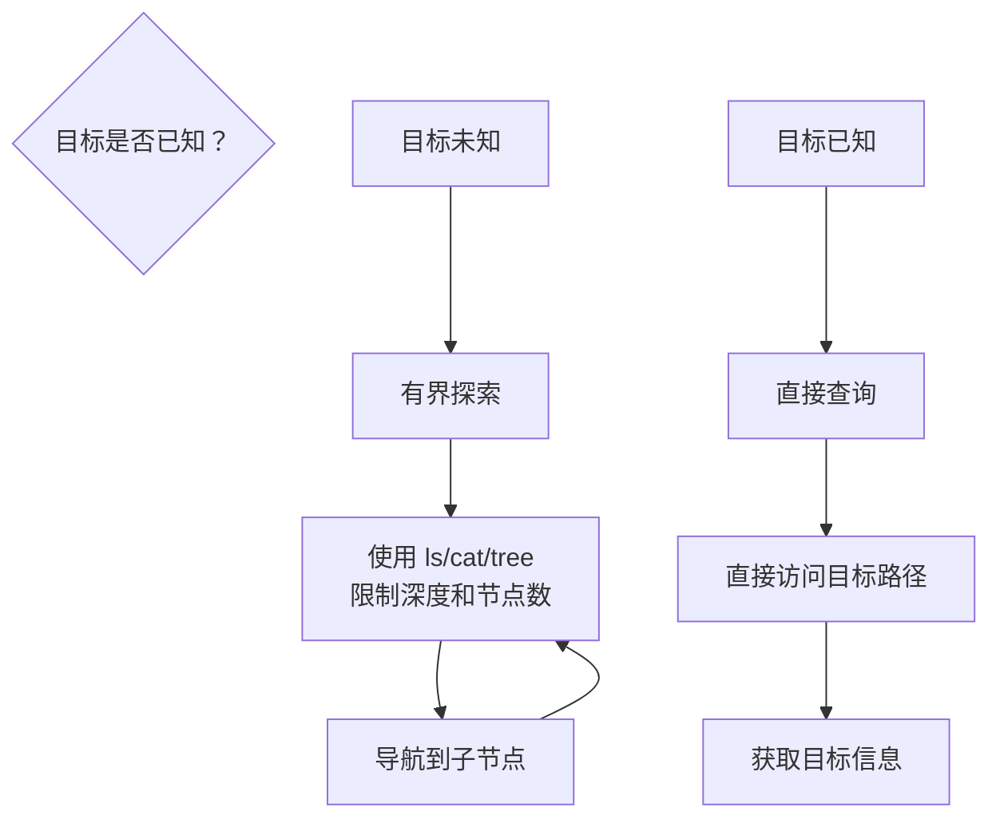
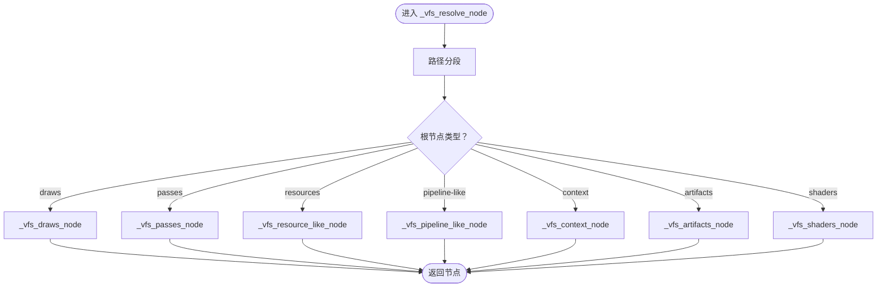
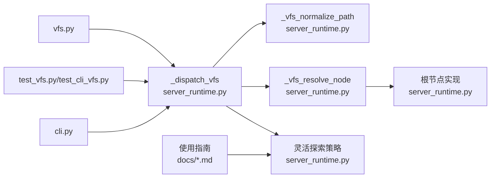

# VFS虚拟文件系统

<cite>
**本文档引用的文件**
- [vfs.py](file://rdx/handlers/vfs.py)
- [server_runtime.py](file://rdx/server_runtime.py)
- [test_vfs.py](file://tests/test_vfs.py)
- [test_cli_vfs.py](file://tests/test_cli_vfs.py)
- [cli.py](file://rdx/cli.py)
- [agent-model.md](file://docs/agent-model.md)
- [rdx-native-agent-playbook.md](file://docs/rdx-native-agent-playbook.md)
</cite>

## 更新摘要
**变更内容**
- 更新了VFS探索策略章节，反映新的灵活探索机制
- 新增了目标未知时的有界探索和已知目标时直接查询的说明
- 更新了使用示例和最佳实践指南
- 增强了错误处理和性能优化部分

## 目录
1. [简介](#简介)
2. [项目结构](#项目结构)
3. [核心组件](#核心组件)
4. [架构总览](#架构总览)
5. [详细组件分析](#详细组件分析)
6. [依赖关系分析](#依赖关系分析)
7. [性能考虑](#性能考虑)
8. [故障排除指南](#故障排除指南)
9. [结论](#结论)
10. [附录](#附录)

## 简介
本文件系统为虚拟文件系统（VFS），用于将底层资源抽象为统一的树形文件系统视图，支持列出目录、解析路径、获取节点信息以及构建树状结构等操作。VFS通过灵活的探索策略，既支持在目标未知时使用有界探索进行导航，也支持在已知目标时直接查询，提供高效的资源访问能力。

## 项目结构
VFS相关的核心实现位于以下位置：
- 处理器入口：rdx/handlers/vfs.py
- 运行时分发与节点解析：rdx/server_runtime.py
- 测试用例：tests/test_vfs.py、tests/test_cli_vfs.py
- 命令行入口：rdx/cli.py
- 文档指南：docs/agent-model.md、docs/rdx-native-agent-playbook.md



**图表来源**
- [vfs.py:8-9](file://rdx/handlers/vfs.py#L8-L9)
- [server_runtime.py:12740-12775](file://rdx/server_runtime.py#L12740-L12775)

**章节来源**
- [vfs.py:1-11](file://rdx/handlers/vfs.py#L1-L11)
- [server_runtime.py:12740-12775](file://rdx/server_runtime.py#L12740-L12775)

## 核心组件
- 处理器入口：接收外部调用，将请求转发至运行时分发函数。
- 运行时分发：根据动作类型执行相应逻辑，包括路径规范化、节点解析、投影查询与树构建。
- 灵活探索策略：支持两种模式 - 目标未知时的有界探索和已知目标时的直接查询。
- 节点解析：将虚拟路径映射为具体资源节点，支持多种根节点类型（如管线、调试、资源等）。
- 错误处理：对不支持的动作或参数进行校验并返回标准化错误响应。

**章节来源**
- [vfs.py:8-9](file://rdx/handlers/vfs.py#L8-L9)
- [server_runtime.py:12740-12775](file://rdx/server_runtime.py#L12740-L12775)

## 架构总览
VFS采用"处理器入口 → 运行时分发 → 灵活探索 → 节点解析"的四层架构。处理器负责协议适配与参数传递；运行时负责路径规范化、动作分发与结果封装；灵活探索策略根据目标状态选择最优探索方式；节点解析负责将虚拟路径映射到具体资源。



**图表来源**
- [vfs.py:8-9](file://rdx/handlers/vfs.py#L8-L9)
- [server_runtime.py:12740-12775](file://rdx/server_runtime.py#L12740-L12775)

## 详细组件分析

### 组件A：处理器入口（vfs.py）
- 职责：接收动作与参数，直接委托给运行时分发函数。
- 关键点：保持轻量，避免业务逻辑下沉。



**图表来源**
- [vfs.py:8-9](file://rdx/handlers/vfs.py#L8-L9)

**章节来源**
- [vfs.py:8-9](file://rdx/handlers/vfs.py#L8-L9)

### 组件B：运行时分发（server_runtime.py）
- 路径规范化：统一输入路径格式，确保后续解析一致性。
- 动作分发：
  - ls：解析节点并返回条目列表，支持投影查询。
  - cat/resolve：解析节点并返回节点元数据。
  - tree：递归构建树结构，受深度限制。
- 投影查询：对条目进行投影，支持文本化输出等。
- 错误处理：对不支持的动作或参数组合返回标准化错误。



**图表来源**
- [server_runtime.py:12740-12775](file://rdx/server_runtime.py#L12740-L12775)

**章节来源**
- [server_runtime.py:12740-12775](file://rdx/server_runtime.py#L12740-L12775)

### 组件C：灵活探索策略
**新增** VFS现在支持两种探索模式：

1. **目标未知时的有界探索**：当目标不明确时，使用受限的VFS探索来导航
   - 使用 `rdx vfs ls --path / --format tsv` 浏览顶层结构
   - 使用 `rdx vfs cat --path /context --format json` 获取上下文信息
   - 使用 `rdx vfs tree --path /draws --depth 2 --max-nodes 2000 --format json` 进行有界树遍历

2. **已知目标时的直接查询**：当目标明确时，直接查询特定资源
   - 直接访问 `/draws/<event_id>` 获取特定事件详情
   - 直接访问 `/resources/<resource_id>` 获取特定资源信息
   - 避免不必要的广泛展开操作



**章节来源**
- [agent-model.md:7](file://docs/agent-model.md#L7)
- [rdx-native-agent-playbook.md:16](file://docs/rdx-native-agent-playbook.md#L16)

### 组件D：节点解析与树构建（server_runtime.py）
- 节点解析：将路径拆分为段，识别根节点类型（如管线、调试、资源等），并生成对应节点。
- 树构建：基于节点条目递归构建子树，深度由参数控制。
- 根节点与专用节点：支持多种根节点（如 draws、passes、resources、pipeline-like、context、artifacts、shaders 等）。



**图表来源**
- [server_runtime.py:12681-12709](file://rdx/server_runtime.py#L12681-L12709)

**章节来源**
- [server_runtime.py:12681-12709](file://rdx/server_runtime.py#L12681-L12709)

### 组件E：API接口与文件操作方法
- 支持动作：
  - ls：列出目录内容，支持投影查询。
  - cat：获取文件内容（以节点形式返回）。
  - resolve：解析路径为节点。
  - tree：按深度构建树结构。
- 参数与约束：
  - 投影仅支持 ls 动作。
  - 不支持的动作将返回错误。
- 返回结构：包含路径、节点、条目及可选投影结果。

**章节来源**
- [server_runtime.py:12740-12775](file://rdx/server_runtime.py#L12740-L12775)

### 组件F：路径映射与访问控制机制
- 路径映射：通过路径分段与根节点识别，将虚拟路径映射到具体资源。
- 访问控制：当前实现未显式暴露细粒度权限控制接口；可通过上层会话与会话ID管理进行间接控制（例如管线着色器节点要求会话ID）。

**章节来源**
- [server_runtime.py:12681-12709](file://rdx/server_runtime.py#L12681-L12709)
- [server_runtime.py:12318-12337](file://rdx/server_runtime.py#L12318-L12337)

### 组件G：错误处理策略
- 动作不支持：返回标准化错误，包含工具名、支持的动作列表等。
- 参数不支持：如投影非 ls 动作时返回验证类错误。
- 路径不支持：当无法识别的路径前缀出现时抛出异常。
- 会话相关错误：某些节点需要有效的会话ID，提供恢复提示。

**章节来源**
- [server_runtime.py:12740-12775](file://rdx/server_runtime.py#L12740-L12775)
- [server_runtime.py:12318-12337](file://rdx/server_runtime.py#L12318-L12337)

### 组件H：使用示例与场景
**更新** 新的探索策略提供了更灵活的使用方式：

1. **目标未知时的探索**：
   ```bash
   # 浏览顶层结构
   rdx vfs ls --path / --format tsv
   
   # 获取上下文信息
   rdx vfs cat --path /context --format json
   
   # 有界树遍历
   rdx vfs tree --path /draws --depth 2 --max-nodes 2000 --format json
   ```

2. **已知目标时的直接查询**：
   ```bash
   # 直接访问特定事件
   rdx vfs cat --path /draws/42 --format json
   
   # 直接访问特定资源
   rdx vfs resolve --path /resources/texture_123 --format json
   ```

3. **智能导航**：
   - 对于 `/draws` 树节点，如果报告 `detail_deferred=true`，应使用 `event show` 或专门的工具获取详细信息
   - 避免广泛展开 `/resources`、`/textures` 或 `/buffers`，使用 `vfs ls` 和目标特定的 `vfs cat`

**章节来源**
- [test_vfs.py](file://tests/test_vfs.py)
- [test_cli_vfs.py](file://tests/test_cli_vfs.py)
- [cli.py:833](file://rdx/cli.py#L833)
- [agent-model.md:7](file://docs/agent-model.md#L7)
- [rdx-native-agent-playbook.md:16](file://docs/rdx-native-agent-playbook.md#L16)

## 依赖关系分析
- 处理器入口依赖运行时分发函数。
- 运行时分发依赖路径规范化、节点解析与工具调用。
- 灵活探索策略依赖节点解析和会话管理。
- 节点解析依赖多种根节点实现与会话管理。
- 测试用例覆盖运行时分发与 CLI 入口。



**图表来源**
- [vfs.py:8-9](file://rdx/handlers/vfs.py#L8-L9)
- [server_runtime.py:12740-12775](file://rdx/server_runtime.py#L12740-L12775)
- [server_runtime.py:12681-12709](file://rdx/server_runtime.py#L12681-L12709)

**章节来源**
- [vfs.py:8-9](file://rdx/handlers/vfs.py#L8-L9)
- [server_runtime.py:12740-12775](file://rdx/server_runtime.py#L12740-L12775)
- [server_runtime.py:12681-12709](file://rdx/server_runtime.py#L12681-L12709)

## 性能考虑
- 树构建深度控制：tree 动作通过深度参数限制递归层级，避免过深遍历导致的性能问题。
- 条目投影：ls 动作支持投影查询，可在保证必要信息的同时减少传输与渲染开销。
- 节点缓存：当前实现未显示内置缓存机制，建议在上层或工具侧实现缓存以提升重复查询性能。
- 并发访问：运行时分发为异步实现，适合高并发场景；但需注意工具调用与资源访问的并发安全。
- **新增** 探索策略优化：
  - 有界探索防止无限递归和资源耗尽
  - 直接查询减少不必要的中间步骤
  - 智能延迟加载避免过早获取详细信息

**章节来源**
- [server_runtime.py:12770-12774](file://rdx/server_runtime.py#L12770-L12774)
- [server_runtime.py:12749-12763](file://rdx/server_runtime.py#L12749-L12763)
- [agent-model.md:7](file://docs/agent-model.md#L7)

## 故障排除指南
- 动作不支持：确认传入的动作是否在支持列表中（ls、cat、resolve、tree）。
- 投影不支持：仅 ls 动作支持投影，其他动作请移除投影参数。
- 路径无效：检查路径前缀与分段是否符合预期，确保根节点类型正确。
- 会话相关错误：某些节点（如管线着色器）需要有效的会话ID，请确认会话上下文。
- **新增** 探索策略相关问题：
  - 如果探索过程过于缓慢，考虑使用有界探索限制深度
  - 如果遇到大量无关结果，尝试直接查询已知目标
  - 对于 `/draws` 节点的详细信息延迟，使用推荐工具获取完整信息

**章节来源**
- [server_runtime.py:12740-12775](file://rdx/server_runtime.py#L12740-L12775)
- [server_runtime.py:12318-12337](file://rdx/server_runtime.py#L12318-L12337)
- [agent-model.md:7](file://docs/agent-model.md#L7)

## 结论
VFS通过灵活的探索策略实现了更高效和智能的资源访问。新的机制既支持在目标未知时的有界探索导航，也支持在已知目标时的直接查询，大大提升了使用效率和用户体验。结合路径规范化、节点解析与树构建能力，VFS满足了现代应用对虚拟化文件系统的多样化需求。未来可在缓存、并发控制与细粒度权限方面进一步增强，以适应更复杂的使用场景。

## 附录
- 命令行入口：CLI 提供 vfs 子命令，便于从命令行触发 VFS 操作。
- 测试用例：覆盖运行时分发与 CLI 入口的行为，确保功能稳定性。
- **新增** 使用指南：详细的探索策略指导文档，帮助开发者选择合适的访问模式。

**章节来源**
- [cli.py:833](file://rdx/cli.py#L833)
- [test_vfs.py](file://tests/test_vfs.py)
- [test_cli_vfs.py](file://tests/test_cli_vfs.py)
- [agent-model.md:7](file://docs/agent-model.md#L7)
- [rdx-native-agent-playbook.md:16](file://docs/rdx-native-agent-playbook.md#L16)